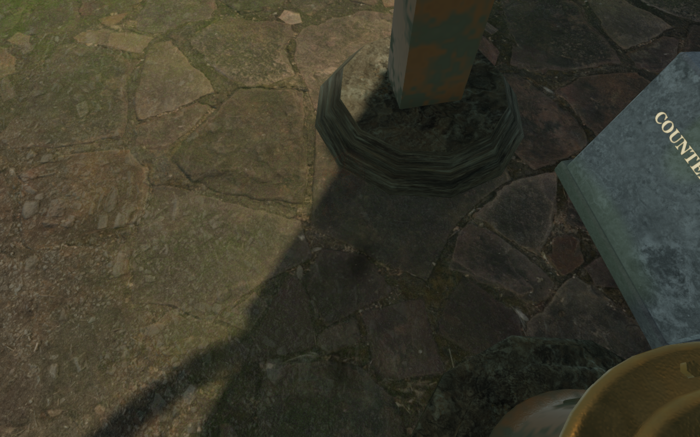
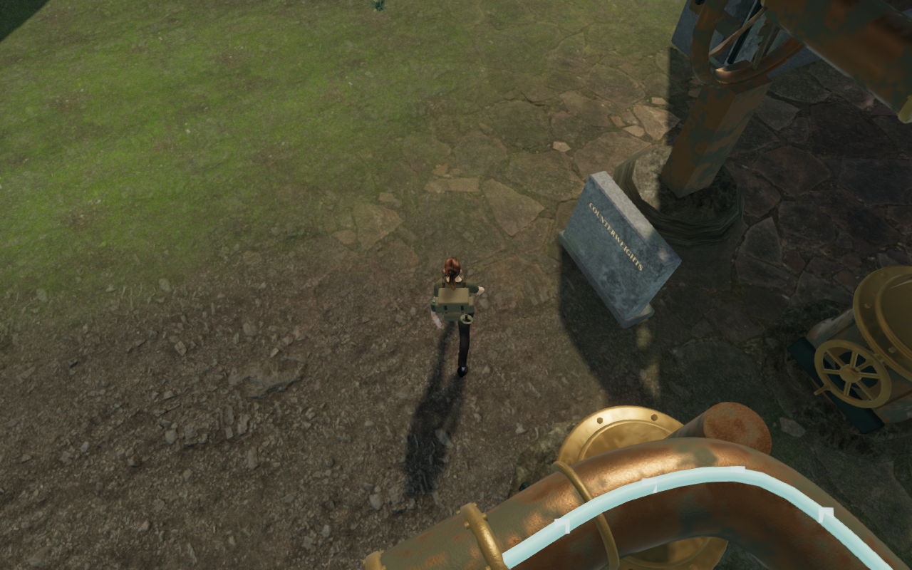
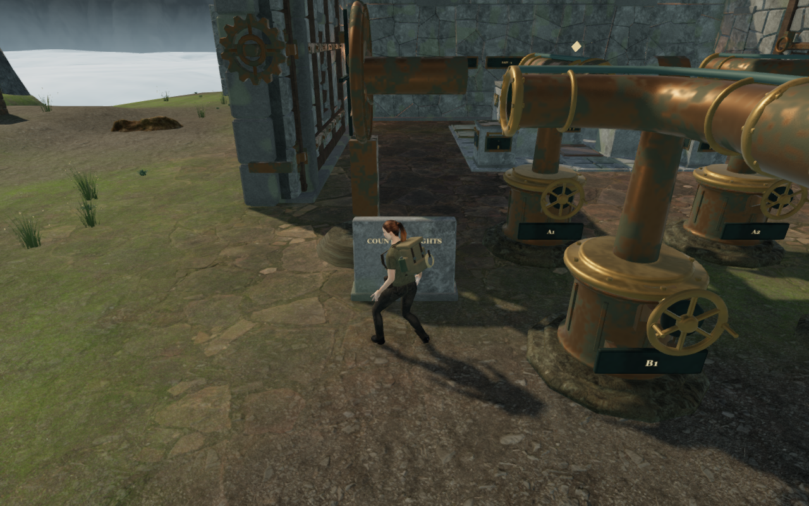
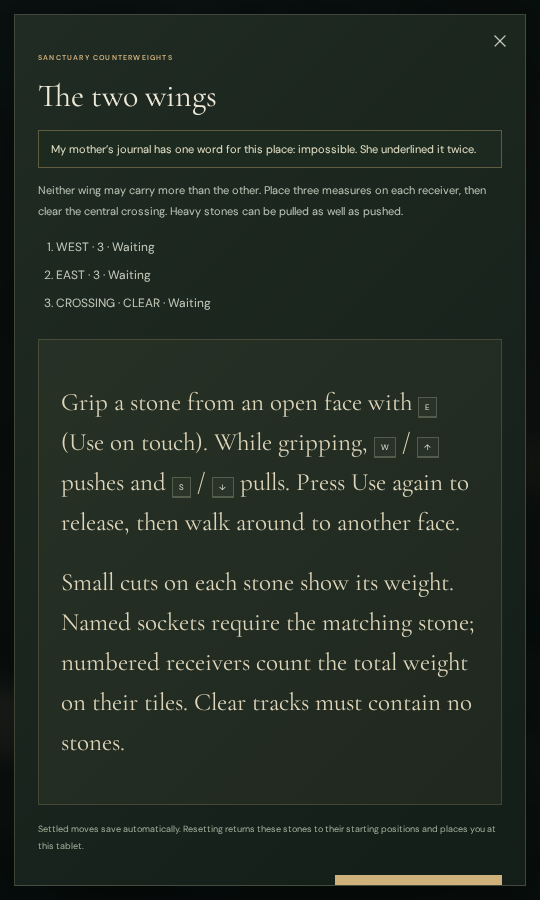

# Cloud forecourt inscription

The first cloud chamber's entrance tablet stood close to a wind bearing. On
returning from the engine, the desired camera segment crossed that bearing and
partly faded the explorer. The [wider chamber aisle](cloud-aisle.md) had already
cleared the side wall; this obstruction belonged to the forecourt machinery.

The tablet now sits 1 m farther left and 3 m farther forward, on the same flat
forecourt. Its slab, backing, lettering, base, walking solid and camera bounds
move together. The reading and reset positions clear both nearby wind stands.
The board, stones, receivers, engine controls and saved progress retain their
positions and rules. Other chapters' tablets retain their delivered locations.

These captures come from continuous routes starting with the same earlier earned
opening save. Each reads the tablet, solves the stone trial, operates the first
engine and returns to the inscription. The tablet relocation changes the final
route, feet and camera heading, so this is a comparison of those reading places,
not an identical-pose camera comparison. The final moving camera arm increases
from 1.739 m in the earlier route to 5.354 m in the updated route.

## Verification

All **14 counterweight tests pass**, including all eight authored solutions,
backed labels, walking and camera solids, safe reset stances and save recovery.
The production build, JavaScript formatting and whitespace checks pass. The
existing bundle-size advisory remains. The complete campaign suite was not
rerun for this placement change.

The repeated continuous assisted route covers **192.687 m** over 3,410 controller
ticks, completes all **14 stone moves** and the first engine's physical controls
and UI activation, then returns through the chamber to its relocated tablet.
Health remains 100, no route stalls, and the largest recorded ground step is
6.7 cm. All **64 route captures** are reviewed. Recorded shaders link, with no
browser errors or console warnings. Direction steering and puzzle solutions are
assisted; this does not establish an unassisted playthrough or device performance.

A separate stationary replay uses the updated route's exact final feet, heading
and pitch, then advances 120 normal camera updates. Its arm reaches **5.474 m**,
character coverage is 1, and no actual registered solid intersects the desired
camera segment. The earlier stationary return retained a wind-bearing
obstruction at 2.070 m and 0.909 coverage. The additional diagnostic capture is
reviewed; the two positions differ because the tablet moved.

High and Low reading/reset checks load previously performed partial stone saves,
place the explorer at the new reading stance, and press the actual **Reset
chamber** button. It restores the initial stones and places the explorer at a
walkable position 1.3 m in front of the tablet. Both reading and reset views have
full character coverage and a 5.381 m camera arm, with health 100. Thirty upward
mesh rays across the actual base footprint confirm that it reaches beneath the
terrain. All **four captures** are reviewed. These checks use assisted setup.

Two native production cases use keyboard High and portrait touch Low from the
older tablet save, preserving its original starting feet. Both open the actual
inscription with Use, return to play, walk and reload. Net walking distances are
1.37 m and 0.89 m, with health 100. All **eight production captures** are reviewed;
the development hook is absent, no asset requests fail, portrait layout has no
horizontal overflow, and loaded bundle filenames match the current build.

Reload preserves the complete saved store apart from `lastPlayed` and the
existing arrival-camera correction in both cases. Independent actual-world
queries measure the old saved orbits at 0.020 m and 0 m; the selected orbits reach
the full 5.353 m and match the normal arrival selector. Both headings change by
45 degrees with the saved pitch retained. A second reload preserves the complete
store apart from timestamps. Restored feet agree within 5 cm, and stone state,
field work, health, discoveries and chapter progress remain intact.

The verified production files are `index-CvOm4yOY.js`, `game-C4qb489i.js`,
`three-mu_AYolc.js` and `index-CQBT4VmC.css`.

## Remaining review and provenance

VA-46 is repaired for the tested relocated reading/reset positions and final
inscription return. Some free stone approaches and a view during the chamber
return still obstruct the explorer. Walking from the older saved forecourt
position also retains close views before the existing arrival correction. Those
parts of VA-46 remain open, alongside the observatory approach VA-39 and broader
chapter composition. This change does not establish complete character visibility
through the whole route, subjective sound quality or supported-device performance.

The tablet remains original procedural artwork using the credited chapter
masonry and existing metal materials. No external model, texture, sound or
dependency was added. The existing positional soundscape and quiet scores are
retained. The four documentation images are actual game captures converted
losslessly to WebP, with decoded RGBA identity verified. Test saves, browser
profiles and raw captures remain in ignored local staging.
