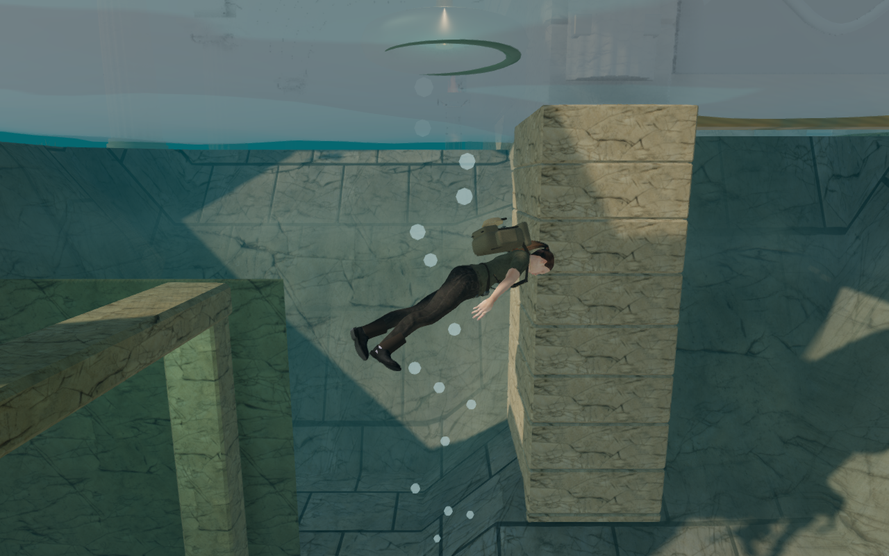
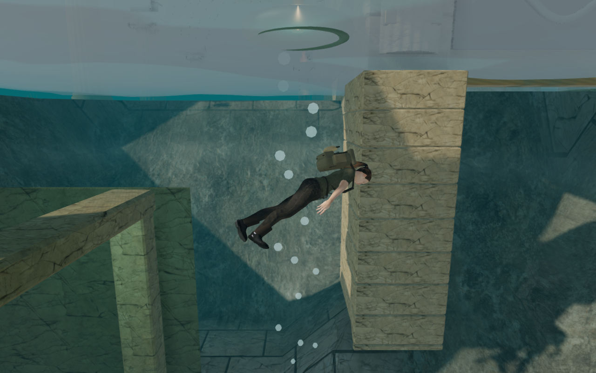

# Rock beneath the coastal courts

The Drowned Kingdom's steep well banks now use worn natural rock. Previously,
the terrain shared the palace's marble maps between paving and cliffs, and its
slope blend carried horizontal paving too far down the banks. Diving exposed
stretched slab outlines on the sides of the wells.

The coastal material now keeps separate color, normal and roughness maps for
the marble slabs and exposed rock. The existing triplanar cliff projection uses
a 3.2-metre scale here, with broad variation across the stone. The slope blend
retains paving on level courts and changes to rock before the horizontal slabs
stretch visibly. Wet staining still follows each reservoir's water height, and
the surviving mosaic inlays retain their own maps. Geometry and collision are
unchanged.

This reuses the bundled Rock Boulder Dry and Marble Rock 02 maps, whose sources
and licenses remain in [asset credits](asset-credits.md). It introduces no new
downloaded artwork.

## Actual game comparison

These 1280 × 800 High-quality canvases show the same harbor well, water level,
camera and actor pose. The before material comes from published commit
`e093bb3`; both versions include its fitted sluice foundations. The canvases
omit the HTML HUD and CSS vignette. Lossless WebP conversion preserves their
captured pixels.

| Before | Revised |
| --- | --- |
|  |  |

Twenty matched pairs cover all five wells, full and drained, on High and Low.
Another six pairs inspect the coral pump and a flat court on High, Balanced and
Low. All 26 pairs retain their draw-call and submitted-triangle counts. The
flat court's three comparisons differ in only 8, 4 and 4 RGBA channel values
respectively, out of 4,096,000 per image, with a maximum difference of two on
the 0–255 scale. Seven selected High views in the other chapters are
pixel-identical; those materials receive no new coastal slab maps.

## Material checks

All 491 automated tests passed in 121.7 seconds. The production build passed
in 5.17 seconds with Vite's existing large-chunk advisory.

The reusable [browser verification helper](../scripts/verify-coastal-banks-browser.js)
renders the actual compiled terrain color layer on planes at six angles. Red
sentinel maps identify paving, blue identifies rock and green identifies soil.
At 0° and 15°, only paving contributes; at 30°, paving and rock mix; at 45°,
60° and 90°, only rock contributes. No sampled angle contains the soil sentinel.
The fixture uses an overfilled court attribute to isolate the slope transition
from the separate burial effect.

Both inspected coastal shader variants link with 14 active texture samplers
on the tested device, whose fragment limit is 32. Leaving the coastal chapter
disposes all 12 terrain textures. The comparison, shader and chapter-transition
runs reported no browser errors, warnings or failed assets.

The final release passed native keyboard and muted portrait touch swimming,
camera input, diving, archive recovery and reload checks. Both runs retained
their record and full health, restored at the surface and continued swimming.
The saved data was compared in full except the last-played timestamp and the
arrival position, which was checked against the existing collision-recovery
rule. The loaded JavaScript and CSS matched the final build, which exposes no
development test hook. The release checks reported no errors, warnings, failed
assets or horizontal overflow. This material-only change adds no new route or
sound sources; the earlier [foundation checks](sluice-foundations.md) remain
the latest full assisted archive/memorial and positional-audio evidence.

## Rendering cost

Separating the maps grows the coastal terrain set from nine textures to twelve.
The three added 1024² rock maps increase estimated RGBA8 storage with mipmaps
from 144 to 160 MiB. That is an estimate for these terrain textures, not a
measurement of the whole game's memory use.

A Radeon 780M check used a fixed harbor dive camera at 1280 × 800, pixel ratio
1, with the actual game loop running. Each quality setting used four three-second
samples in before/after/after/before order, with a warm-up before each sample.
The mean of each version's two sample means was:

| Setting | GPU before | GPU revised | Frame interval before | Frame interval revised |
| --- | ---: | ---: | ---: | ---: |
| High | 13.811 ms | 15.179 ms | 43.850 ms | 45.377 ms |
| Low | 5.702 ms | 6.690 ms | 23.932 ms | 25.853 ms |

Mean GPU time increased by 9.9% on High and 17.3% on Low in this view. High
sample means varied substantially: 12.960–14.662 ms before and 14.074–16.285 ms
after. Low samples were closer, at 5.698–5.706 ms before and 6.654–6.726 ms
after. The GPU queries were valid, with no disjoint samples. Draw calls remained
426 on High and 166 on Low during the timing runs. These short samples describe
one scene and device; they do not establish general browser or hardware
performance.

Modern AAA graphics, approximately one hour of human play per chapter,
subjective sound/music review and wider browser/device acceptance remain
unfinished. See [production status](production-status.md).
