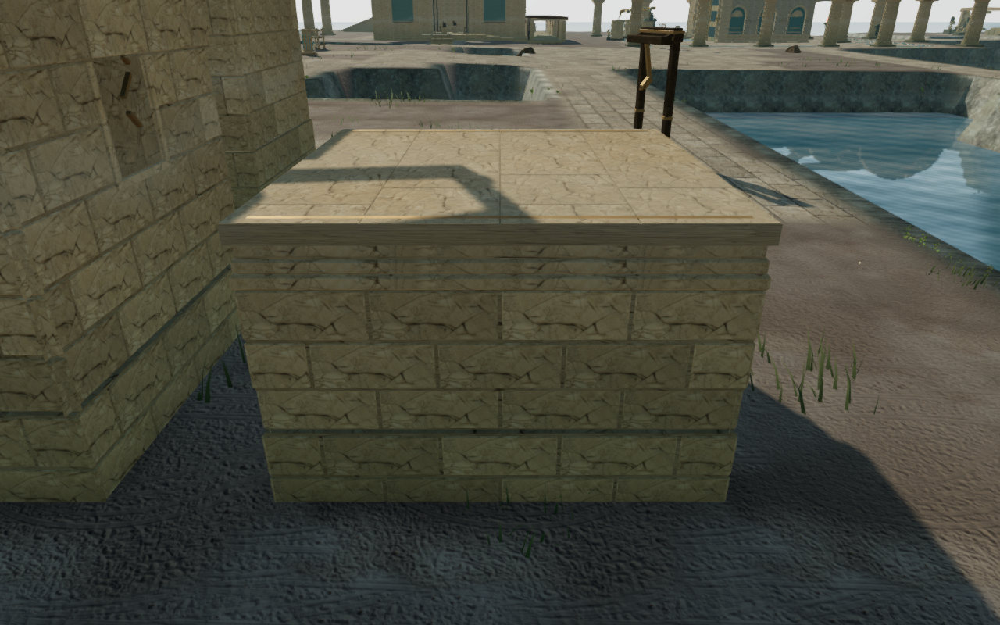
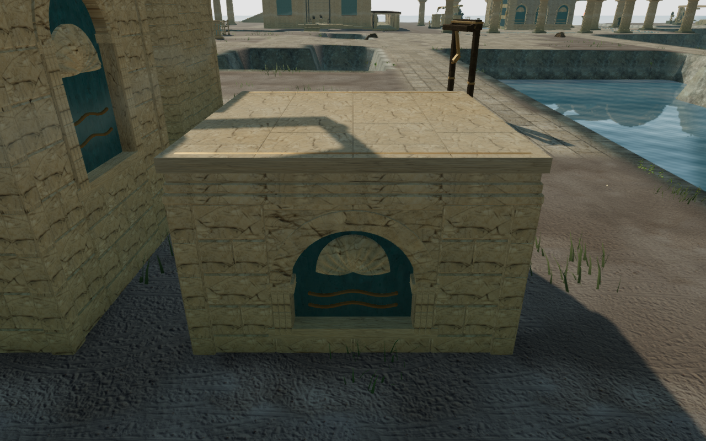
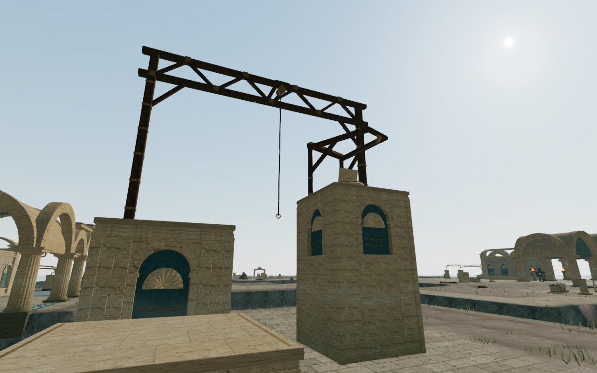

# Coastal climbing piers

The coastal palace's ten climbing piers now have forty arched tidal bays.
Blue plaster, jointed stone arches, fluted jambs, closed shell reliefs and
paired bronze waves replace the plain wall grid and small generic tablets.
The palette and carving connect both climbing courses with the surrounding
palace galleries.

Stone wings, dressed corners and arch joints have continuous backing over a
buried full bearing bed. Shells have complete rims, diameter edges and planar
backs that intersect the plaster. Bronze waves sit into the panel; seated end
bosses close their tube ends. The construction stays inside the existing
movement and camera solids. Standing roofs, coping, landing markers, hoist
frames, terminals, cables and later construction seeds retain their geometry
and positions. Original project geometry reuses the existing credited palace
stone, plaster and bronze materials; [asset attribution](asset-credits.md)
is preserved.

The mountain's exact vertex indexing now lives in the shared pier helper.
For each coastal course it reduces fixed/detail records from 245,148 to
115,717 while retaining every triangle, material batch and attribute.
Expanding the indexed triangles verifies all 5,960,808 coastal position,
normal, UV, color and material components byte for byte against the same
unindexed artwork. Differing normals, colors and signed zero stay separate.
All four mountain courses also retain their previously verified attribute
hashes and counts. Each complete coastal course uses 142,787 vertex records
within the existing 180,000 limit; these counts do not establish hardware
frame rates.

All 802 campaign checks across 122 files pass without failures, cancellations
or skips. The production build passes with its existing bundle-size advisory.
Browser rays verify 4,410 roof points, 1,210 underside points and 360 panel
centers. Every sample meets construction. The largest roof difference is
5.000 mm at a paving joint; the highest sampled underside is 210.000 mm below
queried ground. Another 4,840 points cover the arched faces, including near
their curved edges, without gaps. Sampled surfaces sit 39.993–300.006 mm
behind the outer pier face. An isolated shell check adds 3,924 front, back,
rim and inside-to-outside rays across the exact generated widths and preserves
all 65,280 original front position, normal and UV components.

All 42 High construction views, four Low views and eighteen comparison views
are reviewed. Sixteen matched external face observers retain exact camera
positions and targets. Some have foreground masonry or terrain; they do not
establish every possible walking view.

Both final assisted coastal loops complete their walking approaches,
mantles, jumps, swinging ropes, summits, animated cable descents and ground
returns. Health remains 100 and camera opacity remains full across 7,254
updates. Recorded movement, camera poses and traversal states match the
preceding coastal routes exactly; rendering counts change with the new art.
All 97 final route images are reviewed. Each loop uses one supported starting
placement and a completed-expedition fixture without advancing enemy AI or combat.

Keyboard/High and portrait touch/Low production cases climb the first 2.8 m
roof, crouch and look, then descend to ground through native input. Health,
progress, explored cells and complete-store reloads remain stable apart from
chapter timestamps, with no arrival-camera corrections. Loaded bundles match
the final build, with no development hook, browser errors, warnings, failed
resources or horizontal overflow. All fourteen native captures are reviewed.

These lossless High images preserve the captured pixels. The first pair shares
its camera position and target; the course image is a separate construction
observer. The five-pier arrangement still repeats and broad coastal banks
remain sparse. Broader campaign visual coverage, landscape and discovery
composition, subjective sound/music review and browser/device acceptance
remain open. Positioned hoist sources and the quiet climbing arrangement
retain their existing movement and distance behavior.
