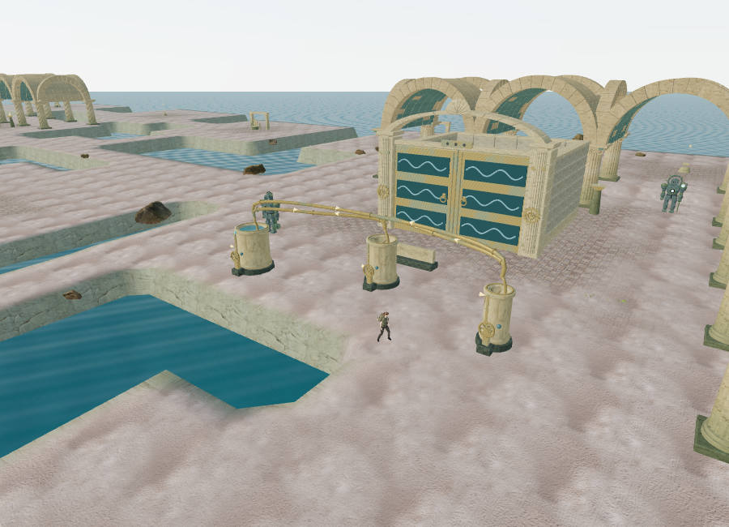
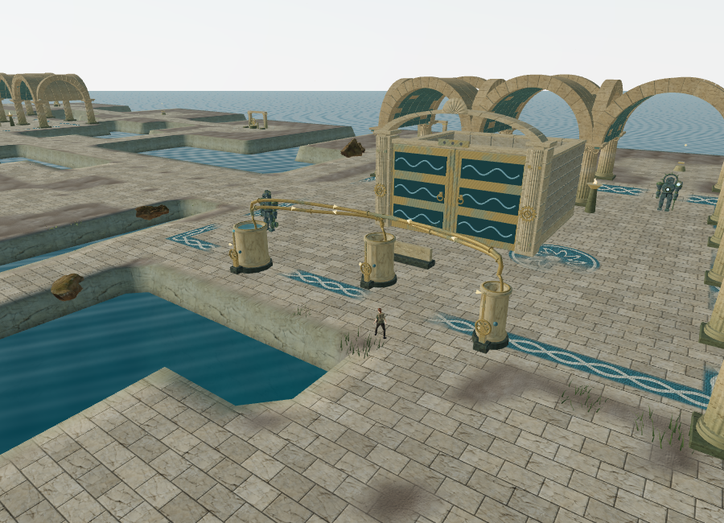
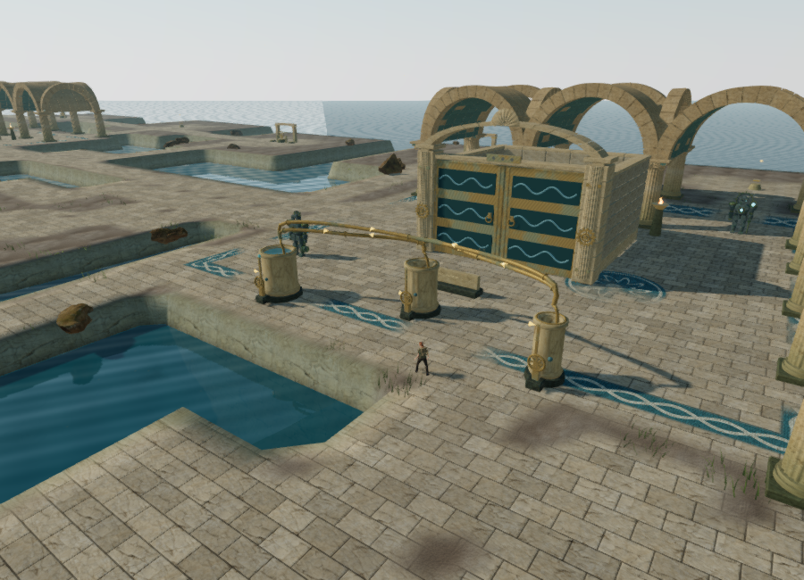
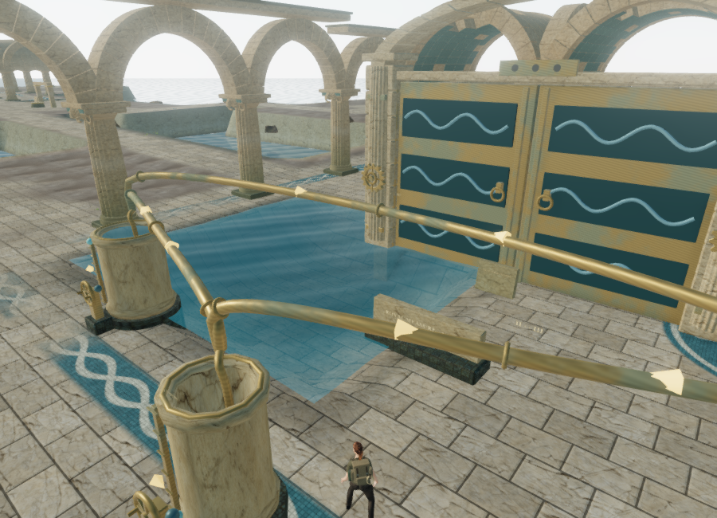
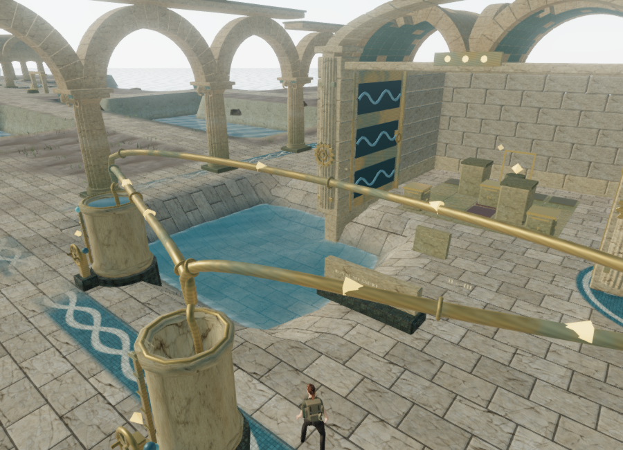

# Coastal ground and light

The Drowned Kingdom's floors now extend through its ten palace courts and along the actual causeways. Previously, the terrain's small mechanism-centered paving masks left most of the arcades and hydraulic forecourts covered with the same rippled sand as the shoreline.

The current work improves the visible environment. It does not establish AAA visual quality, supported hardware performance or approximately one hour of play per chapter.

## Before and after

The first two 900 × 650 views use Low quality and the same harbor-relative camera. The final High view includes the revised sky radiance, shadows, contact shading and water reflection. Field restoration differs in the High view.

## Surface design

The material plan follows all ten court foundations and the generated causeway cells, including their turns. Walkable paths have a broad stone center and a worn edge. The plan supplies material coverage and local court coordinates; it does not change the map grid, terrain heights, reservoir geometry or collision.

Running-bond limestone slabs use the existing palace stone color, normal and roughness textures. Procedural grout and shallow bevel shading give the slabs a readable scale. A screen-space footprint softens narrow joints at distance and converges toward their average coverage, avoiding the dotted aliasing found in the first browser render.

Teal and cream tessellated borders frame the courts. Braided bands and floral medallions use the room index to vary their phase, petal count and placement. Individual tesserae have restrained color variation, mortar, and noise-based losses. Sand and worn patches interrupt the paving near its edges. The material's coverage also guides the existing grass placement so grass is less prominent across the paved floors.

The appearance remains procedural. Tile bevels are shading details, not raised collision geometry, and the unchanged island topography is still visibly regular.

## Water and lighting

Terrain darkening, roughness and muted algae staining follow the actual reservoir surfaces. Eight basin descriptions use the live water heights; small waterfall basins contained by a larger reservoir inherit that reservoir's level. Independent waterfall basins retain their own level. Historical salt variation stays on the stone as the active wet band drops.

An assisted harbor drainage check moved the water from **0.4164804172515869 m** to **−1.3835195827484132 m**, a 1.8 m drop. The terrain's corresponding float uniform moved from 0.4164804220199585 to −1.3835195302963257, within float precision. The visible bank and water share the same ground profile.

These drainage views precede the final sky-radiance adjustment. The final floor geometry and wetness logic are the same.

Coastal daylight now comes from a lower diagonal direction. Cooler, reduced hemisphere fill and restrained sky radiance preserve more contrast under the arcades. The visible sky and its reflected environment use the same radiance adjustment. The chapter's fog is slightly thinner, keeping neighboring island courts legible.

The existing positional soundscape, drainage-linked water emitters and quiet palace music continue to follow their gameplay state. No recordings or score arrangements changed in this work.

## Verification and limits

Four new tests check floor and causeway coverage, unchanged terrain and foundation heights, matching attributes/normals across terrain chunk seams, and live wetness heights during drainage, including shared waterfall surfaces. All **209 tests** passed in 81.47 seconds. The production build passed with the existing Three.js chunk-size advisory.

Browser-assisted movement retained clear sampled positions at all **36 hydraulic controls**, all **27 front pump sound paths** and approaches to all **59 original non-guardian chapter features**. The character completed all **36 local routes** between tablets and pumps through the actual movement physics. Low and High coastal shaders linked successfully after correcting a reserved GLSL identifier found during development.

All seven other chapter scenes also rendered with linked shaders. Each correctly omitted the coastal terrain attributes/material mode, hydraulic sites and hydraulic sound sources after the chapter switch.

The Low overview changed from **170 calls / 320,608 triangles** to **183 calls / 321,644 triangles**. The changed floor mask also changes seeded grass/scatter choices, so this is an observed scene workload, not a shader-only benchmark. The final High overview submitted **1,257 calls / 2,249,755 triangles** across its passes. High adds shadows, contact shading and a planar reflection; its saved field state also differs. The browser uses ANGLE/SwiftShader, and none of these counts establish a supported hardware frame rate.

The final release contains `index-BtzkA6VA.js`, `game-eM-prESq.js` and `three-_2BfqRZv.js`. In the High production build, native E restored `field-0-2` after an assisted setup with the first two harbor stations restored. Native W moved the explorer from `(238, 128.4)` to `(238, 128.10000000000002)`. Reloading restored that exact position, stage 0, all three field stations and **62.355000000000004 active seconds**. Holding a required texture and moving focus away during startup made the expedition open paused, avoiding additional active time during the comparison.

The release contained no development hook and reported no console warnings/errors or failed HTTP resources. Development and preview test progress were cleared; both launchers were left on chapter one with High quality selected. The broader requirement audit remains in [production status](production-status.md).

## Files and sources

- `src/coastal-layout.js` — material coverage on actual court and causeway cells.
- `src/coastal-material.js` — limestone, tessellation, grout filtering, wetness and reservoir uniforms.
- `src/terrain.js`, `src/terrain-material.js` — shared ground geometry and layered-material integration.
- `src/water-surface.js` — synchronizes coastal wetness with water animation and saved drainage.
- `src/atmosphere.js` — coastal daylight, sky radiance and matching environment capture.
- `tests/coastal-ground.test.js` — coverage, geometry, seam and drainage regressions.

The layouts, mosaic patterns, tile shading and wetness code are original to this repository. Existing palace stone and mosaic maps are reused; their sources remain in [asset credits](asset-credits.md). No new third-party files or remote runtime services were added.
