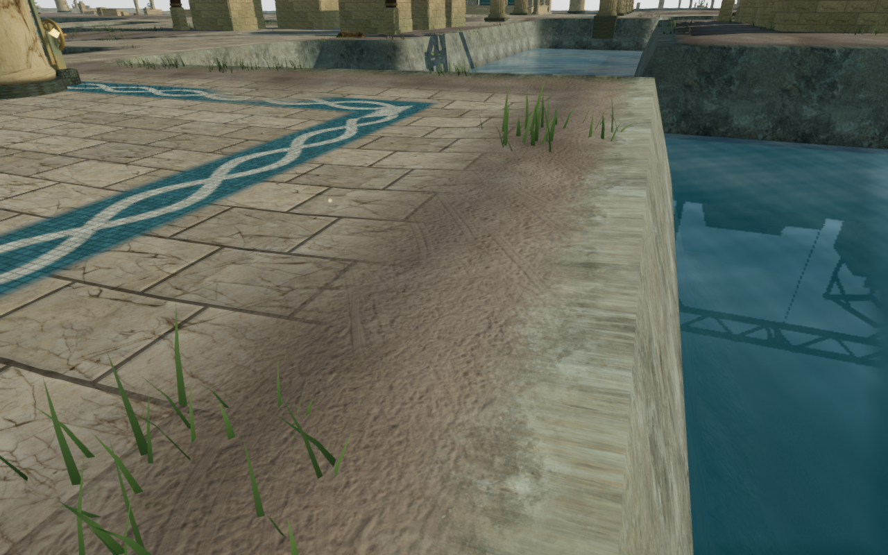
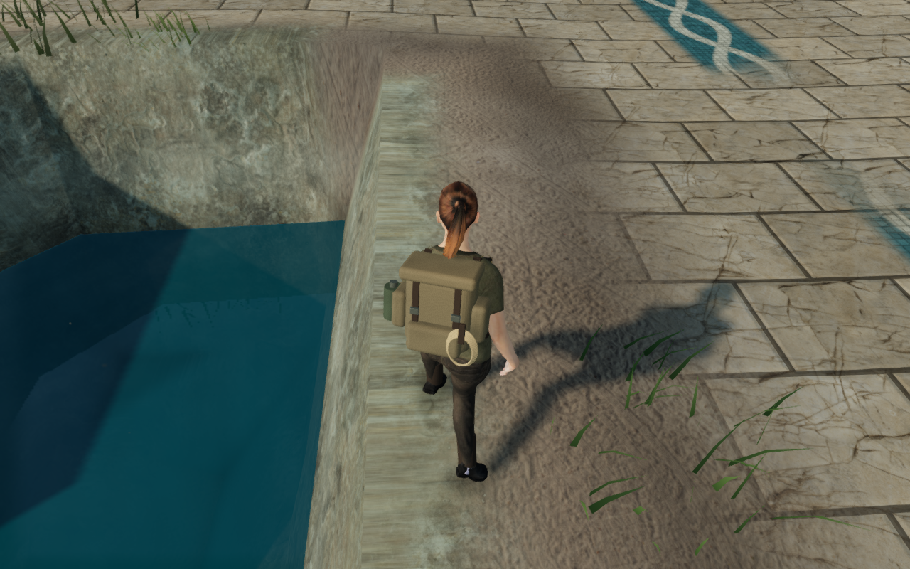
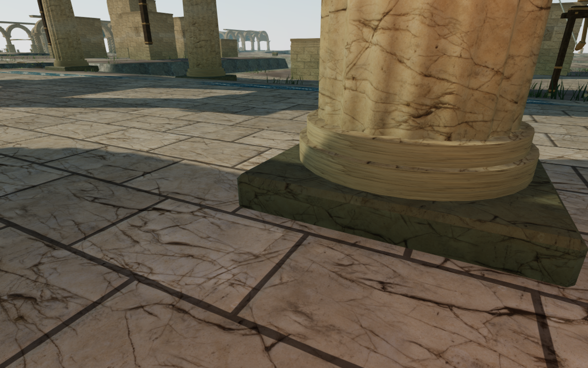
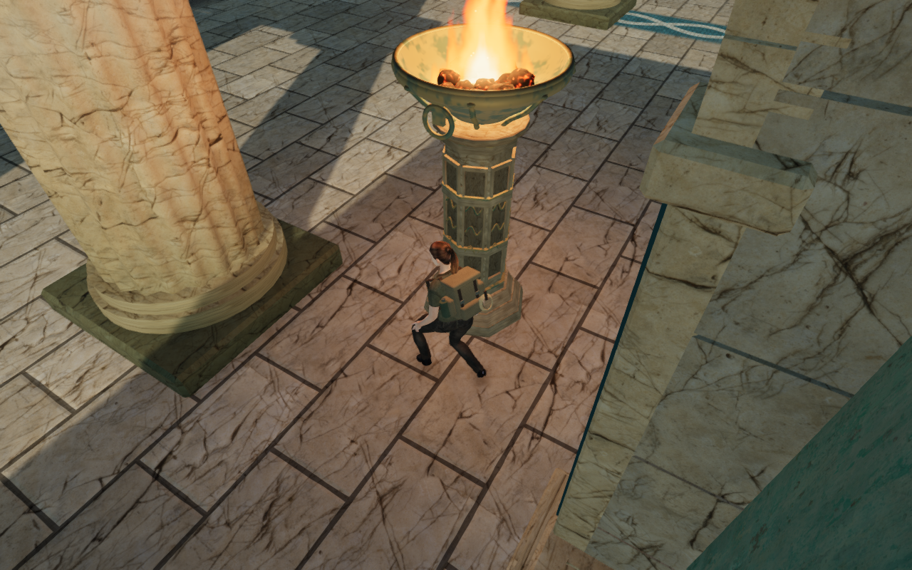

# Coastal walking camera recovery

Continuous approaches to the two coastal climbing courses exposed brief views
in which the explorer disappeared. The canal-edge approach recorded six camera
updates inside the character's fade range, reaching a 1.060 m arm. The approach
beside a column recorded fifteen, reaching 3.738 mm. All occurred during ordinary
walking, with swimming, aiming, climbing and cable/rope riding inactive.

The existing recovery searched a small pitch/yaw neighborhood, then widened yaw
to 0.9 radians. Actual-world ray queries found no 3.2 m view in that neighborhood
at the hidden poses. Clear views existed within 1.5 radians. The recovery now
tries the additional side directions only after the preceding neighborhood
fails to provide a comfortable view. Every candidate retains the normal swept
camera bounds, terrain and map checks. Collision response preserves the player's
feet and chosen yaw/pitch. The existing exemptions for aimed, water and traversal
views remain in place.

The two complete assisted loops now retain full character visibility across
7,254 camera updates. They use one initial supported placement each, followed
by normal controller movement through the approach, mantles, jump gap, rope
catch/release, summit, animated return cable and walk back to the starting point.
There is no placement or progress reset between those legs.

| Course | Approach | Climbing and cable | Return | Minimum camera arm | Faded updates |
| --- | ---: | ---: | ---: | ---: | ---: |
| `field-3-0` | 144.478 m | 66.643 m | 130.517 m | 2.380 m | 0 |
| `field-3-2` | 58.661 m | 66.639 m | 57.618 m | 2.694 m | 0 |

All 97 final route captures are reviewed. These are completed-expedition
backtracking fixtures: enemy AI and combat are not advanced. They establish the
recorded traversal and camera behavior, not a human campaign playthrough.

Separate replays check all 21 captured hidden positions. One ordinary camera
update from the recorded preceding camera position retains the same feet,
chosen look and progress, full character visibility, a camera arm of at least
2.2 m with floating-point tolerance, a legal camera position and an
unblocked center ray against the scene's camera bounds. All 21 baseline and
21 revised pose images are reviewed. These ray checks use collision bounds;
they are not a full skinned-model or rendered-triangle penetration test.

The regression in `tests/camera-follow.test.js` uses the delivered coastal map,
terrain and court construction to reproduce the canal-edge retraction. It
checks 120 updates for visibility distance, clear bounds, legal camera space,
unchanged feet and retained look. Existing checks retain ordinary follow in
special camera modes and safe retraction when an enclosed corridor offers no
clear escape.

All 787 campaign checks pass across all 122 test files exactly once, with no
failures, cancellations or skips. The production build passes in 3.62 seconds
with the existing bundle-size advisory.

Two native production cases exercise keyboard/High at the canal edge and
touch/Low beside the column. Both verify manual look, crouching, brief grounded
movement, health 100, retained progress and previously revealed map cells.
Complete-store reloads match apart from chapter timestamps and three
arrival-camera corrections. Independent actual-scene queries confirm that the
preceding chosen rays are obstructed or too short, and that the existing arrival
policy selects the recorded full 5.372 m views. A second reload retains the
complete store apart from timestamps. All six native captures are reviewed.
The loaded JavaScript and CSS match the revised build, without failed resources,
browser errors, warnings or page overflow.

The before images are captured moving frames. The after images replay their
feet and chosen look with a stationary character pose; animation poses are not
identical. All four are actual game captures, converted losslessly to WebP with
identical decoded RGBA pixels and dimensions.

The wider review has also completed continuous loops in the jungle, desert,
snow, volcanic and opening cloud regions. It corrects earlier height-blind
inspection setup and bounded-search failures; these were not proof of a blocked
physical cable exit. Remaining cloud, crystal and meridian approaches and wider
landscape composition are still under review. Repeated course forms and the
open findings in the [visual audit](visual-audit.md) remain. This camera repair
adds no subjective listening evidence, consumer-device benchmark or AAA-quality
claim.
