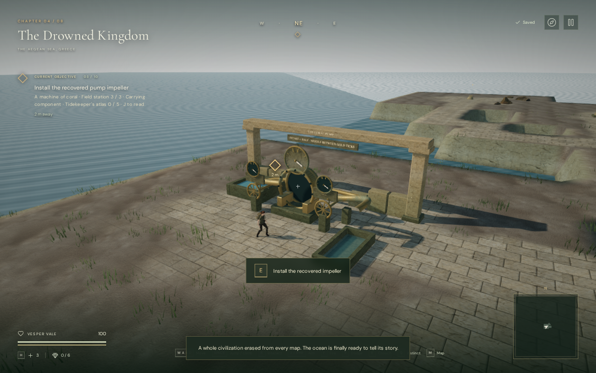
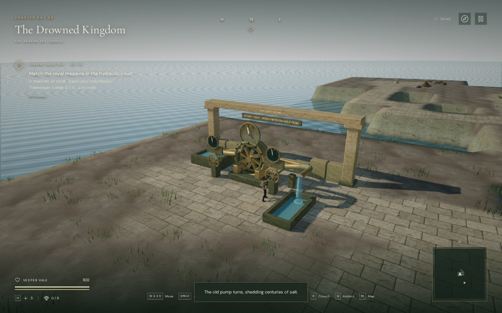

# A machine of coral

The third field mission in **The Drowned Kingdom** now repairs a working pump.
The recovered impeller and the pumpkeeper’s diagram lead to an exposed bronze
pump, two adjustable handwheels and pressure gauges in the existing delivery
clearing. Establishing steady flow opens the sanctuary gate.

Use **E / Use** to recover the impeller and read the diagram along the marked
route. At the pump, approach the central seat and install the rotor. Move to the
left **INTAKE** wheel and the right **BYPASS** wheel to adjust their four detents.
Each press advances from closed through three open positions and back to closed.
The interaction prompt reports the selected setting, and a pip above each wheel
moves to its corresponding mark. A smaller pressure gauge above each valve
repeats the main reading, keeping the needle in view in portrait play.

The intake must be at least half open. Adjust the bypass until the needle stays
between the two long gold ticks. Five continuous seconds of stable pressure
restore the pump; the objective then returns to the hydraulic court. The rotor
turns and water falls into the receiving channel as pressure rises.

## Puzzle and persistence

The gauge uses authored units. Its target pressure is 22 times the intake detent
minus 14 times the bypass detent, clamped at zero. The operating band is 36–46.
There are two valid configurations: intake 2 / bypass 0 and intake 3 / bypass 2.
The needle eases toward the selected equilibrium. Both that equilibrium and the
actual needle must be in the band, with sufficient intake, for five seconds;
briefly sweeping through the band does not count. Changing either wheel resets
the settling interval. These are game rules, not a hydraulic engineering model.

Installing the impeller releases the existing carrying restriction while leaving
the field objective unfinished. The installed part and both valve settings save
immediately. An unfinished reload retains those settings and restarts the pressure
settling from zero. Completed repairs retain their valid selected configuration
and restart with steady flow. Earlier saves that passed this mission receive a
restored pump. Save writes and reloads use the same normalization while preserving
the live state object. Pausing freezes pressure, settling and rotor movement.

A comparison against the published map generator found every map value unchanged
except the coastal diagram and final-repair labels. All field positions, paths,
rooms, enemies and discoveries retain their existing placement.

The casing, cistern walls, control pedestals and surviving masonry have movement
and sight bounds. Camera bounds cover the physical geometry. Both control aisles
and the perimeter remain traversable. Local pump water is decorative and does
not change the chapter’s swimming or reservoir volumes.

## Verification

The assisted browser repair used native E input to install the impeller and turn
both valves, then walked the control aisles and the perimeter at 100 health.
Directions and the solution were supplied by
[`verify-coral-pump-browser.js`](../scripts/verify-coral-pump-browser.js).
The check began with the earlier pickup and diagram flags prepared; it does not
establish a blind chapter playthrough or one-hour pacing. Both earlier props were
inspected in their actual browser locations.

Four new automated tests cover ordered prerequisites, delivery gating, carrying,
both solutions at 20/30/60 updates per second, invalid pressure sweeps, pause,
legacy and unfinished saves, independent chapters, collision, walking routes and
synchronized gauge needles.
The full suite passes all **487 tests** in 108.88 seconds with four test workers.
The release build passes in 4.48 seconds with the existing large-chunk advisory.
The final production build passed four saved-state checks: the installed impeller,
unfinished valve settings, a completed keyboard repair at intake 2 / bypass 0,
and a muted 540 × 900 Performance touch repair at intake 3 / bypass 2. Both
repairs used native movement and interaction, finished at 100 health, and kept
the valid selected configuration on reload. Mouse look reoriented the camera
after its normal reload turn toward the mission marker. The full save matched
after every reload except for the last-played timestamp. These checks began at
the pump with the pickup and diagram flags prepared. Final keyboard and portrait
views were inspected. The release exposed no development hook, loaded the current
build's JS/CSS assets, and reported no errors, warnings, failed assets or page
overflow.

The pump has a machinery emitter at its bearing and a water emitter at its
outflow. They reuse original machine synthesis and the existing credited stream
recording. HRTF positioning, linear falloff, occlusion and the shared voice limit
apply. Both voices are absent before installation, present in the live mixer
while pumping and removed on pause; resumed restored flow retains both voices.
The existing coastal score selects its valve task during the repair.

A distance-only offline render of the actual machine buffer measured RMS
0.098059 at 2 m, 0.049029 at 13 m and zero at 25 m, with a 24 m range. The stream
buffer measured 0.119553 at 2 m, 0.059776 at 15 m and zero at 29 m, with a 28 m
range. Both have exactly half amplitude at the falloff midpoint. Source positions
are within 2 cm of the bearing rotor and at the outflow ring respectively. These
checks establish signal behavior, not subjective mix or music quality.

All active shaders linked in High, Balanced and Performance. The checked High
view submitted 731,466 triangles and 297 calls across its rendering passes;
Performance submitted 248,350 triangles and 102 calls. These include the nearby
coastal world and are not frame-rate measurements. Changing to the desert disposed
all 42 inspected pump-root geometries and 18 materials, cleared the runtime pump
and removed both sound sources. In a 540 × 900 Performance view beside the bypass,
the local gauge centre
projected to pixel (270, 181), and both small needles matched the main needle.
The development checks reported no console errors, warnings or failed asset requests.

The impeller, pump casing, valves, gauge, pipes, masonry and inscriptions are
original project geometry and writing. They reuse existing credited materials
and audio; no external assets or dependencies were added. The images are actual
1280 × 800 browser views of the assisted repair; the lossless WebPs preserve
their captured RGBA pixels exactly.

The broader request remains open: modern AAA graphics are not met, approximately
one-hour chapters require blind human playtesting, and subjective listening and
broader browser/device evaluation remain unverified.
