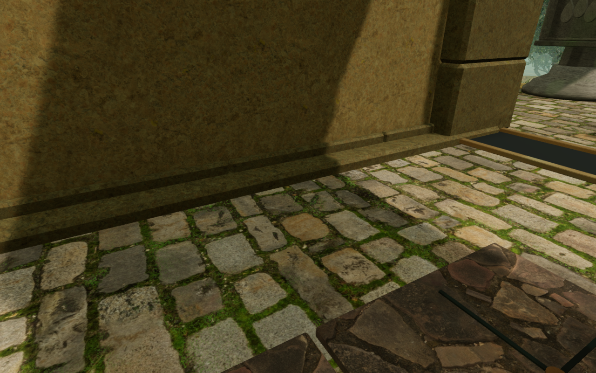
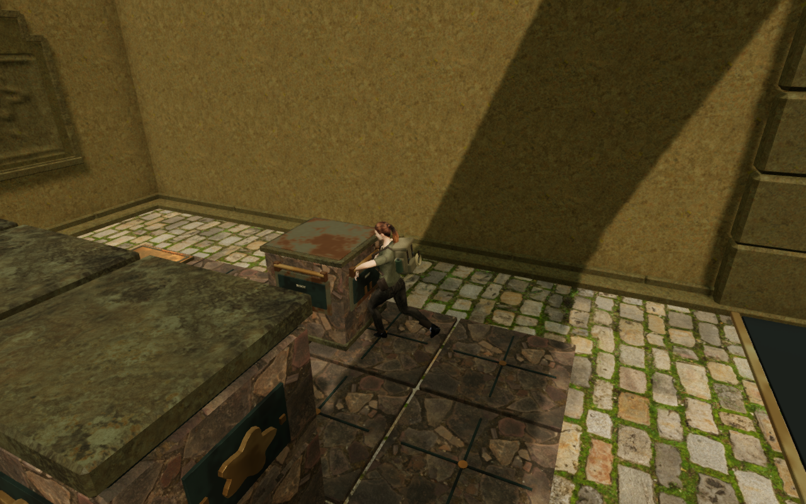
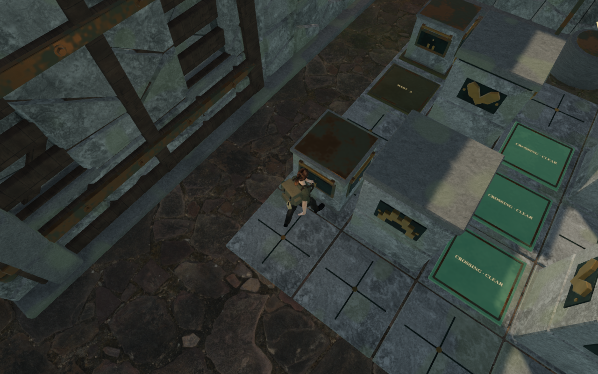
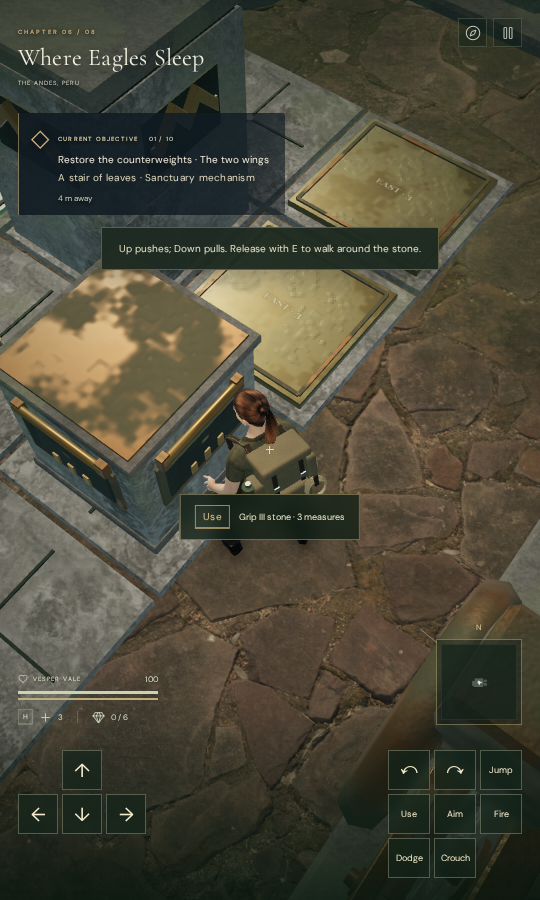
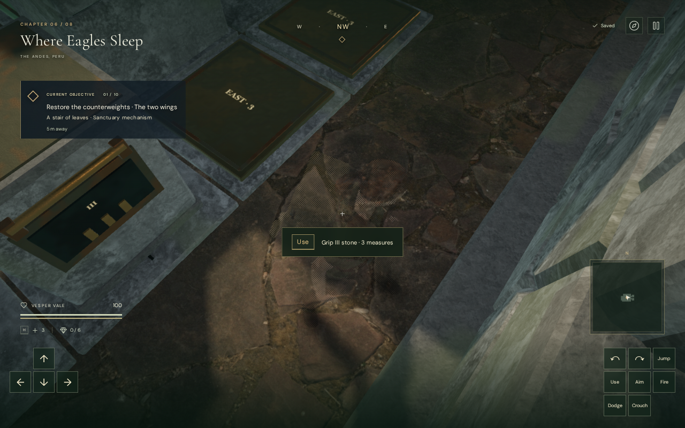

# Counterweight working views

Gripping a stone could hide the explorer even when the approach view was clear.
Use closes the last 15 cm to the working stance, bringing the camera's look point
inside the stone's clearance margin. In the baseline first-slide checks, seven
chapters reached zero character coverage; the shortest arm was 0.237 m in the
cloud chamber. The crystal chamber's first move remained clear.

An accepted grip now chooses a clear working view. Before each accepted push or
pull, it checks nine positions across the requested slide, including both ends.
It predicts the stone's translated camera bounds while retaining every other
world obstruction and terrain check. A view that stays clear is retained;
otherwise it selects a nearby working angle, checking the remaining orbit when
the rear side is closed by a wall. The ordinary swept follow camera then follows
the movement.

These images use the same assigned working save, chapter, quality and motion
frame. Their headings intentionally differ. The prediction does not move world
objects, walking obstacles, the player or saved stone cells. View selection runs
once on accepted Use or a newly accepted slide. Later look input remains free;
it is not rewritten on every movement frame. A rejected stone move does not
select a view. The existing paused-slide recovery and settled-move saves remain.

## Verification

All **51 targeted tests pass in two batches**: 28 camera/counterweight tests and
23 wind machinery tests. Regressions reproduce the old hidden grip, check an
endpoint wall across a moving stone's path, retain a clear chosen orbit, and
verify that excluding the predicted stone still leaves other moving and fixed
solids in the camera query. Movement, blocked tracks, pause recovery, local saves,
hand poses and the existing wind camera behavior remain covered. The production
build and changed JavaScript formatting pass, with the existing large-chunk
advisory. The complete campaign suite was not rerun for this camera change.

The first-slide browser traces cover **992 frames on High and Low** across all
eight chapters. Their minimum character coverage is 1 throughout. The minimum
updated arm is 2.483 m, compared with 0.237 m in the baseline. All **64 baseline
and 64 updated captures** are reviewed; recorded shaders link and both completed
traces report no browser errors or console warnings.

The full solution check walks the actual terrain and collision routes, grips
each stone and advances the ordinary camera through **121 settled moves and
6,413 observed camera frames**. All **121 captures after settled moves** are
reviewed. Character coverage remains 1 across this observed sequence:

| Chapter | Stone moves | Minimum observed camera arm |
| --- | ---: | ---: |
| The Verdant Veil | 14 | 3.101 m |
| Beneath the Sands | 12 | 2.756 m |
| A Silence of Snow | 15 | 5.149 m |
| The Drowned Kingdom | 14 | 5.289 m |
| A Heart of Embers | 14 | 5.083 m |
| Where Eagles Sleep | 14 | 4.625 m |
| The Night Below | 18 | 2.785 m |
| The Last Meridian | 20 | 5.147 m |

These checks assign the opening field progress and working saves. Full solutions
use assisted walking and direction steering; they do not advance enemy combat
or establish an earned continuous chapter playthrough. The integration helper's
optional frame observer allows the camera and character pose to be inspected
without changing its default solution check.

Four native production cases exercise jungle keyboard High and desert touch
Low pushes, plus cloud keyboard High and touch Low pulls. Each records two legal
settled moves, releases the grip, walks normally and reloads its local save.
Health remains 100, restored feet agree within 5 cm and the entire saved store
matches apart from `lastPlayed` and two existing arrival-camera corrections.
Both cloud reloads choose a heading 30 degrees away from the saved orbit. An
independent geometry check measures the earlier arms at 1.823 m and 2.809 m,
and both new arms at a clear 5.474 m. A second reload preserves the complete
saved store apart from timestamps.

All **20 native production captures** are reviewed. The final bundle filenames
match the built files, the development hook is absent, portrait pages have no
horizontal overflow, and no failed assets, browser errors or console warnings
are recorded. Production keyboard and touch look checks also retain the grip,
feet and counterweight progress while changing the orbit; the chosen view stays
unchanged after input ends.

The verified production files are:

- `index-D_znEF_y.js`
- `game-BR4hOiK8.js`
- `three-mu_AYolc.js`
- `index-CQBT4VmC.css`

## Remaining scope

The accepted grip and stone-slide views repair VA-44. At this milestone, ordinary
walking beside the cloud chamber's side wall and folded door leaf could still
retract the camera and fade the explorer after release. Actual camera-bound
queries identified those objects as the blockers, recorded separately as VA-45.
The later [wider cloud court](cloud-aisle.md) repairs that observed walking aisle
by moving its walls and folded leaves outward. The final observatory's approach
finding VA-39 remains open. Grip/move selection does not run while walking freely.

A separate replay starts from each native case's settled two-move save and
advances 24 ordinary rightward walking ticks followed by 21 idle follow ticks.
All eight High/Low diagnostic captures are reviewed. Both sequences end beside
the wall with a 0.266 m camera arm and zero character coverage. Physical mesh
ray casts also intersect the wall. This baseline informed the later room repair.

Nine prediction samples and the recorded routes do not prove every arbitrary
camera input or world position. The player can deliberately choose an obstructed
orbit. Wider scenery and chamber composition, subjective sound and music review,
and supported-device performance remain part of the broader audit.

No external model, texture, audio asset or dependency was added. The existing
credited artwork, positional sounds and themed scores are retained. The five
documentation images are actual game captures converted losslessly to WebP,
with decoded RGBA identity verified.
