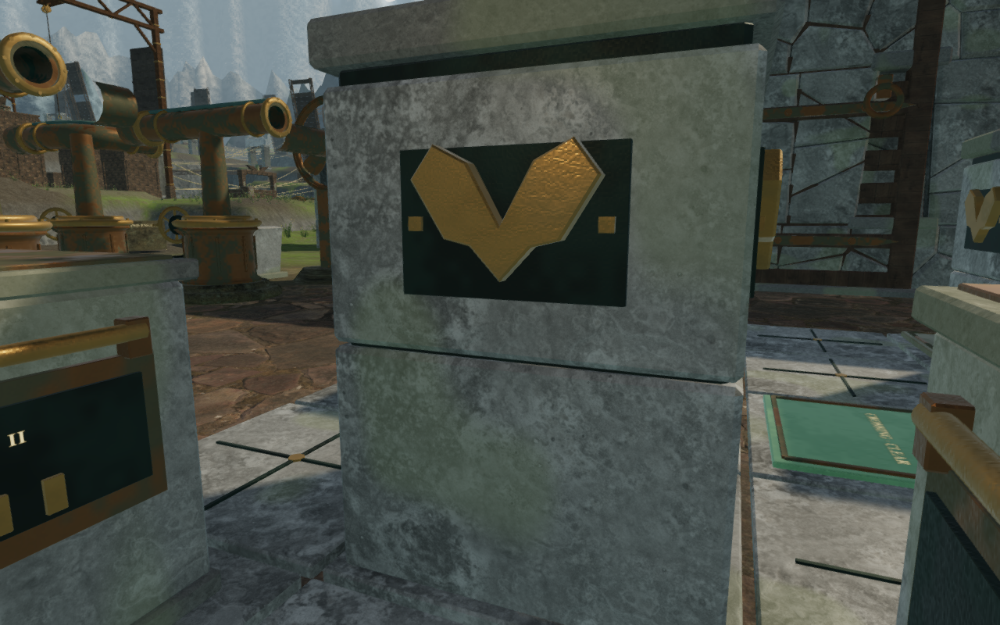
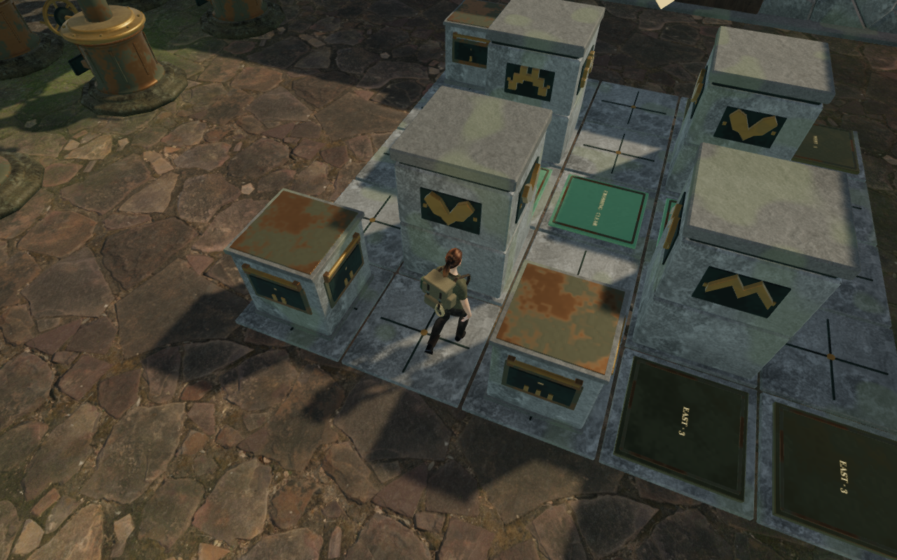
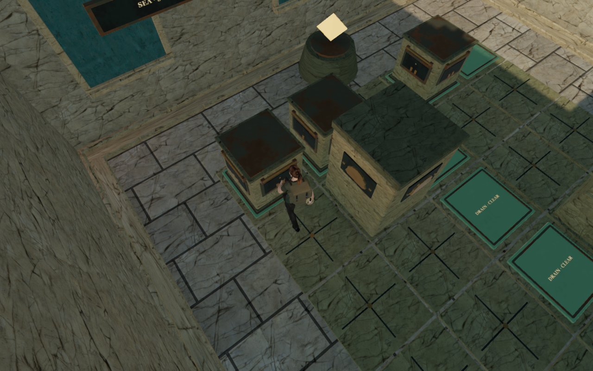
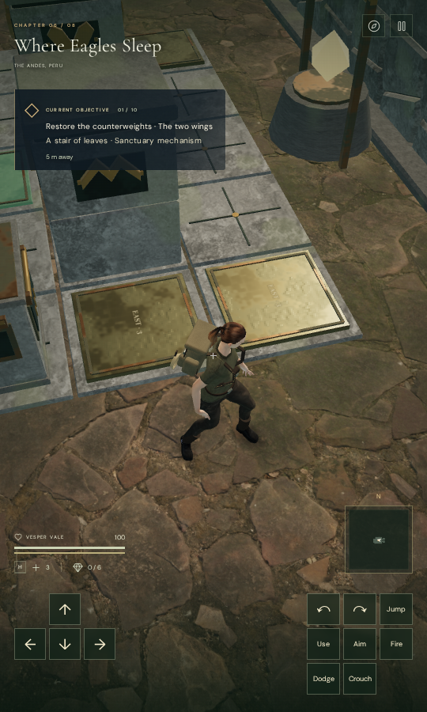

# Counterweight board views

Walking around the cloud chamber's twice-pulled third stone could hide the
explorer after an otherwise clear grip. The low working view put the following
camera behind neighboring masonry; waiting for it to settle did not clear the
obstruction. The earlier [inscription audit](cloud-inscription.md) records that
continuous approach and a second replay retaining the saved heading.

Taking a stone grip now prefers a clear elevated board view. The existing
selection adds a 0.85-radian pitch candidate and a small preference against lower
grip views, while retaining low views when the upper orbit is obstructed.
Accepted slides still predict the translated stone at nine positions and retain
the player's current view when it remains clear. Selection runs on accepted
grips or slides; ordinary look controls stay available between those decisions.

These captures repeat the same earned route, stone moves, walking feet and
horizontal heading. The pitch deliberately changes. No world objects, walking
solids, stone rules, saved cells or audio behavior change.

## Verification

All **29 targeted counterweight and camera tests pass**. The new regression
performs two legal cloud pulls, retains the recorded horizontal heading, walks
around the moved stone and advances 120 neutral follow-camera updates. It checks
physical camera clearance, unchanged look angles during the walk and unchanged
stone progress. Running that regression with the earlier camera module fails its
minimum-arm assertion. The production build, JavaScript formatting and whitespace
checks pass; the existing bundle-size advisory remains. The full campaign suite
was not rerun for this camera preference.

The repeated third-move approach records **50 moving and 120 neutral frames**.
The feet and horizontal heading agree exactly with the baseline in all 170
frames. The minimum arm increases from **0.426 m to 4.881 m**, and character
opacity coverage remains 1 throughout; the settled arm reaches **5.452 m**.
Previously, 30 moving frames and all 120 neutral frames fully faded the explorer.
All **18 updated trace captures** are reviewed. This is shader opacity coverage,
not a guarantee that every body pixel is unobscured by foreground objects.

All eight actual-world counterweight solutions also pass: **121 moves and 6,413
observed camera frames**, with character opacity coverage 1 throughout.

| Chapter | Stone moves | Minimum observed camera arm |
| --- | ---: | ---: |
| The Verdant Veil | 14 | 5.152 m |
| Beneath the Sands | 12 | 5.452 m |
| A Silence of Snow | 15 | 5.149 m |
| The Drowned Kingdom | 14 | 5.391 m |
| A Heart of Embers | 14 | 5.391 m |
| Where Eagles Sleep | 14 | 5.391 m |
| The Night Below | 18 | 3.534 m |
| The Last Meridian | 20 | 5.147 m |

All **32 representative release captures**, covering the first two and last two
moves of each solution, are reviewed. This check assigns working saves and uses
assisted collision-aware walking and puzzle directions. It does not establish
an earned campaign playthrough. An initial browser attempt closed before any
chapter passed; the completed run uses a fresh browser per chapter and avoids
duplicate setup work in the private harness. No application cause for the
earlier closure is established.

A separate continuous cloud route starts with the earlier earned opening save,
reads the relocated inscription, solves all **14 stone moves**, operates the
first engine's physical controls and UI activation, and returns through the
chamber to the tablet. It covers **192.687 m over 3,410 controller ticks**, with
health 100, no route stalls and a largest ground step of 6.7 cm. All **64 route
captures** are reviewed. The recorded third and ninth stone approaches now have
5.348 m and 5.426 m moving camera arms. Recorded shaders link; the completed trace,
solution and route runs report no browser errors or console warnings.

Four native production cases exercise jungle keyboard High and desert portrait
touch Low pushes, plus cloud keyboard High and portrait touch Low pulls. Each
performs two legal settled moves, releases the stone, walks and reloads. Net
walking distances are **2.10 m, 2.10 m, 1.80 m and 2.10 m**, with health 100.
The complete saved store matches across reload apart from `lastPlayed`; no
arrival-camera correction is needed in these cases. Restored feet agree within
5 cm, and all **20 production captures** are reviewed.

The development hook is absent, no asset requests fail, portrait pages have no
horizontal overflow, and loaded bundle filenames match the current build.
The four production cases report no browser errors or console warnings.

Two additional production checks change the view while gripping, using keyboard
look and a real touch drag. Both retain the stone grip, feet, health and saved
stone state, and keep the new angles after input ends. Both captures are reviewed,
with no browser errors or console warnings. The keyboard-selected orbit enters
an obstructed close view; preserving manual look does not guarantee visibility
for every player-selected angle.

The verified production files are `index-iMfEidn0.js`, `game-CvIuYwI5.js`,
`three-mu_AYolc.js` and `index-CQBT4VmC.css`.

## Remaining review and provenance

VA-46 is partly repaired for the recorded board approaches following the new
grip preference. During the engine return, a wind coupling still retracts the
camera to **1.362 m** and hides the explorer in the recorded moving view. Engine
interactions have selected a different pitch by then. Older manually chosen low
orbits and forecourt walks also remain part of the review. This change does not
automatically adjust arbitrary free-walking views.

The later [wind walking-camera repair](wind-walking-camera.md) clears that
recorded coupling return and the observatory approach. Its complete first-engine
route still records 15 brief fades between stones inside the board, outside the
wind adjustment area. Those free approaches remain open.

The observatory approach VA-39, broader chapter composition and repeated scenery
remain open. These checks do not establish subjective audio quality, consumer
hardware performance or complete visibility at every world position.

The camera preference and regression are original project code. Existing
credited artwork, distance-sensitive sounds and quiet chapter/objective scores
are retained; no external asset or dependency was added. The four documentation
images are actual game captures converted losslessly to WebP, with decoded RGBA
identity verified. Saves, raw captures, logs and browser profiles remain in
ignored workspace-local staging.
