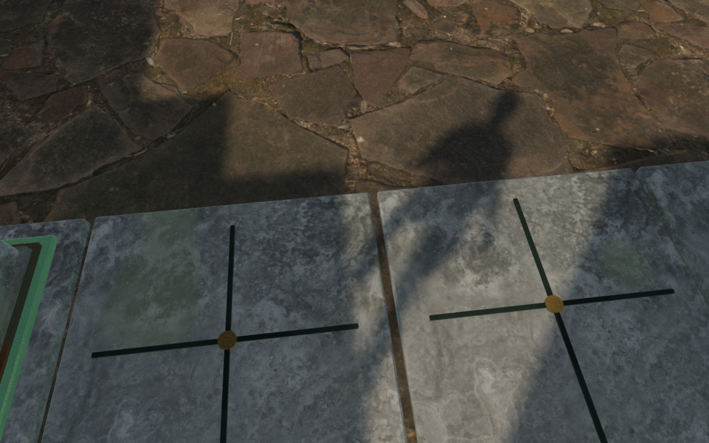
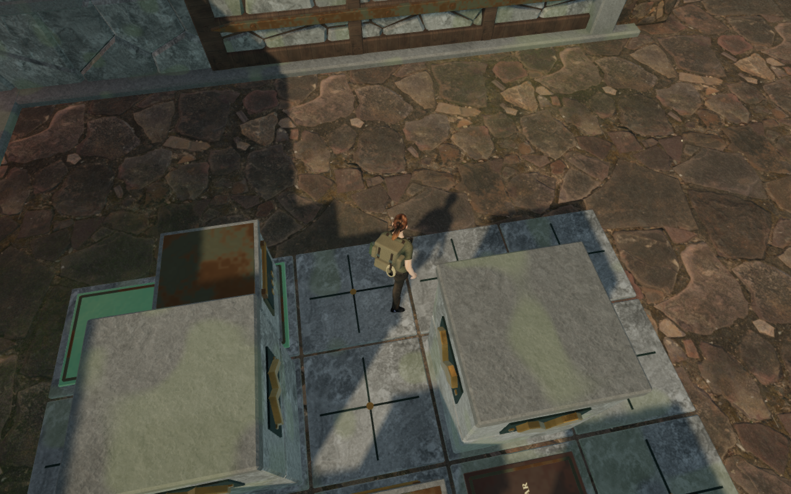
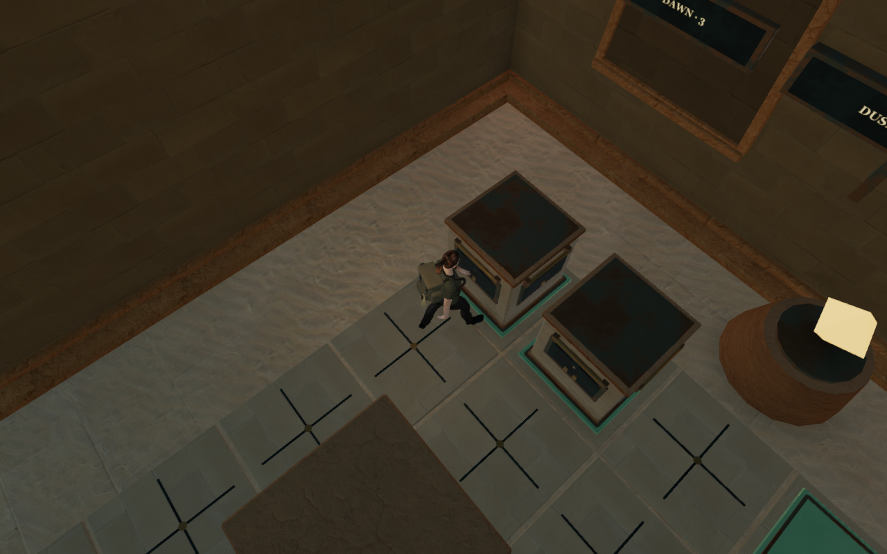
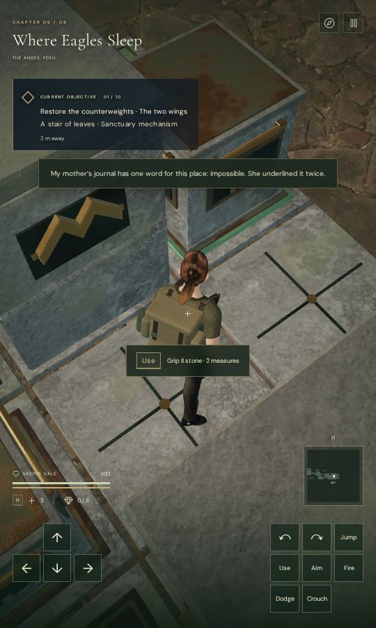

# Walking camera clearance around puzzle pillars

Five brief approach episodes in the first cloud counterweight chamber still
faded the explorer after the [wind walking-camera pass](wind-walking-camera.md).
Two requested views hit fixed puzzle pillars. Three requested views were clear,
but the following camera crossed a pillar while moving toward them. The earlier
recovery applied only beside wind machinery, leaving these board positions out.

Ordinary walking views now use the same nearby recovery throughout the campaign.
The camera first searches within 0.3 radians of the chosen yaw and 0.4 of the
pitch. If that neighborhood cannot fit a comfortable view, a second search
extends the yaw offsets to 0.9 radians. The smaller recovery remains preferred
whenever it fits. All candidates retain the existing solid, terrain and body
sight checks. A fully obstructed neighborhood retains its safe close view.

Collision response moves the camera without rewriting the player's yaw, pitch,
feet or puzzle state. The supplied camera arm and lift are retained, including
the shorter transition out of aim. Aimed, swimming, diving, climbing, rope and
cable views retain ordinary follow. World geometry, save format, positional
sounds and themed scores are unchanged.

## Verification

All **750 campaign checks pass on the final source**, in three exhaustive groups:
730 checks outside the wind file, its first ten checks, and its remaining ten.
Each group finishes successfully with no skipped or failed checks. This replaces
an earlier interrupted campaign attempt. All **37 focused camera/counterweight
checks** also pass, and the final production build finishes in **25.18 seconds**
with the existing bundle-size advisory. JavaScript formatting and diff checks
pass.

The regressions restore real seven-move cloud and three-move desert boards and
reproduce a tall entrance support. They test solid sight lines, retained feet,
look and stone state, a wall with no nearby clearance, excluded view modes and
the shorter arm after aiming. Substituting the previous wind-scoped helper
makes both cloud clearance regressions fail. Substituting the small-range
version makes both wider-pillar/support regressions fail their visibility
assertions.

Five actual partial cloud saves retain their earlier seven-, nine- and eleven-
move states. Independent probes reproduce the earlier ordinary camera arms
exactly. The two directly blocked poses recover to **2.562–2.563 m**; the three clear
destinations with obstructed following paths recover to **5.324–5.476 m**. All
ten before/after captures are reviewed.

The continuous first-engine route repeats **192.687 m over 3,410 controller
ticks**. It reads the tablet, completes fourteen stone moves, physically turns
and activates the engine, then returns through the chamber to the inscription.
Every recorded foot position, yaw, pitch and stone state agrees exactly with
the published baseline. Character opacity remains 1 throughout, removing its
fifteen faded frames; the minimum camera arm increases from **0.798 m to
3.214 m**. Health stays 100, no route stalls, and the largest ground step is
6.7 cm. All **64 final route captures** are reviewed. The largest camera step
falls from 4.605 m to **3.985 m**, so immediate contact and mechanism framing
changes still exist; this is not a claim of uniformly smooth camera motion.

The chamber verifier now exposes an optional walking-frame observer as well
as its existing slide/release observer. Fresh chapter checks complete all
**121 stone moves**, recording **9,293 walking frames** and **6,413 grip,
slide and release frames**. All recorded feet, yaw, pitch and solved puzzle
results agree exactly between the small-range diagnostic version and final
recovery. Expanding the range reduces its walking fades from 67 frames to
three:

| Chapter | Moves | Walking frames | Small-range faded frames | Final faded frames | Final minimum arm |
| --- | ---: | ---: | ---: | ---: | ---: |
| The Verdant Veil | 14 | 927 | 49 | 3 | 0.000 m |
| Beneath the Sands | 12 | 653 | 3 | 0 | 3.214 m |
| A Silence of Snow | 15 | 1,170 | 0 | 0 | 2.500 m |
| The Drowned Kingdom | 14 | 1,181 | 1 | 0 | 3.214 m |
| A Heart of Embers | 14 | 1,032 | 0 | 0 | 3.214 m |
| Where Eagles Sleep | 14 | 1,371 | 4 | 0 | 3.201 m |
| The Night Below | 18 | 1,647 | 3 | 0 | 2.725 m |
| The Last Meridian | 20 | 1,312 | 7 | 0 | 3.201 m |

No grip, slide or release frame fades. All **70 small-range and 65 final
representative captures** are reviewed, including approaches and releases
around the first and last two moves of each solution. Shaders link; completed
assisted runs report no browser errors or console warnings. Assisted field
unlocking, route steering and supplied solutions do not establish an unassisted
playthrough, pacing or consumer hardware performance. Character opacity does
not mean every body pixel is free of foreground occlusion.

Four native production cases restore two actual seven-move cloud saves in
keyboard High and portrait touch Low. Real look input restores the earlier
obstructed headings; subsequent manual look remains available, and walking
retains those angles. Net movement is **0.566 m, 0.515 m, 0.874 m and 0.500 m**,
with health 100 and the stone state intact. Complete stores agree before and
after reload apart from `lastPlayed`; **none requires an arrival-camera
correction**. Restored feet agree within 5 cm. All **16 native captures** are
reviewed. The development hook is absent, loaded bundles match the final build,
no asset requests fail, and portrait pages have no horizontal overflow. The
completed run reports no browser errors or console warnings. Two earlier native
attempts lost their browser target during startup; that cause was not isolated,
so the completed cases do not establish startup reliability across devices.

## Remaining observation

Three jungle walking frames still retract beside the first cipher court's drum
support on the initial inscription-to-board approach, before any stone move.
Independent actual-world replays reproduce both episodes exactly and identify
the existing **2.04 × 3.55 × 2.08 m cipher camera proxy**. No view within the
bounded recovery fits there. The affected positions and proxy geometry need
comparison with the delivered drum assembly; they are recorded as **VA-47**.
The camera remains constrained and the route still solves, but this approach
does not retain continuous character visibility.

VA-46's recorded complete cloud route is clear. Wider camera composition,
repeated scenery and the full eight-chapter visual audit remain open. The
distance-sensitive audio and quiet scores are retained; this camera pass does
not establish subjective sound quality or complete the game's acceptance audit.
