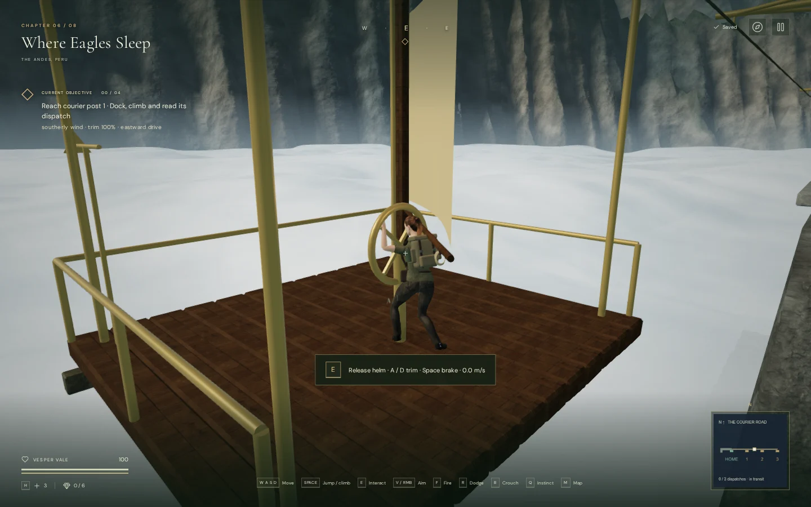
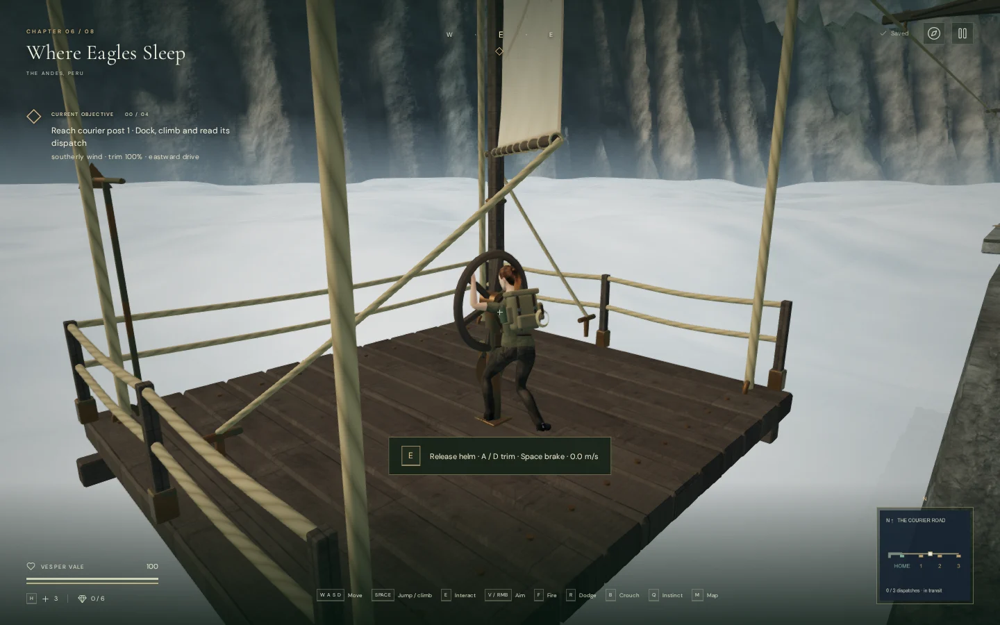
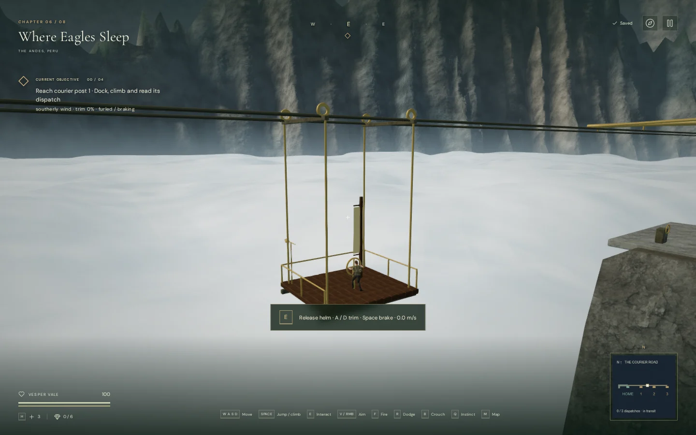
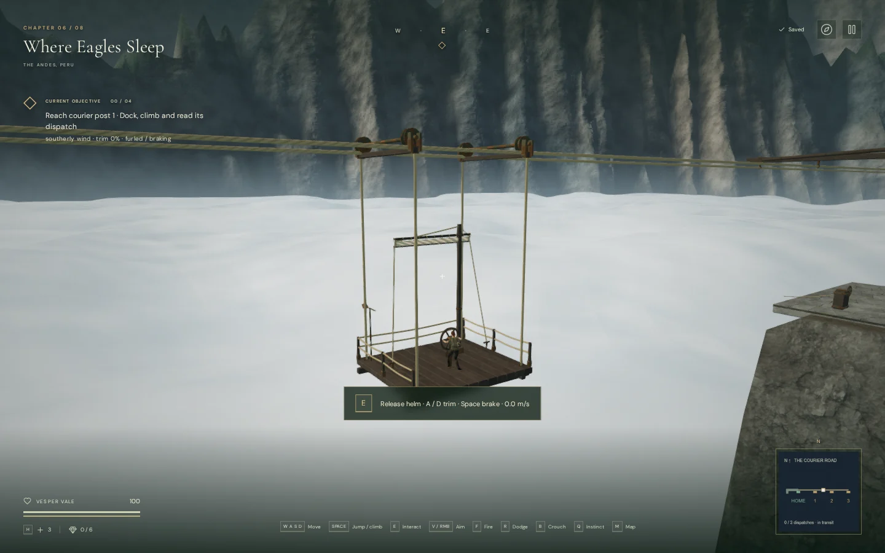
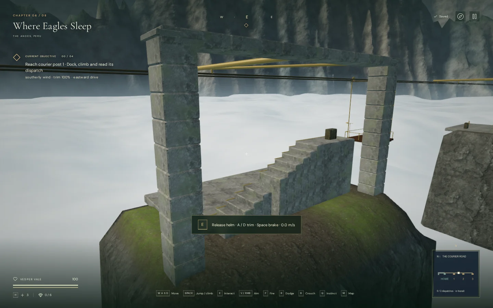
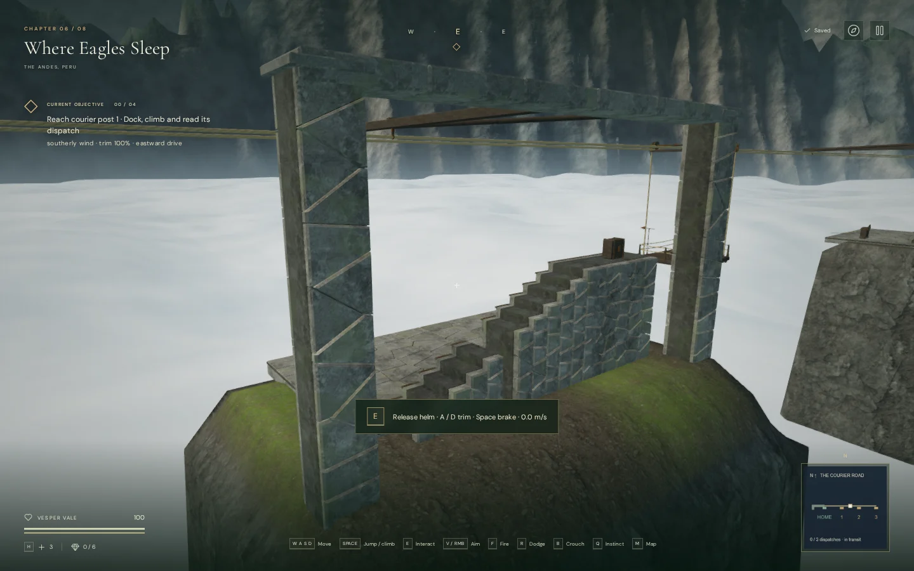
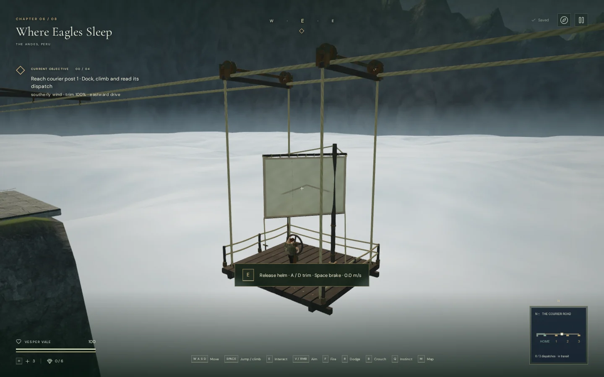

# Courier ferry construction

The [Courier Road](courier-road.md) now has a framed timber ferry, grooved cable
wheels, continuous suspension and sail rigging, and fitted-stone landings. Its
189-metre journey, three dispatch climbs and return register retain the same
controls and saved progress.

The sail gathers upward when **Space / Jump** brakes the ferry. Both yards keep
their four-metre span, and the lower batten follows the cloth's foot. Previously
the entire sail assembly narrowed horizontally. Four moving lines now follow
the cloth corners through the trim range, and the raised assembly clears the
operator. The fabric has original woven shading, seams, a weathered border and
a faint courier bird motif.

The deck has individually worn planks and pegs, underside stringers and bearers,
rope guards and metal shoes. Grooved wheels sit on bearing axles, with clevis
plates and strapped suspension beams below. Terminal cables return to eyes on
the granite piers. The helm has timber spokes, a bronze hub and a moving trim
needle. The taller mast and helm pedestal block movement; the calibrated
operator stance remains accessible.

Landing paving has level walking faces and shallow recessed joints backed by
continuous stone. Fitted masonry replaces the repeated blocks on the stairs
and piers. Dispatch cases have metal bands, and signs share one texture atlas.

The wind emitter follows the rendered sail's centre as it turns and gathers.
Cable creaks originate at the western axle's height. Both use the existing
linear distance falloff and HRTF graph; the quiet sky crossing music continues
under the courier objective. The visual work adds no audio voices or external
assets. Existing rock and timber maps and original procedural materials retain
their [asset attribution](asset-credits.md).

## Matched views

These are 1440 × 900 browser captures with the same High settings, camera,
ferry location and trim for each before/after pair. The final image gives an
additional view of the opened sail. Captures demonstrate the rendered result;
they do not establish AAA quality or consumer hardware performance.

| View | Before | After |
| --- | --- | --- |
| Helm and deck |  |  |
| Furled sail |  |  |
| Landing |  |  |

## Verification

Five new geometry checks cover fixed sail width and operator clearance,
rigging endpoints against actual cloth vertices, moving emitter attachments,
wheel/cable clearance, continuous paving, material attributes and moving camera
surfaces. Together with the eight existing courier gameplay checks, all 13
focused tests pass. The paving test samples 2,665 positions across one landing.
The final full suite passed all 442 tests in 131.5 seconds.

Ten final High/Performance views linked all shaders with no console warnings,
errors or failed assets. Eight have matching baseline captures. The ferry route
now contains 63,166 source triangles across 31 meshes, compared with 14,682
triangles across 59 meshes previously. Rigid assemblies are batched, while the
sail, rigging, wheels, helm, trim needle and vane remain animated. These are
source geometry counts, not frame-rate measurements.

A continuous assisted browser journey completed 46 walking segments and four
sail journeys, recovered all three dispatches, restored the register and
returned through the north gate at 100 health. The return journey crossed ten
wind-direction changes. Keyboard events operated Use and Jump; steering and
simulation timing were assisted. All 44 tracked ferry graphics resources
released exactly once when changing chapters, and the runtime and its sound
sources were removed.

Offline renders of the actual HRTF voice graph measured a 0.5 amplitude ratio
at each moving source's falloff midpoint and zero output beyond its range.
Wind samples used 3, 19 and 36 metres; cable samples used 2, 13.5 and 26 metres.
These are signal measurements, not subjective listening results. Both wrist
targets remained within 0.015 metres of the moving helm targets in four
High/Performance views at opposite trim settings; finger contact throughout
every animation is not established by that target-position check.

The world regression check retained 119 clear wind controls, 260 clear sound
fronts, 119 assisted local movement routes, 54 bridge-bank route searches and
59 clear feature approaches. This does not replace continuous native
playthroughs of the original bridge route.

Four final production cases passed without a development hook: native keyboard
boarding, helm use, trimming, braking and transit recovery; an elevated dispatch
read; muted 540 × 900 touch Use at another post; and completed-register journal
recovery. Every whole-save reload matched except for `lastPlayed`, retained
100 health, and produced no console warnings/errors or failed assets. The
portrait case had no horizontal page overflow.

The final build passed with Vite's existing large-chunk advisory. Release
bundles are `index-98cYgavd.js`, `game-BuEx2zwd.js`, `three-CQcYX-_1.js`, and
`index-DYq9hjRy.css`.

The full game remains a playable campaign prototype. Approximately one hour
per chapter, modern AAA graphics, subjective listening quality and broader
browser/device performance remain unverified or unmet requirements.
