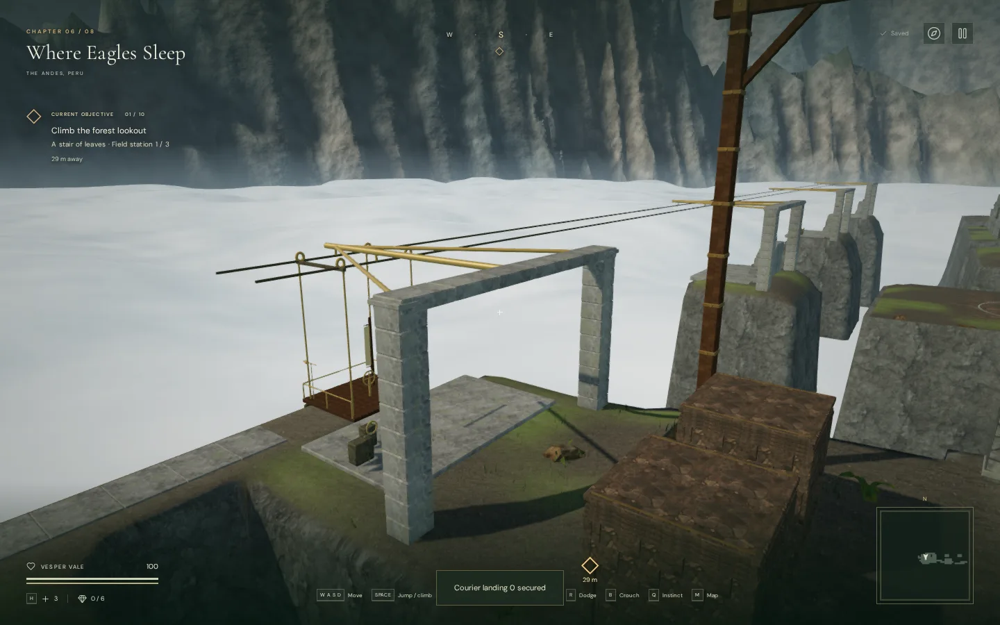
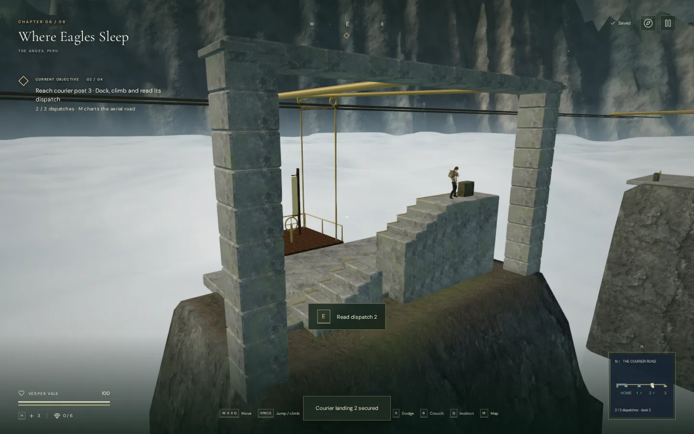
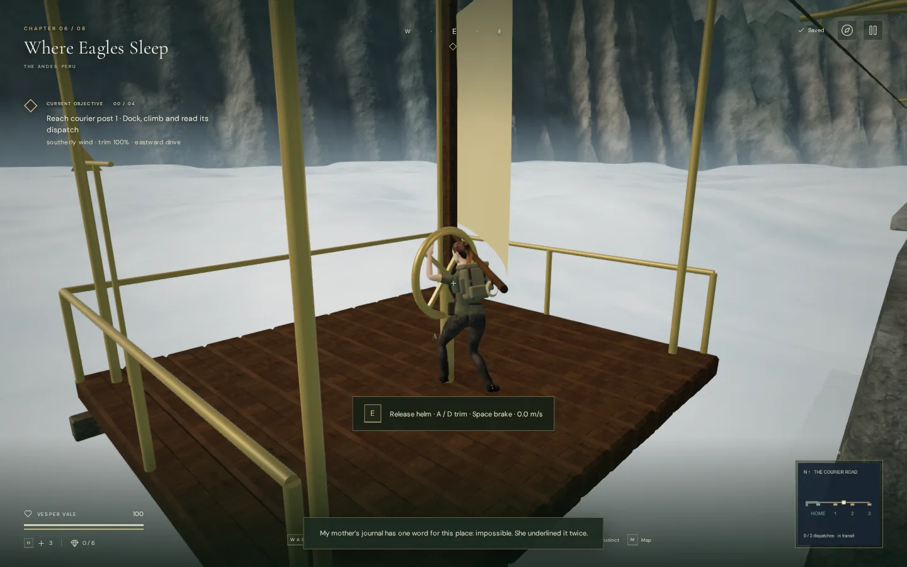
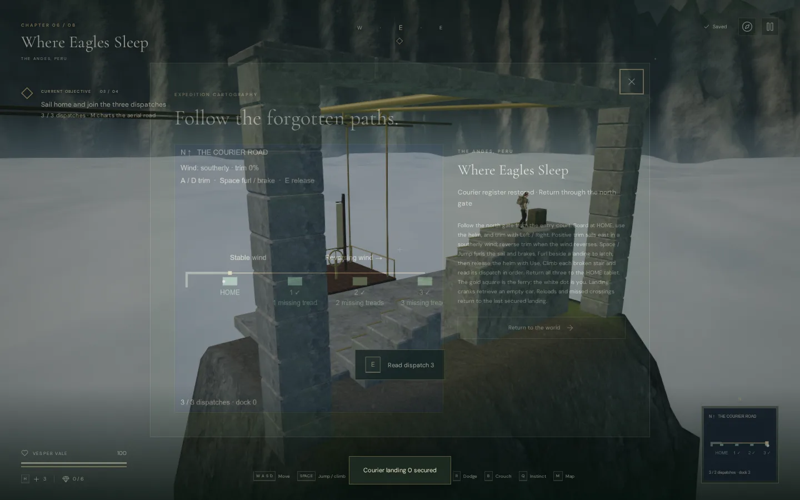

# The Courier Road

The cloud-city chapter has an optional aerial route through the first court's
north gate. A wind-powered ferry follows a 189-metre cable between four stone
landings. Three dispatch posts ask the explorer to dock, climb a broken stair,
read a letter and sail home to restore the courier register.

Use the physical helm with **E / Use**, then trim the sail with **A / D**, arrow
keys, or the touch stick's Left / Right. Positive trim drives east in a southerly
wind; reverse trim when the wind reverses. The first section is steady, while
later sections change direction. Wind blends across the section boundaries.
A vane and the HUD show direction with sound muted.

**Space / Jump** furls the sail and brakes. Near a landing, the slowed ferry
latches automatically. **E / Use** releases the helm so the explorer can step
through the open south side. The three stairs have one, two and three missing
treads. Ordinary movement and Jump cross these gaps; missed stair jumps land
on the lower dock. Each dispatch must be read in order. The entrance tablet
joins all three into a new journal record.

Landing cranks retrieve an empty ferry. The explorer can interrupt retrieval
by boarding. A missed crossing returns both explorer and ferry to the last
secured landing. Saving while sailing or airborne also uses that landing;
supported positions on fixed docks and stairs preserve their elevation.
Dispatches, the last dock and register recovery persist independently of the
sanctuary objectives in the chapter's `courierFerry` save record.

The map follows the cable, ferry, landings and explorer. The field journal keeps
all recovered letters. Wind and cable creaks move with the ferry and use the
existing HRTF graph, linear distance attenuation and occlusion filtering. The
courier objective uses the quiet sky crossing arrangement, retaining its pad
and bass while leaving out the flute line. Independent music, ambience,
effects and mute settings remain available.

The geometry, letters and map are original project work. Stone and timber reuse
already bundled credited textures; the moving wind and rope sounds use existing
original synthesis. No external assets or dependencies were added.

## Views

These views and the measurements below record the initial playable Courier
Road milestone. See the later [construction update](courier-construction.md)
for the current ferry, sail, landings, geometry counts and repeated checks.

## Verification

The full suite passed 437 tests in 180.8 seconds. After the final helm stance
adjustment, all eight focused courier tests passed again. These cover actual
character physics on each stair, wind travel and braking, continuous sector
boundaries, rider transport, pause, retrieval, ordered records, invalid saves,
transit recovery and elevated arrivals. The public browser diagnostic is
`scripts/inspect-courier-browser.js`.

A continuous assisted browser journey completed 46 walking segments and four
ferry journeys, read all three dispatches, restored the register and returned
through the entrance gate at 100 health. Keyboard events operated Use and Jump;
steering and simulation timing were assisted. The final return journey crossed
ten wind direction changes. Changing chapters released all 97 tracked ferry
resources exactly once and cleared its runtime state and sound sources.

The new route adds 14,682 source triangles across 59 meshes. High and Performance
captures linked all shaders. After fitting the stance to the delivered rig,
both wrist targets coincided with the moving helm targets within 0.015 metres
in the four sampled views. This is a target-position check, not a claim of
perfect finger contact throughout every animation.

The full-world regression check retained 119 clear wind controls, 260 clear
sound fronts, 119 assisted local movement routes, 54 bridge-bank route searches
and 59 clear feature approaches. These checks do not replace continuous native
playthroughs of the original bridge route.

Offline renders of the actual HRTF voice graph measured a 0.5 amplitude ratio
at the falloff midpoint and zero output beyond range for both new moving
sources. Wind samples used 3, 19 and 36 metres; cable samples used 2, 13.5 and
26 metres. This establishes attenuation behavior, not subjective listening
quality.

Four production cases passed with no development hook: native keyboard boarding,
helm use, sail trim and mid-transit recovery; an elevated dispatch read; muted
540 × 900 touch Use at another post; and completed-register journal recovery.
Each whole-save reload matched except for `lastPlayed`, retained 100 health,
and produced no console warnings/errors or failed assets. The portrait case
had no horizontal page overflow.

The final build passed with Vite's existing large-chunk advisory. Release
bundles: `index-k1oLptm_.js`, `game-DRFXiofX.js`, `three-BYDEb79W.js`, and
`index-DYq9hjRy.css`.

Assisted and accelerated routes establish reachable content and regressions,
not human completion time. This adds prototype exploration to the cloud-city
chapter. Approximately one hour per chapter, modern AAA graphics, subjective
listening quality and broad browser/device performance remain unverified or
unmet requirements of the larger game.
