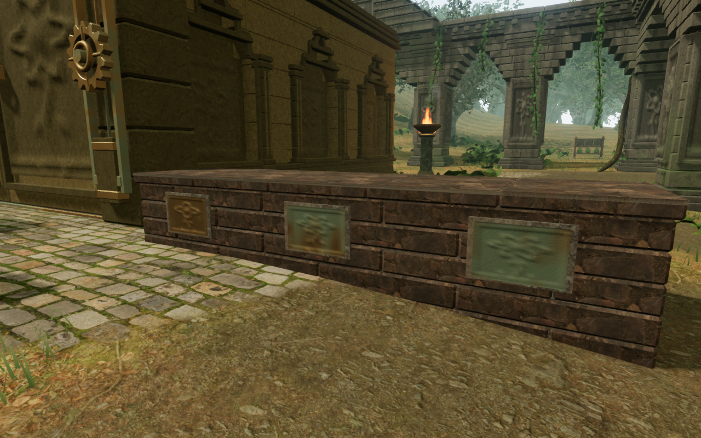
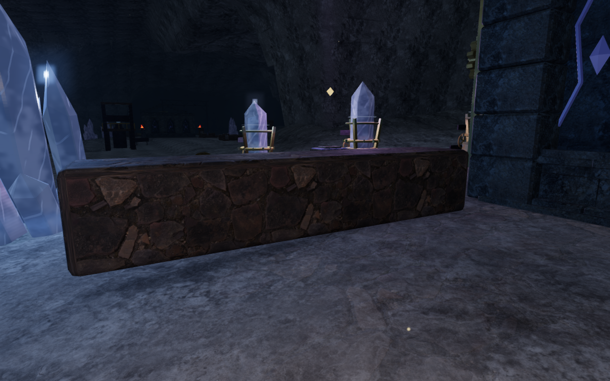
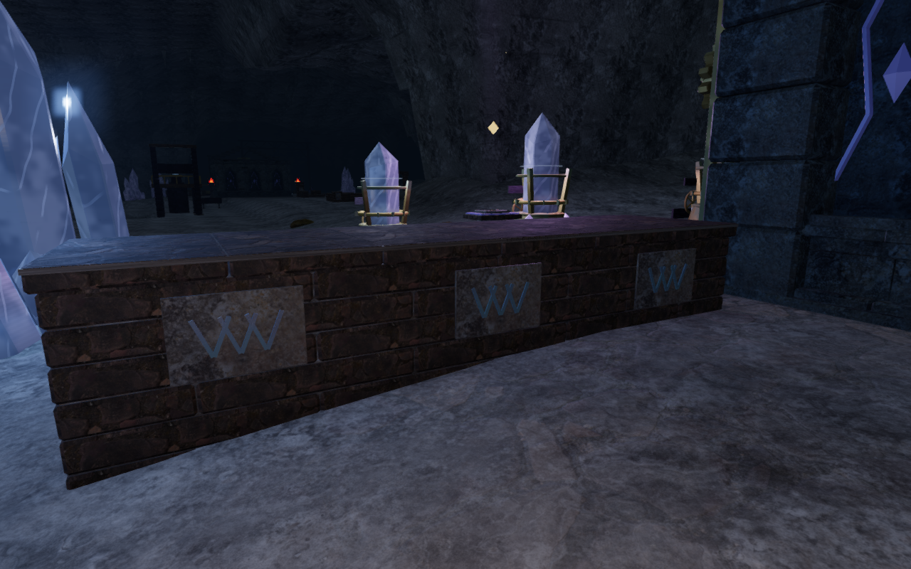
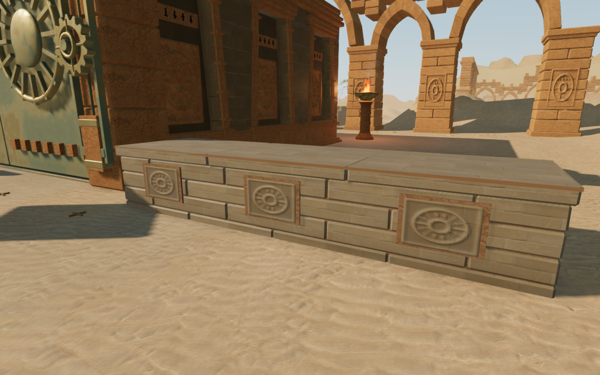
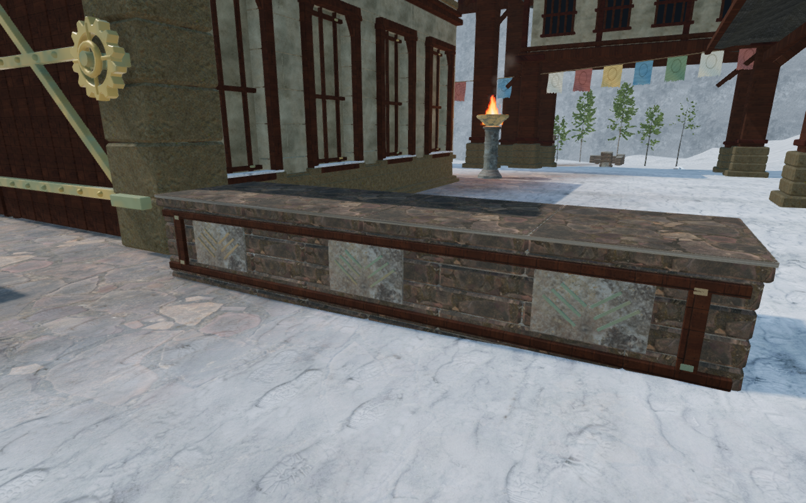
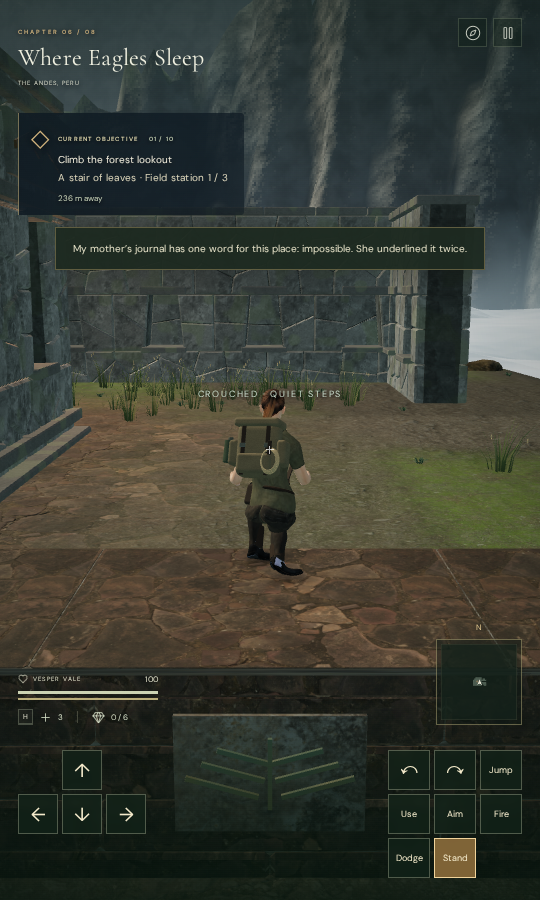

# Fitted regional court cover

The 25 low court walls now have jointed stone courses, fitted foundations,
flat segmented caps and decoration from their chapter. Their visible roofs
cover the existing 7.6 by 2 metre standing footprint and sit at the same
1.3 metre height used by movement and mantling.

## The recorded defects

The renewed survey reviewed 154 front and rear ground views of the 77 main
courts. The same plain low block still appeared across all eight regions.
Closer measurements found gaps above sloping ground at ten walls, ranging
up to 45.6 cm. Twelve roofs differed from their physical standing heights by
more than 1.5 cm; the largest difference was about 9.8 cm. The old visible
boxes also measured only 7 by 1.4 metres, leaving unsupported-looking edges
inside their larger standing footprint.

The close observer searches actual geometry from clear ground. Its 50 baseline
images are reviewed; three volcanic front faces are explicitly recorded as
obstructed by their valve assemblies, not counted as clear construction views.

## Construction and room around the machinery

Every foundation extends beneath the lowest vertex of all terrain cells
touched by its cap. Alternating end stones break up the vertical mortar joints,
and the cap slabs retain chipped side edges with flat upper faces. The narrow
cap joints have a continuous mortar bed 5 mm below the standing surface.

| Region | Construction |
| --- | --- |
| Jungle | Botanical bronze plaques and moss-toned ashlar |
| Desert | Sandstone courses, broad caps and raised sun panels |
| Mountain | Timber ties, corner fastenings and mountain marks |
| Coast | Pale masonry with shallow shell fans |
| Volcano | Closely coursed stone, steel straps, rivets and cast gear marks |
| Cloud city | Broad coping and oxidized wing markings |
| Crystal | Fine cap divisions and paired mineral collar marks |
| Eclipse | Dark ashlar with orbit rings and engraved axes |

The three volcanic walls move four metres toward the chamber, leaving the
valve matrix and its front working aisle clear. The three cloud-city walls
move two metres outward, into the space between the wider gate corners and
the gallery. The other nineteen retain their coordinates. All walls retain
their collision size, relative standing height and climbability.

Materials reuse the credited local texture maps and original bronze shader.
The new assembly does not consume the campaign's shared random stream.
Parts batch within each wall by material; all 25 walls together contain
179,272 triangles and 72 material batches. A loaded chapter has three walls,
or four in the eclipse chapter. These are geometry counts, not a device
frame-rate measurement.

## Verification and limits

- All 765 campaign checks pass. The four new cover regressions check the
  complete standing footprint, actual merged geometry, terrain contact,
  ground collision, mantling, occupied elevations, sight obstruction and the
  relocated foundry strip.
- The production build passes in 3.91 seconds with the existing chunk-size
  advisory.
- Actual browser worlds pass 2,975 roof rays and 500 footing rays across all
  25 walls. Roof error stays within the intended 5 mm mortar joints. Their
  checked footprints intersect no other ordinary movement solid.
- All 50 final High construction views and 16 representative Low phone views
  are reviewed, including the final botanical bronze refinement.
- Native keyboard climbs, crouches and departures pass at the first wall in
  each chapter, covering 1,751 game-loop frames with full health, no character
  fades and no solid-camera violations. Their 32 captures are reviewed.
- Eight production cases alternate desktop High keyboard input and phone Low
  touch input. Crouch/stand, manual look and 2.10–6.59 m departures pass.
  The complete store, including the revealed map, reloads exactly apart from
  timestamps and five recorded arrival-camera corrections; a second reload
  is stable. The initial supported roof positions are retained.
- Six older occupied saves retain their horizontal coordinates and every
  non-pose store field apart from timestamps. The three relocated volcanic
  positions return to the ground; the three cloud positions retain their
  supported height on the new overlapping caps. Subsequent reloads are exact.
- All eight camera corrections, including three older volcanic arrivals,
  are independently proved against the existing arrival policy. Original
  arms stop at 0.55–1.23 m; the selected arms are clear at 5.33 m.
- All 46 production captures are reviewed. The final four bundles match the
  build, with no development hook, missing resources, browser errors,
  warnings or horizontal overflow.

These checks use scoped positions and cleared guardian encounters. They do not
establish an earned campaign playthrough or consumer hardware performance.
The existing distance-sensitive ambience and quiet chapter scores remain in
use; this pass does not establish subjective listening quality.

The shared chamber footprints, other court and discovery surroundings,
continuous route composition and broader device and audio acceptance remain
under review. The complete playable surface is not yet accepted as finished.
