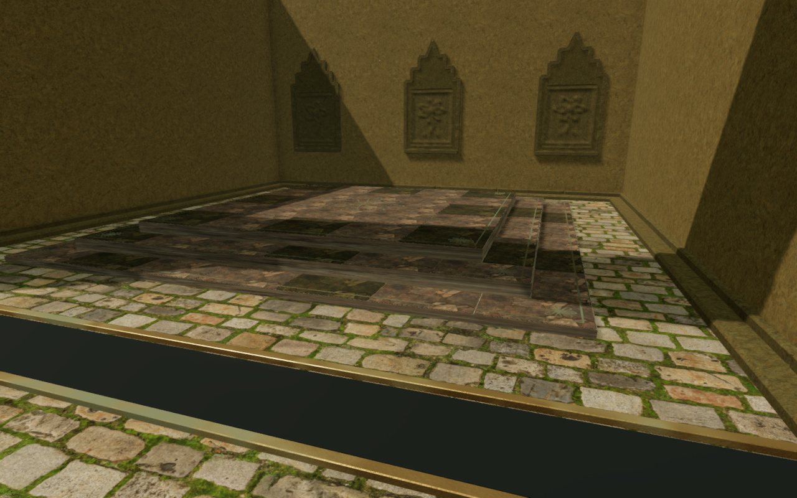
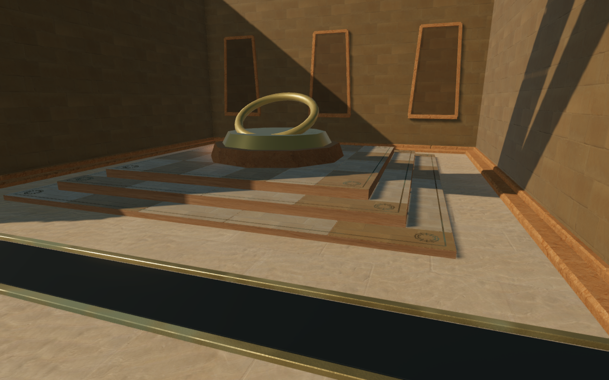
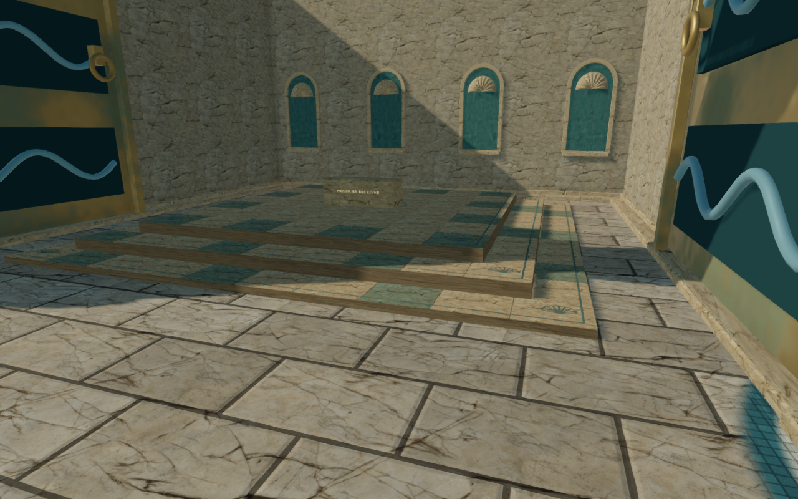
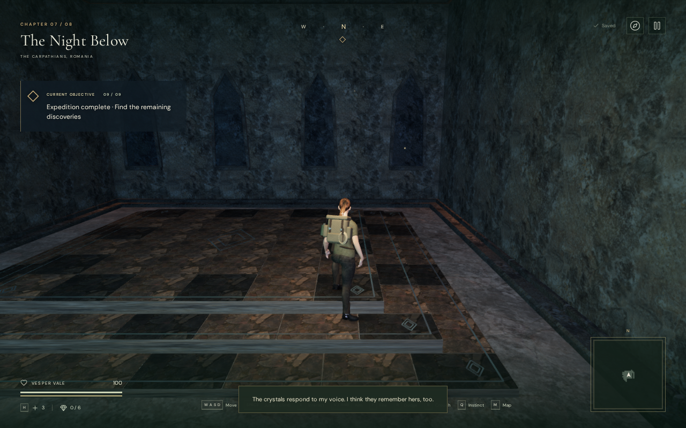
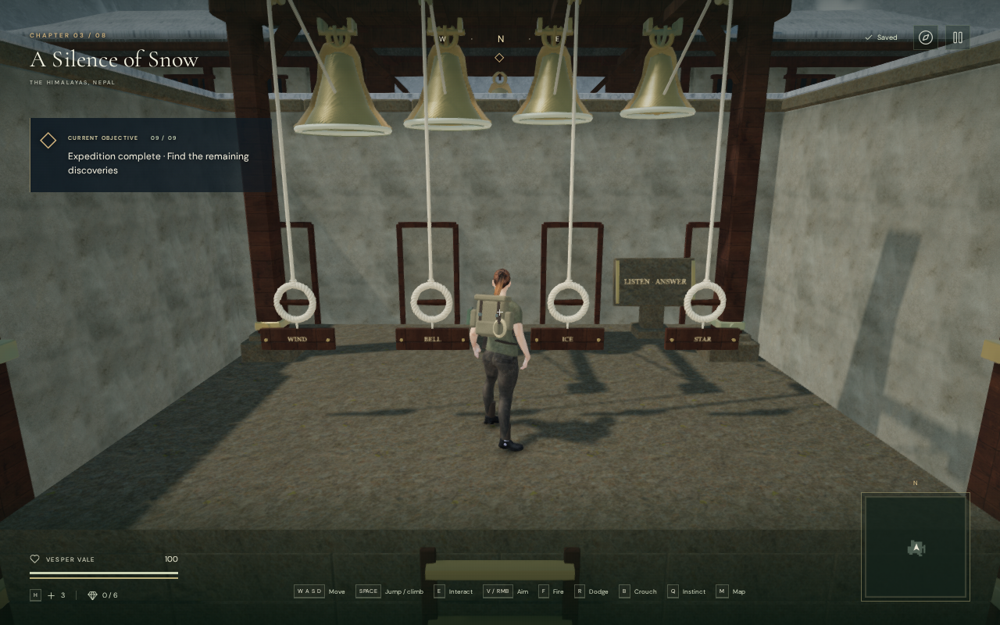
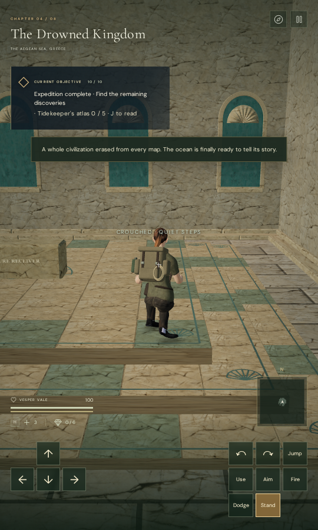

# Regional chamber floors

The 61 central chamber daises previously used three thin boxes with no walking
support. The stone tops sat 11.5, 31.5 and 51.5 cm above the terrain used by
character motion. A browser survey of all 61 assemblies found 658 unobstructed
points where the rendered stone exceeded the standing surface; the largest
difference was 51.5 cm. Another 74 probe points were already blocked by raised
instruments.

Each dais now has fitted foundations, individual tread stones, recessed joints
and restrained bronze inlays. The existing 9, 7.6 and 6.2 m footprints and their
top heights are retained. The lower two courses tile their exposed rings;
the upper course has a regional paving grid. Alternating room patterns, stone
shading and rotated corner marks vary the assemblies within a chapter.

| Region | Paving and marks |
| --- | --- |
| Jungle | Lotus outlines and green border stones |
| Desert | Long limestone flags, solar rings and radial marks |
| Mountain | Slate courses and nested mountain chevrons |
| Coast | Smaller mosaic stones and shell fans |
| Foundry | Broad flags and square cast markings |
| Cloud city | Narrower tessellation and feather marks |
| Crystal | Schist tiles and nested prismatic diamonds |
| Observatory | Meridian paving, orbital rings and crossed axes |

These low steps support ordinary walking without taking a mantle input from
the taller bell and wind platforms. A tolerance of one micrometre handles
floating-point comparisons at the exact 20 cm rise. The foundation bottom
uses all terrain grid cells touched by the complete footprint, with an
additional 18 cm burial. Flat tread tops bound their chipped lower edges;
joint beds are 5 mm below the standing surface. The non-emissive metal marks
sit 1 mm above the pavement. The 61 assemblies total 302,462 triangles in 244
material batches, with four materials shared by the chapter's daises.

Guardians now use the low-step floor for movement roots, patrol footing,
planted feet and attack markers. Explorer grounding already queries standing
surfaces. Dodge movement also follows these steps. A dodge remains unavailable
on a taller instrument above the paving. Older ground saves on an unobstructed
dais lift to its top at the same horizontal coordinates. Existing elevated
landings retain their height, and solid instruments still reject an occupied
arrival.

Five additional regression checks cover 38,125 delivered roof rays, fitted
foundations, 244 complete walks up and down the steps, 732 older or occupied
arrivals, 15 raised-platform mantle priorities, blocked legacy arrivals,
low stone sight occlusion, guardian navigation and planted feet across all
regions, and dodge grounding. All **770 campaign checks** pass. The production
build passes in 4.07 seconds, retaining the existing bundle-size advisory.

The actual browser worlds repeat the 732 baseline probes. All 658 unobstructed
points now match the standing surface within 5.001 mm; the remaining 74 points
remain blocked by existing instruments. All 61 High construction images are
reviewed. Live keyboard walking and crouching across eight chapters cover
1,586 frames without fades, camera-solid violations or damage. All 15 existing
mountain and cloud-city instrument mantles reach their expected roofs. Their
61 motion and landing images are reviewed.

The production build passes eight keyboard/touch cases, alternating High
1280 × 800 desktop views and Low 540 × 900 portrait views. Crouching, manual
look, departure and repeated reloads retain the complete save apart from
timestamps and expected elapsed time, moved position and newly explored map
cells. Departures cover 2.0982–4.2228 m and end on the terrain. Twenty-four
older positions retain horizontal coordinates and all non-pose progress:
22 ground positions lift onto the expected tread and two raised instrument
positions retain their roof height. Every arrival remains identical on its
next reload, apart from timestamps. All 64 production images are reviewed;
the four loaded bundles match the build, with no development game hook,
failed resource, page overflow, browser errors or warnings.

Two older first-tread saves receive the existing arrival-camera adjustment.
Independent checks confirm that their former arms reached only 5.081 and
4.599 m; the selected views clear the full 5.343 m arm. Their angles match the
unchanged generic arrival policy. No new camera adjustment code is introduced.

An additional assisted browser check animates one delivered guardian per region
over 2,880 navigation frames and runs eight explorer dodges over 304 frames.
Roots follow the actual low-step floor throughout; settled ankles retain their
scaled sole offset. All 32 pose and departure images are reviewed. Mountain
and cloud-city guardians use the exposed front tread around the existing
raised instruments. The other six cross the exposed three-tier paving. These
are scoped motion observations, not complete encounter playthroughs.

The construction survey uses disposable completed progress to open gates and
remove guardians from the observer views. The motion checks use the same scoped
progress, place the explorer at each approach, then use native controls. They
do not establish complete human playthroughs, consumer-device performance,
subjective audio quality or AAA graphics. The wider [visual audit](visual-audit.md)
remains open, including repeated court forms, other primitive structures,
connecting routes, and the complete eight-chapter route and listening review.
