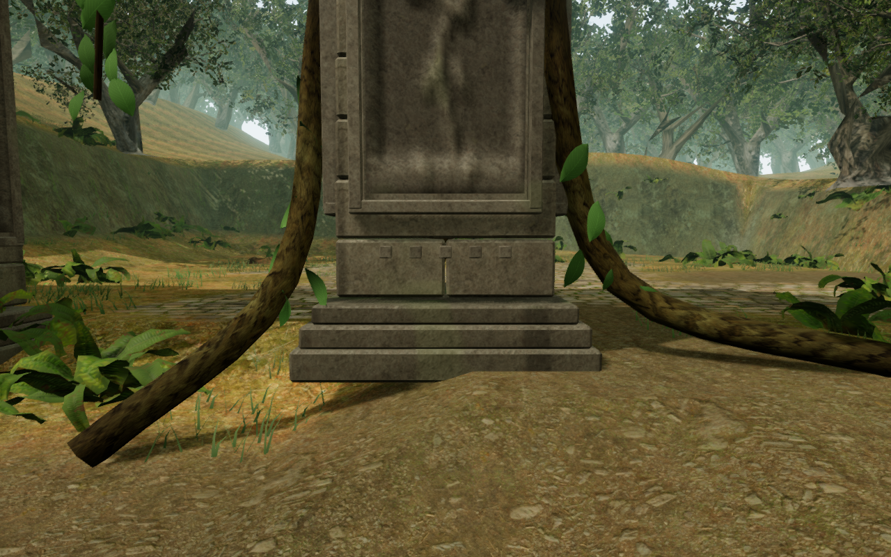
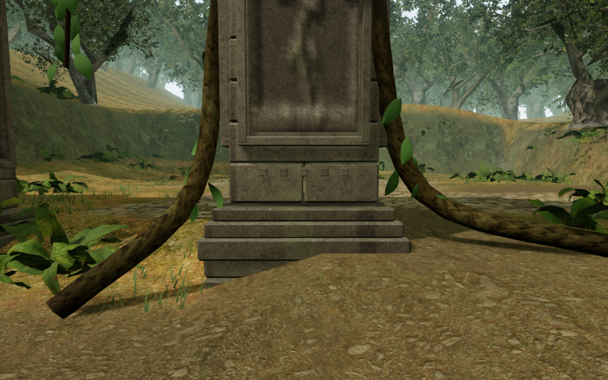
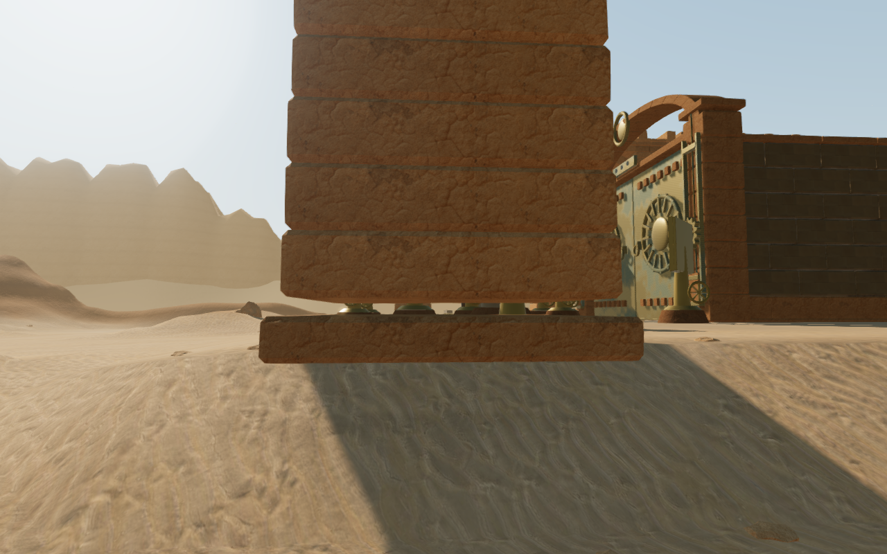
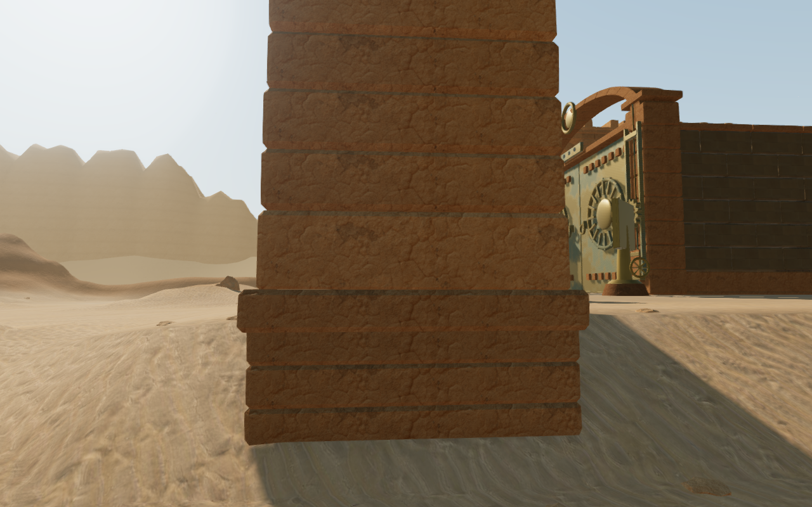
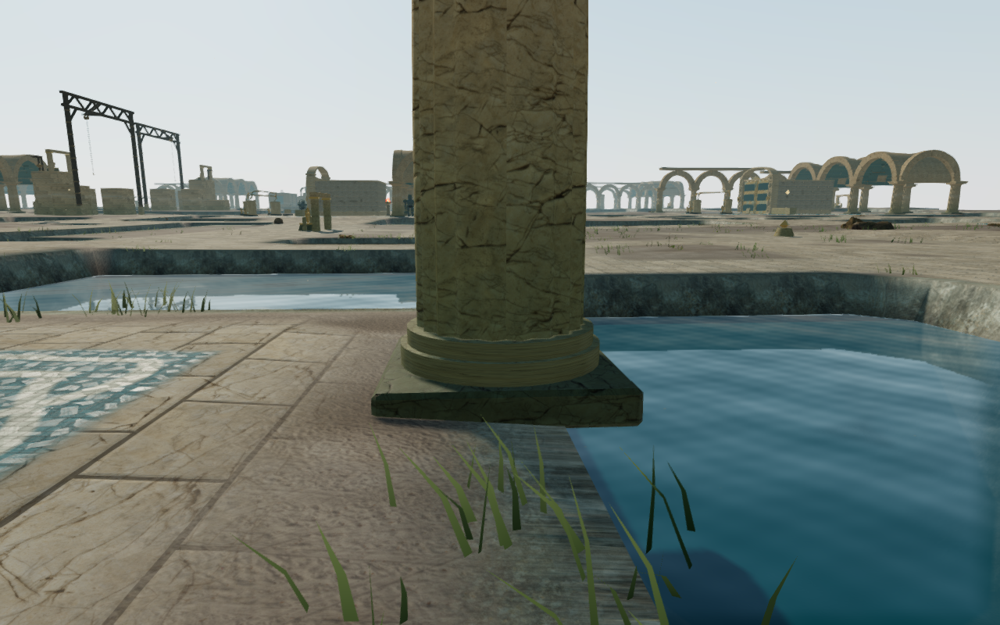
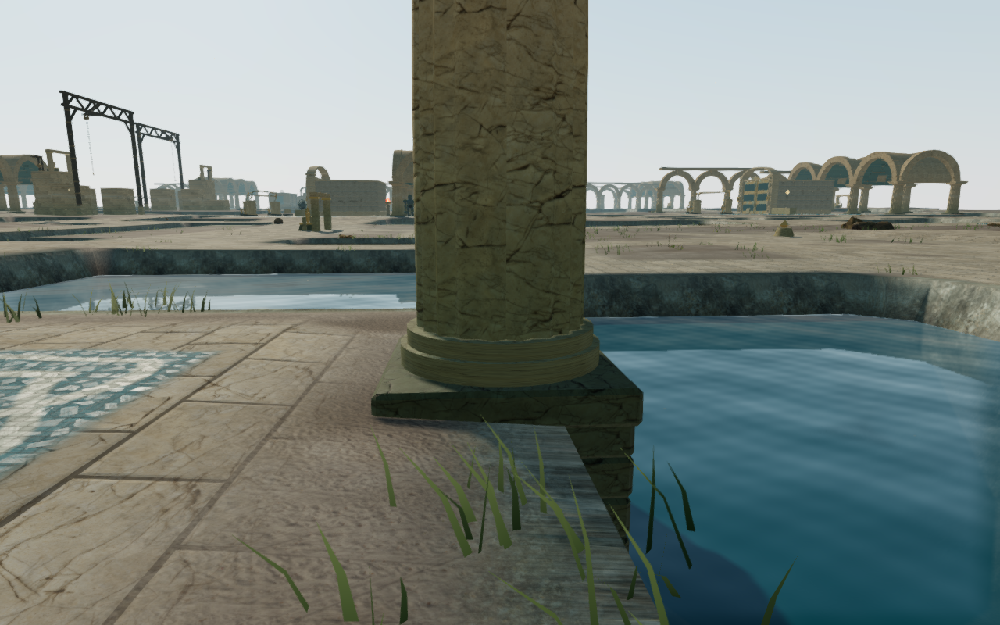

# Court foundations and desert pier joints

Stone supports in the jungle, desert and coastal courts now carry their base
slabs down into the terrain. The survey checked 338 support footprints across
29 courts and found 48 with more than 10 cm of clearance above part of the
underlying ground. Previously, each slab used only its center's terrain height.
These measurements sample the chapter's ground-height function over each base
footprint; separate rendered-mesh checks are recorded below.

| Chapter | Supports checked | Gaps over 10 cm | Largest measured gap |
| --- | ---: | ---: | ---: |
| The Verdant Veil | 98 | 15 | 0.44 m |
| Beneath the Sands | 108 | 15 | 1.06 m |
| The Drowned Kingdom | 132 | 18 | 2.12 m |

New stone courses fill those exposed spaces. They use the existing chapter
materials, fit inside the original base footprints and extend below the lowest
vertices of the terrain grid cells beneath them. Recessed solid backing closes
the small joints between courses. Camera collision extends down with the stone.
The new geometry uses independent seeds and colors, preserving the random
sequence that places and shades the rest of each court.

The desert also had a separate gap of approximately 17 cm between every pier's
base slab and its first shaft course. Extending that course 20 cm downward
seats all 108 shafts inside their slabs while retaining the course's upper edge.

## Browser comparisons

These High graphics captures show the most affected support in each chapter
from matching observer positions before and after the correction. They are
actual game renders, converted losslessly to WebP.

Jungle court 1:

Desert court 6:

Coastal court 5:

## Verification

All **600 automated tests** pass. The three new chapter checks build the actual
courts and cast rays into previously exposed spaces in their merged meshes,
including off-center samples on all four sides. They check camera collision
beside the extended foundations. A further **1,296 ray samples** check the
repaired slab-to-shaft joints on all 108 desert piers. Existing court tests
continue to check open axes, feature approaches, arch clearance and supported
bird perches. The production build passes with its existing large-chunk advisory.

The browser captured 36 close views: four angles of the most affected support
in each chapter on High, Balanced and Performance. It also recaptured 58 High
front/rear overviews of all 29 affected courts. All 94 views were reviewed in
labeled contact sheets, with selected comparisons also inspected at full
resolution. All shaders linked without browser errors or warnings. Some close
observer angles lie outside normal
walking areas; their availability does not establish traversal access.

For each of the three worst footings, 81 downward rays sampled the actual
rendered terrain. The foundation bottom lies below every sample, with minimum
clearances of 0.215 m in the jungle, 0.466 m in the desert and 3.335 m on the
coast. The conservative coastal depth includes lower terrain-grid vertices
beside the reservoir bank; the excess stone is buried.

The complete chapters add 37 jungle, 38 desert and 29 coastal footings,
including smaller slopes and conservative coverage beside uneven grid cells.
They add 2,688, 3,184 and 9,632 structural triangles respectively and use the
existing material batches. These geometry counts are not frame-rate results.

Native production checks exercised keyboard sprinting and portrait touch
movement/crouching beside the affected support in each chapter. The six cases
travelled 1.19–4.50 m, retained 100 health and restored their exact saved state
after reload, apart from the last-played timestamp. Portrait checks used muted
Performance mode at 540 × 900 without horizontal page overflow. The browser
loaded the current build's four JS/CSS files, exposed no development hook and
reported no console errors, warnings or failed asset requests. The short input
checks used disposable saves positioned at the courts; they are not full-route
playthroughs.

This addresses VA-02 in the [visual audit](visual-audit.md), including related
jungle and coastal footings discovered during the investigation. The wider audit
remains open: the observatory pedestal, waterfall surroundings, mechanism
mounts, repetitive surfaces and incomplete area coverage still need attention.
The close jungle views also reveal unsupported ends on some pier roots, recorded
separately as VA-08. Those roots still need correction.
These checks do not establish whole-world visual completion, subjective sound
quality or a consumer hardware frame-rate target.
