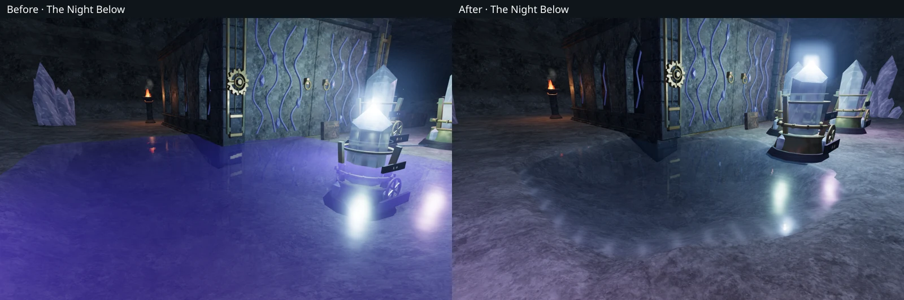
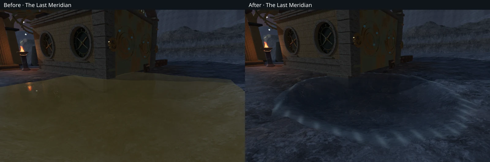
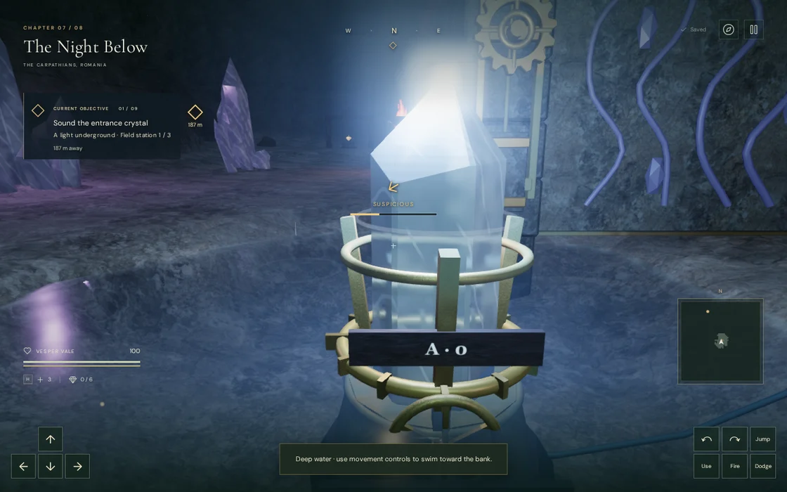

# Court pools with grounded shorelines

The desert, crystal and eclipse courts used square water meshes set above the
surrounding terrain. Every one of the 4,536 sampled positions on their fourteen
old mesh borders was exposed, by 12–32.4 cm. In close views this produced purple,
bronze or pale rectangular sheets across the courtyard floor.

The pools now sit below their banks. Their render bounds extend past the
excavation to cover terrain interpolation, while the original bed dimensions
still determine the surrounding geology's protected area. The basin corners
rise into uneven sandy pockets, faceted mineral shelves or rounded observatory
pools. Quiet green and blue-grey water colours retain the chapter lighting,
waves, transparency and reflections.

The last crystal pool adjoins a lower terrace. Its water level fits the lowest
border rather than using only the court centre's height. The resulting centre
is 1.24 m deep; the other thirteen centres are 1.47 m deep. All remain swimmable.
The correction raises 873 terrain vertices inside the original excavations;
no vertex outside those beds changes and none is lowered. Existing objective
foundations retain their elevations.

## Verification

All **636 automated tests** pass, and the production build succeeds with the
existing large-chunk advisory. Regression checks cover all fourteen perimeters,
both terrain interpolation methods, varied bank shapes, foundation elevations,
saved water states and swimming exits. The older desert standing-height
snapshot now excludes the deliberately reshaped pools: all **45,738 remaining
samples** match the pre-change terrain exactly.

The browser casts **5,656 rays onto the actual terrain meshes**. The smallest
measured border burial is 8.36 cm; the walking height field has at least 8 cm of
clearance, exceeding the 5.1 cm maximum wave displacement. All 42 new surface
views were reviewed: wide High, close High and wide Low at every pool. All
shaders link without browser errors or warnings.

Assisted movement with real collision reaches a shallow bank from every pool.
Three desert pools require steering around existing instruments. The nearby
77 solar and 41 resonance routes also complete. Checks retain access to 118
controls, 176 feature approaches and 27 open gate thresholds. These isolated
routes do not step enemy AI or combat.

Each water sound source matches its lowered surface. All fourteen have clear,
reachable listening positions approximately 8, 12 and 20 m away, with decreasing
computed gain. At every near position, the actual Web Audio voice loads and
plays through the ordinary voice selection, without occlusion. The chapter and
objective music context stays in exploration mode. This checks source placement
and playback behavior; it is not a subjective sound-mix evaluation.

Eight production cases exercise native keyboard movement at High and portrait
touch at Low in the first pool of each affected chapter and the lower crystal
pool. All sixteen movement legs retain health 100. Their sixteen reloads retain
every normalized save field apart from timestamps and one camera-only
obstruction correction. An independent scene check reproduces that correction:
the requested orbit has 3.16 m clearance and the selected orbit has the full
5.34 m. All other camera angles persist exactly.

The sixteen production captures were reviewed. The page has no development
hook, horizontal overflow, failed requests, browser errors or warnings. The
verified bundles are `game-CZtvmt8b.js`, `index-B6Uu5beD.js` and
`three-DQZTZ_dW.js`. Prepared local saves isolate these movement/reload checks;
they do not represent chapter completion.

One High return-swim capture at crystal reservoir 7 shows a resonance instrument
obscuring the explorer during ordinary play. This is recorded as **VA-18** for a
separate camera-obstruction repair; the successful reload correction above does
not resolve that view.

The [reusable surface-view helper](../scripts/inspect-reservoirs-browser.js)
selects unobstructed ground observers for these comparisons. Raw captures,
player fixtures, profiles and logs remain in ignored local staging. This change
introduces no external assets; existing [asset attribution](asset-credits.md)
is retained.

This resolves the exposed water borders in VA-17. The
[world audit](visual-audit.md) remains open. Repeated court composition, sparse
surroundings, abrupt terrain forms and the swimming-camera view still need
work. These pool checks do not establish complete chapter playthroughs or
overall graphics completion.
