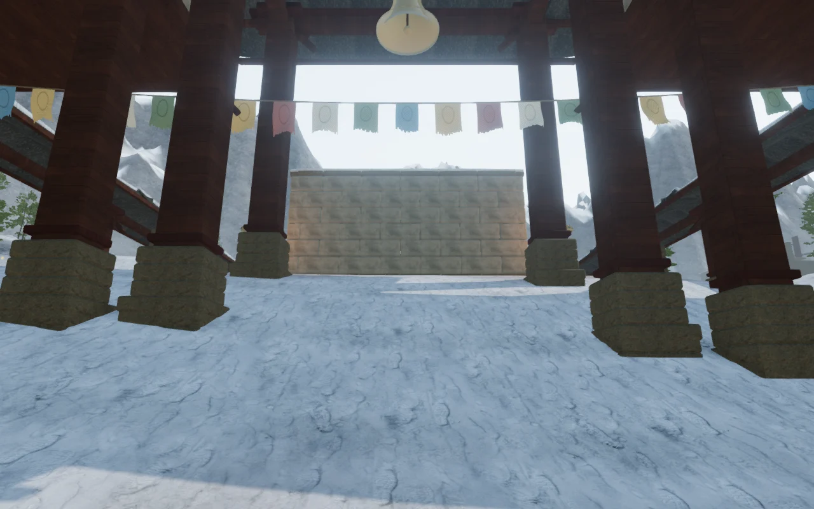
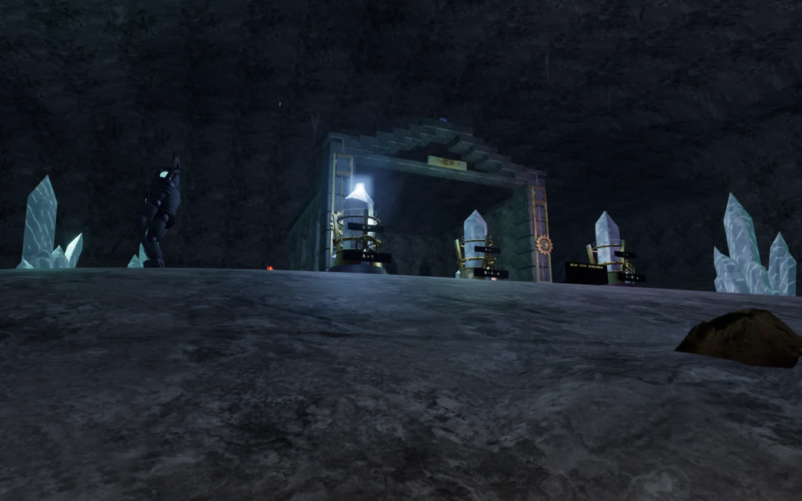
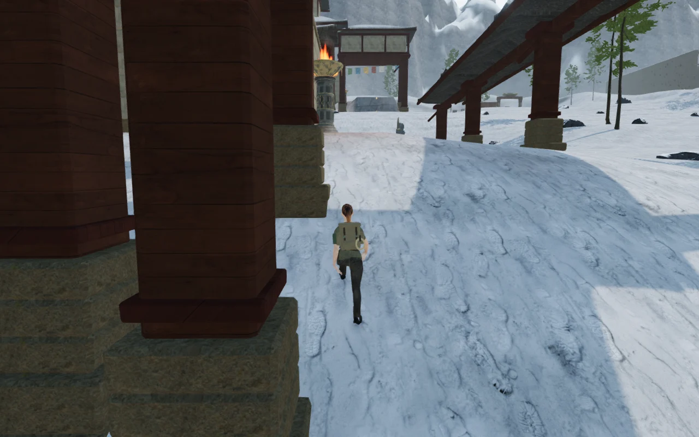
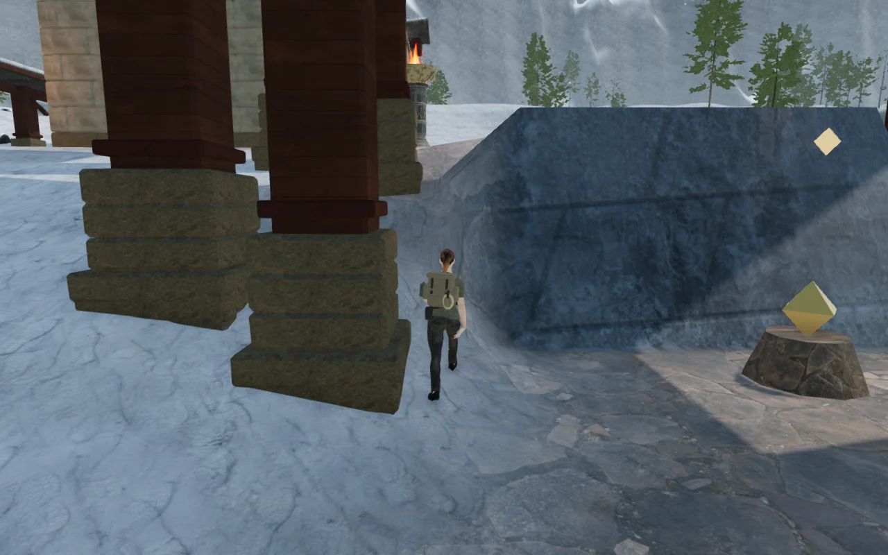

# Continuous court approaches

The jungle, snow, volcanic, crystal and eclipse terrain now joins neighbouring
court pads through graded slopes. This addresses the abrupt terrace cuts left
open by the [regional bank pass](regional-banks.md), including the rear snow
courts and front crystal courts recorded in VA-15.

The previous terrain rule chose whichever terrace had the strongest weight.
When two pads at different elevations overlapped, that winner could change
between adjacent samples. Behind snow court 5, the recorded pair of samples rose
**6.83 m over a 1.75 m interval**. This was a discontinuity in the court layout,
not an intentional cliff or a defect in the snow texture.

The new [court terrain pass](../src/court-terrain.js) relaxes the shared height
field around the pads before regional banks, special foundations and basins are
built. Every iteration reads a separate field, so grading does not depend on
scan direction. Main instruments and field work areas retain their central
floors; smaller discovery pads leave room for a gentler approach. Special flat
floors and the complete water/lava footprints retain their original ground,
including the surrounding cells interpolated into the buried mesh borders.

## Measured transitions and saved footing

The table compares exact 1.75 m sample intervals from the recorded defects.
It describes those transitions, not the maximum slope of the entire landscape.

| Location | Height change before | Height change after |
| --- | ---: | ---: |
| Snow court 5, (329, 196) toward increasing z | 6.83 m | 0.86 m |
| Snow court 7, (329, 268) toward increasing z | 3.72 m | 0.82 m |
| Crystal court 2, (343, 79) toward increasing z | 2.75 m | 0.67 m |
| Crystal court 6, (60, 314) toward increasing z | 2.09 m | 0.37 m |

Regrading intentionally changes some walking terrain between the working pads.
The old whole-walking-grid hash would preserve the defects, so the regression
checks now retain the baseline vertices in every main/field working core and
bound the graded transitions. The 14 m square cores contain **14,013 sampled
vertices across 173 pads**, all equal to the shipped `32c28c6` baseline. Cell
edges align with those samples, preserving the interpolated working floors.

All 42 water-site records retain their baseline values. The complete desert,
coastal and sky height arrays also match the baseline. Terrain mesh counts,
texture assets and attribution are unchanged; the new heightfield is computed
once when a chapter loads.

## Verification

- **658/658 tests pass**, including seven new court-joining regressions. The
  production build succeeds with the existing bundle-size advisory.
- Working-floor regressions cover all five affected chapters. Existing checks
  cover tower pads, snow/mineral foundations, terrain chunk seams, swimming
  exits, receiving-water borders, slag shores, lava hazards and cooled footing.
- The first broad run caught exposed pool borders and changed swimming depths.
  The final pass protects full basin footprints, and all five failing water/lava
  checks pass without relaxing their requirements.
- Front/rear observer captures cover all **47 main courts** in the affected
  chapters: 94 High views and five additional Low views. The 99 views were
  reviewed alongside the movement captures.
- Ten assisted approach/return legs cover **1,775.2 m and 26,916 movement
  frames**, with 122 reviewed High captures. All legs arrive with health 100.
  These use the normal character controller and follow camera, without stepping
  enemy AI or combat.
- Eight shorter legs cross the repaired joins near snow courts 5/7 and crystal
  courts 2/6 in both directions. All arrive with health 100; 24 movement views
  were reviewed. The snow lines shift 2 m sideways from the measured intervals
  to clear existing columns.
- **45,997 terrain rays** check 361 support records, including regional
  foundations, ruin-root rings and pool borders. Every sampled bottom is buried
  in the rendered terrain. The separate jungle-tree check covers **1,085,912
  lower-root samples** on 752 interior and 1,046 outer trees, retaining at least
  8 cm burial within floating-point tolerance. All 279 snow firs remain supported
  and outside walking cells.
- Local control routes and approaches pass, as do all 42 open gate thresholds.
  All 84 gate sound sources have a reachable listening stance with a clear sound
  path. Reachable positions at horizontal radii of 8, 12 and 20 m produce
  decreasing distance gains for bird, wind, fire, drip and stream sources. Each
  sampled near source has a loaded, nonzero Web Audio voice. This checks playback
  and attenuation; it does not assess the mix or chapter music by listening.
- All eight crystal inspection eyes retain roof clearance in desktop, portrait
  and landscape formats. Four additional captures open the actual puzzle
  controls at arrays 2 and 6 in desktop and portrait formats: complete instrument
  silhouettes fit, native increment/decrement controls update saved values, and
  closing the dialog restores the follow lens.

Ten production cases load disposable saves created before this terrain change,
using keyboard/High at 1280×800 and touch/Low at 540×900 in all five chapters.
All twenty native movement legs retain health 100. Reloading after each leg
preserves the complete saved data except play timestamps; this set needs no
camera corrections. Thirty arrival/movement captures were reviewed. There are
no browser errors, warnings or horizontal page overflow. Every case loads the
final build's four JavaScript/CSS assets without a development hook. Enemy combat
is suppressed in these fixtures to isolate movement and persistence.

The reusable checks include [court routes](../scripts/inspect-court-routes-browser.js),
[court views](../scripts/inspect-world-courts-browser.js),
[bank supports](../scripts/inspect-bank-supports-browser.js) and
[resonance framing](../scripts/verify-resonance-browser.js). Raw captures,
profiles, logs and disposable saves remain in the ignored local staging folder.

## Remaining observations

VA-15 remains open. The crossing beside snow court 7 still exposes a sharp bank
where its terrace overlaps discovery pad 16. At (322, 267.75), toward increasing
z, the ground rises **4.34 m over 1.75 m**, equal to the previous terrain. That
interval lies inside the protected discovery core; the shared grading mask
cannot change it. Its floor priorities and surrounding layout need a separate
repair. Passing the nearby walking line does not resolve the visible bank.

This is a terrain-joining repair. Repeated chamber and station forms and sparse
surroundings remain in the [world visual audit](visual-audit.md); the review does
not establish full-world completion, consumer hardware performance, subjective
audio quality or AAA parity.
