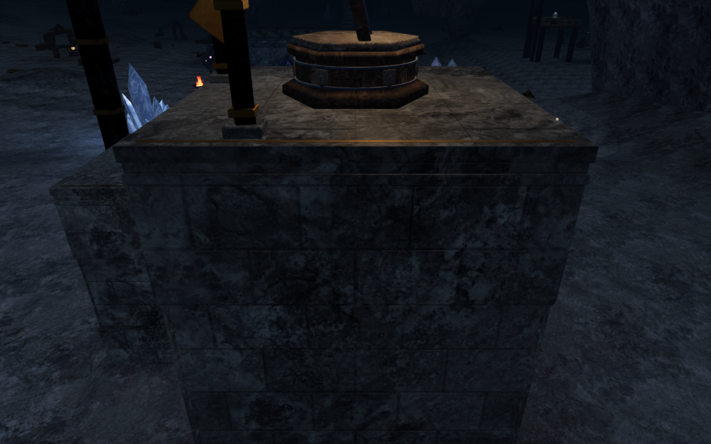
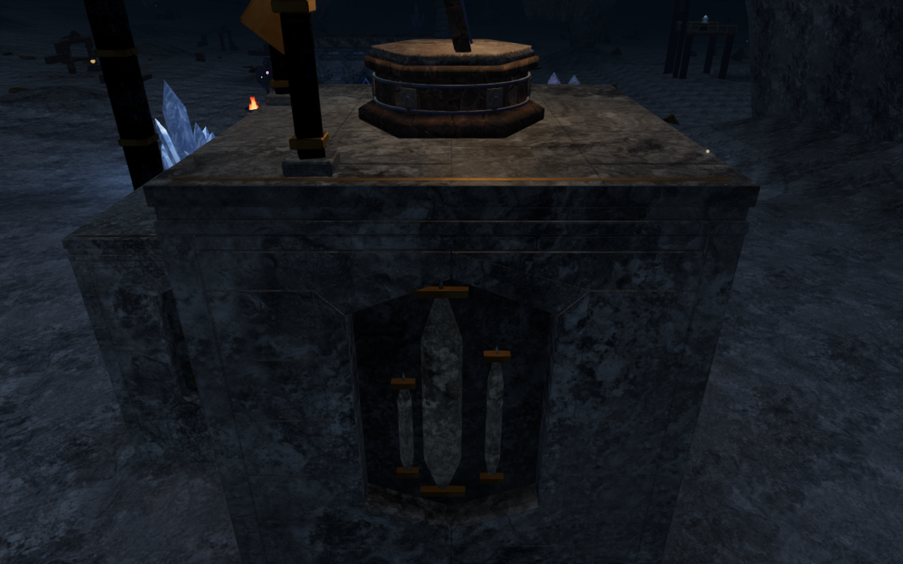
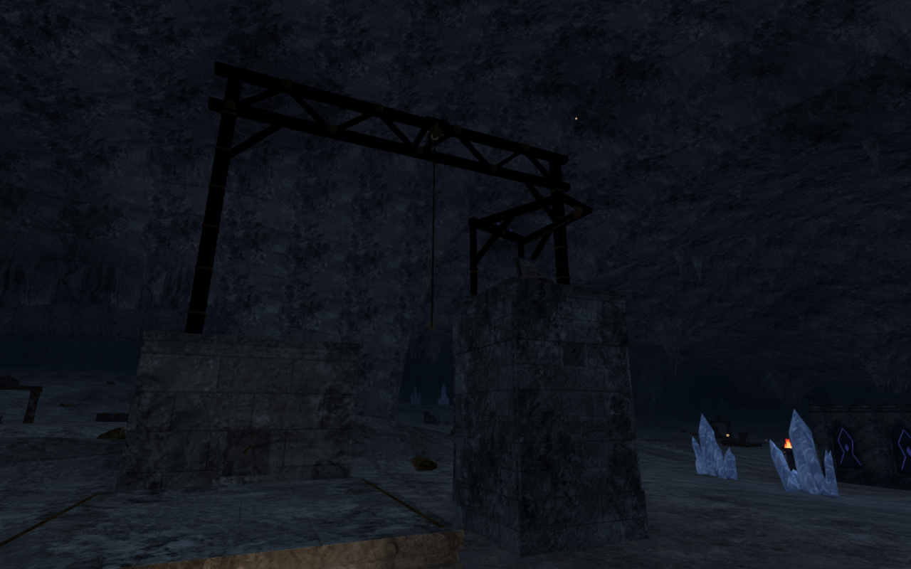
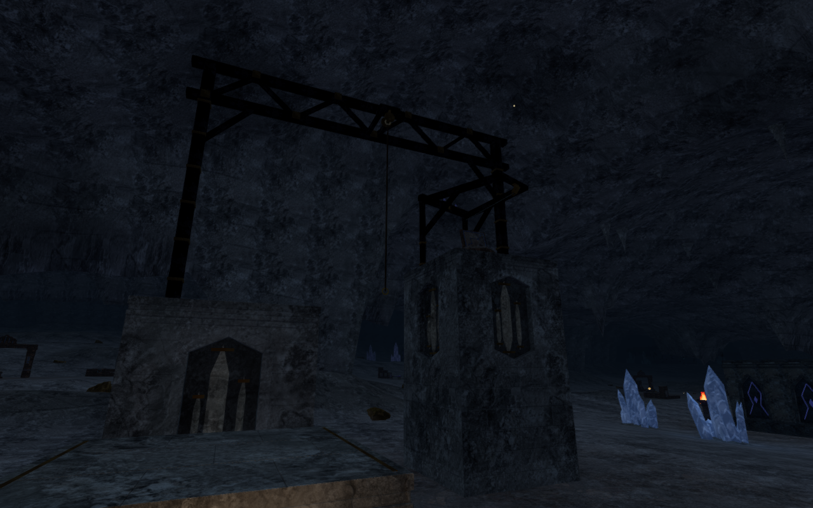
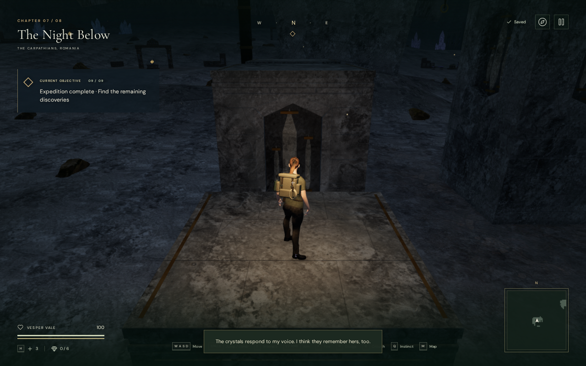
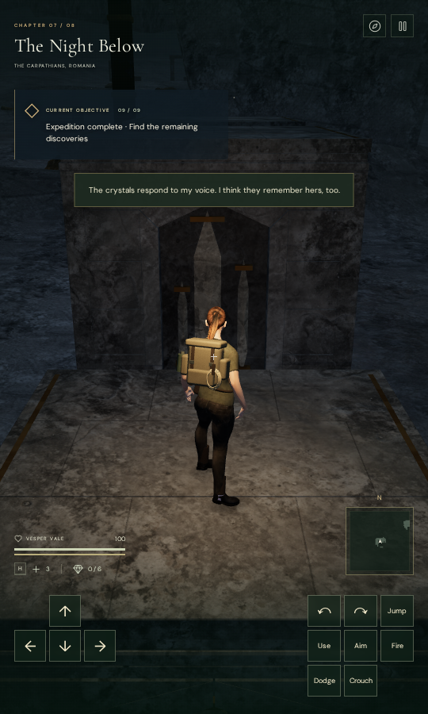

# Crystal climbing piers

The Night Below's twenty climbing piers now carry eighty six-sided limestone
niches. Fitted diagonal shoulders surround closed, recessed rock backs; pale
calcite reliefs sit against those backs with paired bronze restraints. The
construction connects the elevated routes to the cave's mineral architecture.
The short entrance piers use shallower proportions, while the taller piers
carry elongated registers.

The surrounding cave still needs broader composition work. This milestone
improves the pier faces while verifying their construction, traversal and save
behavior; it does not establish that the entire chapter is finished.

The summit comparison uses the same camera position and target, on the same
side of `field-2-0`, at High quality. These are actual game captures converted
losslessly to WebP, preserving their dimensions and decoded RGBA pixels.

The following wider course comparison retains the same authored observer.
Both images include surrounding mineral chambers and the existing hoist.

## Construction and geometry

`src/crystal-climbing-piers.js` fits the six-sided frame and its shoulders
together. Each dressed frame joint has a continuous limestone bearing behind
it. Closed trapezoids support the diagonal shoulder courses; separate buried
corner bearings carry both outward faces. A full lower bed reaches below the
terrain under the complete footprint.

The opaque calcite reliefs have independent planar facets and closed backs.
Their back vertices are seated about 22 mm into the niche backing. They reuse
the chapter's stratified rock shader with a pale material tint. The existing
cave quartz, resonators, positioned ambience and quiet objective score remain
the sources of light and sound in the mineral chambers.

Complete landing roofs, ledge inlays, hoist parts and camera envelopes retain
their established construction and seed sequence. Exact vertex indexing
reduces fixed/detail records from 67,140 to between 46,660 and 46,676 per
course. Expanding the indices reproduces every triangle attribute byte for
byte: 3,113,904 components across the four courses. The previous mountain,
coastal and volcanic indexed reports retain identical counts and hashes.
Each complete course stays below 67,300 vertex records and the existing
180,000-record construction limit. These are geometry counts, not frame-rate
or device-performance measurements.

Actual browser geometry checks cover all twenty piers:

| Probe | Samples | Result |
| --- | ---: | --- |
| Full standing roof grids | 8,820 | No misses; maximum height difference 5.001 mm |
| Undersides across full footprints | 2,420 | No misses; every sampled underside at least 210 mm below terrain |
| Niche center areas | 720 | No misses; approximately 370 mm of recess |
| Dense grids fitted to six-sided profiles | 9,680 | No misses; backing recess between 369.995 and 370.014 mm |
| Actual calcite back vertex records | 1,680 | No misses; burial between 21.973 and 22.003 mm |

All 36 baseline and 92 updated construction captures are reviewed. The final
set includes all four sides of every pier, each complete course, and entrance
and summit views on Low quality. Thirty-two before/after face observers retain
exactly the same eye and target. Some external observers are partially or
fully blocked by neighboring piers or hoist posts; the geometry probes supply
separate evidence for those obscured surfaces. Linked shader programs and
empty browser warning/error reports are required by the checks.

## Traversal and persistence

All four updated routes complete the ordinary approach, successive mantles,
jump gap, moving-rope crossing, summit, unlocked return cable and ground walk
back. The observer uses completed-expedition fixtures and controller-driven
movement with enemies removed. It verifies these routes, not a full campaign
playthrough or encounter balance.

| Course | Camera updates | Reviewed captures | Minimum camera arm |
| --- | ---: | ---: | ---: |
| `field-2-0` | 4,020 | 53 | 2.963 m |
| `field-2-2` | 1,487 | 25 | 3.233 m |
| `field-6-0` | 2,435 | 35 | 3.549 m |
| `field-6-2` | 1,631 | 27 | 3.548 m |

Across 9,573 updates the explorer retains full opacity and health 100. All
140 final route captures and their 140 baseline counterparts are reviewed.
Recorded feet, chosen look, camera positions, controller state and field
progress match exactly at every capture. The two eclipse baseline loops also
complete with no fades; all 74 additional captures are reviewed. Eclipse pier
artwork remains outside this change.

The production build passes native keyboard/High and portrait touch/Low
checks. Both climb to the first 2.8 m roof, crouch, change the look direction,
descend and recover through localStorage reloads. Complete stores remain
stable apart from timestamps, including chosen camera angles; neither case
needs an arrival-angle adjustment. A second reload is idempotent. All fourteen
native captures are reviewed, with no failed assets, browser warnings/errors,
horizontal overflow or development hook. The loaded JavaScript/CSS assets
match the final build.

## Verification limits

All 51 focused checks pass: sixteen climbing construction/contact/audio
checks and thirty-five traversal, cable, audio, cave geology, cavern and
mineral checks. The production build passes with the existing large-bundle
advisory. This milestone does not rerun or claim a new full campaign test
result; the preceding 803-test result is recorded with its own milestone.

Verification runs through the shared CPU budget helper, within 60% of the
available CPUs, with at most two test workers and one browser. Temporary
browsers, preview servers and completed workers are released after their last
check. Private fixtures, captures, helper scripts and installed dependencies
remain excluded from publication.

The five-pier layout, large stretches of sparse cave floor, scattered rock
placement and full-body terrain/rock contact still need broader review.
Full opacity and route completion do not prove body clearance throughout the
world. Listening quality and real-device acceptance also remain open. There
is no minimum chapter duration, and this work makes no commercial AAA claim.
