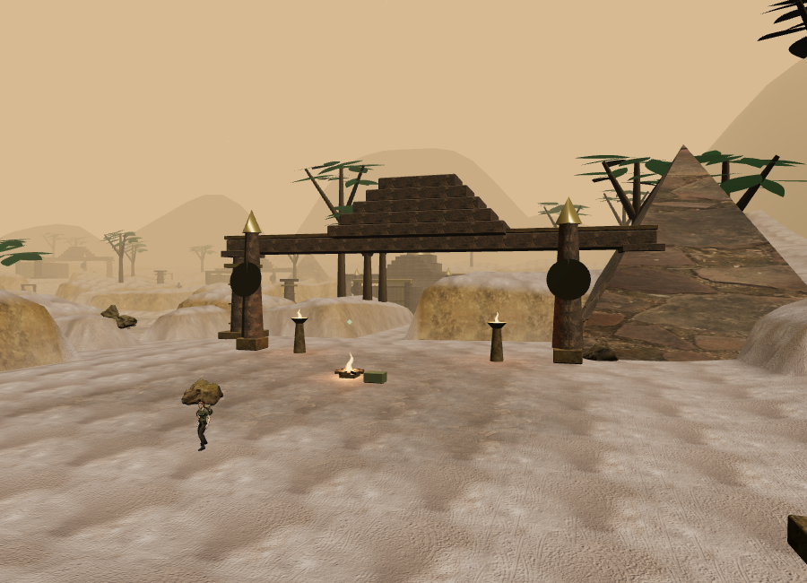
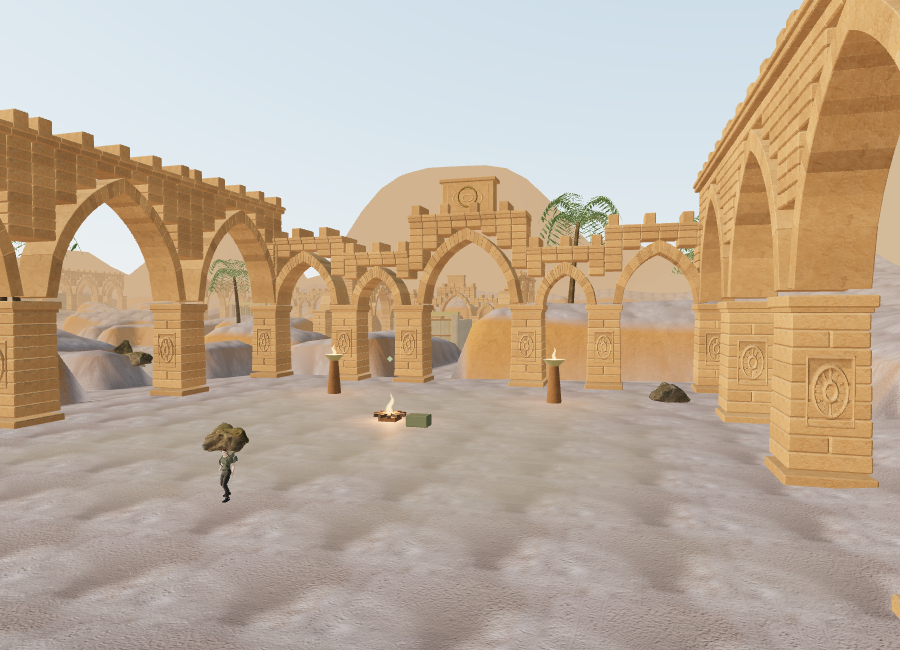
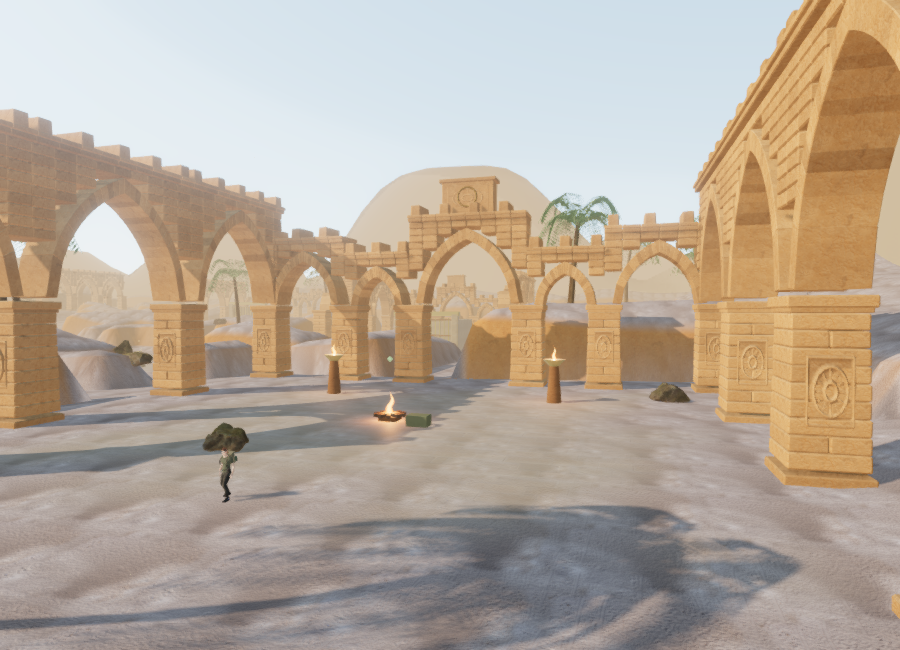
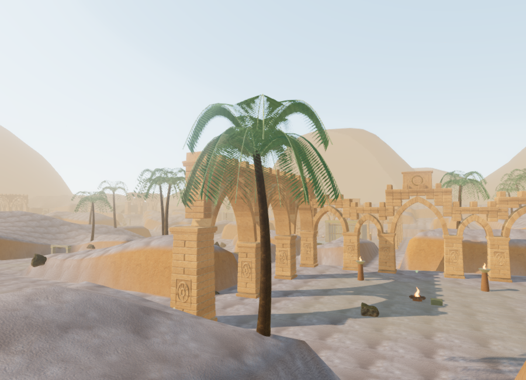

# Sandstone city and desert palms

The desert chapter now uses an original sandstone courtyard kit instead of its generic four-pier lintels, dark stone obelisks, and simple pyramid silhouettes. Pointed arches, individual beveled voussoirs, masonry spandrels, crenellated cornices, solar reliefs, and bronze details give the city a distinct architectural language. This is fictional environment design, not a reconstruction of a historical Omani site.

All ten courts have authored combinations of gallery wings, arch heights, and broken spans. Structure stays around the perimeter, retaining the north/south and east/west crossing axes. The northwest support of court three shifts inward to leave its supply-cache approach clear without crowding the nearby camp. The gallery joins that shifted support. Terrain heights, objective locations, gate rules, and the existing two elevated desert routes are retained.

## Materials and lighting

Two unmodified 2K texture sets by Rob Tuytel supply the stone: [Sandstone Cracks](https://polyhaven.com/a/sandstone_cracks) for individual blocks and exposed rock, and [Sandstone Blocks 08](https://polyhaven.com/a/sandstone_blocks_08) for wall surfaces and paving. Both are [CC0 assets from Poly Haven](https://polyhaven.com/license). Color, OpenGL normal, and roughness maps are bundled locally; play does not contact the asset service.

The six maps total **11,946,330 bytes**. `scripts/download-desert-stone.py` reproduces the downloads and records their source URLs, byte counts, and SHA-256 values under `asset-sources/desert-stone/`. Delivered files match all six recorded hashes. Block geometry carries subtle tint variation; surface shaders add sediment bands and dust on upward-facing stone. Solar panels have actual shallow relief geometry, with three different ray patterns and a shorter draw range than structural masonry.

The desert sky now uses the daylight shader with a lower sun angle, atmospheric haze, warmer ground fill, and cooler sky fill. A one-time 128-pixel cube-face capture of that sky supplies filtered environment lighting and reflections, so metalwork can reflect its surroundings. The visible sun direction and directional light agree. The environment target is released when another chapter loads.

## Palms and sound landmarks

Seventy deterministic palm placements replace the earlier straight branch clusters. The original parametric models have tapered curved trunks, seventeen fronds, individual folded leaflets, and wind movement shared by their leaf shadows. Three crown variants each have three geometry tiers. Higher detail increases leaflet density; distant leaflets widen to retain coverage. This improves their silhouette but remains procedural plant art.

The tiers contain **10,384**, **5,928**, and **3,136 triangles per complete palm**. Distance selection, 300 ms dither transitions, hysteresis, and range culling use the existing instance-detail system. Distances are measured horizontally, preventing elevation changes from unnecessarily changing a nearby palm's detail. The existing local bark texture is reused; no new palm bitmap is required.

The four desert birds now obtain their perch coordinates from the rebuilt architecture. Where a gallery extends above the old capital, a small stone perch sits on its upper cornice. Bird models and their positional audio emitters share those coordinates. Browser ray checks found a supporting stone surface within 3.1 mm of each perch; that small difference is within the block's procedural edge variation.

## Rendered comparison

These Performance-quality views use the same 900 × 650 viewport and camera position. They include the material, architecture, palm, sky, and lighting changes together:




The High-quality view includes verified shadow reception and contact shading:




These are actual browser renders with the HUD hidden for review. They improve the environment, but do not meet the requested modern AAA visual standard.

## Verification and limits

The full suite passes **124 tests**. Seven new tests cover closed/wound arch solids, ten distinct court plans and feature clearance, actual built camera/navigation bounds, physical solar relief, palm shape and geometry budgets, deterministic placements, and palm detail transitions. The production build passes with the existing Three.js chunk-size advisory.

The finished city uses 3,681 camera surfaces including the existing gameplay structures, down from 8,034 in the first version of this new kit. Adjacent pier courses and spandrel courses share bounds, while individual arch stones preserve the opening's curved outline. Built-world tests verify that cameras can pass under the central arch and collide with its crown and piers. The structure remains in the scene when fine relief is culled.

Each court batches its structural stone into one mesh, containing approximately 22,500–39,200 triangles. The matching Performance view increased from **375,800 triangles / 204 calls** to **497,488 / 209**. The final High view submitted **1,975,139 triangles / 688 calls**, including rendering passes. Its active terrain shader used eleven texture samplers, including the environment and directional shadow textures, with an empty shader-link log. These are workload counts, not frame-rate measurements.

Browser diagnostics found clear sampled approach/standing positions for all 59 non-guardian features. Ground features use nearby ground positions; elevated stations check both the course entry and summit height. This does not prove full routes through every encounter or bypass normal objective gates. An initial ground-only diagnostic correctly failed at the two elevated stations and was corrected to inspect their authored height. Unit tests separately retain a two-metre approach margin between features and the new piers.

After loading the desert, the snow and jungle chapters prepared successfully with zero asset-batch errors, no retained desert court/palm patches, and no retained desert environment target. Their expected sky states were restored. Development checks reported no warnings/errors after the final reload. One earlier diagnostic imported a second Three.js instance directly and produced a tooling warning; the reproducible helper now imports through Vite.

The production build loaded all six maps with HTTP 200 and expected byte counts, opened the High-quality desert briefing at zero recorded play time, and exposed no development hook. Native keyboard movement changed the saved position to `(371.0315702747083, 224.13680452373615, height 0)`. Pausing recorded `3.7400999999642375` active seconds. Reloading and finishing preparation after another tab gained focus opened paused with exactly those same values. No console warnings or errors were reported in the production checks.

Reproduce the development inspection with:

```js
const review = await import('/scripts/verify-desert-art-browser.js');
review.inspectDesert(__vesper.game);
// Assisted visual review changes the observer position; do not save that pose.
review.desertView(__vesper.game, 0);
```

Browser checks used ANGLE/SwiftShader software rendering. Supported-GPU performance, broader device coverage, further environment/character art, and full-duration chapter playtests remain open. No one-hour pacing claim is based on these assisted checks. Test progress was cleared from development and production preview afterward, restoring the default High setting.
