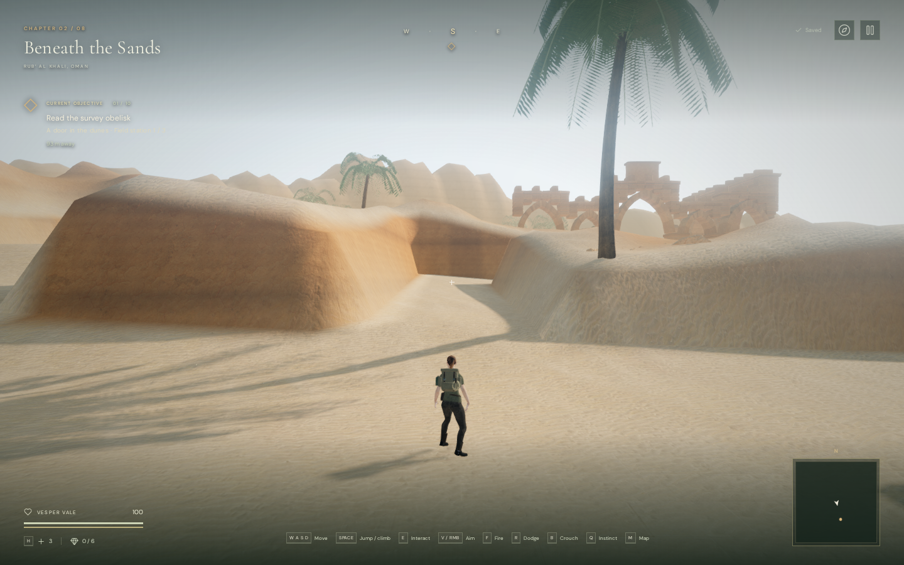
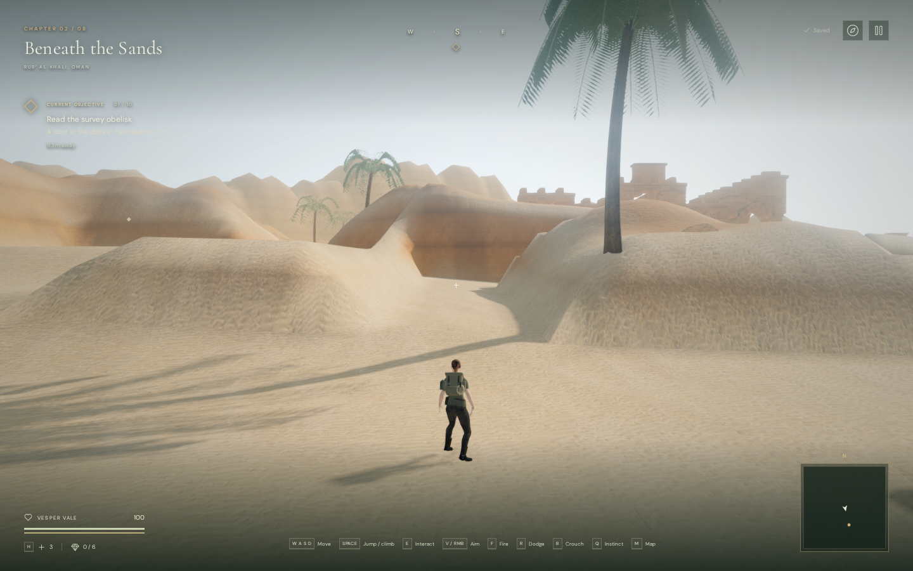
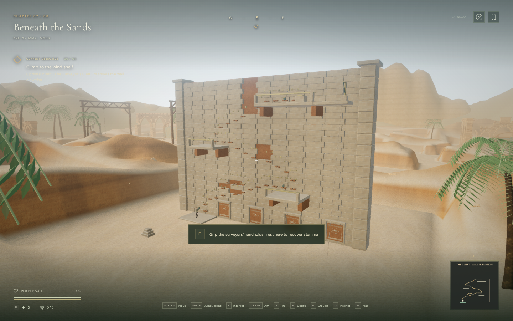
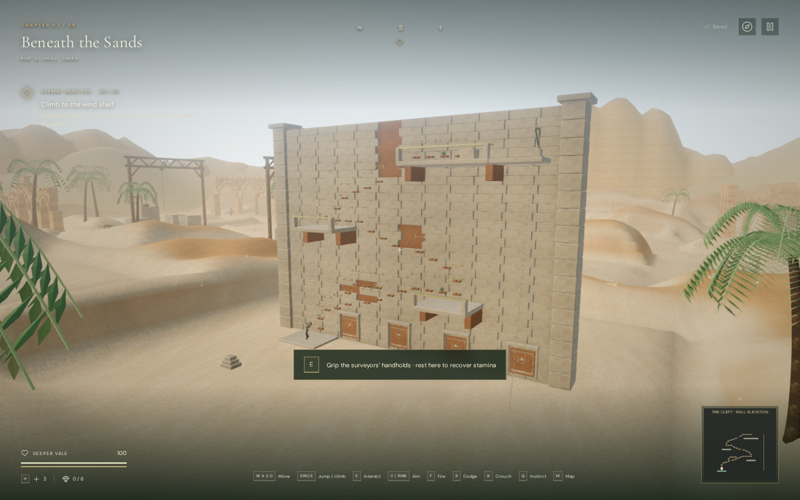

# Desert banks

The later [rounded lower-slope revision](desert-transitions.md) eases the steep
first interval that remained beside walking routes after this crest update.
The measurements below describe this earlier milestone.

The desert's near and middle-distance banks now rise over broader shoulders
with varying crest heights. Previously, the generic terrain rose rapidly beside
the square walking cells, making many ridges look like rectangular blocks.
Seeded, wind-oriented variation now changes the width and height of those rises;
three masked smoothing passes soften the stepped crests left by intersecting
corridors. The existing sand and sandstone materials follow the revised surface.

This is an original procedural landscape for the fictional expedition. It still
has visible grid-shaped passages, simplified landforms and fixed route boundaries:
the gentler banks do not introduce free travel across the surrounding dunes.
The project has not reached AAA graphics. Human chapter pacing, subjective
listening and broader device/browser testing remain open.

## Matching views

The images below are actual 1440 × 900 High-quality development-browser renders
from matching cameras, observer positions and chapter time. They compare the
published `0693507` terrain with the revised banks. These are assisted terrain
review positions, not a character-footing or performance test. Images are lossless
WebP encodings of the captures, without retouching.

| Entrance, before | Entrance, revised |
| --- | --- |
|  |  |

| Quarry, before | Quarry, revised |
| --- | --- |
|  |  |

## Surface and route checks

Comparison against `0693507` found exact equality at 51,375 walking-floor
samples, including cell boundaries, and the same foundation query at those
positions. All 4,805 sampled reservoir-floor points and five reservoir base
levels also match. The other seven chapters retain their complete height arrays.
The new regression stores the previous walking-floor fingerprint rather than
deriving its expected heights from the revised profile.

Across 7,985 non-walkable samples within 3.5 metres of routes, median slope
changed from 45.90° to 38.80° and the 90th percentile from 60.79° to 52.90°.
These are central-difference measurements at the existing 1.75-metre spacing,
not a claim about real sand stability or accessible walking slopes. A total of
23,692 interior terrain vertices changed by more than one millimetre; the largest
absolute height change was 8.67 metres, outside the walking surface.

Browser comparisons preserved all 284 collision-obstacle records, 59 feature
foundation heights, 155 sound-source positions, and the climbing wall's grip,
platform and solid records. All 59 feature approaches remained clear, along with
the climbing wall's 37 holds and 37 checked connections.

All 465 automated tests passed, including the floor fingerprint, slope regression
and existing terrain continuity, protected-foundation and asset checks. The
release build passed with the existing large-chunk advisory.

An assisted browser route used native keyboard events with manually stepped
simulation through 34 climbing transfers, all three terraces, survey-record
recovery and the return rope. It finished at 100 health with the climbing score
active during the ascent. In the release build, native E/W climbing from a
prepared terrace save reduced stamina to 94.08%; pausing mid-climb and reloading
recovered the same safe position at x=209, z=219.2, height=6, with the record
retained. The journal still displayed the recovered text. There was no development
hook, failed asset or console warning/error, and loaded JS/CSS filenames matched
the new build. These checks do not establish a human playthrough duration.

The actual registered bird voice retained its linear panner settings: 3-metre
reference distance and 48-metre range. Diagnostic gains were 0.79333 at 6 metres,
0.17227 at an occluded 24 metres, and the voice released at 55 metres. These are
source-state checks, not rendered loudness or subjective listening measurements.
Changing to the water chapter released all 83 inspected terrain/horizon
geometries, three materials and nine textures, and selected the water sound scene.

## Rendering and assets

The terrain retains its existing sample spacing, chunks, materials and textures.
No meshes, texture downloads or audio assets were added. The new work changes
height generation during chapter construction and adds three smoothing passes;
it does not add a per-frame terrain deformation pass. The renderer, ground
queries, scenery seating and shadows use the resulting surface.

All six Low/High comparison views linked their shaders without console
warnings/errors or failed assets. Rendered workload changed with the new heights
and visibility; these counts are not GPU timings or an FPS improvement claim:

| View | Quality | Before triangles / calls | Revised triangles / calls |
| --- | --- | ---: | ---: |
| Entrance | Low | 480,674 / 270 | 468,506 / 267 |
| Court | Low | 659,002 / 246 | 646,414 / 243 |
| Quarry | Low | 736,988 / 290 | 735,230 / 291 |
| Entrance | High | 1,576,459 / 670 | 1,560,249 / 663 |
| Court | High | 1,875,277 / 648 | 1,847,659 / 639 |
| Quarry | High | 1,907,259 / 727 | 1,915,819 / 730 |

Existing [sand and sandstone attribution](asset-credits.md) remains applicable.
The [earlier landscape notes](desert-landscape.md) describe the ripple textures
and distant horizon meshes, which this change retains.
