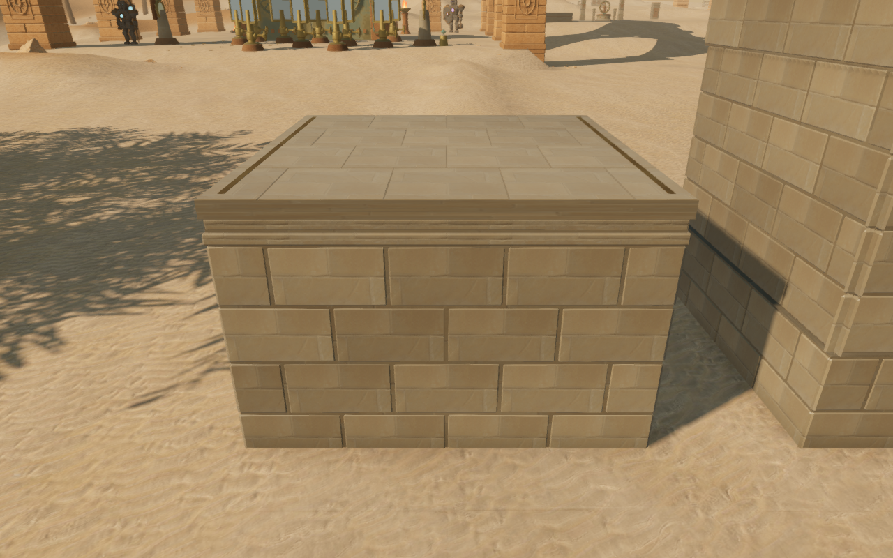
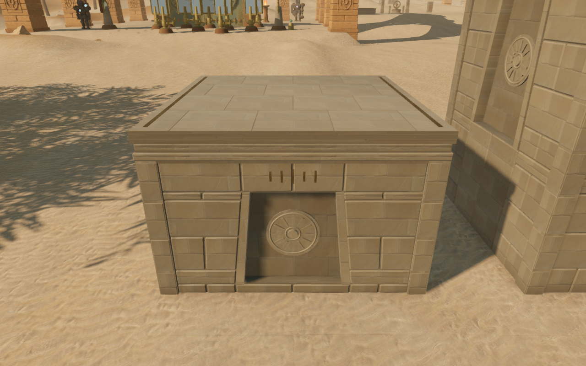
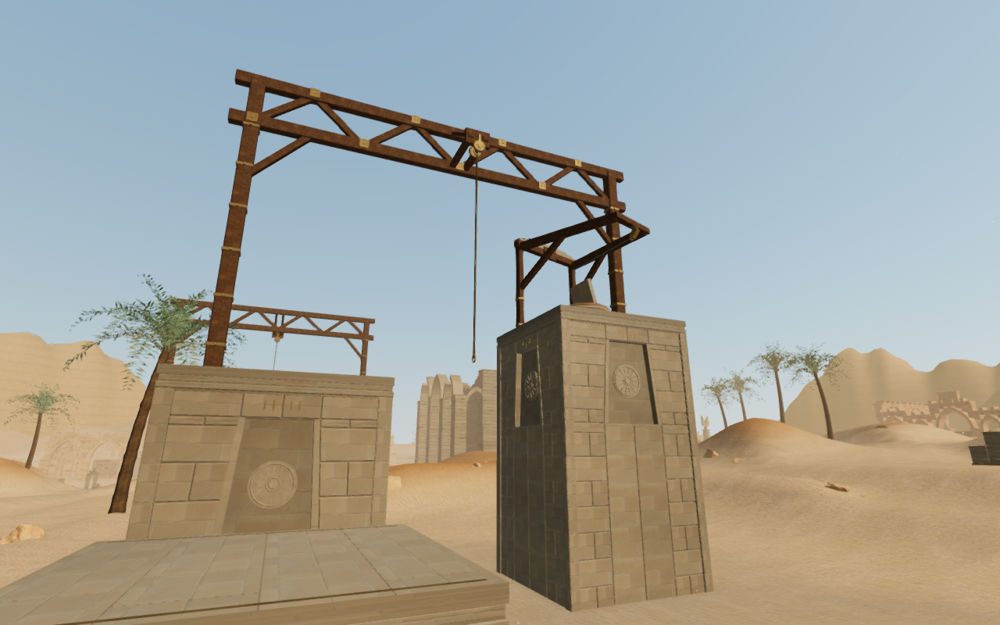

# Desert climbing piers

The desert's ten climbing piers now have forty tapered solar surrounds,
closed stone tablets and seated sun medallions. Jointed sandstone wings and
dressed corner stones replace the plain rectangular wall grid. The medallions
have distinct rings, central bosses and twelve to sixteen rays, with short
bronze marks above each surround. Their construction connects both climbing
courses with the chapter's existing solar courts and pylons.

The tablets, surrounds and medallions stay inside the existing climbing and
camera solids. Every ring and ray intersects its supporting disk or tablet.
Continuous wall and corner backing, plus a buried full bearing bed, carry
the recessed facing joints and lower edges. Complete standing roofs, coping,
bronze landing markers, rope mounts, terminal frames and return cables retain
their geometry, heights and construction seed sequence. The dressed corner
generator is shared with the jungle piers without changing its implementation.
The artwork uses original project geometry and existing credited sandstone
and bronze materials; [asset attribution](asset-credits.md) is preserved.

All 802 automated campaign checks across 122 files pass without failures,
cancellations or skips, including the sixteen climbing contact, construction,
camera and positioned sound-source checks. The production build passes with
its existing bundle-size advisory. Each course's fixed/detail buffers use
147,516 vertices; the complete course uses 177,730 within its existing
180,000-vertex limit.

The construction observer checks all ten piers through 4,410 roof rays,
1,210 underside rays and 360 panel-center backing samples. Every sample
meets stone. The largest roof difference is 5.000 mm at a narrow paving joint;
the highest sampled underside is 210.000 mm below queried ground. A denser
observer also checks 4,840 points across the full tapered tablet faces,
including near their edges, with no gaps. Their sampled surfaces sit
194.995–250.003 mm behind the outer pier face.

All 42 High construction views and four Low views are reviewed, along with
eighteen comparison views. The sixteen matched face observers retain exact
camera positions and targets. Some external observers have foreground masonry
or terrain; these views do not establish every possible walking view.

Both complete assisted desert loops pass with health 100 and full camera
opacity across 9,002 updates. Each uses one supported starting placement and
continuous controller movement through walking approach, mantles, jump, rope,
summit, animated return cable and ground return. The recorded movement,
camera positions, look angles and traversal states match the previous routes
exactly; rendering counts change with the new construction. All 117 final
route images are reviewed. The completed-expedition fixtures do not advance
enemy AI or combat.

Keyboard/High and portrait touch/Low production cases climb the first 2.8 m
roof, crouch and look on it, then descend to ground through native input.
Health, progress, explored cells and complete-store reloads remain stable
apart from chapter timestamps, without arrival-camera corrections. Loaded
bundles match the final build; no development hook, browser errors, warnings,
failed resources or horizontal overflow are present. All fourteen native
captures are reviewed.

These lossless High images preserve the captured pixels. The first pair uses
matching camera positions and targets; the course image is a separate
construction observer. The basic five-pier arrangement still repeats.
Broader campaign visual coverage, landscape and discovery composition,
subjective sound/music review and browser/device acceptance remain open.
Positioned hoist sources and the quiet climbing arrangement retain their
existing movement and distance behavior.
