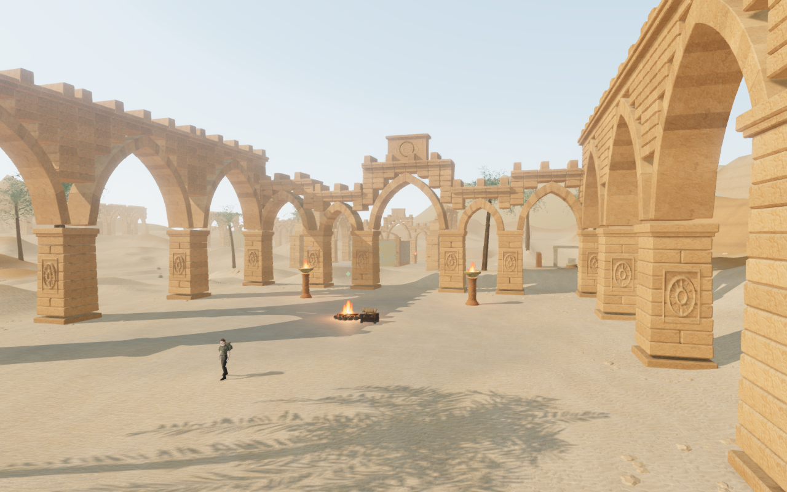
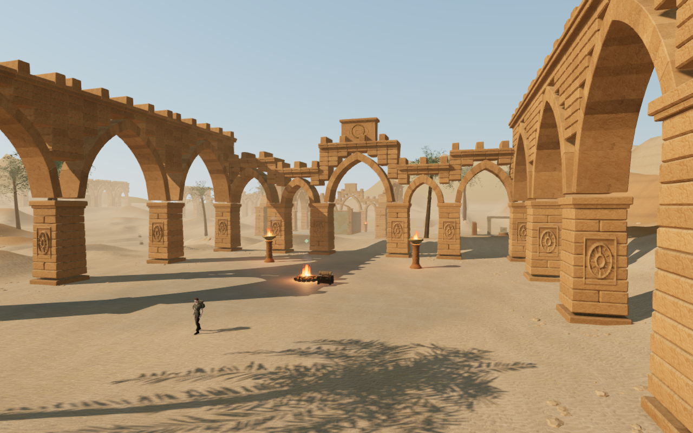
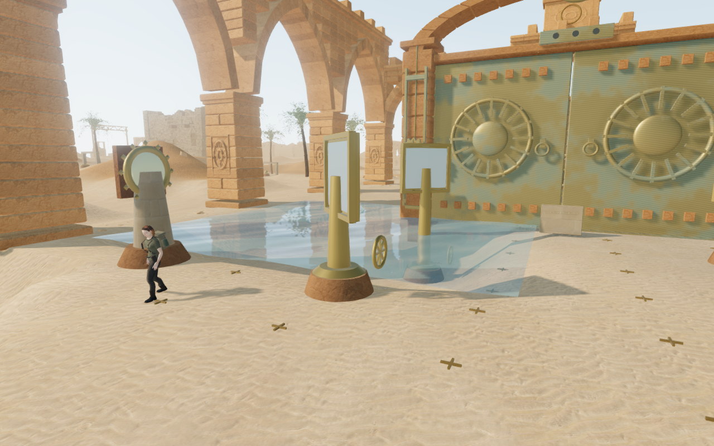
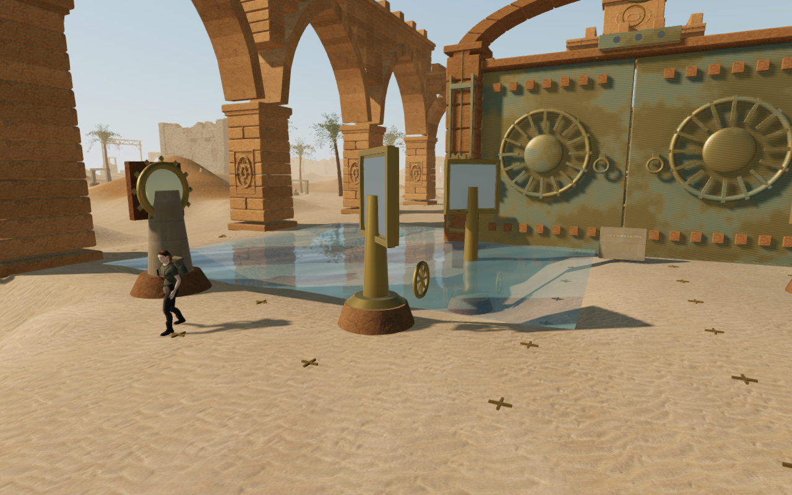

# Desert daylight

The desert now has a deeper blue sky, stronger separation between sunlit stone
and shaded recesses, and less pale reflected light on sand and bronze. The sky's
output is scaled before both display tone mapping and the shared reflection
capture, so visible sky and environment lighting use the same calibration.
The cooler, lower ambient fill leaves warm sunlight as the main directional
light. Haze still separates the distant dunes and escarpments.

This is an art calibration of the existing lighting, not a physically measured
atmosphere or global-illumination simulation. Materials, geometry, the sun's
direction and shadow-map settings retain their existing behavior. The visible
changes do not establish AAA production quality.

## Matching views

These are actual 1280 × 800 High-quality game canvases comparing the published
`75d1cc4` atmosphere with the revised source. Each pair uses the same camera,
observer, actor pose and chapter time. The captures omit the HTML HUD and CSS
vignette. Lossless WebP conversion preserves every decoded capture pixel.

| First court, before | First court, revised |
| --- | --- |
|  |  |

| Reservoir mechanism, before | Reservoir mechanism, revised |
| --- | --- |
|  |  |

Eighteen matching pairs covered the court, walking view, quarry face, rear
court, upper horizon and reservoir on Low, Balanced and High. All shaders
linked without browser errors, warnings or failed assets. Each pair retained
exact draw counts, submitted triangles, camera and observer coordinates,
chapter obstacles, feature heights, reservoir records, sound-source positions,
and quarry handholds, decks and solid bounds. Observer health remained 100.
These are assisted review views, not a blind human playthrough.

## Chapter isolation and resource lifetime

All eight chapters rendered with both atmosphere versions in High. The seven
other chapters had zero differing RGBA values in their matching canvas pairs.
That verifies the inspected views on this browser/GPU, rather than every
possible camera, objective state or device.

Changing chapters released every inspected sky geometry and material and every
shared reflection render target: seven geometries, seven materials and seven
targets across the eight transitions. The crystal chapter has an enclosed
reflection capture instead of a daylight sky; the jungle has a sky without
this shared reflection target. No browser errors, warnings or failed assets
were reported.

## GPU measurement

A separate Radeon 780M run held the first-court camera at 1280 × 800, pixel
ratio 1. Each quality used four-second before/after/after/before samples with
the actual game loop, retaining the same world and shadow settings. Values
average the two sample means for each version.

| Quality | Mean GPU time before | Mean GPU time revised | Change |
| --- | ---: | ---: | ---: |
| High | 17.238 ms | 17.570 ms | +1.9% |
| Low | 9.490 ms | 9.472 ms | −0.2% |

The sample variation is larger than these small differences; no performance
improvement is established. Mean frame intervals were 29.08 → 29.59 ms in
High and 17.94 → 19.96 ms in Low. All eight samples used valid hardware GPU
queries with zero disjoint events and no browser errors or warnings. These
measurements do not establish performance on other views or devices.

## Playable verification

All 476 automated tests passed in 129.1 seconds, covering the existing campaign,
traversal, persistence, audio, rendering and asset checks. The production build
passed in 3.67 seconds with the existing large-chunk advisory. Source formatting
also passed.

The High-quality release browser climbed using native E/W input from a
prepared six-metre terrace, reducing stamina to 93.35%. Pausing mid-climb and
reloading restored x=209, z=219.2, height=6 with the recovered survey record
retained and readable in the journal. Health stayed at 100. This verified input
and recovery; the capture also exposed camera crowding beside the wall, where
the explorer can obscure the view. That camera behavior still needs correction.

Separate release cases travelled 4.378 metres with keyboard sprinting and
1.123 metres with portrait two-finger movement/crouching. Both finished at
100 health and preserved the complete local save on reload except the play
timestamp. The touch case retained its muted setting and fit the viewport.
The release checks loaded the current JS/CSS bundles, had no development hook,
and reported no browser errors, warnings or failed assets. The climbing case
also verified all three sand textures against their recorded bytes and SHA-256.

## Scope

The change is confined to the desert branch of `src/atmosphere.js`. Sky output
is multiplied by 0.38 before tone mapping and reflection capture; turbidity,
Rayleigh and Mie settings are 4.5, 2.3 and 0.006. Sun intensity is 2.8 and the
hemisphere fill is 0.45 with cooler upper and subdued ground colors. These
values describe the artistic setup, not physical atmospheric measurements.

The change requires no new geometry, texture download, audio asset, render
target, pass or dependency. Controllers, collision bounds and save formats are
unaffected. The existing 128-square sky capture and material system remain in use.
Human hour-per-chapter pacing, AAA graphics, subjective music/sound review and
broader browser/device coverage remain open. See [production status](production-status.md)
and [asset credits](asset-credits.md).
