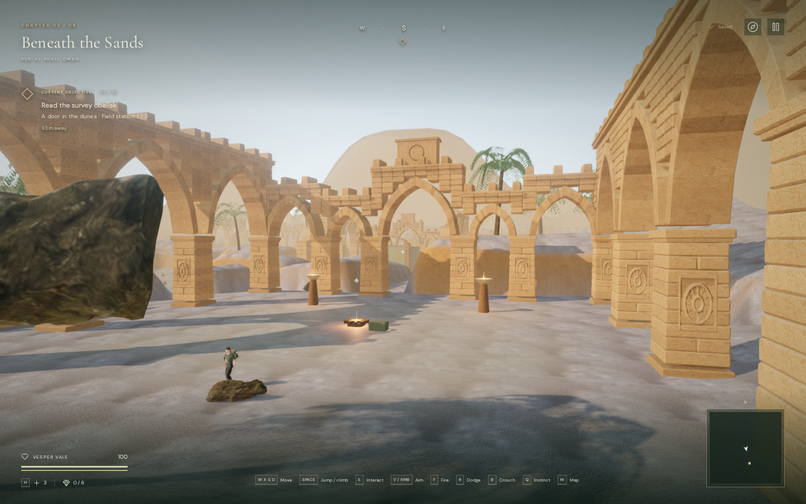
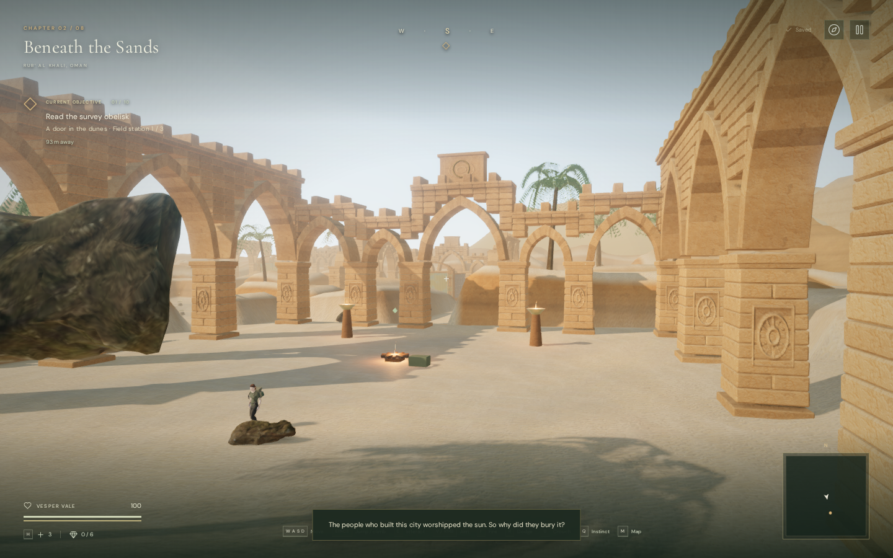
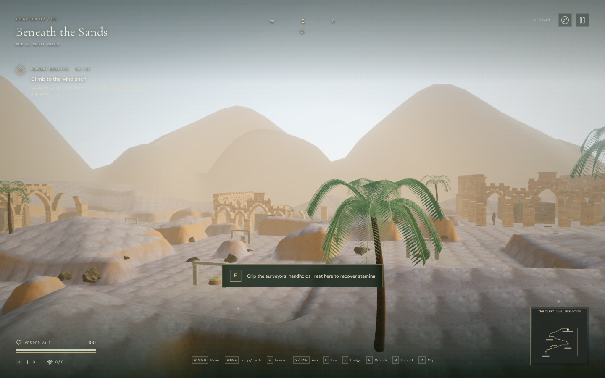
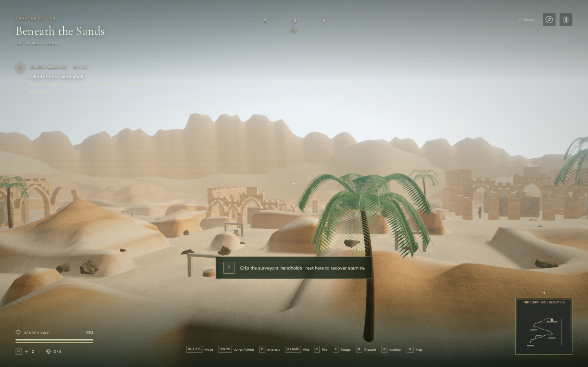

# Desert sand, strata and horizon

The later [desert bank revision](desert-banks.md) broadens the near and
middle-distance shoulders and softens stepped crests while preserving walking
floors. The comparisons below record the earlier texture and horizon milestone.

The subsequent [stone scatter pass](desert-scatter.md) replaces the moss-covered
rocks visible in these images with seated sandstone boulders and smaller rubble.
The terrain and horizon milestone below retains its original comparison evidence.

The desert's ground now uses irregular sand ripples with a warmer mineral tint.
Patchy dust covers parts of the courtyard paving, while exposed slopes carry
sediment bands, shallow relief and darker weathering. Outside the walkable
routes, bounded erosion breaks up the old rounded terrain. The distant backdrop
has two separate ranges: asymmetric dune crests and a taller sandstone escarpment
with plateaus, gullies and height-dependent bands.

This is original procedural landscape design for the fictional chapter. It is
not a survey of the real Rub' al Khali. The existing court buildings, quarry
wall, climbing grips, objectives and saved progression retain their layouts.

## Rendered comparison

These are actual 1440 × 900 High-quality browser frames. Each before/after pair
uses the same camera, observer, chapter time and graphics settings. The baseline
is commit `a89560b`; the final frames include the new sand maps. The HUD remains
visible. Cameras were positioned for inspection, not used for a timed playthrough.

Before, first court:



After, first court:



Before, looking outward from the climbing route:



After, from the same position:



The landscapes still show procedural forms, and the existing scenery and
character need further art work. This milestone does not meet the requested
modern AAA visual standard.

## Materials and geometry

The three new local maps are the unmodified 2K diffuse, OpenGL normal and
roughness JPEGs from [Aerial Beach 01 by Rob Tuytel](https://polyhaven.com/a/aerial_beach_01),
distributed under [Poly Haven's CC0 asset license](https://polyhaven.com/license).
They total **1,826,595 bytes**. The shader changes their tint, uses a twelve-metre
tile and gives the sand a dry, matte response. Texture mipmaps filter the ripple
detail in distant views. The earlier Aerial Sand maps remain available to the
water chapter. Source URLs and hashes are retained in
`asset-sources/desert-sand/`; `scripts/download-desert-sand.py` reproduces them.

`src/desert-geology.js` changes height samples only outside a protected margin
around walkable cells and water basins. It keeps the original 1.75-metre sample
spacing and bilinear height query. The rendered terrain, movement height query,
scenery placement and terrain shadows therefore use the same edited surface.
Its exposure attribute guides the sandstone material beyond the paths.

`src/desert-horizon.js` builds two closed circular strips outside the full
playable square. Each has 49,152 triangles, upward winding and matched seam
normals. The escarpment reuses the terrain's existing Sandstone Cracks color map.
Both layers receive distance haze; neither casts or receives directional
shadows. They remain backdrop scenery, with no new playable area or objectives.

The two horizon meshes replace two earlier meshes, keeping draw-call counts
unchanged in the matched views. They add **91,904 geometry triangles**. High
quality submits them in more than one render pass:

| Matched view | Quality | Before triangles / calls | After triangles / calls |
| --- | --- | ---: | ---: |
| Quarry overview | Performance | 667,486 / 316 | 759,390 / 316 |
| First court | Performance | 552,684 / 259 | 644,588 / 259 |
| Horizon | Performance | 468,208 / 262 | 560,112 / 262 |
| Quarry overview | High | 1,838,673 / 781 | 2,022,481 / 781 |
| First court | High | 1,684,273 / 683 | 1,868,081 / 683 |
| Horizon | High | 1,443,287 / 658 | 1,627,095 / 658 |

These are submitted-work counts from local Chromium, not frame-rate measurements.
The larger sand maps also increase decoded texture memory. Both quality settings
currently use the same horizon resolution and 2K maps; low-memory device tuning
and broader performance measurements remain open.

## Playable verification

The full suite passed **369 tests** with no failures or skips, and the production
build succeeded. Its existing bundle-size advisory now includes the game chunk
as well as Three.js. Five landscape tests verify protected terrain samples,
deterministic and continuous heights, isolation from other biomes, horizon
seams/winding/bounds, built texture use, and decoded asset sizes/hashes.

Browser comparisons found exact before/after equality for all climbing grip
coordinates, decks and solids; all navigation obstacles and feature foundation
heights; all water-base heights; and all environmental emitter positions. All
59 non-guardian feature approaches remained clear in the sampled inspection.
The 37 climbing handholds, 37 sampled edges and quarry approach also remained
clear. These spatial samples complement, rather than replace, gameplay checks.

An assisted native-keyboard run completed 34 climbing transitions, rested on all
three terraces, recovered the surveyors' record, and returned to the base by
rope. Collision and guardian updates remained active during the stepped
simulation. Health stayed at 100. Hanging selected the desert score's `climb`
objective arrangement.

The production preview separately used native E/W controls from a prepared
first-terrace save, climbed, paused, and reloaded. Stamina fell to 94.4856 during
the climb. The saved and restored safe position agreed exactly at
`x=209, z=219.20000000000002, height=6`, with 100 health and the recovered record
retained. The record remained readable in the journal. No development hook was
exposed. All three new maps returned HTTP 200 with the recorded byte lengths and
SHA-256 hashes. The verified entry and game bundles were
`index-BlUWpC6K.js` and `game-D1cl5Sjr.js`.

The rebuilt terrain also retained the existing positional sound behavior. A
registered bird voice used a linear panner with a three-metre reference distance
and 48-metre range. Its diagnostic gain was 0.793333 at six metres. At 24 metres
an intervening surface triggered obstruction filtering and the gain was
0.172267, matching the distance falloff multiplied by the existing 0.38 blocked
gain. At 55 metres the voice was released. These are spatial-audio state checks,
not loudness measurements or a subjective listening review.

Switching to the water chapter disposed all **83 terrain/horizon geometries,
three materials and nine terrain textures** observed by the inspection. The
desert horizon list and terrain profile were cleared, the water chapter retained
its original sand texture, and its own audio scene loaded. Observed shaders
linked successfully in both graphics settings and after the chapter switch.
Final browser runs reported no console errors, warnings or failed assets.

## Reproducing the inspection

Use an isolated browser profile and run `npm run dev`. The existing development
helpers inspect the prepared desert world:

```js
const city = await import('/scripts/verify-desert-art-browser.js');
const climb = await import('/scripts/inspect-cleft-browser.js');
city.inspectDesert(__vesper.game);
climb.inspectCleftClearance(__vesper.game);
```

For the court comparison, `city.desertView(game, 0)` supplies the camera and
observer placement. The horizon camera is offset `(6,20,4)` from the cleft origin
and looks at offset `(35,17,115)`, with the observer at `cleftSafePoint(game,3)`.
Comparisons stop the animation loop, use chapter time 40, and render at pixel
ratio one. Assisted camera fixtures should not be saved as player progress.

Run `npm test` and `npm run build` for automated checks. Local browser profiles,
prepared saves, logs, trial captures and scripts stay in the ignored
`local/staging/desert-landscape/` directory. Only the intentional comparison
images above are published. Full-duration human playtests, consumer-device
coverage, subjective sound polish and the broader visual target remain open.
