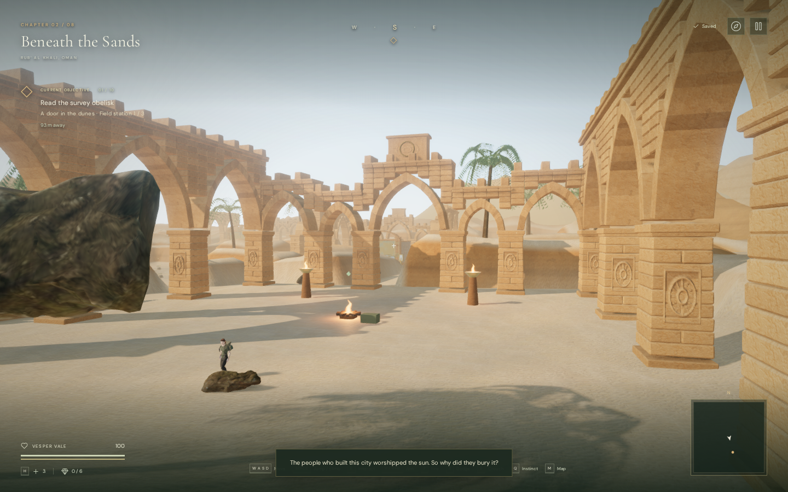
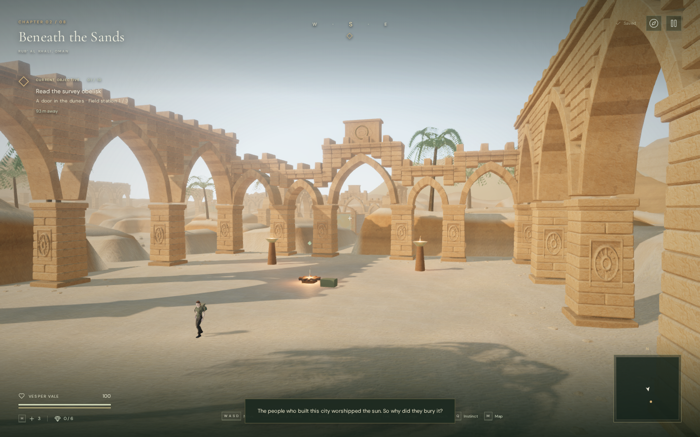
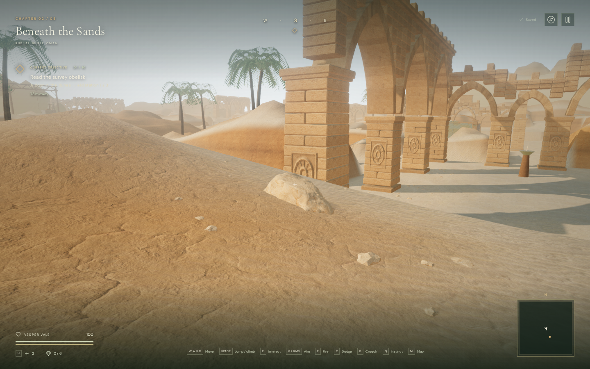

# Seated desert stone and courtyard rubble

The desert's old scatter put the same moss-covered rocks used in the forest on
single terrain-height samples. In the court comparison a nearby 3.3-metre rock
filled much of the frame. Across all 350 old rocks, none was wholly unsupported,
but 145 had sampled underside gaps over one metre on sloping ground. The largest
sampled gap was 4.3747 metres.

The desert now uses 230 sandstone boulders on the banks outside walking cells,
with 4,013 small stone fragments around the boulders and courtyard piers. The
fragments expose at most 0.12751 metres above the soil. Principal crossing axes,
objective approaches, reservoirs, the quarry climb and solid architecture have
placement clearances. Other chapters retain their existing vegetation and rock
assets.

## Rendered comparison

These 1440 × 900 High-quality browser views use the same first-court camera and
observer position. Before, at commit `9740925`:

After:

The close-up below shows a sandstone boulder seated in the bank, with smaller
fragments around it. This is a positioned inspection camera with the explorer
hidden so the stone can be seen clearly:

These are unmodified browser screenshots. The result is a more coherent desert
surface treatment; the environment remains procedural and below the requested
modern AAA visual standard.

## Placement and materials

`src/desert-scatter.js` normalizes six existing scanned shapes and caches their
undersides on a local grid. Each candidate's underside is compared with terrain
heights across its footprint, then slightly buried. Abrupt height changes and
placements that would hide nearly the whole stone are rejected. The layout is
seeded, so reloads and graphics settings retain the same stone positions.

The final browser inspection's separate world-aligned sample grid found no
completely unsupported boulders and no underside gaps above half a metre. The
largest sampled gap was 0.39922 metres, with five rocks having samples above
12 cm. Rounded stone edges can still overhang the ground; this sampling does
not prove continuous contact over every surface point.

Large stones keep their full geometry outside the walking cells. Small rubble
uses an original 80-triangle chipped shape, rotated and scaled into varied flat
fragments. The clutter remains visual: it does not add navigation obstacles,
change terrain height, or modify saved routes. Its short visible height allows
it to sit on otherwise traversable ground.

`src/desert-scatter-material.js` projects the existing local Sandstone Cracks
color, normal and roughness maps from three directions. Position and normal
transforms include each instance's rotation and nonuniform scale, so the shading
follows the placed rock. Restrained sediment bands and upward-facing dust bring
the rocks closer to the surrounding terrain. Texture ownership remains with the
terrain; scatter materials borrow those maps through uniforms.

The six boulders derive from [Rock Moss Set 01 by Kless Gyzen](https://polyhaven.com/a/rock_moss_set_01),
a [CC0 asset from Poly Haven](https://polyhaven.com/license). The geometry-only
`public/assets/models/desert-stones.glb` preserves the already-simplified source
positions, normals, indices and node transforms while omitting its moss images,
materials, UVs and tangents. It contains 12,614 triangles in six meshes and is
267,548 bytes, compared with the former 792,204-byte rock asset. The browser
loads this smaller file for the desert. The original remains in use elsewhere.
No new external model, image or audio files were downloaded for this pass.

Reproduce the derivative from the checked-in source with
`node scripts/build-desert-stones.mjs`. Input/output SHA-256 hashes, the author,
source, license and derivation are recorded in `asset-sources/desert-stones/`.

## Rendering cost

The scatter uses 285 spatial patches. Boulders retain the existing 140/119/91 m
High/Medium/Performance draw ranges. Tiny rubble uses 48/38/28 m ranges, horizontal
observer distance and the existing 300 ms dither transition. Boulders cast
shadows; the tiny fragments receive lighting and shadows but do not cast their
own directional shadows.

Matched view submissions, including each quality setting's render passes:

| View | Quality | Before triangles / calls | After triangles / calls |
| --- | --- | ---: | ---: |
| Quarry | Performance | 759,390 / 316 | 739,462 / 309 |
| First court | Performance | 644,588 / 259 | 630,024 / 251 |
| Horizon | Performance | 560,112 / 262 | 537,192 / 255 |
| Quarry | High | 2,022,481 / 781 | 1,901,895 / 748 |
| First court | High | 1,868,081 / 683 | 1,780,667 / 641 |
| Horizon | High | 1,627,095 / 658 | 1,551,299 / 637 |

These are workload counts in local Chromium, not frame-rate or consumer-device
benchmarks. The additional fragments are inexpensive geometry, but their
placement and draw ranges still need evaluation across more devices.

## Verification

The full suite passed 374 tests with no failures or skips. Five new tests cover
exact source-to-derivative geometry and provenance, sampled underside seating on
flat/sloped terrain, rejection of abrupt steps, deterministic layouts, full-mesh
walking-cell clearance, feature/water/quarry exclusions, built pier bounds,
texture ownership, and quality/distance visibility. The production build passed
with the existing game/Three.js bundle-size advisory.

Final visual runs exercised five cameras in Performance and High quality.
Observed shaders linked successfully, the geometry-only GLB returned its
expected 267,548 bytes, and the browser made no moss-rock request for the desert.
Before/after world records agreed exactly for terrain feature heights, all
navigation obstacles, climbing grips/decks/solids, water-base heights and
positional sound emitters. All 59 sampled feature approaches and the 37-hold,
37-edge quarry inspection remained clear.

The browser completed all 77 assisted walking legs between controls in the nine
solar courts. The helper opens field gates and steps movement physics along
computed routes; it is route-clearance evidence rather than a normal campaign
playthrough. Every inspected solar control remained approachable.

The existing bird sound retained its three-metre reference distance, 48-metre
range and linear panner. Its diagnostic gain was 0.793333 at six metres and
0.172267 at 24 metres behind an obstruction, matching the existing distance and
blocked-gain rules. At 55 metres its voice was released. No audio or score code
changed; these state checks do not establish subjective sound quality.

Switching to the water chapter disposed exactly the observed 368 terrain,
horizon and scatter geometries; 289 materials; nine terrain textures; and 285
instance buffers. The scatter layout and gravel patches were cleared. The water
chapter loaded its original rock UVs and sand texture, its own audio scene and
successfully linked shaders. Borrowed sandstone maps were retired once by their
terrain owner.

A separate production check used native E/W input from a prepared climbing
terrace save. Climbing reduced stamina to 94.4872. Pausing and reloading restored
the same safe position at `x=209, z=219.20000000000002, height=6`, with 100 health
and the recovered surveyors' record still readable in the journal. The production
build exposed no development hook. Its three desert sand maps and new stone GLB
all returned HTTP 200 and matched their recorded byte lengths and SHA-256 hashes.
The verified bundles were `index-Bbw2krCZ.js`, `game-Du39Xjqr.js` and
`three-BO-Q2dVM.js`. Final browser runs reported no console errors, warnings or
failed assets.

Temporary profiles, prepared saves, logs, draft notes and trial captures remain
in ignored `local/staging/desert-scatter/`. Only the intended documentation images
above are published. Human chapter pacing, subjective sound polish, broad-device
performance and the full graphics target remain open.
