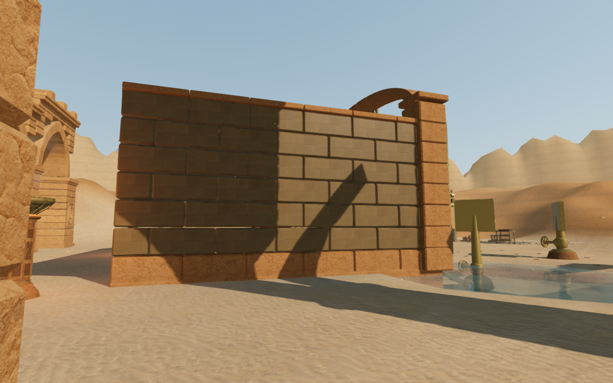
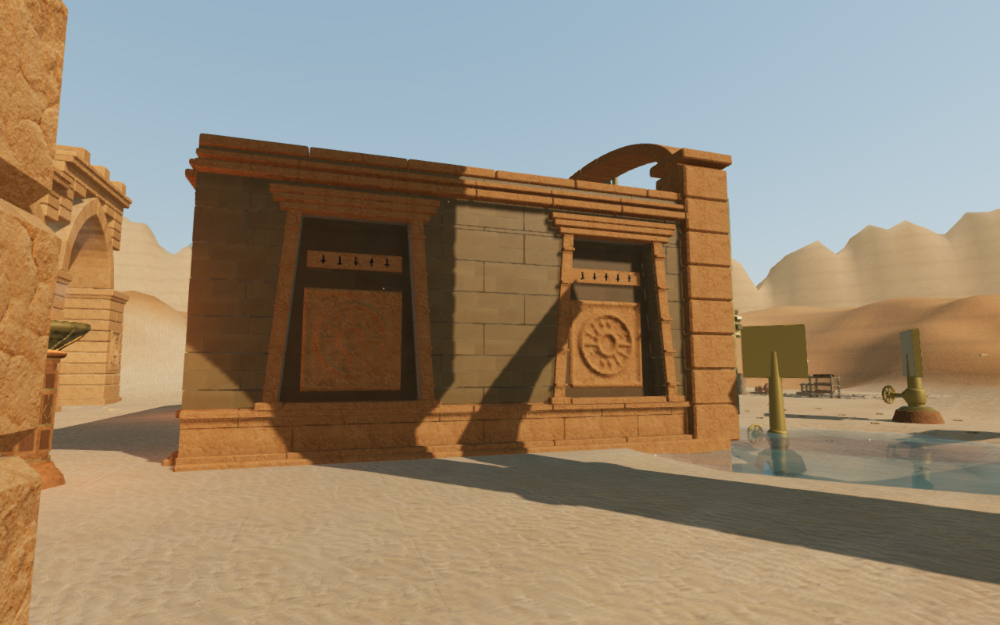
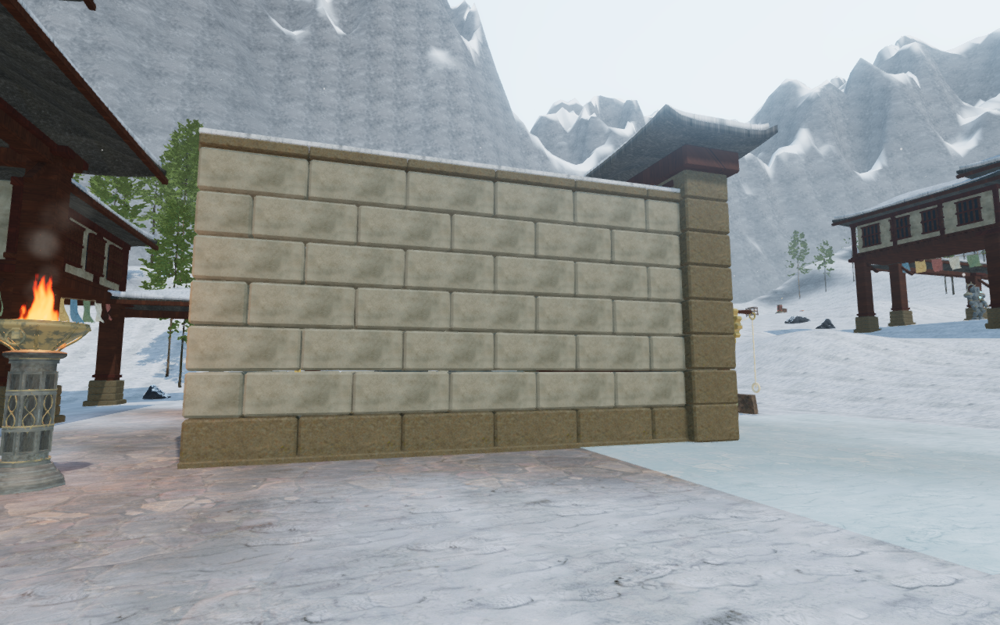
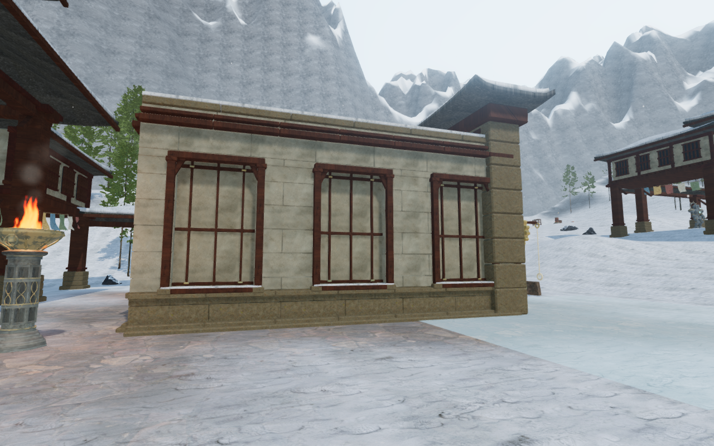

# Solar and monastery chamber walls

The desert and snow gate chambers now carry their regional architecture around
their sides and backs. **51 exterior walls across 17 chambers** replace plain
block faces with recessed bays and fitted surrounds. The desert's nine chambers
have 63 tapered solar bays, layered lintels, closed carved medallions and small
friezes. The snow chapter's eight chambers have 80 timber-framed plaster bays,
seated lattice bars, braced lintels and snow on their sills. Their inner rear
panels use the same tapered or rectangular outline.

The first desert side wall, before and after, from the same position:

The corresponding monastery wall, also from a matching position:

## Construction and clearance

The [wall builder](../src/chamber-walls.js) clips masonry courses around each
bay's silhouette, with a closed backing behind the joints. Solar relief faces
have closed edges and embedded backs. Timber grain follows each member's long
axis. The lattice sits against the plaster and its ends embed into the masonry;
the first prototype left a gap behind it, which the final construction and a
rendered-geometry regression repair.

Mouldings stay within the existing wall movement boundary. Foundations sample
their full 1.6 m width and extend below the surrounding terrain. Side-wall cores
enclose the inward-opening snow door backs; interior side walls retain their
working clearance. Camera surfaces are captured before material batching, so
the finished recesses and backing remain available to collision queries.

The additions use existing credited sandstone, temple stone, plaster, timber,
snow and bronze materials, with original geometry. No external assets,
recordings or dependencies were added. The four documentation images are actual
High game captures converted losslessly to WebP; decoded pixel identity and
matching observer positions and targets were checked.

## Verification

All **689 tests** pass, and the production build succeeds with the existing
large-bundle advisory. The regional chamber regression now covers all
**180 walls and 519 bays** in seven chapters, including **2,700 footing samples**.
Opened-leaf occlusion checks include the snow doors alongside coastal and
eclipse doors. The new lattice regression traces the rendered timber and plaster
to confirm contact, rather than relying on collision boxes alone.

The final assisted review covers **80 wall and interior views**: all 51 changed
exterior faces at High, 17 open interiors, six Low wall views and six
intermediate-state interiors. Another **24 views** cover the first and last
doors at five positions from closed to fully open, and four closer rear walls.
All 104 views were reviewed. The wall observer requires a clear supported
position and sightline; it applies the requested door state before selecting
that position. An edge position beside a raised snow bell platform gave a
misleading view of its supports. All 23 interior views were refreshed after the
observer began using actual support heights and body clearance around its
feet. Door entrance state views use an elevated inspection camera. Shaders link
without browser warnings or errors.

Local routes advance the real character movement through **77 desert legs** and
**40 snow legs**, with field gates temporarily open. All 17 restored thresholds,
113 sampled feature approaches, 36 discovery collection stances and the solar
and bell control/source checks remain clear. These computed local routes do not
represent complete unassisted chapter journeys.

Eight native production cases exercise exterior movement and open-door
crossings in both chapters: keyboard at High and portrait touch at Low. The
four crossing cases pass through the first chamber's restored threshold. Health
stays at 100 and all 16 movement reloads preserve the complete saved data apart
from timestamps and two independently verified camera corrections. Those two
snow exterior return cases request obstructed views of 5.10 m and 4.71 m; the
existing arrival correction selects the full 5.33 m orbit. Each corrected save
is exact on a further reload apart from its timestamp. All 16 native movement
captures were reviewed.

The production cases load the final four JavaScript/CSS assets, with no
development hook, horizontal page overflow, browser warnings or errors. The
JavaScript bundles are `index-DEyXMbul.js`, `three-BDLjPWsr.js` and
`game-KxUjSp0D.js`. Disposable saves, logs, profiles and raw captures stay in the
ignored local staging directory.

All **34 gate-drive sources** retain unobstructed reachable positions in their
nearby 3–7 m rings. The final ambient check in each affected chapter finds a
loaded, nonzero-gain wind voice in a running audio context and decreasing
calculated gain at three increasingly distant ground positions. Chapter theme
and initial objective music states remain present. Gate collision proxies
clear discovery construction and settings at five poses. These checks establish
source access, playback and attenuation; they do not establish subjective
listening quality.

## Cost and continuing review

An isolated construction count includes the complete gate assemblies in each
affected chapter, with the same terrain plan and empty progress:

| Chapter | Meshes before / after | Triangles before / after |
| --- | ---: | ---: |
| Desert | 207 / 216 | 174,996 / 486,774 |
| Snow | 120 / 128 | 161,900 / 247,352 |

Material batching adds one rendered mesh per chamber. Captured camera surfaces
also increase with the detailed masonry. These counts are geometry costs, not
a consumer-device frame-rate guarantee.

This extends the wall treatment within VA-05. Chamber footprints, broad court
composition, elevated instruments and continuous routes remain under the
[playable-world visual audit](visual-audit.md). The complete graphics target,
full journey coverage, human chapter duration and AAA graphics have not been
declared verified.
