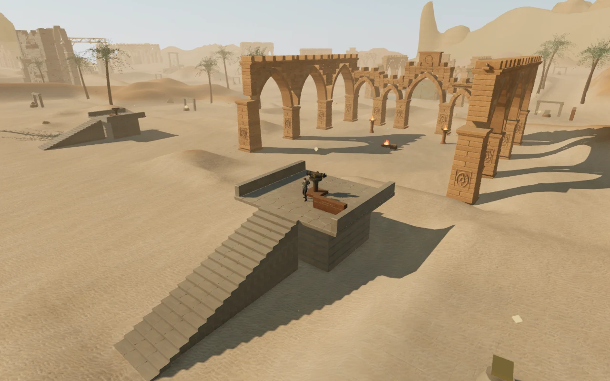
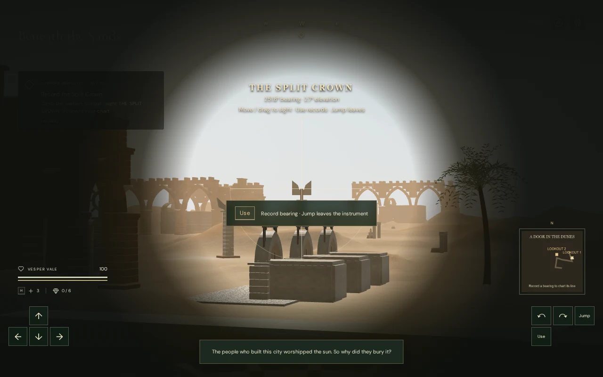

# A door in the dunes

The desert chapter now opens with an observation mission. Two mounted instruments
look across the ruins toward carved monuments. Their recorded bearings locate a
court containing three doorways; the player identifies its entrance by matching
the paired seals with the two observed signs.

## Playing the mission

1. Follow the chapter's first marker and climb the eastern lookout's southern
   stair. Stand beside the instrument and press **E / Use**.
2. Read its inscription, **THE SPLIT CROWN**, and find that carving on the skyline.
   WASD, arrow keys or the touch direction pad adjust the optic. Mouse look and
   touch dragging also work, with reduced sensitivity for precision.
3. Center the carving and press **E / Use** to record its bearing. **Space / Jump**
   leaves the instrument without recording. Pause also releases the view.
4. Follow the second marker to the western lookout. Observe **THE PIERCED SUN**.
   The chart now shows both lines and their crossing at the search court.
5. Walk to the court and compare the three pairs of seals with the recorded
   signs, from left to right. Use the matching door to raise its stone leaf.
   The short recess has a floor, walls and ceiling. Continue to the sanctuary
   marker and the existing counterweight chamber.

The chart does not mark the correct individual door. Incorrect observations and
seals explain why they do not match and preserve earned progress. Target checks
include actual terrain and structural occlusion; inaccessible dunes do not stop
an optical ray merely because the player cannot walk across them.

## Persistence and sound

Instrument angles save with chapter progress. Recorded observations derive from
completed field actions, so an imported flag cannot grant an unearned bearing.
Scope use is temporary: pause, leaving the instrument, death and chapter changes
restore the ordinary view. Standing reloads retain lookout elevation. Airborne
saves within the survey construction area recover on a fixed lookout platform.
Previously completed first-sector actions remain completed.

The instruments have quiet positional movement sounds. The raised doorway has a
separate hoist emitter, and the existing desert score uses its survey arrangement
while observing. Birds and wind remain part of the surrounding environment. All
sounds use the existing independent music, ambience and effects controls.

## Verification and limits

All 592 automated tests pass, and the production build completes with the
existing large-chunk warning. Four production input/reload cases pass without
development hooks: keyboard observation, leaving the scope without recording,
portrait touch observation and chart use, and reloading during the door's rise.
Saved chapter data matches exactly after reload apart from last-played timestamps.
The portrait chart instructions remain visible and the page has no horizontal
overflow.

The assisted browser route starts at the chapter entrance and walks to both
lookouts, down to the seals and inside the opened door with 100 health. It keeps
the ordinary movement, guardian, hazard and camera updates enabled. This verifies
a continuous route, rather than only the individual station positions.

Twelve rendered views across High, Medium and Low linked all shader programs
without browser errors or warnings. The lookout view submitted 1,115 / 648 / 440
draws and approximately 2.40 / 1.56 / 0.99 million triangles respectively. These
are scene counters, not consumer-device performance measurements.

The instrument voice was observed while turning and absent after pausing. An
offline rendering through the actual linear Web Audio panner produced RMS
0.092785 at 1 m, 0.046393 at 6.5 m and zero at 13 m. Leaving the chapter disposed
all 95 tracked geometries, 14 materials and 11 textures exactly once, with no
survey emitters left in the next chapter.

This mission adds observation and spatial reasoning to the campaign. Automated
routes and audio measurements do not establish human chapter duration, subjective
mix quality or modern AAA graphics. The original approximately one-hour-per-
chapter and visual-quality requirements remain open in the
[production status](production-status.md).
