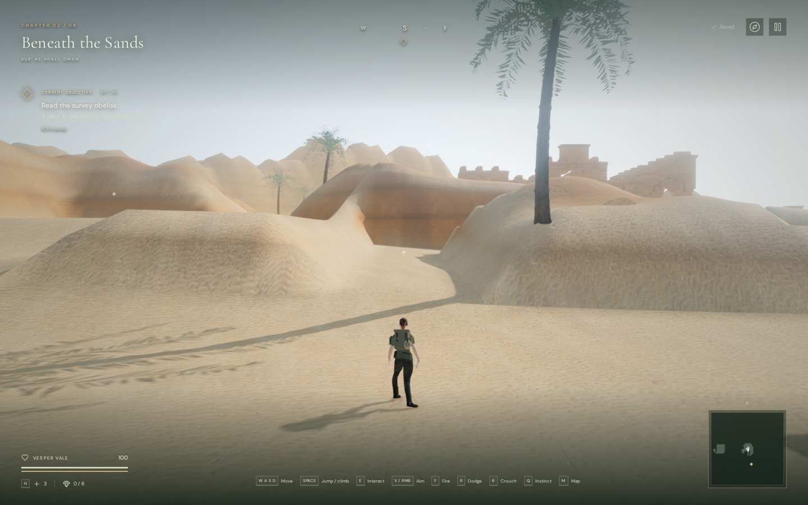
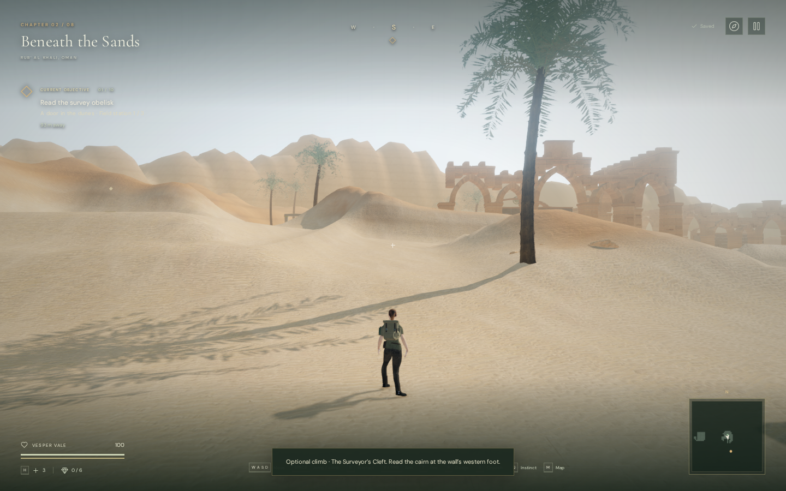
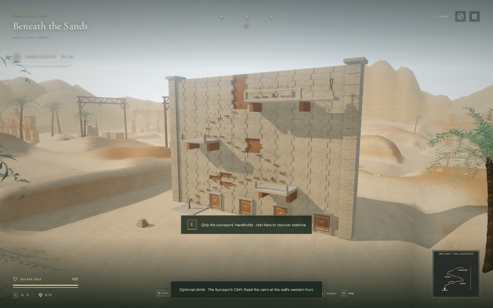
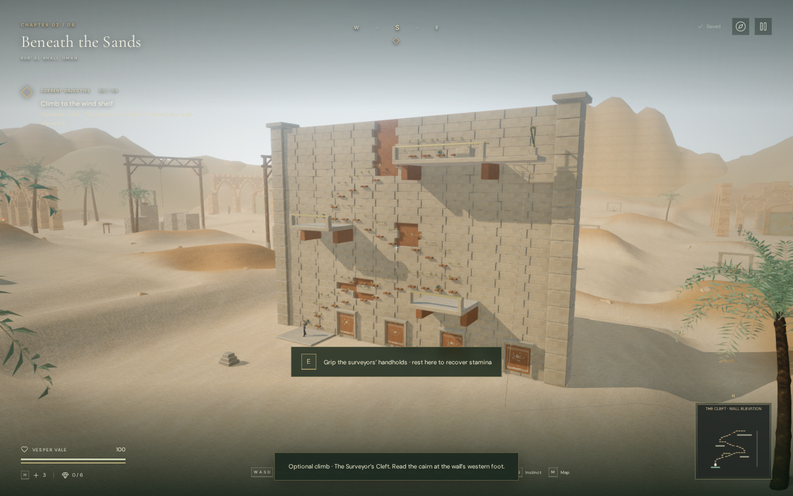

# Rounded desert slopes

The desert banks now rise gently from the edges of the walking routes before
climbing into their higher shoulders. The previous curve softened the crests
but still concentrated much of the climb into the first terrain interval,
leaving straight, steep fronts beside the entrance and quarry. A slower initial
rise gives those lower slopes a rounded shape and opens views between them.

This changes the original procedural landscape in `src/desert-geology.js`.
The walking routes retain their exact heights and fixed boundaries. The change
does not introduce free travel across the surrounding dunes, and some grid
outlines and simplified landforms remain visible. AAA graphics, human chapter
pacing, subjective listening and broader browser/device coverage remain open.

## Matching views

The images compare published `b02fd56` terrain with the revised curve in the
actual development browser at 1440 × 900, High quality. Cameras, observer
positions and chapter time match, with the explorer allowed to settle after
placement. These are assisted landscape review positions. The lossless WebP
images preserve every decoded capture pixel, without retouching.

| Entrance, before | Entrance, revised |
| --- | --- |
|  |  |

| Quarry, before | Quarry, revised |
| --- | --- |
|  |  |

## Surface measurements

Central-difference slopes at 7,985 non-walkable samples within 3.5 metres of
routes changed as follows. The second pair of measurements covers 4,836 edges
between a walking-floor sample and the first off-route sample, 1.75 metres away.
These describe the sampled game terrain, not physically simulated sand or
accessible walking gradients.

| Measurement | Before | Revised |
| --- | ---: | ---: |
| Near-route median slope | 38.80° | 17.85° |
| Near-route 90th-percentile slope | 52.90° | 30.13° |
| First-interval 90th-percentile rise | 2.88 m | 0.75 m |
| First-interval maximum rise | 4.50 m | 1.39 m |

The strengthened regression checks both the broader slopes and their first
interval, so a softened crest cannot conceal another steep front. Against the
published profile, all 51,375 walking-floor samples and their foundation queries
match exactly, as do 4,805 reservoir-floor samples and all five reservoir site
records. All seven other chapters retain their complete terrain height arrays.
A total of 24,658 vertices changed by more than one millimetre; the largest
absolute height change was 5.13 metres outside the walking surface.

Browser comparisons retained the chapter's 284 collision-obstacle records,
59 feature heights, 155 sound-source positions, and the climbing wall's grip,
deck and solid records. All 59 feature approaches and the wall's 37 holds and
37 checked connections remained clear. Scenery seated on the changed banks,
including palms, follows the new heights.

## Playability and audio

All 473 automated tests passed in 132.7 seconds, including the strengthened
bank regression, retained walking-floor fingerprint and existing terrain,
traversal, audio and asset checks. The release build passed with the existing
large-chunk advisory.

An assisted route used native keyboard events with manually stepped simulation
through 34 climbing transfers, all three terraces, survey-record recovery and
the return rope. It finished at 100 health, with the climbing arrangement
selected during the ascent. This does not establish a human playthrough time.

In the release browser, native E/W climbing from a prepared terrace save
reduced stamina to 94.49%. Pausing mid-climb and reloading recovered the same
safe position at x=209, z=219.2, height=6, with the recovered record retained
and readable in the journal. Separate keyboard sprinting and portrait
two-finger movement/crouching checks travelled 4.574 m and 1.035 m, respectively,
and finished at 100 health. Their full saves matched after reload except for
the play timestamp. All release cases loaded the new JS/CSS bundles, exposed
no development hook, and reported no browser errors, warnings or failed assets.
The three delivered sand texture files also matched their recorded bytes and
SHA-256 hashes.

The actual registered bird voice retained linear distance falloff, with a
3-metre reference distance and 48-metre range. Its diagnostic gain was 0.79333
at 6 metres and 0.17227 at an occluded 24 metres; the voice released at 55 metres.
These are source-state checks, not rendered loudness or a listening evaluation.
Changing to the water chapter released all 83 inspected terrain/horizon
geometries, three materials and nine textures, and selected its water sound scene.

## Rendering cost and assets

The curve changes height generation during chapter construction. It retains
the terrain spacing, meshes, smoothing passes, materials and texture downloads,
and adds no per-frame terrain deformation. Lower banks change scenery seating
and visibility, so the rendered cost can still increase.

All six matching landscape views in Low and High linked their shaders without
browser errors, warnings or failed assets. For example, the High entrance view
changed from 1,631,865 triangles / 665 calls to 1,648,537 triangles / 668 calls;
the High quarry changed from 2,053,561 / 751 to 2,105,875 / 764. These are
rendered counts, including render passes, rather than added mesh totals.

A separate Radeon 780M hardware run used a fixed court view at 1280 × 800,
pixel ratio 1, with four-second before/after/after/before samples for each
quality. Each sample rebuilt the full world against its corresponding terrain
profile. Both profiles used the current sun-shadow implementation.

| Quality | Mean GPU time before | Mean GPU time revised | Change |
| --- | ---: | ---: | ---: |
| High | 16.739 ms | 17.254 ms | +3.1% |
| Low | 8.601 ms | 9.370 ms | +8.9% |

The values average the two sample means per variant. Mean frame intervals were
28.97 → 29.56 ms in High and 18.14 → 17.94 ms in Low; scheduling and sample
variation prevent treating these as a general FPS change. All eight samples
had valid GPU queries with no disjoint events, browser errors or warnings.
This is one camera and one GPU, not a device-wide performance claim.

No external model, texture, recording, music or dependency was added. The
existing [sand and sandstone credits](asset-credits.md) remain applicable.
[Earlier bank notes](desert-banks.md) describe the crest variation and smoothing
that this revision retains.
