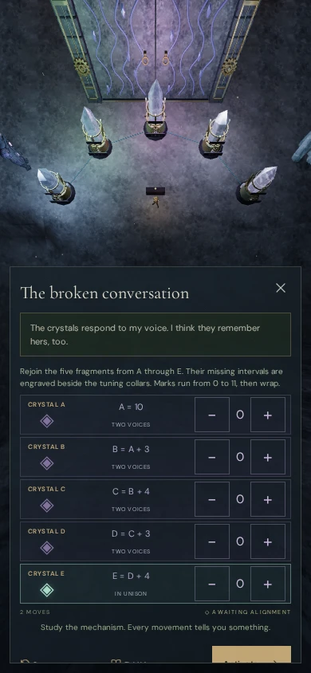
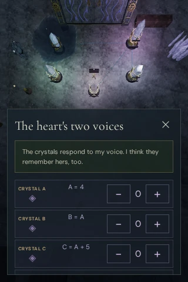

# Narration inside dialogs

Active notifications now sit below the dialog title, in the normal text flow.
They wrap with the panel and scroll with its contents. This repairs VA-22,
where the chapter introduction could float over crystals or tuning buttons
soon after a reload. The existing notification position resumes when the dialog
closes.

The same status element moves between the gameplay screen, inscriptions and
focused controls. Replacing a dialog preserves that element and its expiry
timer. Showing or hiding the message requests a new rendered frame so the
resonance camera can follow changes in the panel's height while paused.

## Verification

- **643/643 automated tests pass**, and the production build passes.
- All eight resonance arrays were checked in four viewport sizes: 320×480,
  390×844, 844×390 and 1280×800. These 32 views keep the complete array within
  its available camera area with narration visible. Sixty-four native tuning
  taps remain reversible. Each notice survives the switch to an inscription
  and returns to the gameplay screen when it closes.
- The expiry check confirms that the same notice becomes hidden after a dialog
  replacement and requests a paused render. The live status element is never
  duplicated.
- Forty-eight further dialog layouts cover all eight chapters at 320×480,
  390×844 and 1280×800, opening the record and its controls. The notice stays
  below the title with no button overlap or horizontal overflow. Captures wait
  for the entrance animation to finish; all 80 development views were reviewed.
- Six production cases cover keyboard/High and touch/Low input on desktop,
  portrait and landscape phones, and a portrait tablet. They complete **93
  tuning turns, six intentional resets and six activations**. All **12 reloads**
  preserve the complete save except play timestamps. Opening a record and its
  diagram preserves existing tuning; the six return walks cover 3.07–5.01 m
  with health 100. All 24 production captures were reviewed.
- The production cases load the current built assets, expose no development
  hook, and report no browser errors or warnings. The build retains its existing
  bundle-size advisory.
- The reusable [dialog notice inspector](../scripts/inspect-dialog-notice-browser.js)
  checks placement below the title, button overlap, horizontal overflow and
  the status element's parent.

These checks use disposable progress to isolate layout, input and persistence.
They do not establish complete chapter playthroughs or subjective audio quality.

The chapter review initially recorded an obstructed snow bell view as VA-23.
Follow-up identified a setup error: assigning field progress and moving the
player inside a court while pausing its animation left the sanctuary doors shut.
The [original capture](images/dialog-notices/bell-obstruction.webp) shows those
doors. Reloading that progress constructs them fully open, and native keyboard
interaction shows [all four bells clearly](images/dialog-notices/bells-after-reload.webp).
Camera-to-bell rays then reach the instrument without the intervening doors.
VA-23 is closed as a capture-state error; no camera change was needed. The 48
chapter cases verify notice layout, not the framing of every instrument.

This is a dialog-layout repair. The [world audit](visual-audit.md) remains open
for court terraces, jungle tree placement, repeated court forms and sparse
surroundings. Runtime models, textures, sound sources, music and their existing
attribution are unchanged.
