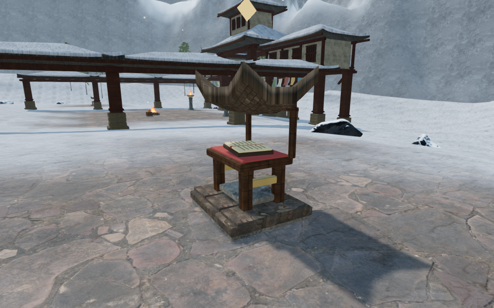
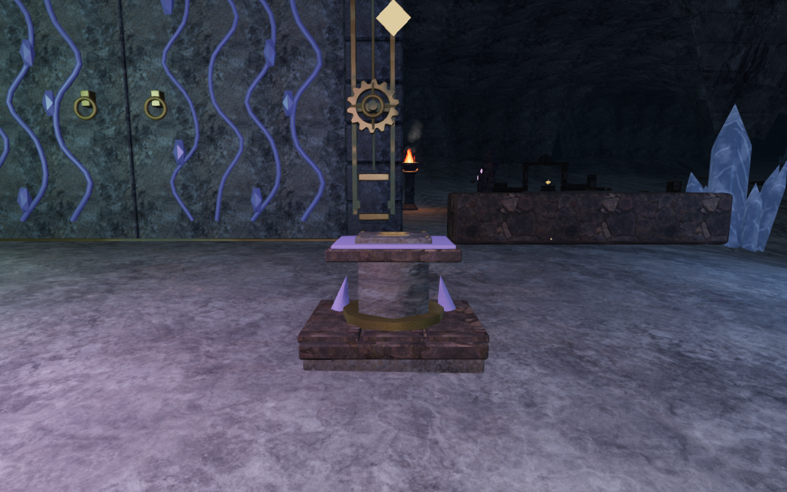
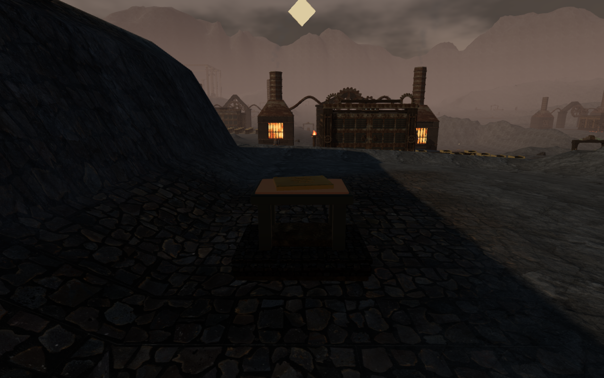
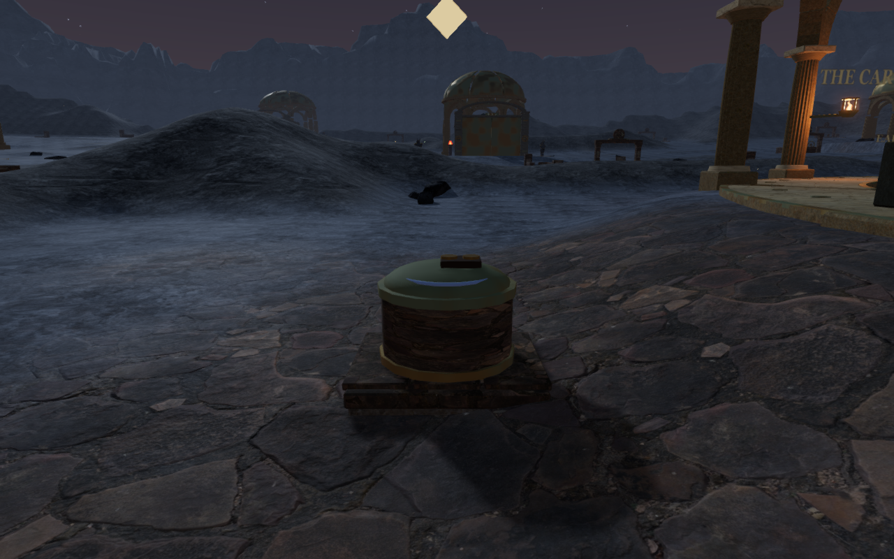

# Grounded discoveries and regional construction

All 96 notes and 48 caches now rest on constructed stands or containers. The
previous floating gold tablets and gems have been replaced with scripture,
scrolls, engraved registers and cache contents. The stands remain after
collection, with the contents and gold discovery marker removed. Their visible
construction and collision therefore remain together.

| Chapter | Notes | Caches |
| --- | --- | --- |
| Verdant | Stone reading tables with lotus fittings and tablets | Banded reedwood coffers |
| Sands | Sandstone desks with rolled survey scrolls | Painted stone caskets |
| Frost | Sheltered timber desks with open scripture | Monastery travel chests |
| Tides | Mosaic-trimmed desks with bound ledgers | Harbor strongboxes with carrying rings |
| Embers | Riveted metal desks with etched registers | Iron safes |
| Sky | Timber chart tables with rolled sheets | Canvas-panel courier trunks |
| Crystal | Hexagonal stands with inset crystals and slates | Hexagonal archive cases |
| Eclipse | Reading stands with orbital fittings and star plates | Round reliquaries with domed lids |

The new geometry reuses the credited masonry, timber and monastery roof maps,
the project's bronze shader and camp materials. Static construction is batched
within each prop. No external assets or dependencies were added.

## Placement and clearance

The [placement pass](../src/discovery-placement.js) runs after the chapter's
architecture, special missions, hazards and courtyard furniture have been
built. It checks a 1.9 m square footprint and a clear collection stance beside
the prop. Water sites, traversal projections, other instruments, existing
solids and sanctuary gate swing areas reserve their space. A footing extends
below the lowest terrain-grid sample across the footprint.

Five discoveries move to nearby clear ground. The remaining 139 retain their
original centres. Coordinates below are world metres; indices follow the
zero-based discovery IDs.

| Discovery | Previous x, z | New x, z | Distance moved |
| --- | --- | --- | ---: |
| Verdant cache 15 | 70, 315 | 71.75, 315 | 1.75 m |
| Embers note 2 | 161, 343 | 164.5, 343 | 3.5 m |
| Crystal note 4 | 210, 182 | 210, 189 | 7 m |
| Crystal cache 16 | 189, 315 | 189, 316.75 | 1.75 m |
| Eclipse cache 12 | 245, 217 | 243.25, 217 | 1.75 m |

Crystal note 4 previously occupied a permanent chamber side wall; its plinth
also overlapped the closed gate corner. Embers note 2 intersected the steep
tempering-track bank. Eclipse cache 12 stood in the orbit-vault depression.
Their new positions preserve the original discovery IDs, text, rewards and
local-storage schema. The terrain and puzzle floors retain their existing
heights.

The [prop builder](../src/discovery-props.js) gives construction finite world
bounds for movement, sight, sound occlusion and shots, and captures surfaces for
camera clearance. Standing height follows the actual upward triangles saved
before batching, including curved roofs and lids. Collection requires a clear
sight line, compatible elevation and distance below 3 m. Found stands remain
solid and visible; found contents cannot become an invisible obstacle.

## Verification

All **678 automated tests pass**, including fourteen new placement and geometry
checks. The [placement tests](../tests/discovery-placement.test.js) cover wall
overlap, hidden-solid reservation, protected water/traversal/instrument areas,
physical bounds and collection through walls or from another elevation. The
[support tests](../tests/prop-support.test.js) compare standing heights against
actual mesh rays in every regional prop style and on a rotated curved roof.
Existing station collision, traversal, terrain, water, save and audio checks
also pass. The production build succeeds with the existing bundle-size
advisory.

The browser audit verifies all **144 collection stances**, occupied centres,
finite solids, nearest-item selection and direct interactions on disposable
development progress. Every note is recorded, and every cache supplies one
medical item. Collected contents and markers disappear while construction and
collision remain. All 144 placements remain exact after rebuilding found
progress and after rebuilding with all sanctuary gates open. A final fresh
pass repeats collection and confirms unchanged placements after the support
correction.

The observer captured **160 High views across all 144 sites**, including a side
view of one note and cache per chapter, with no blocked views or shader-link
failures. All initial views were reviewed; the final snow views and the three
principal placement repairs were reviewed again after material and support
changes. The [prop observer](../scripts/inspect-discovery-props-browser.js) uses
valid walking positions and rejects obstructed views. It hides the explorer to
inspect construction and does not collect items.

Eight production cases collect snow cache 16, volcanic note 2, crystal note 4
and eclipse cache 12 with native keyboard/High input at 1280×800 and touch/Low
input at 540×900. Short, measured directional inputs approach each prop before
Use. All cases retain health 100; notes open their reading panels, and caches
supply exactly one medical item. Full reloads preserve the complete saved data
apart from play timestamps. Four additional older saves occupying the new
construction recover to clear positions 1.5 m away, preserving their
checkpoint and discoveries; a second reload keeps each repaired save exact.
All twelve cases load the final build's four JavaScript/CSS assets without a
development hook. The collection cases check horizontal overflow. No browser
errors or warnings are recorded. Guardian combat is suppressed in these
disposable fixtures to isolate input and persistence.

The final browser audio check covers a bird, wind, stream, fire or drip source
in each chapter. Calculated distance gain decreases at three progressively
farther valid ground positions, and every selected source has a loaded,
nonzero-gain voice in a running audio context. The chapter and initial
objective music state is present in all eight cases. This is a playback and
attenuation check, not a listening assessment of the mix. All sanctuary gates
also pass prop clearance against their movement collision proxies at five
poses from closed to fully open, with no overlaps or browser errors.

## Continuing world review

VA-25's floating pickup and missing collision findings are repaired. Its
surrounding scenery work remains open: many discoveries still stand alone on
broad repeated paving or terrain, and some neighboring discoveries repeat the
same arrangement. The [world visual audit](visual-audit.md) continues to track
those areas, repeated courts and sparse connecting routes. Moving these three
pickups clear of special terrain does not repair every surrounding bank or
vault edge in VA-15.

These bounded checks do not establish complete journey coverage, human
playthrough duration, consumer hardware performance, subjective audio quality
or AAA graphics. Raw captures, profiles, logs and disposable saves remain in
the ignored staging directory.
