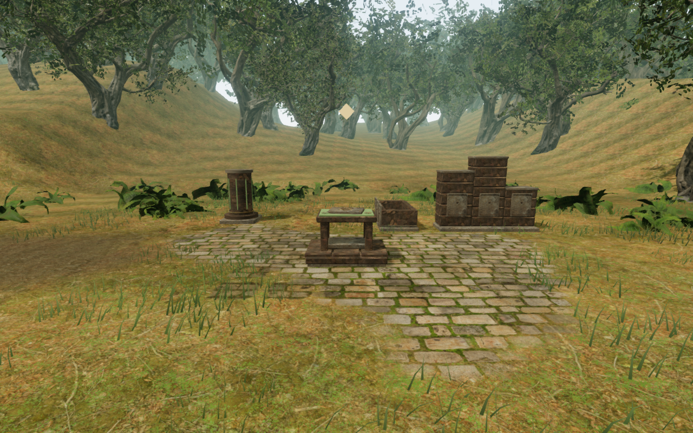
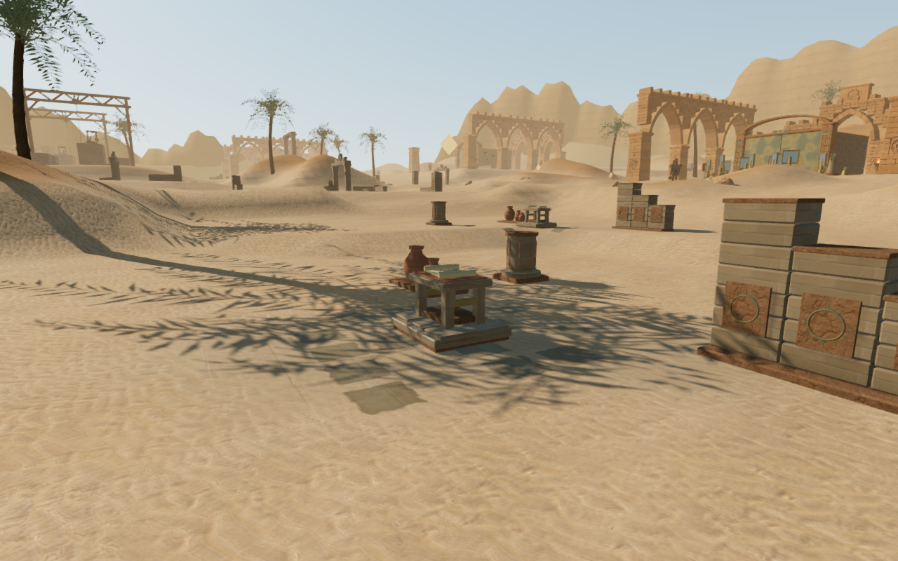
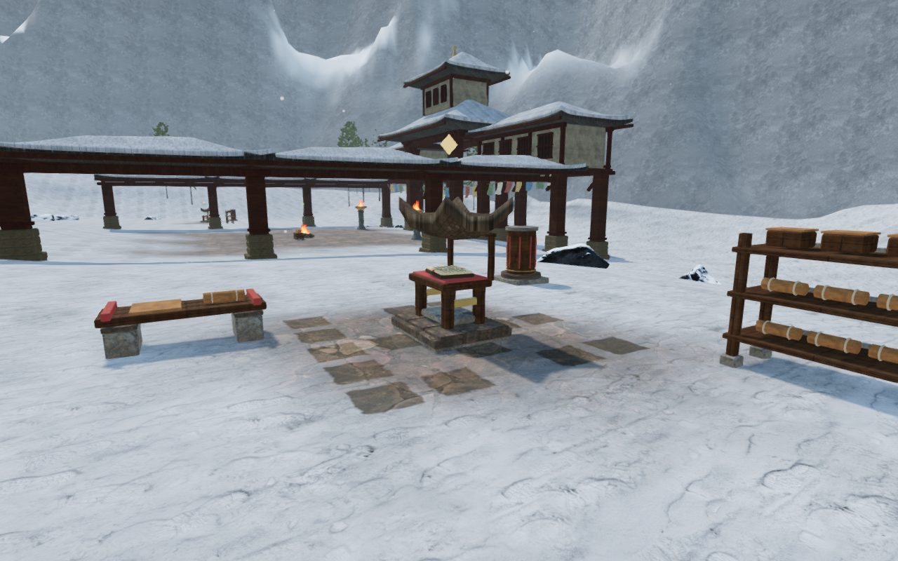
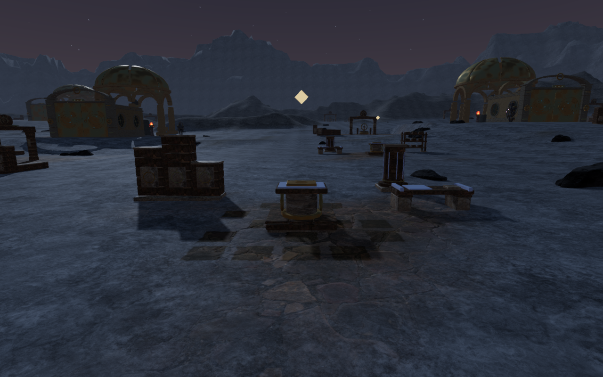

# Regional surroundings for discoveries

Notes and caches now have small regional settings around their permanent
construction. Broken walls, storage racks, sorting troughs, benches and column
fragments give these stops a purpose within their chapter. Nearby discoveries
share their surroundings rather than acquiring two copies of the same backdrop.
Existing buildings and working mechanisms take priority when an area is crowded.

The 144 discoveries form **138 settings**, with **397 accepted scenery modules**.
Three settings rely on their existing architecture: jungle cache 15, crystal
note 4 and eclipse cache 16. Their new floor fragments remain in place.

| Chapter | Surroundings |
| --- | --- |
| Verdant | Carved archive masonry, pottery shelves and dry sorting troughs |
| Sands | Survey reliefs, stored scrolls and profiled pottery |
| Frost | Timber scripture racks, resting benches and cloth rolls |
| Tides | Mosaic fragments, harbor crates and coiled rope |
| Embers | Iron mold racks, sorting bins and riveted plates |
| Sky | Courier cargo, canvas rolls and timber benches |
| Crystal | Geometric archive reliefs, stored slates and faceted column fragments |
| Eclipse | Meridian plates, orbital reliefs and memorial benches |

Discovery terrain paving has a smaller worn boundary. Interrupted inlays follow
the actual terrain triangles around each stand, leaving soil, grass, sand and
snow visible between courses. This changes the floor's material coverage without
changing terrain elevations or moving the pickup construction.

## Placement and physical construction

The [setting planner](../src/discovery-setting-plan.js) runs after the existing
[grounded discovery placement](discovery-props.md). It protects complete
collection approaches, campaign walking lanes, climbing-course projections,
water footprints, other instruments and special chapter foundations. Hidden
solids reserve space along with visible ones, and sanctuary gates reserve their
entire swing area independently of progress. Sloped or occupied sites reject a
module instead of forcing it into the terrain or another building.

Groups of neighboring discoveries have a bounded diameter of 16 m. Each setting
selects among asymmetric wall/rack, furnishing and broken-column placements,
using a stable chapter seed and discovery identity. Shared settings use one
backdrop and one column fragment, with space for a separate furnishing near
each member. Existing buildings may supply the context where these additions
cannot fit. Floor fragments remain around those stands.

The [regional assembly builder](../src/discovery-setting-art.js) keeps reliefs,
fittings and pottery within each reserved footprint. Foundation feet extend
below the lowest sampled ground across that footprint. Large pieces have
individual finite solids; an open rack has separate shelves and legs, without
a solid wall across its empty bays. Movement support follows the actual upward
triangles, and camera surfaces are captured before geometry is batched.
Storage jars have visible fitted lids: their previously open narrow mouths
allowed body placement inside the shell despite intersecting its sides. The
lids close that gap in both rendered geometry and movement support.
Collection never hides the surrounding construction.

The [world builder](../src/discovery-settings.js) batches the additions by
material across each chapter, resulting in four to eight construction meshes
and one floor mesh per chapter. Floor inlays form their own batch without casting
shadows. Understory placement includes the leaf extent when reserving the new
masonry and pickup footprints, repairing a fern that initially passed through a
column. Existing credited stone, timber, mosaic, paving and camp materials are
reused; no external assets or dependencies were added.

## Verification

All **688 automated tests pass**, including seven new checks for bounded discovery
clusters, complete collection approaches, hidden/moving geometry reservations,
regional assembly extents, open rack bays, covered-jar body clearance and
understory leaf clearance. The production build succeeds with the existing
bundle-size advisory. Whole terrain
height buffers in all eight chapters compare exactly with the previous
milestone; this pass changes paving coverage and adds construction only.

The assisted browser check covers all **144 collection stances**, nearest-item
selection, sight, occupied stand centres and direct collection. Notes retain
their text and caches supply one medical item. Construction remains visible and
solid after collection. Rebuilding found progress and fully open sanctuary
gates produces identical pickup positions and setting layouts.

The [surroundings observer](../scripts/inspect-discovery-settings-browser.js)
uses clear ground positions and sightlines. It captures **160 High views** of
all 144 sites, including a side view of one note and cache in each chapter.
Every final view was reviewed. The first wider captures revealed black floor
fragments: the inlay material expected a vertex color attribute that its geometry
does not carry. Disabling that material option repairs the fragments. The final
build and all 160 views were repeated after this rendering correction, with all
144 collection approaches checked again. Setting geometry compares exactly with
the earlier complete collection and progress-state audit. No shader-link
failures, blocked observer views or browser warnings/errors were recorded in
the final observer check.

The final jar repair affects jungle and desert construction. All 36 collection
checks and progress-state rebuilds in those two chapters were repeated, and
all 40 affected views were recaptured and reviewed. The other six chapters do
not use the jar builder and their setting geometry remains unchanged.

Eight native production cases collect one note or cache per chapter. Keyboard
input uses High graphics at 1280×800 in jungle, snow, volcanic and crystal
chapters; touch input uses Low at 540×900 in desert, coastal, sky and eclipse
chapters. Short directional inputs approach the stand before Use. Every case
retains health 100, receives the expected journal entry or medical item, and
preserves the complete saved data on reload apart from play timestamps. The
four JavaScript/CSS assets for each tested production build load without a
development hook or horizontal overflow. Jungle and desert collection and
older-save recovery were repeated against the final build after the jar repair;
the other six cases precede that repair to the unused jar builder. Guardian
combat is suppressed in these disposable fixtures to isolate movement,
interaction and persistence.

Eight additional older saves begin on ground now occupied by a setting module.
Arrival recovers to a clear position 0.75–1.5 m away, retaining health 100,
checkpoint and discoveries. Every repaired save remains exact on a second
reload apart from timestamps. One longer verification browser closed during
the fifth collection case's reload; its cause was not traced. That case and
the remaining cases pass in fresh browsers. All sixteen completed native cases
record no browser warnings/errors.

The final audio check selects a bird, wind, stream, fire or drip source in each
chapter. Calculated distance gain decreases at three progressively farther
valid ground positions, and the selected source has a loaded, nonzero-gain voice
in a running audio context. Chapter theme and initial objective music states are
present in all eight cases. Sanctuary gate collision proxies clear the new
settings and discovery construction at five poses from closed to fully open.
The affected jungle and desert audio and gate checks were repeated after the
jar repair. This checks playback and attenuation, without claiming a subjective listening
assessment or a visual audit of every intermediate moving mesh.

Raw captures, browser profiles, logs and disposable saves stay under the ignored
local staging directory. The four documentation images are actual final game
captures converted losslessly to WebP, with decoded pixel identity verified.

## Continuing world review

This pass adds context to discovery stops. The [world visual audit](visual-audit.md)
remains open for continuous routes, broader court composition, repeated scenery
and surrounding terrain banks. Static observer views and assisted collection
checks do not establish full journey coverage, subjective audio quality,
consumer hardware performance, human chapter duration or AAA graphics.
