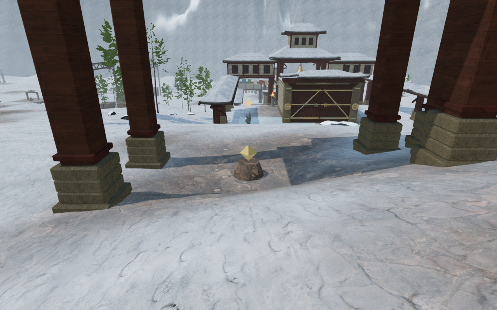
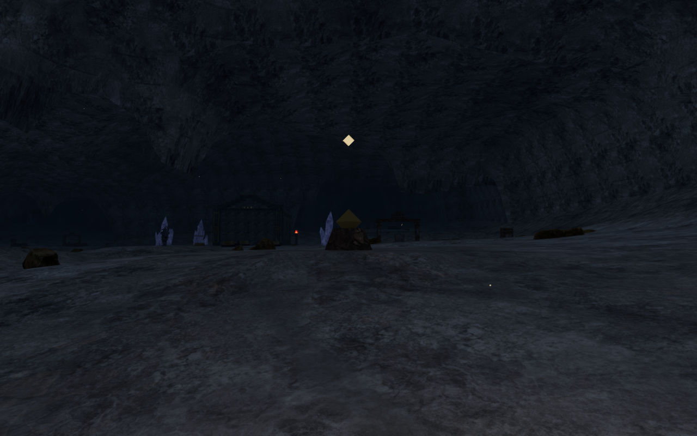
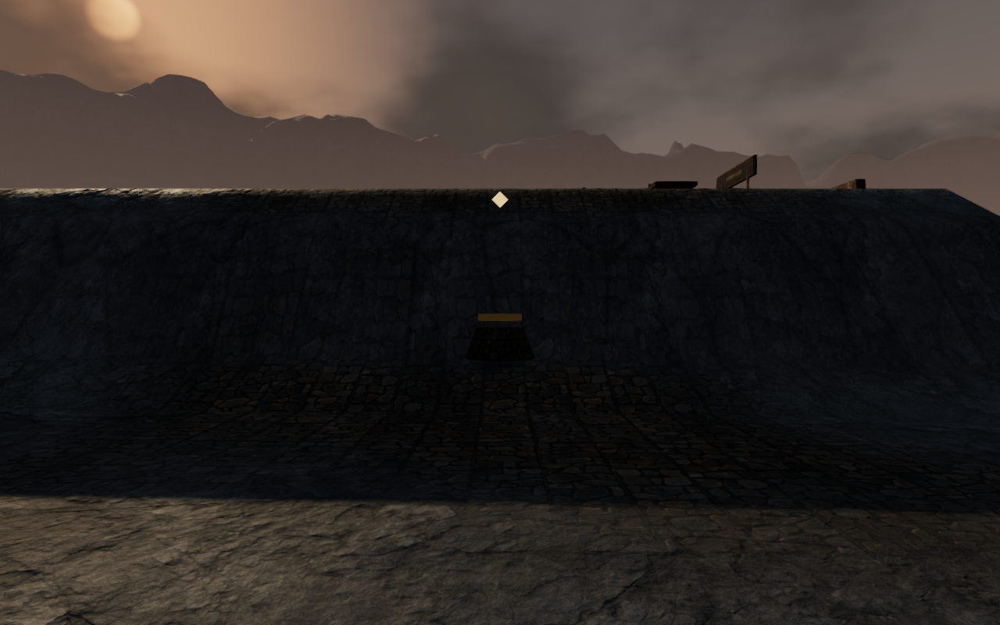

# Discovery landings and terrain joins

The sharp bank beside snow cache 16 now joins its neighbouring court through a
graded slope. The [court terrain pass](court-terrain.md) left this overlap open:
its old discovery mask protected a height switch inside the pickup area. The
same rule could preserve a cut directly beneath a note or cache in other
chapters.

The [terrain builder](../src/court-terrain.js) now gives each discovery a small
level landing at its existing centre elevation, with a feathered approach out to
5 m. Overlapping approaches blend together. The surrounding ground then joins
the court slopes through the existing relaxation pass. Main instruments, field
working floors, special flat foundations and complete water/lava footprints
keep their higher-priority masks.

At the recorded snow interval, from (322, 267.75) toward increasing z, the rise
falls from **4.34 m to 1.01 m over 1.75 m**. The pickup centre remains at its
previous elevation. Both directions across this join pass with the normal
character controller and follow camera.

## Measured landings

The table shows the largest adjacent-sample rise in each discovery's immediate
7 m neighbourhood. Every interval is 1.75 m, checked along both grid axes. These
are local measurements, not maximum slopes for entire chapters. Indices follow
the map's zero-based discovery order.

| Location | Largest rise before | Largest rise after |
| --- | ---: | ---: |
| Snow note 4 and neighbouring cache 15 | 2.58 m | 0.97 m |
| Snow note 8 | 2.28 m | 0.74 m |
| Snow note 10 | 1.50 m | 0.53 m |
| Snow cache 16 | 4.34 m | 1.30 m |
| Volcanic note 10 | 0.87 m | 0.31 m |
| Crystal note 10 | 0.94 m | 0.31 m |
| Crystal cache 17 | 2.41 m | 0.70 m |
| Eclipse note 7 | 1.66 m | 0.29 m |
| Eclipse note 11 | 1.19 m | 0.39 m |

All **90 pickup-centre elevations** in the five affected chapters match the
shipped `ae0ef6d` terrain. Nine samples across each 3.5 m square landing are
level at **88 of the 90 discoveries**. Two later special-terrain overrides still
alter the volcanic note 2 and eclipse cache 12 footprints; those are recorded
below.

The **14,013 main/field working-core samples across 173 pads** retain their
baseline heights. All **42 water-site records** are unchanged. The complete
desert, coastal and sky height arrays are also unchanged. No save fields,
discovery IDs, mesh counts, texture assets or dependencies change. The height
field is built once when a chapter loads.

## Verification

**664/664 tests pass**, including six new discovery regressions. The
[discovery tests](../tests/discovery-terrain.test.js) retain every pickup centre
and check level landings and bounded slopes at the ten recorded sites. Existing
working-floor, foundation, terrain-seam, swimming, water-border, lava-hazard and
cooled-footing checks pass. The production build succeeds with the existing
bundle-size advisory.

The browser review covers the following:

- **285 High observer captures across 143 discovery sites** in all eight
  chapters, from 288 attempted views. Volcanic note 2 lacks one requested side
  view; seven additional radial views inspect its track bank. Crystal note 4
  lacks both requested views and all eight additional radial attempts.
- **99 court overviews**, covering front/rear views of all 47 main courts in the
  affected chapters plus five Low views. The court and discovery captures were
  reviewed with the movement images. They cover these viewpoints and do not
  establish complete interior or route coverage.
- **Twelve assisted crossings at six sites**, covering 121.1 m and 1,782 movement
  frames. All arrive with health 100; 36 movement captures were reviewed. The
  snow, crystal and eclipse lines use the normal controller and follow camera
  without stepping enemy AI or combat. Some lines shift sideways to clear
  existing columns.
- **46,118 terrain rays at 362 support records** in the jungle, snow, crystal and
  eclipse scenes. Every sampled bottom remains buried in the rendered terrain.
  The separate jungle-root check retains at least 8 cm burial at 1,085,912 lower
  root samples on 752 interior and 1,046 outer trees. All 279 snow firs remain
  supported and outside walking cells. The support helper does not collect
  volcanic supports.
- Existing local control routes and regional approaches pass. All **42 open
  gate thresholds** remain traversable. All **84 gate sound sources** have a
  reachable listening stance with a clear sound path.
- Bird, wind, fire, drip and stream sources play through loaded, nonzero Web
  Audio voices. Reachable positions at horizontal radii of 8, 12 and 20 m
  produce decreasing distance gains. This verifies playback and attenuation;
  it does not assess the mix or objective music by listening.
- The eight crystal inspection eyes retain at least 0.4 m centre roof clearance
  in desktop, portrait and landscape formats. These 24 direct-focus captures
  check the roof, without opening the puzzle controls; the earlier
  [actual-dialog framing checks](resonance-framing.md) remain separate evidence.

Ten production cases restore disposable saves created before the terrain
change, using keyboard/High at 1280×800 and touch/Low at 540×900 in all five
affected chapters. All twenty native movement legs retain health 100. Reloading
after each leg preserves the complete saved data except play timestamps; no
camera correction is needed. Thirty arrival/movement captures were reviewed.

Two additional production cases collect snow cache 16 with native keyboard Use
and touch Use. Both retain health 100, receive one medical supply, and preserve
the found item and complete save on reload apart from timestamps. Six collection
and reload captures were reviewed. All twelve cases load the final build's four
JavaScript/CSS assets without a development hook. They report no browser errors
or warnings; the ten movement cases also check horizontal overflow. Enemy combat
is suppressed in the fixtures to isolate input and persistence.

The reusable [discovery observer](../scripts/inspect-discovery-terrain-browser.js)
reports blocked viewpoints rather than rendering through obstacles. Raw
captures, profiles, logs and disposable saves remain in the ignored staging
folder.

## Remaining observations

The later [grounded discovery pass](discovery-props.md) moves volcanic note 2
and eclipse cache 12 clear of these special-terrain footprints and repairs
crystal note 4's chamber overlap. The observations below describe this terrain
milestone's remaining work; the surrounding special banks and vault edges
continue under VA-15.

VA-15 stays open for the special terrain around volcanic note 2 and eclipse
cache 12. Their sampled landing variations remain **3.19 m and 0.53 m**,
respectively, unchanged from the baseline. The volcanic views show the note
partly buried in the steep side of the tempering-track bank. The orbit-vault
edge near the eclipse cache retains a 6.84 m rise over one 1.75 m interval.
These later overrides need a layout repair that preserves their puzzle floors
and traversal surfaces.

Crystal note 4 sits beside main court 4. Its centre is not walkable in fresh
progress, and the observer cannot find a clear radial view. This is a placement
and coverage finding, not evidence that every progress state is unreachable;
open-state inspection and actual collection checks remain necessary.

The survey also records VA-25: notes and caches repeat the same simple plinth
and floating gold shape across all chapters, often on sparse paving. Movement
and the collection setup can put the explorer inside the plinth. Their physical
clearance, construction and regional composition need a further pass. The
[world visual audit](visual-audit.md) remains open; this milestone does not
establish full-world polish, consumer hardware performance or AAA graphics.
