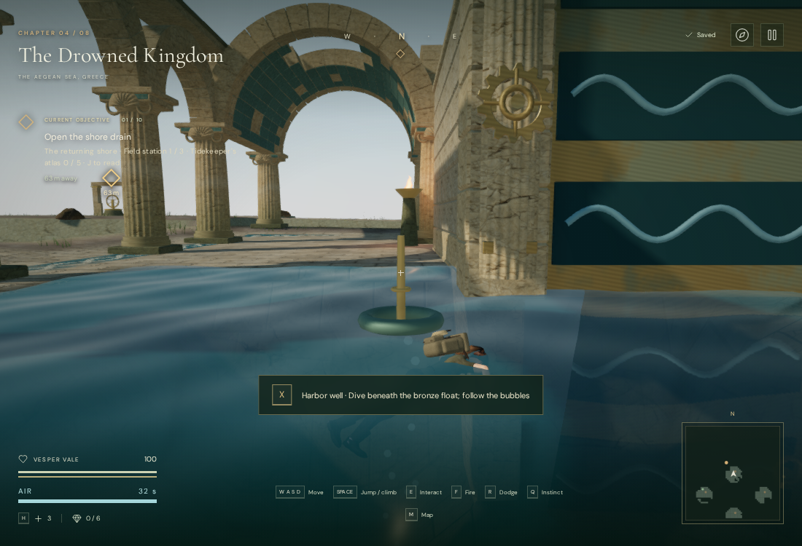
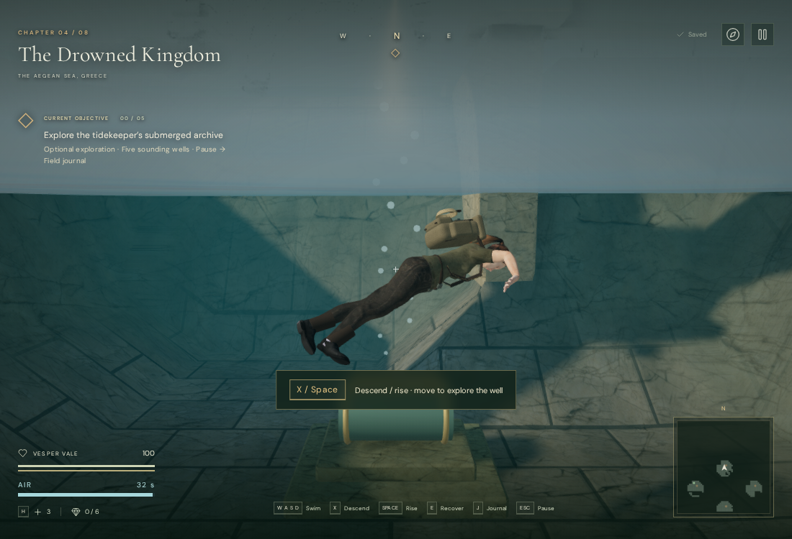
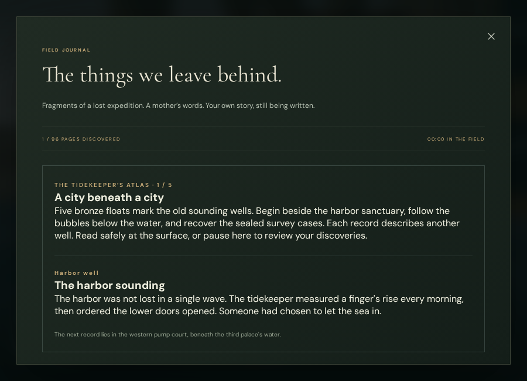

# The tidekeeper's submerged archive

The Drowned Kingdom now has a second exploration goal beneath its palace courts:
recover five sealed survey records and reconstruct the story of the city's
evacuation. Bronze floats identify the sounding wells. Bubble trails lead down to
banded cases on stone benches. Each recovered record names another well and adds
a permanent journal entry; the five records can be found in any order.

The former surface-only reservoirs now have five different excavation depths,
from 5.8 to 9 metres. Their existing pressure circuits still lower the water by
1.8 metres. The cases remain submerged after drainage, with open vertical escape
paths. This adds vertical exploration and a chapter-specific discovery thread;
it does not establish approximately one hour of play or a finished underwater
level. The later [memorial gallery](sunken-gallery.md) adds an enclosed route with air
bells beneath the first well. Currents and further submerged traversal remain
future work. The surface-recovery behavior below describes the five open wells;
the gallery uses its own saved breathing anchors.

## Playing

- Enter a deep well with free hands. Hold **X** to descend, **Space** to rise, and
  use the movement controls to swim. Releasing both vertical controls holds depth.
  Diagonal motion is normalized; swimming into cover cannot bypass collision.
- On touch screens, **Dive** replaces Fire while swimming. **Jump** becomes
  **Rise** underwater. Separate held fingers retain their controls when another
  finger releases. Carrying a field component prevents a dive until delivery.
- The air meter holds 32 gameplay seconds. Its final ten seconds turn amber and
  show a warning. Empty lungs initiate an upward recovery stroke and expose the
  explorer to damage. The surface replenishes air; another dive needs at least
  ten seconds in reserve. Pauses stop breath consumption.
- Approach a case in three dimensions and use **E / Use** to recover its record.
  The plaque, float and bubble trail disappear, and the positioned source stops.
  Read the record with **J**, or **Pause → Field journal**. Reading pauses play.
- Records save immediately to the chapter's local-storage state. Reloading a dive
  returns the explorer to the current water surface with full air and retains
  discoveries, field work, health, supplies, settings and recorded play time.

## Presentation and sound

The camera follows closer to the submerged torso and may pass below the surface.
Immersion changes the fog and background to water colors and hides the distant
sky. Leaving the water restores the exact chapter fog/background. Water renders
its underside in one double-sided pass. Existing shadows, material detail and
the explorer's procedural swimming pose remain in use.

The archive's [revised bubble trails](archive-bubbles.md) have transparent
centers, soft rims and source/surface fades, replacing the solid polygon beads
visible in the earlier captures above. Their rise speed stays consistent across
well depths, and they fade near the camera.

Each unrecovered case has an original synthesized bubble voice at its actual
depth. Its linear falloff extends from 1 to 16 metres and participates in the
shared twelve-voice selection. Source height does not follow the surface marker;
the sound comes from the visible bubbles beside the case. The listener follows
the swimmer's head height.

Underwater, environment/effect buses smoothly filter at 700 Hz, and music at
950 Hz. The water chapter's harmony continues while its foreground melody and
danger pulse give way to the quiet pad and bass arrangement. Surfacing restores
the ordinary mix and current objective arrangement. No new recordings, downloaded
assets or dependencies are required. The existing palace stone and character
attribution remains in [asset credits](asset-credits.md).

## Verification

The full automated suite passes **291 tests**, including descent, floor limits,
neutral buoyancy, diagonal speed, walls and overhead cover, breath exhaustion,
recovery ascent, safe saved arrival, archive normalization, camera immersion and
five persistent records. The release build passes with the existing large
Three.js-chunk advisory.

Assisted browser checks entered all five floats and used the real chapter's
movement/collision methods to descend, recover each case and surface. All ten
checks passed, before and after drainage, at full health. All 36 hydraulic
control approaches, 27 pump listening paths and 36 local walking routes between
tablets and controls remained available. These checks supply starting positions;
they are not blind playthroughs or evidence of human difficulty and duration.

Performance and High surface/underwater views linked their shaders. The final
1100 × 750 High harbor views reported 1,081 calls / 1,686,719 triangles at the
surface, and 771 calls / 1,347,373 triangles underwater across the rendering
passes. The browser used software graphics and reported ReadPixels stalls.
These counts are not supported-device frame-rate measurements or AAA evidence.

Native keyboard bindings accepted descent, ascent, record recovery and journal
access in an assisted development setup. A separate production run used its
normal animation loop: native X descended, native E recovered the harbor record,
and Escape saved the dive. The save contained the record, 93 health and
the recorded active play time. After reload, the chapter and settings matched exactly
apart from the expected last-played timestamp; the surface objective and full
32-second air reserve returned, and the journal retained the record. The recovery
check simulated an unfocused document to pause immediately after loading. The
release exposed no development hook and reported no failed assets or JavaScript
errors.

Native multi-touch input at 390 × 844 accepted Dive with movement, retained Dive
after the movement finger released, and retained Rise when the Dive finger
released. The pause-menu journal remained readable with no horizontal overflow.

Offline audio used the actual filter functions at 22,050 and 48,000 Hz. A 4 kHz
tone fell to approximately 2.47% and 2.97% of its surface RMS and returned to
within 0.01% after surfacing. Same-buffer HRTF renders of the bubble voice
measured RMS 0.0137136 at 1 m, 0.00685681 at 8.5 m, and zero at 17 m. These prove
filter/falloff behavior, not subjective sound quality or the final mix.

Loading another chapter disposed all 71 inspected archive geometries and
disconnected all three old immersion filters. The game retained no archive sites,
bubble sources, diving state or immersed fog state. Fresh temporary browser
contexts contained the test saves and were closed after verification.

The original eight-level scope, AAA graphics, consumer-device performance,
subjective listening review and approximately hour-long chapter pacing remain
tracked in [production status](production-status.md).
