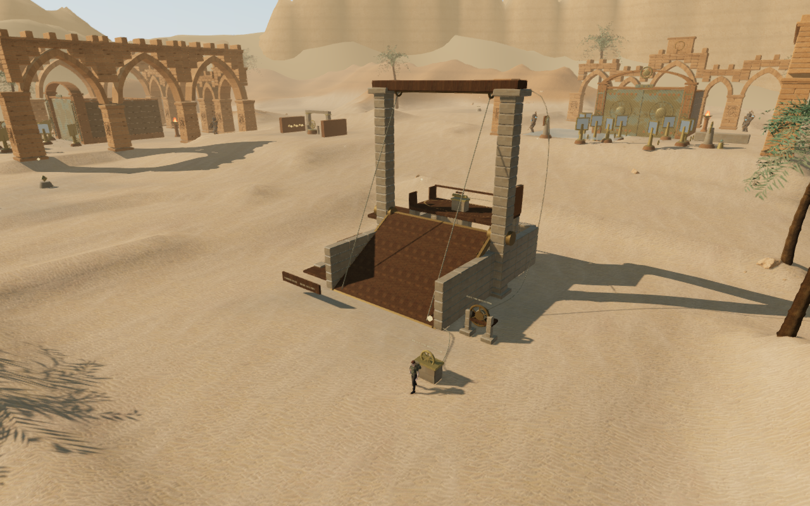
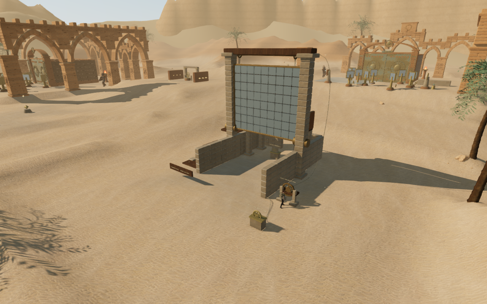

# The eastern reflector

The sixth field mission in **Beneath the Sands** now restores a physical reflector.
Its three scattered winches become a brace, an elevated locking pin and a
threshold beneath a hinged mirror, grouped in the existing eastern clearing.

Use **E / Use** at the lower brace. Walk up the reflector's timber back, then
use **Space / Jump** to cross the gap to the rear gallery. Release the rear pin
between dart volleys; its east parapet fires across the gallery, and releasing
the pin disables the trap. Jump west through the rail opening, descend the
service platforms and return to the hauling wheel on the eastern side.

**E / Use** raises the reflector over 4.4 seconds. Walk beneath the seated mirror
and read the eastern threshold with **E / Use**. The sector's field gate opens,
and the objective returns to its sunlight puzzle. This retains three field
actions for the sector.

These are actual 1280 × 800 High browser renders from the assisted route.
The documentation images are lossless conversions of their captured pixels.

## Construction and persistence

An eight-metre hinged panel has a walkable timber back, 72 reflective metal
plates and a bronze frame. Coursed stone bearings, an overhead timber, paired
sheaves, a connecting shaft, hauling ropes and a rotating wheel and drum carry
the motion. The rear gallery is 4.5 metres above the clearing, with a westward
jump to three descending service platforms. Low walls frame the entrance;
a rear service opening provides an exit if the player drops below the gallery.

Collision follows the closed ramp and static platforms. A conservative swept
volume keeps the character clear during hauling; the raised panel preserves
the ground passage beneath it. Camera bounds follow the rotating timber.
Walls, platforms and the panel also obstruct sight and positional sound at
their elevation. The upper pin and lower threshold have separate height checks
so their interaction prompts do not overlap vertically.

Only a fully seated reflector is saved as raised. Pausing freezes an unfinished
haul and silences its emitters. Reloading an interrupted haul keeps both releases
and restores the closed panel so the wheel can be used again. Older saves that
already completed the field sequence or passed its sector receive the raised
reflector. Each chapter retains its own progress in local storage.

## Sound and checks

The mechanism uses three positioned emitters: one beside the drum and one
30 cm outward from each overhead sheave, keeping the source outside its casing.
They reuse the original hoist synthesis, HRTF positioning, linear distance
falloff, obstruction filtering and saved mix controls. All three voices were
present during the checked haul and absent at rest and on pause. The desert
score selects its lifting task during motion and returns to the field task
afterward.

Distance-only renders of the generated hoist buffer measured RMS 0.219427 at
the near distance and 0.109714 halfway to the range limit. The sheaves use
2 m / 27 m near and maximum distances, with silence measured at 28 m; the drum
uses 1.2 m / 20 m, with silence at 21 m. These checks verify amplitude behavior;
they do not establish subjective sound or music quality.

All **499 automated tests pass** in 86.77 seconds. Five new checks cover save
normalization and older progress, ordering, hauling and pause, the complete
physics route, actual ramp-surface contacts, camera/sight clearance and the
elevated dart emitters. The release build passes in 5.04 seconds with the
existing large-chunk advisory.

A continuous assisted browser route used actual player physics and native E
and Space input to brace, ascend, jump to the pin, jump west, descend, haul,
cross the threshold and leave at **100 health**. Traps, projectiles and enemies
continued updating. The helper supplied movement directions and the solution;
this is not a blind playthrough or a duration measurement. The reusable helper
is [`verify-reflector-browser.js`](../scripts/verify-reflector-browser.js).

High, Balanced and Performance views linked all active shaders. The checked
raised High overview submitted 2,058,961 triangles and 926 calls across its
rendering passes; Performance submitted 476,054 triangles and 298 calls.
These include the surrounding world and are not frame-rate measurements or
matched measurements of the change's cost. Changing chapters disposed all
18 inspected reflector-root geometries and eight materials, cleared the
mechanism state and removed its three emitters. Development checks reported
no console errors, warnings or failed asset requests.

Seven production saved-state checks pass: interrupted hauling, a seated raised
panel, desktop keyboard and muted 540 × 900 Performance touch jumps to the rear
pin, keyboard and touch passages to the threshold, and an older completed field
save without reflector state. The jumps land on the 4.5-metre gallery and both
passages stay at ground level, all at 100 health. Reloads preserve the complete
saved state apart from the last-played timestamp. These checks use prepared
saves at each approach; the continuous route was checked separately above.
The native jump check holds movement through a timed jump arc before releasing
it; the pin prompt can appear before landing.

The release exposes no development hook, loads the current build's four JS/CSS
files, and reports no console errors, warnings, failed assets or page overflow.
Keyboard and portrait gallery captures were also visually inspected.

The geometry, signs and mechanism code are original project work. They reuse
the [credited local materials](asset-credits.md#environment-scans-and-pbr-materials)
and existing synthesized sound. No external assets or dependencies were added.

The broader campaign still needs blind human pacing tests, subjective music
and sound review and broader device/browser coverage. Approximately one hour
per chapter remains unverified, and the requested modern AAA graphics standard
is not met.
