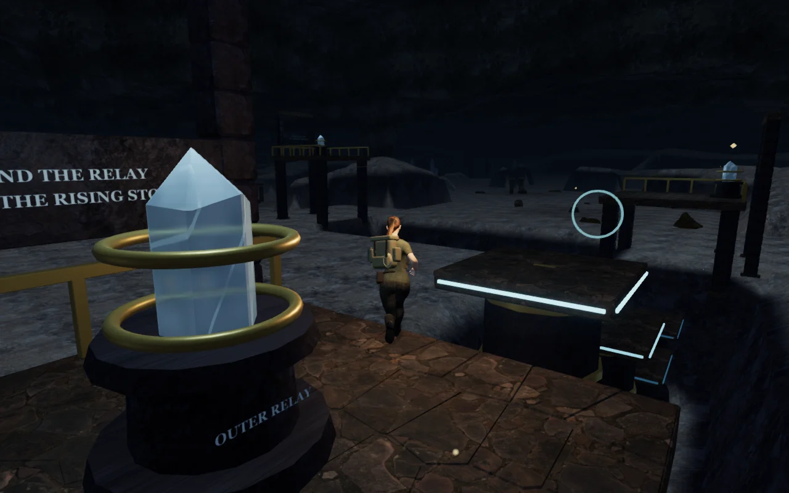
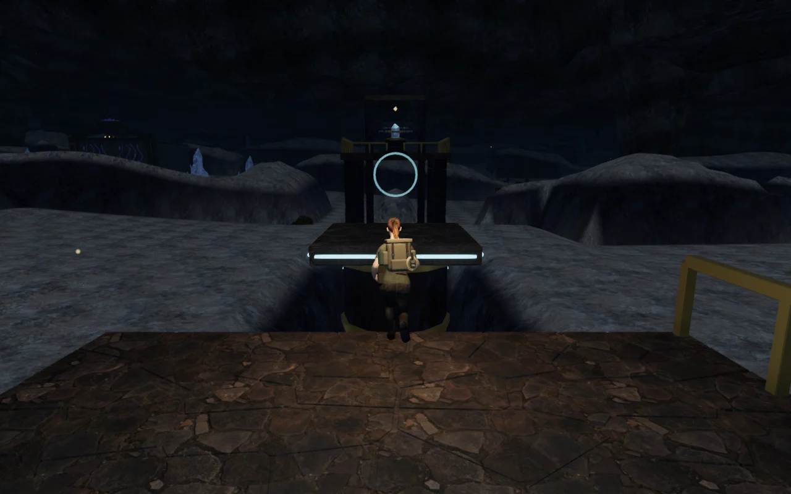
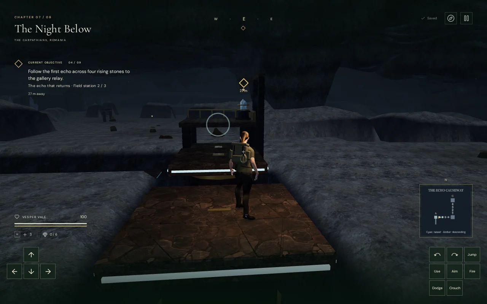
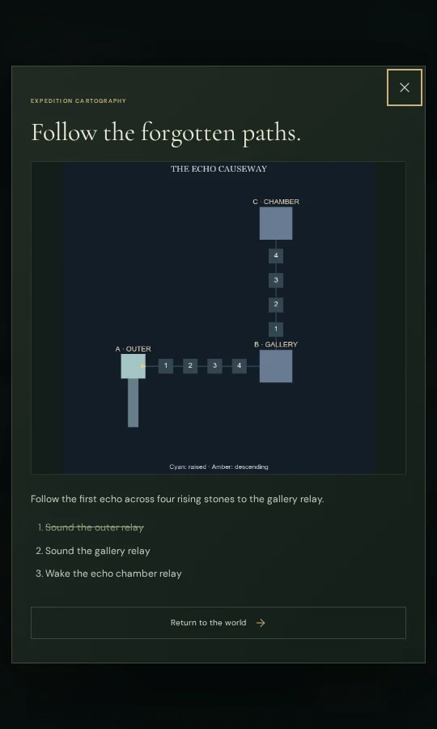

# The Echo Causeway

**The echo that returns**, the fourth objective in **The Night Below**,
now crosses a recessed, L-shaped chamber. Climb the southern stair, sound the
outer relay and follow four rising stones across the first channel. The middle
relay holds that crossing and sends another pulse up four progressively higher
stones. Sound the chamber relay to hold the entire return route.

This replaces that objective's three scattered resonance stations while
retaining their identifiers and the existing resonance-court puzzle afterward.
Its timed crossings replace the sector's generic sweeping beam; the three
relay galleries are safe places to plan a crossing.

## Crossing the chamber

Use **E / Use** at each relay. Move with **WASD / touch directions** and jump
with **Space / Jump** from the edge of each raised stone. Follow stones 1–4,
then reach the next gallery before repeating the pattern. The second crossing
climbs by 0.6 m per stone. Each gap is 2.4–3.2 m wide.

A pulse reaches consecutive stones 0.9 seconds apart. Each stone rises over
one second, holds for 5.2 seconds, then descends over 1.2 seconds. Cyan inlays
show the raised surfaces; amber flickers during the final warning and descent.
Numbered inlays, mounted instructions and the **M** route map make the sequence
usable with audio muted. The map pauses the crossing while open.

A relay can be sounded again after a missed attempt. Reaching the middle relay
permanently holds the first crossing, recalling any descended stones smoothly.
The chamber relay does the same for the second crossing. Return over both
held crossings and descend the entrance stair to continue to the resonance court.

## Construction, persistence and sound

The route uses a 28-tread stair, three fitted stone galleries, twelve main
support piers, portal frames, bronze rails, quartz relays and eight telescoping
stone columns. Two recessed channels sit beneath the moving stones. A local
roof blend leaves headroom over the new upper route while retaining the sealed
world edges. Nearby loose rocks and mineral clusters leave the crossing clear.

Each moving stone carries a grounded rider; jumping releases that support.
Missing a crossing costs eight health and returns the explorer to the last
earned relay gallery. A save made during a jump or on a moving stone also
restores that fixed gallery, preserving completed relays. Pulse timing is
transient: sound the relay again after reloading. Valid stair, gallery and
ordinary ground positions retain their supported height. Older completed
missions restore held crossings.

Eleven spatial sources follow the three relays and eight moving inlays.
The platform sources use a 2 m near distance and 20 m maximum range; relays
reach 28 m. Gain follows their pulse or held state, with a quiet residual drone
at completed relays and stones. The existing crystal score uses its resonance
arrangement in this chamber. Pause freezes the pulse and removes the causeway
voices; music and ambience retain their separate, saved mix controls.

## Verification

- **537 automated tests pass** with `node --test --test-concurrency=2 tests/*.test.js`.
  New checks cover the complete outward and return routes using real character
  motion, pulse ordering, warning intervals, rising riders, pause, smooth recall,
  gallery access, body and ray collision, falls, save normalization, supported
  reloads, roof headroom and the foundations of other discoveries. The existing
  cavern tests also verify that all world edges remain sealed.
- A continuous assisted browser route passes at full health, from one seeded
  entrance through the stair, both crossings, all three relays and the return
  to the trail. It runs normal player, guardian, hazard and camera updates;
  it does not relocate the explorer between route steps. The reusable helper is
  [`scripts/verify-echo-causeway-browser.js`](../scripts/verify-echo-causeway-browser.js).
  This is an integration check, not a blind human playthrough or a pacing result.
- Seven production cases pass with the development API absent: the outer relay,
  a keyboard jump followed by pause and fall recovery, a moving-stone save,
  the ascending crossing's middle-gallery recovery, muted portrait touch input
  with simultaneous movement and jumping, the chamber relay, and an older
  completed save. Each case preserves its resulting progress after reload.
- High, Medium and Low render without shader-link failures. The fixed wide
  view of the completed chamber submits **774 calls / 869,903 triangles** on
  High, **524 / 578,533** on Medium, and **493 / 535,494** on Low. These are
  whole-scene rendering counts for one view, not frame-rate or device guarantees.
- The nearest raised inlay produces an unoccluded positioned voice in the live
  crossing check. Two isolated audio renders, using the platform and relay
  distance settings, measure half the near-source RMS at the attenuation
  midpoint and silence beyond their maximum range. The resonance music task,
  pause silence and source cleanup pass. Subjective listening quality remains
  unverified.
- Leaving the chapter disposes all **41 tracked causeway-root geometries and
  17 materials** exactly once and removes all eleven causeway emitters.
- The build passes with the existing advisory about chunks larger than 500 kB.
  The checked production files are `index-Ld-iwlkH.js`, `index-DYq9hjRy.css`,
  `three-PnK6XMTC.js` and `game-B26t-e_2.js`. Final browser runs report no console
  errors, warnings or failed resource requests.

All artwork is original project geometry and shaders using existing credited
stone maps and quartz materials. The sound uses the project's existing crystal
synthesis. No external assets or dependencies were added. These are captures
of the running game, converted to WebP for this guide.

Approximately one-hour chapter pacing, modern AAA graphics, subjective audio
quality and broad browser/device coverage remain open production requirements.
