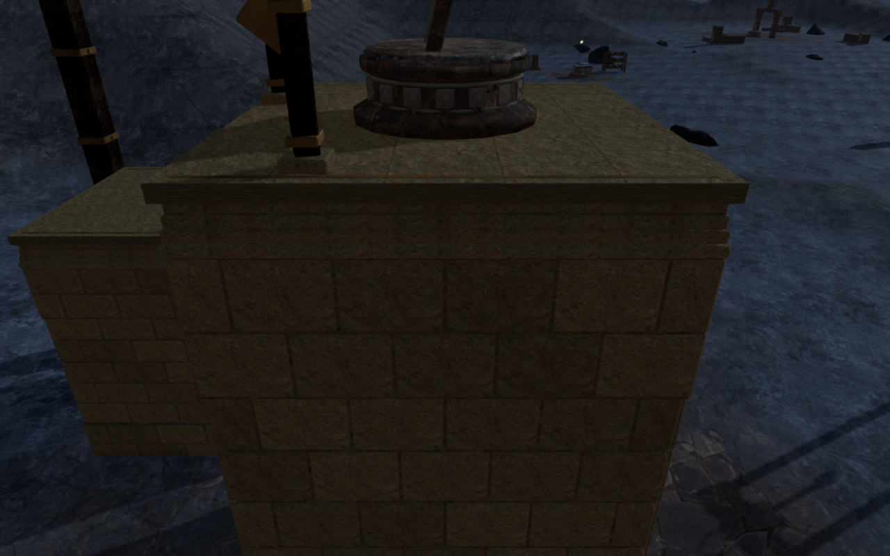
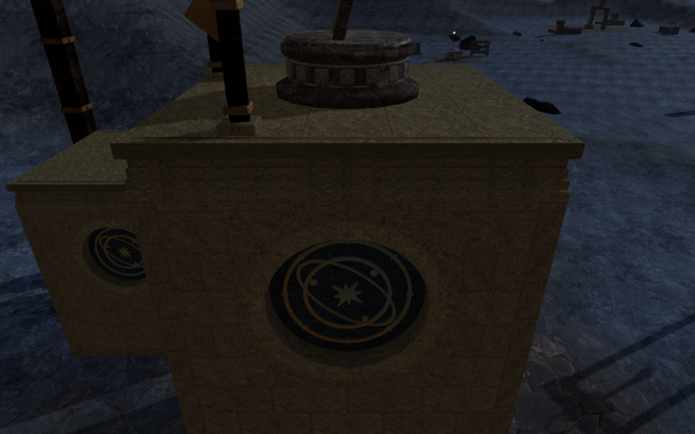
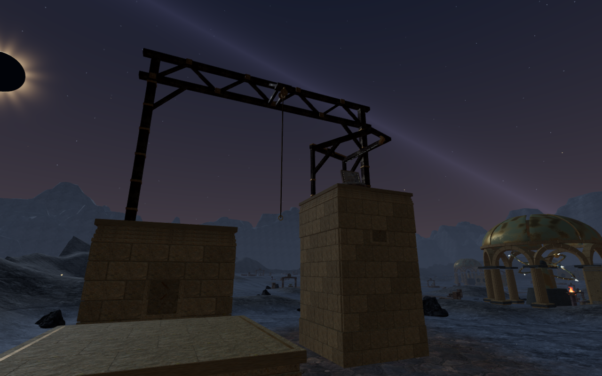
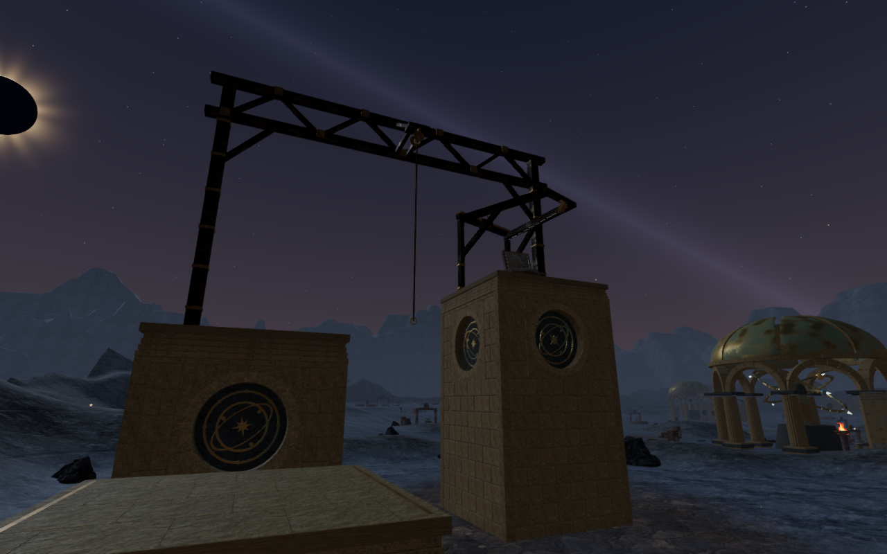
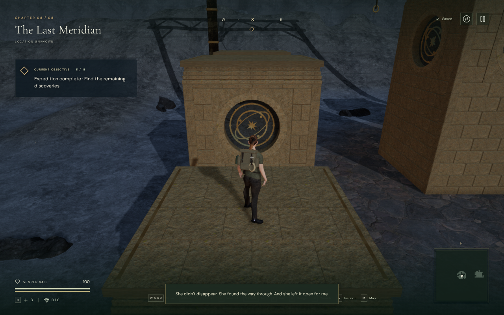
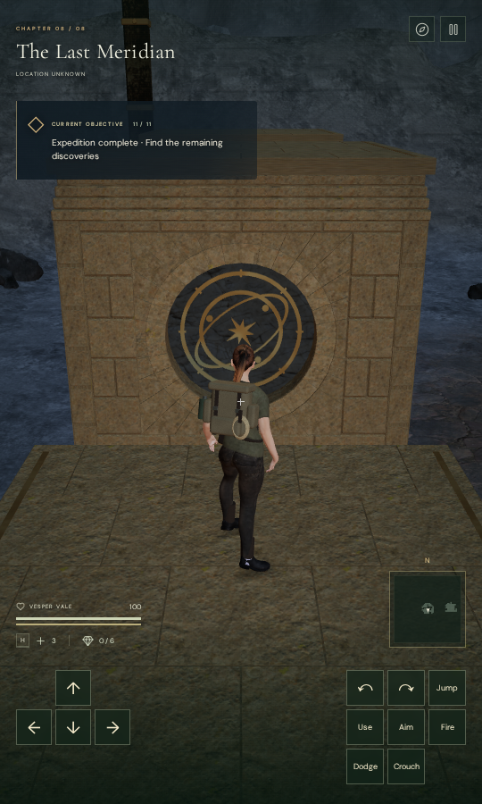

# Observatory climbing piers

The Last Observatory's ten climbing piers now carry forty circular stone
registers. Fitted radial surrounds frame recessed, closed stone backs. Seated
bronze dials combine graduated circles, angled orbital ellipses and eight-point
stars, using the observatory's existing patinated metal. Short entrance piers
use smaller registers than the summit piers.

The wider observatory still needs composition work. These faces connect the
climbing construction to the astronomical architecture; the repeated five-pier
arrangement and sparse surrounding terrain remain visible in the course views.

The summit comparison uses exactly the same camera eye and target at High
quality. These actual game captures were converted losslessly to WebP,
preserving dimensions and decoded RGBA pixels.

The wider course comparison uses the same authored course observer.

## Construction and geometry

`src/eclipse-climbing-piers.js` supplies the fitted radial stones, continuous
square-to-circle bearings, closed recessed backs and bronze ornament. Buried
corner bearings and a full foundation bed support the wall facing. The circular
back sits about 370 mm behind the facade; the bronze back vertices seat between
14.496 and 23.010 mm into that stone.

The bronze rings have explicit closed rims and backs, smooth radial rim
normals, flat face normals and open centers. The isolated geometry regression
checks triangle orientation, welded edge ownership and both face directions.
Additional tests cover 1,960 backing rays, 3,840 radial shoulder rays and actual
delivered bronze back records after batching.

Capture review found obsolete rectangular decorative panels still covering
some new dial centers. Retiring those panels preserves the later ornament seed
sequence. A 1,320-ray regression now verifies that the center and graduated
outer ring on all forty faces remain exposed.

Complete landing roofs, hoist machinery, ledge support and collision footprints
retain their established construction. Exact indexing reduces fixed/detail
vertex records from 234,000 to 133,055 on `field-3-0` and from 233,424 to 132,623
on `field-3-2`. Expanding the indices reproduces all 5,186,976 triangle attribute
components byte for byte. Previous mountain, coastal, volcanic and crystal
reports retain identical counts and hashes. Including the remaining machinery,
the complete courses have 163,389 and 162,957 records, within the existing
180,000-record limit. These are geometry counts, not frame-rate measurements.

Actual browser geometry checks cover all ten piers:

| Probe | Samples | Result |
| --- | ---: | --- |
| Full standing roof grids | 4,410 | No misses; maximum height difference 5.001 mm |
| Undersides across full footprints | 1,210 | No misses; all sampled undersides at least 210 mm below terrain |
| Register center areas | 360 | No misses; approximately 370 mm of recess |
| Dense grids fitted to circular profiles | 3,208 | No misses; recess between 369.995 and 370.013 mm |
| Actual bronze back vertex records | 18,900 | No misses; burial between 14.496 and 23.010 mm |

All eighteen baseline and 46 final construction captures are reviewed. The
final set includes four sides of each pier, both complete courses, and entrance
and summit faces on Low quality. Sixteen before/after face observers retain
exactly the same eye and target. Some external observers sit behind or inside
neighboring piers or behind hoist posts, so those views cannot alone establish
front visibility; the independent geometry and visibility probes cover the
obscured faces. Shader programs link and browser warning/error reports are empty.

## Traversal and persistence

Both updated routes complete their ground approach, successive mantles, jump
gap, moving-rope crossing, summit, unlocked return cable and ground walk back.
The checks use completed-expedition fixtures and controller-assisted movement
with enemies removed; they do not establish encounter balance or a full
campaign playthrough.

| Course | Camera updates | Reviewed captures | Minimum camera arm |
| --- | ---: | ---: | ---: |
| `field-3-0` | 3,394 | 47 | 2.805 m |
| `field-3-2` | 1,614 | 27 | 4.480 m |

Across 5,008 updates the explorer retains health 100 and full opacity. All 74
final route captures are reviewed. Recorded player and camera positions, look
angles, supported height, grounded state, rope/cable state and field progress
match the preceding scanned-rock-contact milestone at every capture.

The production build passes native keyboard/High and portrait touch/Low
checks. Both climb to the first 2.8 m roof, crouch, change the camera heading,
descend to ground and recover through localStorage reloads. The complete store
remains stable apart from timestamps, including chosen look angles; neither
final case needs an arrival correction. A second reload is idempotent. All
fourteen native captures are reviewed, without failed assets, browser
warnings/errors, horizontal overflow or a development hook. The loaded
JavaScript/CSS assets match the final production build.

An initial fixed-interval touch descent ended on the roof and failed the ground
assertion. The verification helper now checks saved elevation after bounded
intervals and continues only while still elevated; the final keyboard and touch
cases both reach ground in their first interval. This changes the private
observer, not game movement. The final checks above use that corrected helper.
The initial keyboard departure also selected a different arrival heading.
An independent terrain-only replay reproduces that exact 30-degree correction:
the preferred arm measures 4.347 m and the selected clear arm measures 5.372 m.
The final two departures retain their chosen headings without corrections.

## Verification limits

The 813-test campaign suite passes before the final retirement of the obsolete
rectangular panels. After that final correction, all 43 focused checks pass:
twenty climbing construction/contact/audio checks and twenty-three traversal,
return-cable and observatory checks. The suite now contains 814 tests; this
milestone does not claim a full 814-test run. The final production build passes
with the existing large-bundle advisory.

Verification uses the shared nine-of-sixteen CPU allocation, below the owner's
60% limit, with at most two test workers and one browser. Production browser
checks run after the test, indexing and build workers finish. Temporary workers,
browsers and preview servers are released after their last check. Private
fixtures, captures, helpers and installed dependencies remain excluded from
publication. No external assets, recordings or dependencies were added.

The five-pier arrangement, sparse landscape, broader architecture and lighting,
worldwide body contact and object placement still need review. Listening quality
and real-device acceptance also remain open. There is no minimum chapter
duration, and this work makes no commercial AAA claim.
