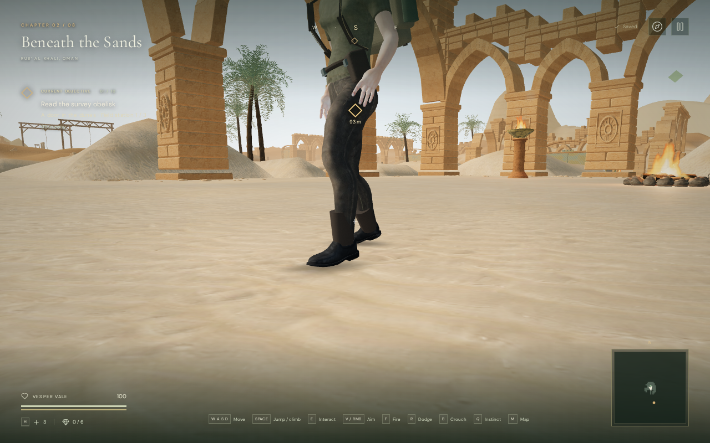
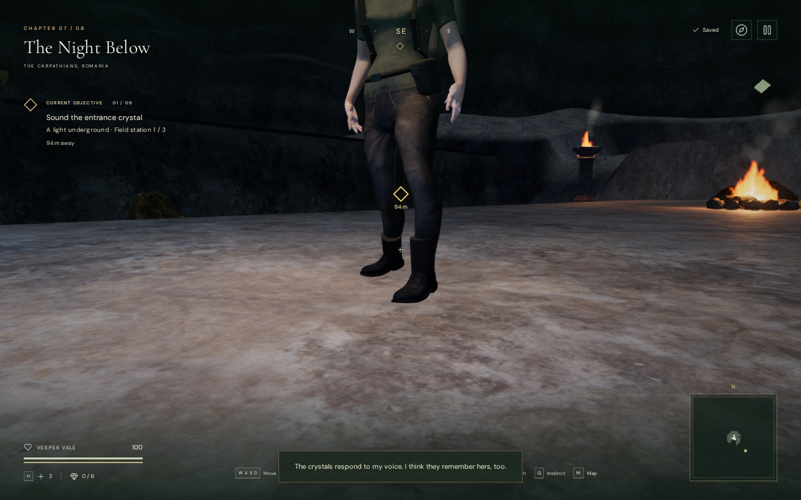
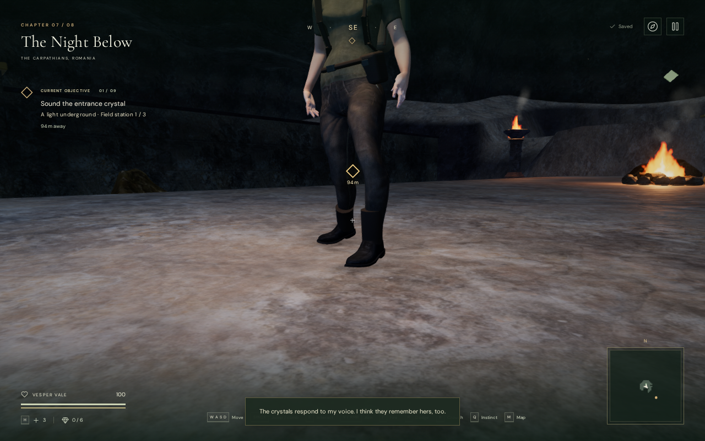

# Explorer ambient foot contact

Soft shading now follows the explorer's animated boot soles on all three
graphics settings. This gives a clearer contact cue on bright ground in
Performance mode and in the cavern, where there is no directional sun shadow.
The effect is intentionally local and remains subtle at normal camera distance.

## Matching views

These 1280 × 800 Chromium captures use the same pose, camera, chapter time and
settings within each pair. The baseline hides the new meshes; the revised view
shows them. Global ambient occlusion and directional-shadow settings are the
same. The cameras are assisted close inspection views. Lossless WebP conversion
preserves the captured pixels without retouching.

| Desert, Performance before | Desert, Performance revised |
| --- | --- |
|  |  |

| Cavern, High before | Cavern, High revised |
| --- | --- |
|  |  |

## Behavior and cost

Each patch follows samples from the delivered, animated boot mesh. Its small
grid fits the walking support beneath it, fades as the sole rises, and omits
triangles spanning missing support or an abrupt ledge. Submerged supports,
jumping, swimming, climbing, rope/cable rides and dodging suppress it. The
helper owns two geometries and one shared material and releases them when
the chapter's renderer is disposed.

This is an approximation of blocked ambient light, not a directional shadow
or a lighting simulation. It does not alter the character's bones, controller,
collisions or sound emitters. Each fully visible patch has 49 vertices and
72 triangles. Eight matching desert/cavern comparisons across High/Performance
and wide/close views each added two draw calls and 144 submitted triangles.
There are no new texture downloads or external assets.

A separate Radeon 780M / ANGLE Vulkan benchmark used a fixed camera at each
chapter's starting area, 1280 × 800 and pixel ratio 1. Each quality ran four
four-second samples in before/after/after/before order with 1.5-second warm-ups.
The baseline skipped both contact calculations and drawing. The actual game
loop continued, so environmental animation and scheduling still varied.

| Chapter / quality | GPU mean before / revised | GPU samples before / revised | Frame wall time before / revised |
| --- | ---: | ---: | ---: |
| Desert / High | 12.931 / 12.765 ms | 266 / 245 | 29.617 / 30.495 ms |
| Desert / Performance | 5.534 / 5.514 ms | 459 / 454 | 14.628 / 13.998 ms |
| Cavern / High | 23.333 / 21.985 ms | 147 / 150 | 53.795 / 52.725 ms |
| Cavern / Performance | 10.352 / 10.184 ms | 244 / 239 | 32.111 / 32.810 ms |

Means are weighted by sample count. No GPU disjoint events or browser
warnings/errors occurred. The High cavern baseline GPU means ranged from
22.282 to 24.289 ms; frame wall times also varied substantially. These samples
do not establish a speed improvement or equivalent performance. Frame wall
time includes renderer submission and driver waits, not isolated CPU execution.
Broader device support and a frame-rate guarantee remain unverified.

## Verification and remaining limits

All 471 automated tests passed in 171.1 seconds. The production build passed
in 5.16 seconds; Vite reported its advisory for bundles larger than 500 kB.

Hardware browser checks covered all eight chapters at High, Balanced and
Performance settings, plus High close views, a raised desert terrace and a
snow slope: 34 views in total. All shaders linked, with no browser warnings,
errors or failed assets. Drawn contact vertices remained within 0.2 mm of the
intended 4 mm support offset. Each of seven observed chapter changes released
both old contact geometries and the shared material exactly once.

New automated checks cover slopes, facing, missing supports, ledges, lift
fading, traversal, water and resource disposal. A delivered-model regression
checks 360 animated poses across idle, walking, running and crouching on three
grades. It compares the patches with independently sampled full soles and
verifies that applying the visual effect preserves the root and every bone's
position and rotation.

Native keyboard checks exercised jogging, sprinting, crouched travel, stopping
and a jump on a prepared clear desert lane. All finished at 100 health with
positioned footstep events. The jump's 18 sampled airborne frames hid both
patches, and the settled stance restored them. Running and crouching also
produced foot-lift fading during travel. These are short regression routes,
not chapter playthroughs.

The built game passed native keyboard sprinting over 4.429 metres and a muted
540 × 900 two-finger move/crouch over 1.141 metres. Both finished at 100 health
and retained exact local saved data on reload, excluding last-played timestamps.
The checks used the normal interface with no development hook, found no
horizontal overflow or browser warnings/errors, and loaded the exact JS/CSS
filenames emitted by the new build.

The grid uses the controller's support queries, not a ray cast against every
rendered surface; complex edges can make it shrink or disappear. It does not
remove all apparent foot separation, animation sliding, sun-shadow bias or
scene lighting limitations. The [production audit](production-status.md)
still records AAA graphics as unmet, with blind human chapter pacing,
subjective listening and broader browser/device coverage open.
