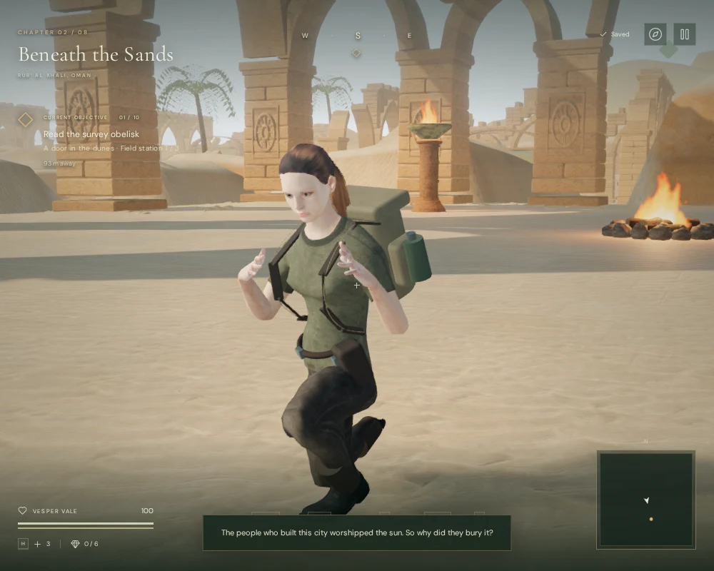

# Explorer crouch hand poses

Crouching now lowers Vesper's hands to waist height, brings the elbows closer to
the body, and turns the palms and fingers into a relaxed pose. Previously, the
wrists stayed almost level with the shoulders and retained the imported clip's
raised, spread fingers. The smaller walking arm swing now follows the walking
clip and fades when collision-resolved movement stops.

`src/explorer-crouch.js` applies a blended pose to the arms, wrists and finger
joints. It uses the delivered hand's anatomical frame, shares axial rotation with
the forearm, and bends each finger without changing bone lengths. The original
joint rotations are restored before the next animation frame. A later torch or
mechanism grip can take over; its restoration runs before the crouch restoration
to unwind those layers in reverse order.

## Matching browser views

These assisted High-quality views use the same 1,000 × 800 viewport, player
position, animation sample and camera. They show the delivered character in the
desert chapter, with ordinary scene lighting. The comparison changes the hand
pose; the underlying crouched leg pose is the existing terrain-fitted animation.

In this idle sample, the wrists changed from about 6.1–6.6 cm below their
shoulders to 25 cm below. The front and side samples submitted exactly the same
scene geometry before and after: respectively 1,709,795 triangles / 572 calls
and 2,006,527 triangles / 751 calls, including additional render passes. This is
a geometry comparison, not a frame-rate or CPU-cost measurement. The new pose
adds joint calculations while crouched, with no new meshes, textures or audio.
Character and animation attribution remains in [asset credits](asset-credits.md).

## Verification

Two new delivery-asset tests sample 540 idle/walking poses across three slopes
and three facing directions. Wrist height remains 23.8–26.2 cm below the shoulder;
finger bend angles, finite rotations, bone lengths, bone scales and the physical
player root are checked independently. A transition test checks entry, release,
blocked movement and returning to airborne animation without retained finger
rotations. Its largest wrist displacement was 9.46 cm in one 1/60-second step,
including the existing lowering of the whole crouched body. The torch-contact
test now also covers crouching in three directions, at rest and while moving.

All **461 automated tests passed**, including the existing footing, cable,
swimming, wheel and mechanism-contact checks. The production build passed with
the existing large-bundle advisory.

A native-keyboard browser check from the ordinary desert spawn recorded 125
frames across entering crouch, walking, stopping, jumping and landing. The
crouched walk covered 4.68 m; its 46 moving samples kept the wrists 23.8–26.2 cm
below their shoulders. Stopping settled into Idle and removed the arm swing.
Jumping released the pose, and the player landed at 100 health.

The High-quality production build was also checked from a prepared position
beside the jungle spillway. Keyboard movement while crouched covered 0.44 m;
portrait two-finger touch movement and crouch covered 1.20 m. Both retained 100
health. Paused reloads restored all saved records and settings exactly, excluding
the chapter's deliberately refreshed `lastPlayed` timestamp. The portrait check
also used the persisted mute setting and reported no horizontal overflow.
These are short input checks, not chapter playthroughs or performance benchmarks.

The browser checks reported no console warnings/errors or failed assets. The
release exposed no development hook and loaded the expected
`index-DqLGLwYm.js`, `game-DmOi_8aj.js`, `three-CZTI3IzG.js` and
`index-DYq9hjRy.css` bundles.

## Limits

This is a procedural hand-pose correction over the existing character and
locomotion clips. It does not establish motion-capture quality, eliminate every
possible body/hand intersection, or solve the existing horizontal foot sliding.
The [production status](production-status.md) continues to track the unmet AAA
graphics target, unverified hour-long chapter pacing, subjective sound/music
review, and broader browser/device testing.
