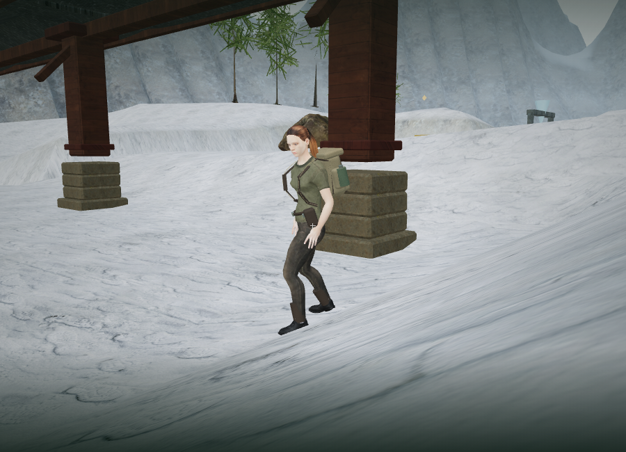
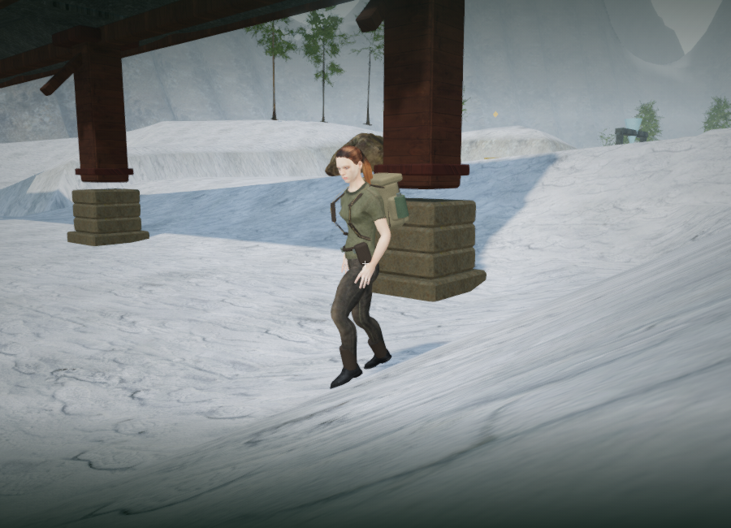

# Explorer footing and contact sounds

The later [stride-alignment update](explorer-stride.md) queries terrain beneath
adjusted foot positions and fits the pelvis to the available leg reach. It also
calibrates playback to movement speed while retaining the contact-sound path.

The later [locomotion correction](explorer-locomotion.md) preserves the running clip’s airborne phase and uses collision-resolved travel to settle blocked input into idle. The measurements below record the earlier terrain-fitting milestone.

The explorer now adapts the boots to sloping terrain, climbable platform tops and
sagging bridge decks. `src/explorer-grounding.js` samples 27 points around each
animated outsole, fits the ankle angle to walkable slopes, adjusts the visual
pelvis height and solves the legs. The imported animation still supplies the
stride, raised-foot clearance and toe roll. Player collision, velocity and saved
position remain controlled by the existing character controller.

Support queries reject ground more than half a metre above or below the player's
support height, so a missing board or deep ravine cannot pull the body down. Sharp
height changes retain the animated boot angle. Swimming, airborne movement,
mantling, ropes, cables and dodges use their existing poses. Ground fitting runs
before hand placement; counterweight lean and firing direction are applied first
so the later hand targets remain in world space.

Footsteps now follow a lifted boot's return to contact while the player actually
travels. The sounds originate at the corresponding sole, using the existing HRTF
effects path with linear attenuation from 2 to 40 m. Timber bridge decks have a
lower filtered contact sound. Idle animation, blocked movement, pauses and
teleports do not generate footsteps. Water retains its splash behavior. The
placeholder character retains a distance-based fallback while its rig loads.

## Rendered views

The fixed 900 × 650 review camera in `scripts/inspect-footing-browser.js` places the
explorer across a mountain slope with a measured grade of 0.381. These are assisted
viewpoints; the HUD is hidden for comparison.

The previous idle soles measured −4.58 cm and +3.22 cm from their supporting snow.
The corrected view measured +1.01 cm and +0.55 cm. The small positive offset keeps
the outsole clear of the rendered ground and includes the animation's own lift.

The High walking pose retained 0.51 cm clearance under the planted boot and
6.42 cm under the swinging boot. Low and High shaders linked. This adds no meshes,
materials or textures; work consists of cached sole probes, support queries and
bone transforms. The High review frame submitted 575 calls and 1,363,267 triangles
for the complete scene, including its extra rendering passes. These software
renderer measurements do not establish supported-device frame rates.

## Verification

Four new delivery-asset tests inspect the actual skinned boot mesh, independently
of the runtime's reduced probe set. They cover 810 idle/walk/run poses across
positive and negative slopes in three facing directions; physical-root invariance;
preserved swing clearance; platform tops; deep drops; sagging bridge support and
timber sounds; walking/jogging/sprinting contact cadence; and silence during
blocked movement, idle, pause, water, teleport and airborne motion. The existing
counterweight test now runs with ground fitting enabled and retains both hands
within 5 cm of all four push/pull handle orientations.

All 271 tests passed, and the release build passed with the existing large Three.js
chunk advisory. The High release loaded `index-DS7Cfosg.js`, `game-CC35p9xX.js` and
`three-fsS38CpR.js`. Native W moved the saved position from `(98, 63)` to
`(98.29794518129687, 62.96494762572978)`, with saved support height zero. A paused
reload restored every chapter record field except the deliberately refreshed
`lastPlayed` timestamp, including exactly 112.92130000001191 active seconds and
100 health. All settings also matched exactly. The release exposed no development
hook and reported no failed assets or console warnings/errors.

An assisted 180-frame walk in the full mountain scene produced four snow footfalls,
with no sampled sole penetration and a maximum 1.01 cm difference from the original
animated clearance. Native W input also moved the character 0.3 m while grounded
and emitted a positioned snow contact. That short native check was constrained
by ANGLE/SwiftShader and does not measure normal gameplay speed.

An isolated browser audio render exercised the delivered footstep path with a
constant input buffer to make distance comparison exact. RMS levels at 2, 21 and
41 m were 0.0029518, 0.0014759 and zero. Panners reported HRTF and linear falloff;
all three completed sound nodes were released. This is signal verification,
not a subjective listening assessment of the normal noise-based footstep timbre.

## Limits

This is terrain adaptation over the existing clips. It does not lock a planted
foot horizontally in world space, add new motion-captured traversal clips, or
remove every possible edge-case penetration between the sampled poses. Character
art, facial animation, contact shadows, supported-device performance and broader
listening review still need work. The original AAA graphics requirement remains
unmet, and roughly one hour of human gameplay per chapter remains unverified.
