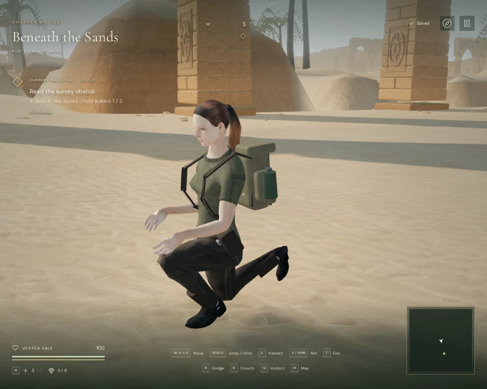
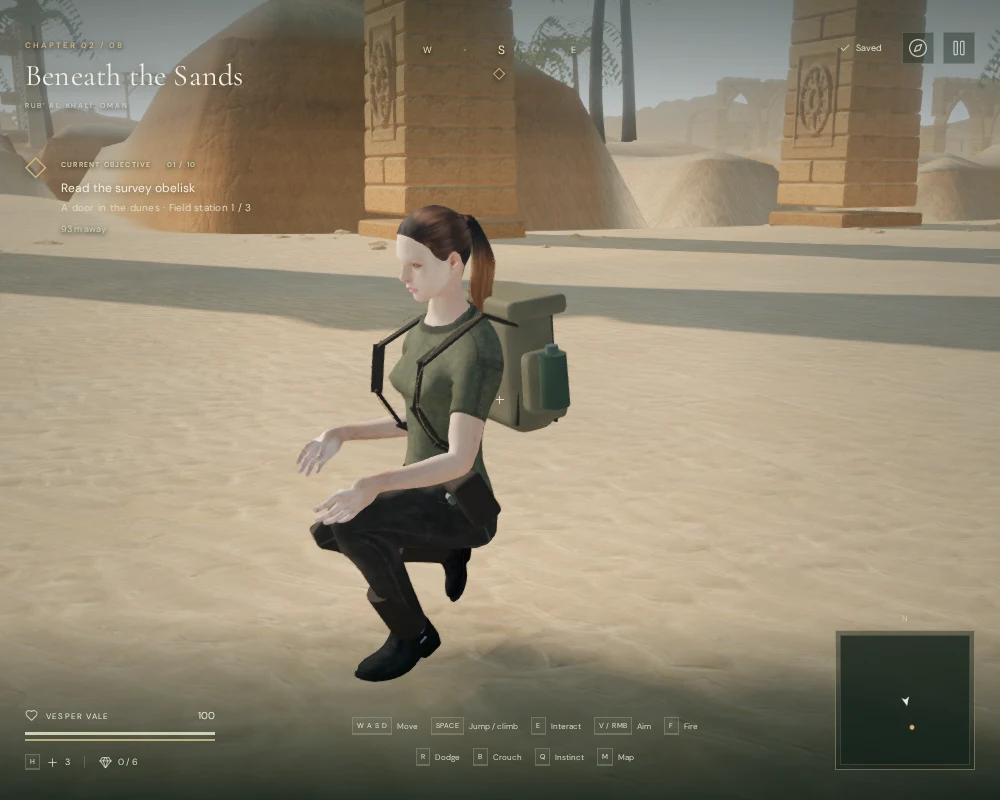
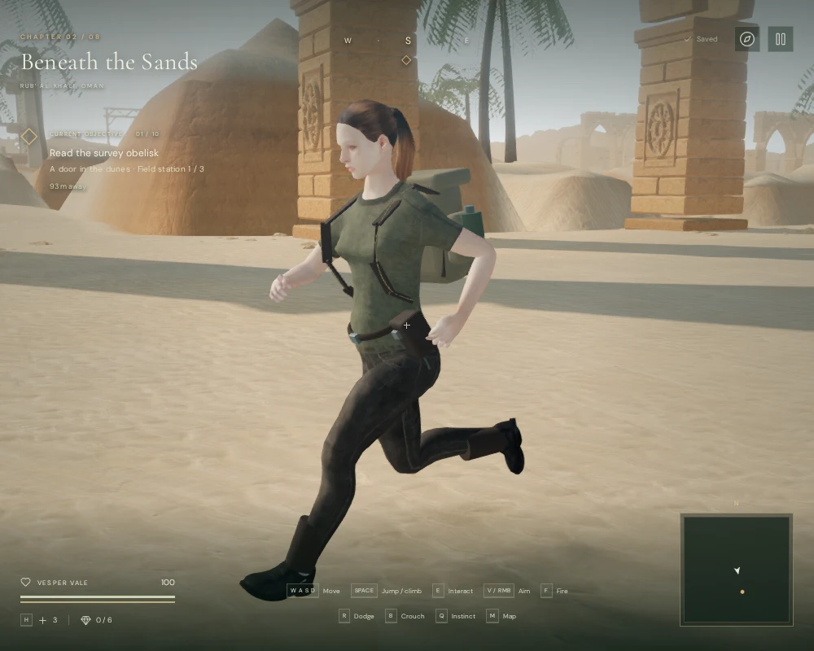

# Stride alignment and crouched recovery

Vesper's stride length and animation speed now respond together to actual travel.
Walking and running cover more ground per cycle, and playback supplies the
remaining speed. Crouching uses a shorter step and brings the recovering foot
forward beneath the hips. This reduces the previous sliding and avoids dragging
a bent knee almost along the floor during crouched movement.

The adjustment operates on the existing character and clips. Physical movement
speeds, collisions, jump routes and saved positions still come from the character
controller. The delivered GLB, its running flight phase, materials and attribution
are unchanged. See [asset credits](asset-credits.md) for the character and source
animations.

## How the movement changes

The delivered walking and running clips move near-floor sole material backward
at median speeds of about 1.56 and 4.24 m/s at their original playback rates.
In the controlled 2.4 m/s walking case, playback previously stayed at its source
rate. Ordinary keyboard jogging moves at 6 m/s with the running clip, while
sprinting moves at 10 m/s; their previous playback rates were 1 and 1.5. These
cases all left a visible speed mismatch. The walking case represents the lower
speed range, which also serves aiming and wading, rather than a separate keyboard
walking toggle.

`src/stride.js` now combines bounded stride extension with playback calibrated
to those measured contact speeds. At the same three travel speeds, playback is
approximately 1.34, 1.20 and 1.81 times the source rate. Crouched travel remains
2.2 m/s with a 72% stride and approximately 1.96-times walking playback. Its
recovery foot moves forward as it lifts, instead of keeping the standing clip's
large backward heel lift below a lowered pelvis.

The terrain fitter queries support beneath the adjusted ankle and sole positions.
It also lowers the visual pelvis when necessary to keep the targets within the
existing leg lengths, then eases the pelvis back up. The animated sole lift and
boot rotation remain the reference for slope fitting and contact sounds. The
counterweight's push/pull gait retains its existing reversed-cycle behavior.

## Matching browser views

These assisted High-quality views use the same desert scene, 1,000 × 800 viewport,
player position, camera and normalized clip phase. The earlier animator was
replayed from the preceding published commit for the comparison.

At this walking phase the trailing knee rises from 2.0 cm to 35.1 cm above the
physical player's support height. Across the complete controlled crouching scan,
the lowest knee rises from 1.4 cm to 12.3 cm. These are joint measurements;
the visible trouser surface extends below the knee joint.

All five comparison pairs retained their triangle and draw-call counts. The
crouched views submitted 2,090,167 triangles / 753 calls; the standing walk,
jog and sprint views submitted 2,140,679 triangles / 771 calls, including extra
render passes. No meshes, textures or audio assets were added. Additional joint
calculations have not been established as cost-free or benchmarked across devices.

## Controlled measurements

Each case advances the physical root at a fixed speed for 240 updates at 60 Hz.
After the initial transition, the scan tracks identical material vertices between
adjacent frames when both positions lie within 3 cm of the floor. It uses the
delivered skinned outsole, independently of the runtime's smaller support-probe
set. Values below are horizontal speeds of those near-floor material points.

| Motion | Root speed | Previous median | New median | Median reduction | New 90th percentile |
| --- | ---: | ---: | ---: | ---: | ---: |
| Walk | 2.4 m/s | 0.845 m/s | 0.215 m/s | 74.6% | 0.421 m/s |
| Jog | 6.0 m/s | 1.739 m/s | 0.341 m/s | 80.4% | 1.522 m/s |
| Sprint | 10.0 m/s | 3.562 m/s | 0.521 m/s | 85.4% | 2.566 m/s |
| Crouch | 2.2 m/s | 0.827 m/s | 0.286 m/s | 65.4% | 0.786 m/s |

The regression test bounds median sliding, knee clearance and sole penetration,
and requires running to retain a flight phase. A second test moves all four gaits
up a slope at both 20 and 30 updates per second. It checks the physical root,
visible support, positioned footstep events and faster sprint cadence. The
existing sprint-sound fixture now supplies its actual 10 m/s velocity, because
playback follows speed rather than a fixed sprint multiplier.

Native keyboard checks used W, Shift and B from the ordinary desert spawn,
with a clear camera heading selected before each run. Jogging, sprinting and
crouched travel produced respectively 80, 78 and 82 moving samples after the
initial transition. Their median measured sole speeds were 0.327, 0.511 and
0.278 m/s. All three stopped in Idle at 100 health. The crouched knee minimum
was 12.6 cm; all emitted contact-sound positions were within 3.4 cm of the floor.
These checks recorded no browser errors, warnings or failed assets.

All **463 automated tests passed**, and the production build passed with the
existing large-bundle advisory. Release checks exercised keyboard crouched wading
(0.55 m), muted portrait two-finger movement and crouch (1.20 m), and a desert
sprint followed by a settled stance (4.60 m). Every case retained 100 health.
Paused reloads restored all saved records and settings exactly, excluding the
chapter's deliberately refreshed `lastPlayed` timestamp. The portrait check had
no horizontal overflow.

The release exposed no development hook and loaded the expected
`index-Cgyhx4_F.js`, `game-CQYTRQ0C.js`, `three-CZTI3IzG.js` and
`index-DYq9hjRy.css` files. No release console warnings/errors or failed assets
were recorded. These are short input and persistence checks, not full human
chapter playthroughs or performance benchmarks.

## Limits

This is stride warping and calibrated playback, not a world-space foot lock.
Residual sliding remains, particularly near touchdown, toe-off and transitions;
the upper percentiles above are materially higher than the medians. No full
motion-capture replacement or supported-device performance claim is implied.
Aiming while moving sideways or backward still lacks dedicated locomotion clips.
The [production status](production-status.md) continues to track AAA graphics,
hour-long human chapter pacing, subjective sound/music review and broader
browser/device testing as unfinished work.
