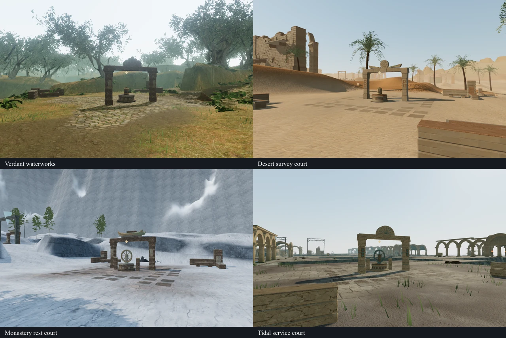
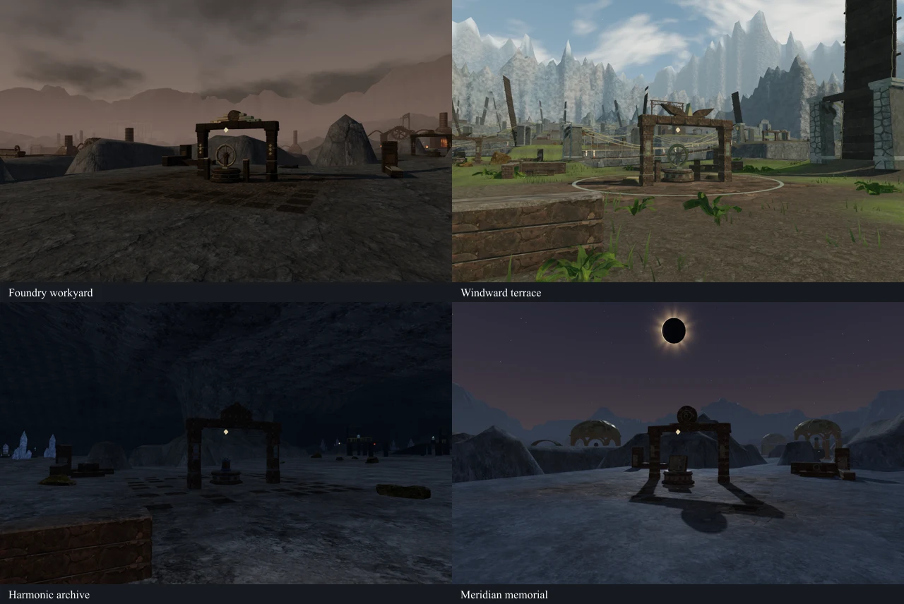
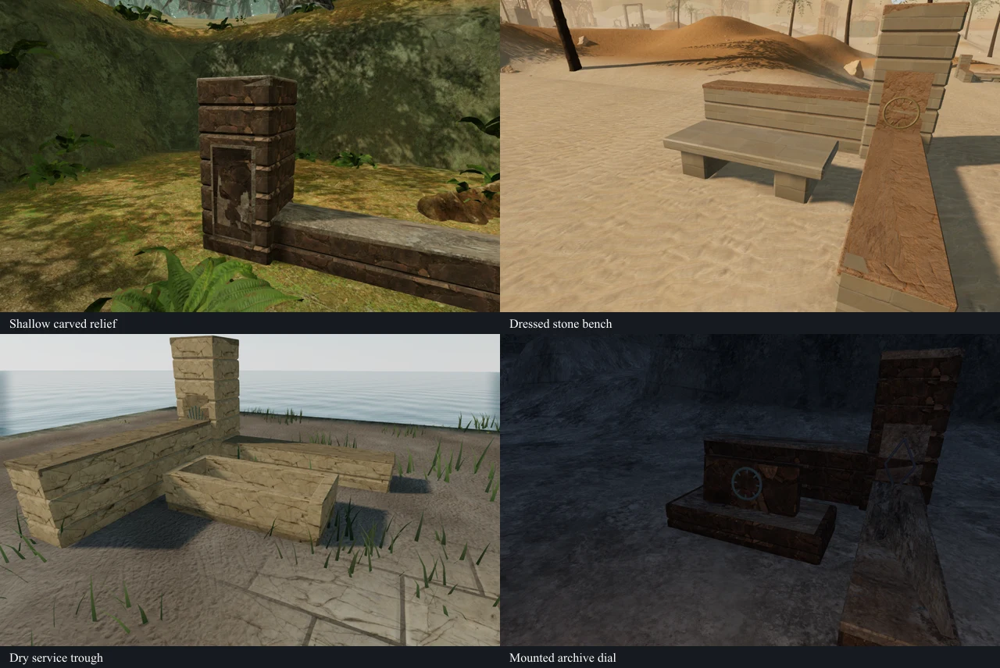

# Regional field courtyards

The 148 shared ground stations now sit among broken corner walls, carved piers
and regional furnishings. Interrupted paving borders extend their working pads;
missing stones and worn edges expose the surrounding soil, sand or snow. The
corners vary in height and survival, and placement follows the space available
beside existing routes and structures.

| Chapter | Courtyard furnishings | Ground stations |
| --- | --- | ---: |
| The Verdant Veil | Carved relief piers and dry waterworks troughs | 12 |
| Beneath the Sands | Solar markers and dressed stone benches | 19 |
| A Silence of Snow | Mountain markers and pilgrim benches | 14 |
| The Drowned Kingdom | Tidal fan markers and service troughs | 19 |
| A Heart of Embers | Iron cap ties and bins holding cold slag | 20 |
| Where Eagles Sleep | Wing markers and terrace benches | 22 |
| The Night Below | Faceted markers and archive registers | 17 |
| The Last Meridian | Meridian markers and memorial registers | 25 |

The final placement contains 346 partial corner groups, 1,187 structural pieces
and 6,340 thin paving inlays. The 21 raised controls retain their existing
climbing installations. Bespoke field sites keep their own construction.

Foundations extend below the minimum terrain height across each complete
footprint. Paving is clipped to the terrain's actual grid triangles, including
their diagonals, so it cannot bridge a saddle-shaped cell. Its texture
coordinates match the underlying court. Filtered edge wear blends the inlays
into that floor; they do not cast shadows on it. Static geometry batches by
material, and the two paving finishes share their texture objects.

Pier markings sit on inset backing plates. The jungle relief's shallow depth
keeps its carved surface outside the masonry, and archive dials share the tilt
of their supporting tablets. Materials reuse the project's credited texture
maps and bronze shader; all new geometry and layout are authored in source.
The troughs are dry and the slag is cold, so these furnishings add no new water
or fire emitters.

## Routes and persistence

Placement reserves the original walking lanes, water footprints, existing
obstacles and the projected climbing routes, including cable descents and
landings. The first traversal review caught a sky-city corner pier beside
`field-5-2` intersecting the neighboring `field-6-0` return cable. Reserving the
whole descent and landing removes that intersection; a regression test retains
the reproduced coordinates.

Courtyard solids use the established finite station bounds for movement,
support, sight, sound occlusion and projectiles. They are built before arrival
recovery, so a save made inside a newly occupied footprint can recover to nearby
supported ground. All eight chapters produce identical courtyard piece and
paving layouts when comparing fresh progress with completed field tasks and
completed chapter stages.

## Verification

All **628 tests** pass. The new tests cover terrain-triangle conformance using
an independent ground raycast, complete walking lanes along axial and diagonal
paths, and the reproduced return-cable conflict. The production build succeeds
with its existing large-bundle warning.

The final assisted browser checks cover:

- **148 courtyards**, preserving all **32,226** sampled formerly-clear positions
  along their approach lanes, with no newly blocked sample.
- **1,187 occupied-position recoveries**, one at each structural piece, all
  finding clear supported arrivals.
- **169 shared station controls**, including working positions, completion,
  sustained movement against their bases and occupied-center recovery.
- **21 complete climbing routes**, including mantle approaches and return cables.
- **Six shared brazier sources**, attached to visible flames, with clear listening
  positions at 6, 12 and 18 m and strictly decreasing distance gain.

The final **352 rendered views** include both sides of all 148 courtyards,
eight representative Low views and 48 fixture details. Observer positions are
supported and clear; rays crossing terrain or intervening architecture are
rejected. The avatar and carried torch are hidden to inspect the environment
under chapter lighting. All images were reviewed in labeled contact sheets,
with selected views also inspected at full resolution. Shaders linked without
browser errors or warnings.

The final production build passes **ten native input cases**: five keyboard
and five touch cases, covering recovery from an occupied courtyard wall in each
chapter and two station interactions. All retain full health. **Twenty reloads**
preserve position and every other normalized save field apart from timestamps;
two also adjust only the camera angle through the established arrival correction.
Independent geometry checks confirm that those two requested views were
obstructed and that both corrected views reach the full 5.33 m camera distance.
All other reload camera angles match exactly. The eight initial occupied-save
recoveries are allowed to correct only position and camera.

The checks confirm the final production bundle names, no development hook, no
viewport overflow and no browser warnings, errors or failed requests. All twenty
production movement screenshots were reviewed. One desert backing-up view
crowds the explorer against the camera before the arrival correction. The
subsequent [close-camera pass](close-camera.md) reproduces and corrects that
ordinary-play transition with shared character fading and stable wall following.

The reusable helper is
[inspect-station-yards-browser.js](../scripts/inspect-station-yards-browser.js).
Raw captures, disposable save fixtures, profiles and logs remain in ignored
local staging. The three labeled images above are intentional public evidence.

## Remaining work

This pass improves the surrounding ground and framing portion of VA-12. The
central station footprints still repeat, and courtyard corners share a modular
layout. Continuous approaches and return paths, optional discovery areas and
the remaining main-court composition need further review in the broader
[playable-world audit](visual-audit.md). It remains open. These checks do not
establish human chapter duration, subjective audio quality, consumer-device
performance or AAA parity.
