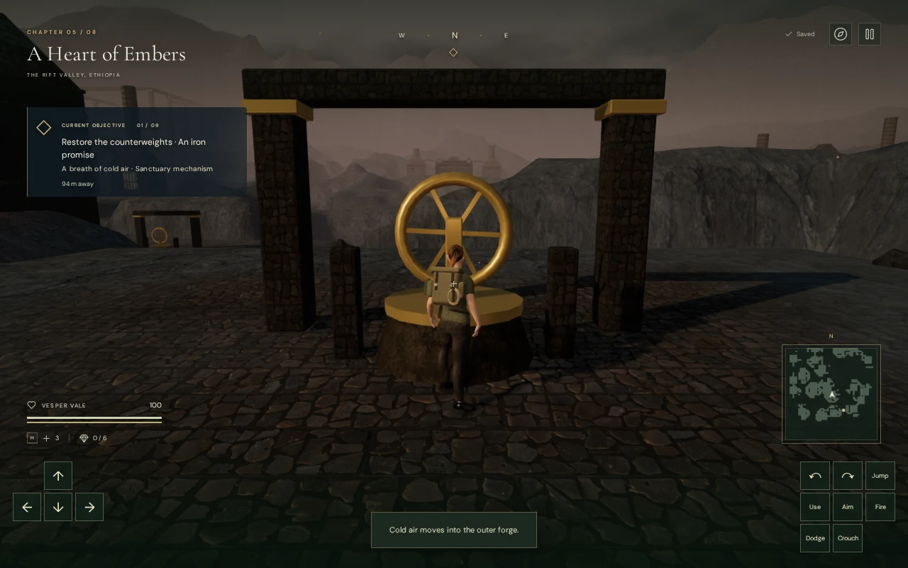
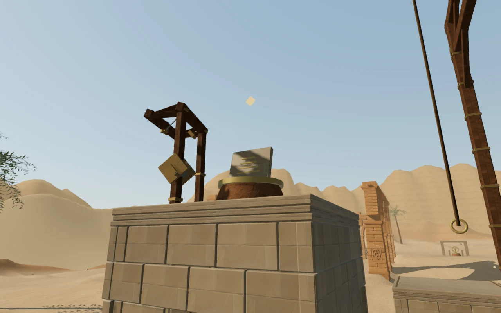
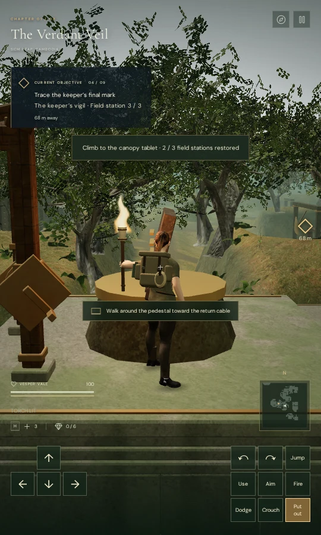
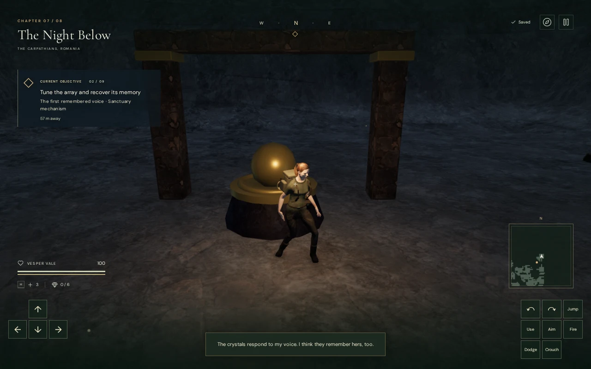
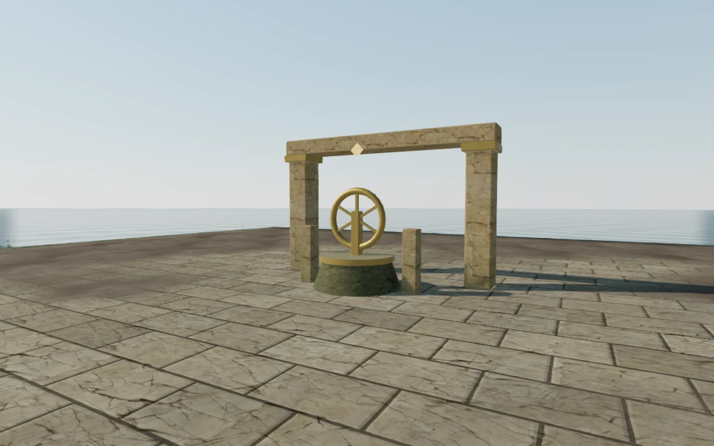

# Field-station clearance

The generic station builder now registers solid bases, controls, side posts and
ground-level frames. The explorer stops outside the pedestal while remaining
within the control's 2.6 m interaction range. This addresses the lower-body
intersection recorded at the volcanic cooling valve as VA-11.

The solids have explicit lower and upper heights. A raised control does not
create an invisible column down to the ground, and the passage under a lintel
remains open. Round bases use round movement and ray bounds. Visible components
affect collision; collected components leave their empty support usable.
Projectile sweeps use physical cover bounds instead of an explorer-sized
walking volume, including thin controls and open space above low objects.
The ground lintels also meet their capitals, closing a 2.5 cm authored joint gap.

Component visibility is initialized from progress before saved-position recovery.
This lets an explorer resume on an empty socket or a collected item's support.
If the explorer is standing on a socket during delivery, installation first
finds a clear supported position and saves that position with the completed
action. It does not leave the explorer trapped inside the installed item.
Landings on controls use the same body footprint as walking collision, so a
descent beside a cap or shaft does not settle inside its collision volume.

Raised controls use the climbing course's existing masonry and cable structure.
The additional ground-station arch is omitted from these 21 landings: its feet
would otherwise overhang the five-meter platform and obstruct the approach.
Mantles select a nearby clear endpoint when the usual arc meets station furniture.
The return cable only boards along a clear approach; its prompt directs an
explorer on the opposite side to walk around the pedestal.

Older saves inside a new solid recover at a nearby supported position. Recovery
tries the saved elevation before searching the ground. A saved climbing ledge
retains a clear position on that ledge, and safety-line recovery also avoids
the occupied pedestal center.

## Full-world checks

The disposable-progress helper
[inspect-field-stations-browser.js](../scripts/inspect-field-stations-browser.js)
checks all **169 generic stations**, with **1,418 collision records**:

| Chapter | Generic stations | Climbing routes |
| --- | ---: | ---: |
| The Verdant Veil | 13 | 1 |
| Beneath the Sands | 21 | 2 |
| A Silence of Snow | 18 | 4 |
| The Drowned Kingdom | 21 | 2 |
| A Heart of Embers | 21 | 1 |
| Where Eagles Sleep | 27 | 5 |
| The Night Below | 21 | 4 |
| The Last Meridian | 27 | 2 |
| Total | **169** | **21** |

Each control is reachable from a clear working position 2.2 m in front of it,
completes through the game's interaction handler, and remains clear after its
state changes. Sustained forward motion stops 1.50–1.60 m from the pedestal
center. Every tested center arrival recovers 1.50 m away while preserving its
elevation. All elevated station solids fit on their landing.

[inspect-climbing-browser.js](../scripts/inspect-climbing-browser.js) exercises
all 21 routes using movement, mantling, jumping, rope catch/swing/release, a walk
around the final control when needed, cable boarding and cable exit. It checks
the body arc during each mantle and collision clearance throughout each ride.
The helper supplies field completion to unlock the cable; this is assisted
route coverage rather than an uninterrupted human chapter playthrough.

All six fire emitters attached to generic braziers remain at their visible
flames. Each has clear, walkable listening positions near 6, 12 and 18 m, with
strictly decreasing distance gain. This verifies source placement and
attenuation paths, not subjective mix quality.

The visual review covers **41 rendered views** of 16 representative stations,
including ground and elevated controls in every chapter and both High and Low
settings. Seven additional planned viewpoints were rejected because intervening
geometry obscured the target. All rendered shaders linked without browser
errors or warnings. This is representative coverage, not a close inspection of
all 169 installations.

## Automated regressions

All **624 tests** pass with four test workers (111.9 seconds), and the production
build passes. The [station regressions](../tests/field-station-solids.test.js)
cover sustained walking, empty and occupied socket restoration, delivery while
standing on a socket, mantle arcs from four course orientations, climbing
checkpoint recovery, cable approach rejection, finite vertical bounds, round
ray bounds, thin projectile cover and landings that can be walked away from.
The full suite also covers the other chapter mechanisms, saves, audio and
existing traversal behavior.

## Production input and persistence

The final production build passes **13 native input cases**: six keyboard and
seven touch cases. They use prepared, normalized browser saves and ordinary UI
controls; the development game handle is absent. Every case loads the delivered
`game-CksLKavX.js` bundle and its matching entry, stylesheet and Three.js chunk.

The cases exercise one control in every chapter, the original volcanic cooling
valve with both input formats, occupied older saves at ground and climbing
height, and delivery while standing on an empty socket with both input formats.
The volcanic keyboard case now stops at `(217, 288.5346)` with zero height above
the ground, **1.53 m from the pedestal center**, instead of entering its base.
All cases retain full health and their completed field action.

Each case compares the complete normalized save after two reloads, for
**26 matching comparisons** apart from `lastPlayed` timestamps. The two initial
occupied-save repairs also preserve every other normalized field while
correcting position and camera; the climbing arrival retains its 8.4 m height.
The explorer can then move away normally, including stepping off the landing.

The delivery cases first restore the empty socket's 81 cm support, place the
component with E / Use, and walk away. The resulting supported placement and
completed action survive reload without trapping the explorer in the item.

The 26 resulting movement views were reviewed. Neither layout overflowed its
viewport, and the browser reported no runtime errors, warnings or failed asset
requests. Native input here verifies these local cases, not a full campaign
playthrough or broad device performance.

## Remaining visual work

The shared stations still repeat simple pedestals, wheels, tablets and thin
frames across different settings. Their surroundings are often sparse.

These observations are recorded separately as VA-12 in the
[open visual audit](visual-audit.md). The collision repair does not establish
whole-world visual completion, consumer hardware performance or AAA parity.
