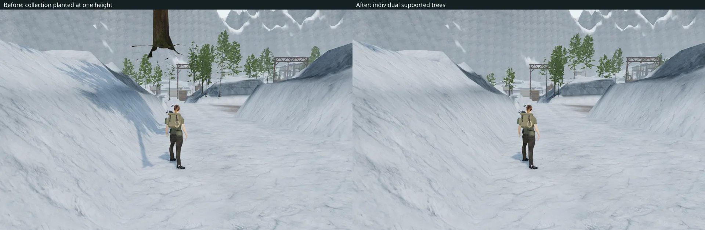
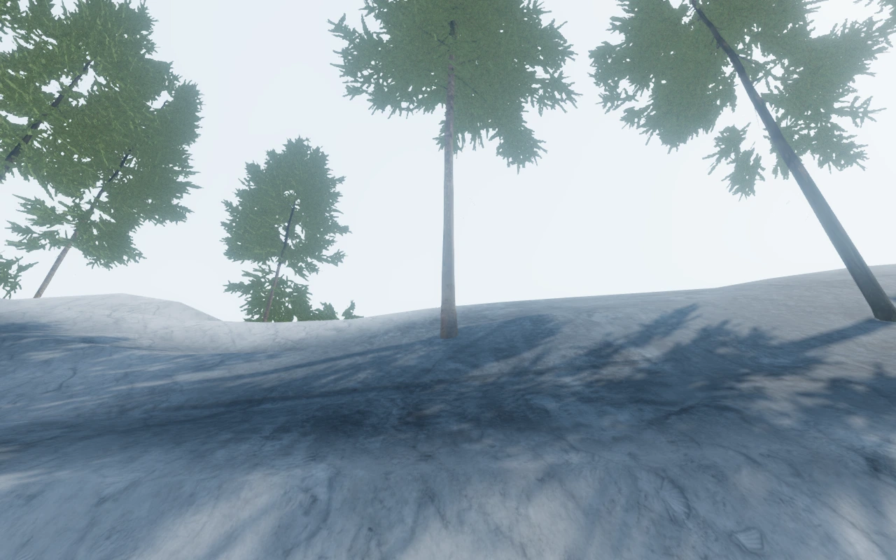

# Individually rooted snow firs

The fir hanging above the snow approach came from treating a collection of
three trees as one plant. The source specimens stand six metres apart. Their
shared instance used one terrain height, leaving some trunks above neighbouring
paths and slopes. The root centre in the reported view measured **2.53 m above
the rendered snow**.

The loader now separates the three specimens, centres each on its root flare,
and fits its lower root vertices beneath both the sampled height field and the
rendered terrain triangles. It preserves the source scale, rotation and
horizontal arrangement where the location is suitable. Candidates that intrude
into walking cells or working areas, overlap another root, or bridge a steep
ledge are excluded. The former 115 collections contained 345 stems; the corrected
chapter has **269 individually supported firs**.

All three source shapes retain the same woody geometry across their near,
intermediate and distant tiers. The shared foliage material keeps both wind
motion and the detail-transition shader. The existing fir assets, textures and
[Poly Haven attribution](asset-credits.md) are retained.

## Verification

All **634 tests** pass, and the production build succeeds with the existing
large-chunk warning. New regression checks read the delivered model collection,
verify specimen separation and tier alignment, and test deterministic planting,
root spacing, objective clearance and contact with terrain triangles.

The browser checks all 269 retained trees with **164,956 root-to-terrain rays**.
Every sampled lower root vertex is buried by at least 8 cm, allowing for floating
point precision; none intrudes into a walking cell. The woodland layout is
identical after switching chapters and after loading completed snow progress.

The visual review includes 18 High/Low views covering all three fir shapes,
three quality settings at the reported route position, and four jungle views
checking the shared forest loader. All shaders link, and the compiled wind
shaders retain instance coverage for detail transitions. Another **34 reviewed
follow-camera captures** cover the snow approach and return: 259.9 m outward and
259.1 m back, both at health 100. This uses ordinary movement with an assisted
route search; enemy AI and combat are not stepped.

Four native production cases exercise keyboard and portrait-touch movement
beside the repaired route and first court. All eight movement legs preserve
health 100. Their eight reloads retain every normalized save field, including
camera angles, apart from timestamps. The production page has no development
hook, overflow, browser errors, warnings or failed requests. The tested bundles
are `game-C9Dk51dG.js`, `index-CulM80-Y.js` and `three-DQZTZ_dW.js`.

The reusable [root inspection helper](../scripts/inspect-fir-grounding-browser.js)
records actual rendered contacts and supported viewing positions. Raw captures,
player fixtures, logs and profiles remain in ignored local staging.

This resolves VA-16. The [world audit](visual-audit.md) remains open, including
the abrupt terrain shapes in VA-15 and the pool boundaries in VA-17. These local
checks do not establish complete chapter playthroughs or overall graphics
completion.
