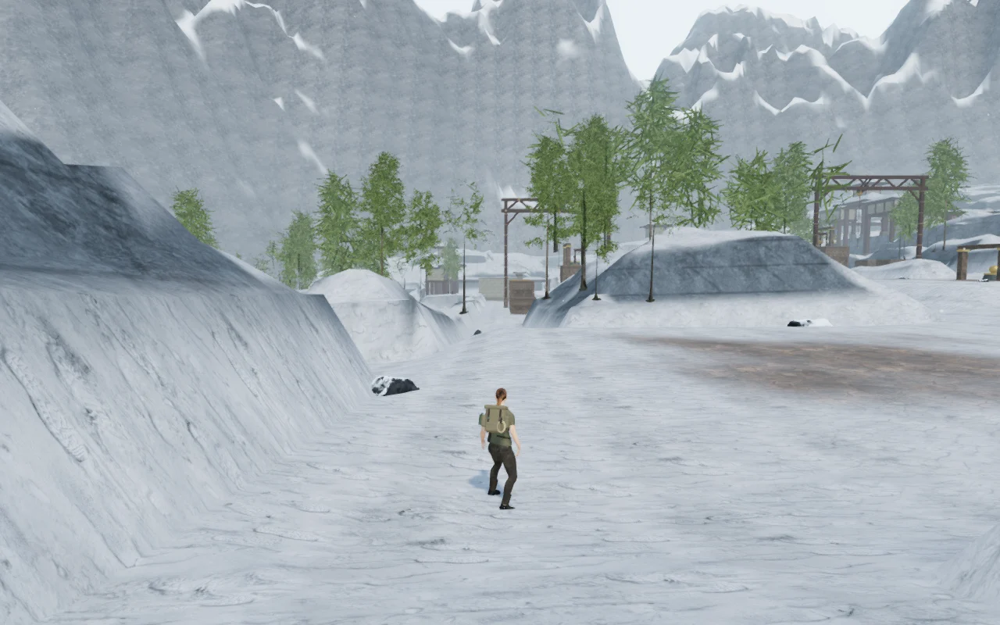
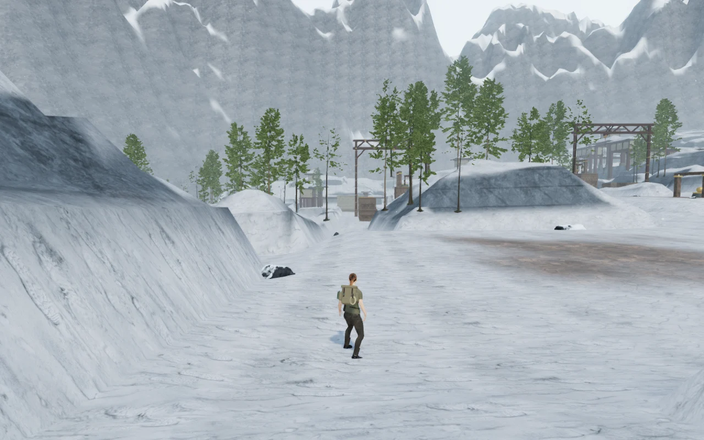
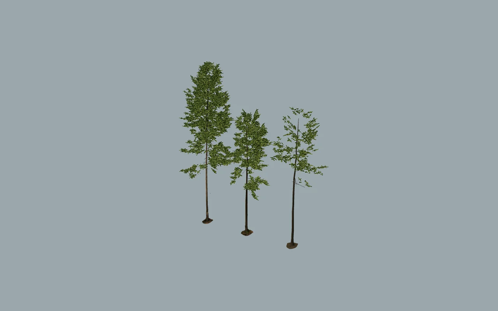

# Fir sprigs in A Silence of Snow

The mountain firs now use cutout sprigs reconstructed from their source model.
This replaces the conspicuous long green strips produced by enlarging a sparse
sample of individual needles. Small branches retain their original placement,
and distant trees keep the near-detail trunks instead of collapsing into gaps.

## Matched views

Before, on the first trail:

After, with the same camera and tree placements:

The same three specimens in an isolated near-detail inspection:

And their distant tier, enlarged here to expose the approximation:

These are real browser renders. The isolated inspection uses a neutral
background and its own lighting; it is an asset comparison, not a gameplay view.

## Reconstruction

The credited Poly Haven Fir Tree 01 contains three specimens with 1,716, 1,024
and 418 repeated sprigs. There are seven distinct sprig templates. The converter
fits each occurrence to its template, verifies all source vertices, texture
coordinates and triangles, and projects each template from three perpendicular
directions. The maximum positional fitting error is 0.00000334 source units.

The color/coverage and normal atlases are each 1536 × 1024 pixels, shared by all
forest patches and distance tiers. Near uses three crossed cards per sprig;
middle uses two. Distant retains one deterministic sprig from each pair, with
square-root-of-two size compensation. Sampling varies between pairs so that
repeated source ordering does not eliminate particular sprig shapes.

The foliage and shadow materials use the same coverage texture and wind
animation. Atlas borders have transparent padding. The build preserves the
texture coordinates even though the shared images are attached at runtime.
The old normalization bounds, world placements and detail distances remain.
The 1,741 near-detail woody triangles are reused in every tier.

| Combined three-specimen mesh | Before | After |
| --- | ---: | ---: |
| Near triangles | 363,598 | 20,689 |
| Middle triangles | 46,025 | 14,373 |
| Distant triangles | 7,566 | 8,057 |

Reproduce after the existing source-download and model-optimization steps with
`node scripts/rebuild-fir-sprigs.mjs`. Runtime delivery files are checked in;
a fresh installation does not need the converter or the raw source models.
The [provenance record](../asset-sources/fir-sprigs/sources.json) contains input
and output hashes. See [asset credits](asset-credits.md) for the original CC0
asset and derivative textures.

## Verification and limits

All **557 automated tests** pass, including transformed-card normals, delivered
atlas coordinates, valid faces, transparent tile padding and provenance hashes.
The production build passes, with the existing Vite large-chunk advisory.

The complete assisted wind-house route passes with three jumps, nine catches
and an eastern return at 100 health. That check runs the normal player, enemy,
hazard and camera updates after one initial fixture placement; its 67.35
simulated seconds do not measure human play duration. Six production cases
pass with the development hook absent: four keyboard/touch catch-and-reload
cases at 1280 × 800, 540 × 900, 360 × 800 and 960 × 540; native keyboard travel
on the first trail; and frozen-stair hauling, pausing and reload. Saved state
matches after reload, apart from the expected last-played timestamp. Both
shared fir atlases are requested by the production build. No browser errors,
warnings or failed HTTP responses were recorded.

The same 115 tree-group placements remain in 74 patches. All 222 foliage
meshes share one color atlas and one normal atlas; their depth materials use
the same cutout coverage. Shader linking passes on High, Medium and Low.
A chapter-change audit releases all 1,630 tracked geometries, 1,475 materials,
81 textures and 1,430 instance buffers exactly once. That audit includes the
forest, terrain, rocks and wind-house resources. Wind/drive voices, objective
music and pause behavior pass. Offline positioned-audio checks produce half
amplitude halfway through the falloff span and silence beyond the range; these
are signal checks, not a listening-quality assessment.

The three models plus the new atlases total **29,011,848 bytes**, down from
45,013,816 bytes for the old models. The two shared atlases require roughly
16 MiB of RGBA GPU storage including mipmaps, replacing the previous embedded
twig textures. The current forest's unique vertex/coverage arrays total
4,188,492 bytes. These figures describe specific assets and buffers, not total
browser or driver memory.

| Matched High gameplay view | Calls, before → after | Triangles, before → after |
| --- | ---: | ---: |
| First trail | 965 → 966 | 2,032,048 → 1,880,247 |
| Eastern court | 593 → 597 | 1,064,792 → 1,026,725 |
| Wind house | 907 → 907 | 1,558,985 → 1,580,166 |
| Frozen stair | 1,039 → 1,042 | 1,689,617 → 1,720,225 |
| Bell hoist | 1,561 → 1,563 | 2,794,500 → 2,723,151 |

Full trunks raise some distant-view counts. A separate first-trail comparison
used the same current scene with original/rebuilt/rebuilt/original forests,
1.3 seconds of settling and 4.2 seconds per sample, at 1280 × 800 and DPR 1.
On Radeon 780M through ANGLE/Vulkan, mean GPU render time was:

| Quality | Original runs | Rebuilt runs | Difference between pair means |
| --- | ---: | ---: | ---: |
| High | 17.454 / 17.354 ms | 18.767 / 18.881 ms | +1.420 ms |
| Low | 9.090 / 9.129 ms | 9.975 / 9.976 ms | +0.865 ms |

There were no disjoint GPU samples. High frame-interval means ranged from
24.966–28.721 ms before and 24.008–24.120 ms after; Low ranged from
16.733–17.427 ms before and 16.732–16.733 ms after. The difference between
GPU and frame-interval results is a reason to keep this comparison bounded:
cutout foliage adds pixel work despite its lower geometry cost. It does not
establish a general frame-rate improvement or broad hardware acceptance.

The trees still use crossed-card approximations, repeated specimen groups and
existing shadow/draw-distance limits. The converted source needles can remain
coarse in extreme close-ups. This milestone does not establish AAA graphics,
one-hour human chapter duration, broad device performance or subjective audio
quality. Those remain tracked in [production status](production-status.md).
