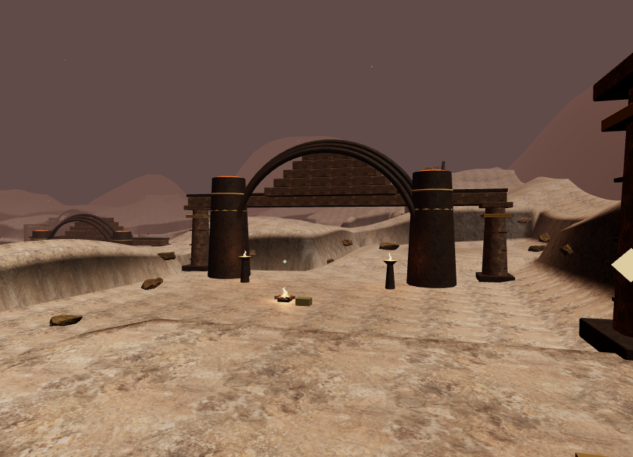
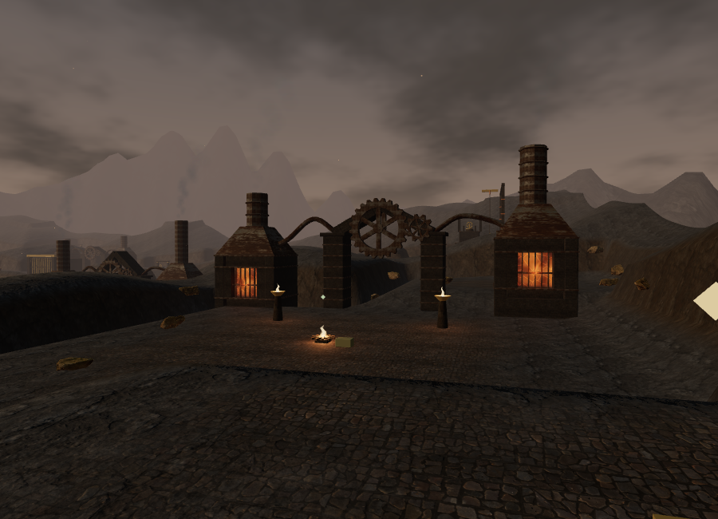
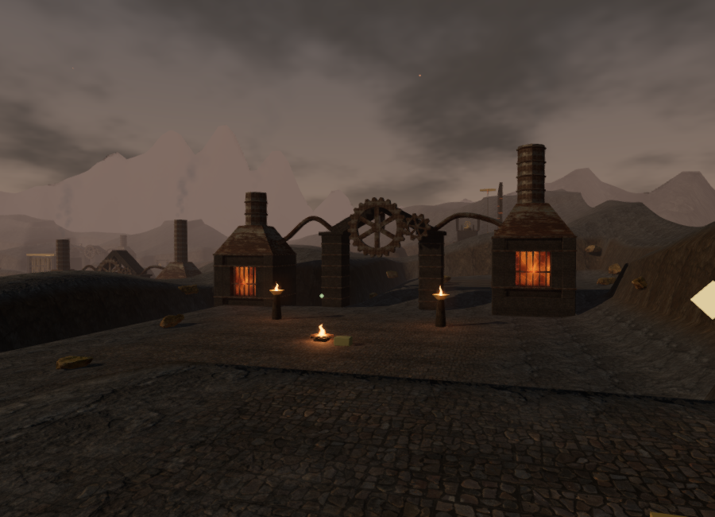
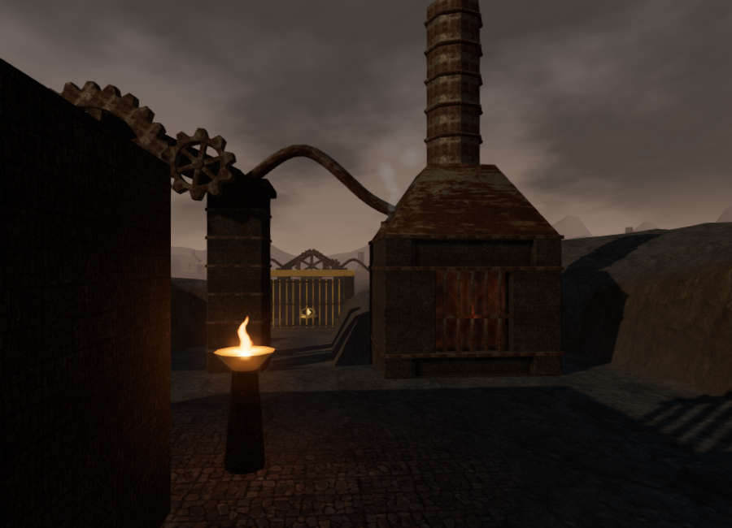
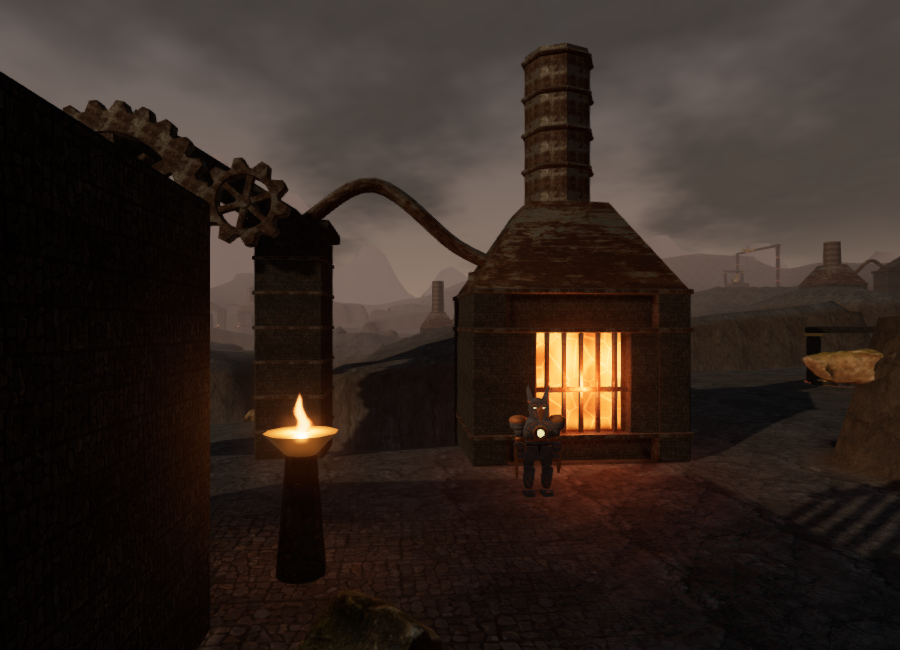

# Volcanic forge: environment and responsive sound

A Heart of Embers now has nine forge halls with masonry fireboxes, corroded metal hoods, hollow octagonal chimneys, supported overhead pipes, and paired toothed gears. Court plans vary the chimney heights and the central masonry crown. This is original architecture for the fictional setting. It replaces the former generic temple frames and cylindrical furnace props.

Dark volcanic paving and desaturated rock replace the sandy ground treatment. An animated ash-cloud sky supplies a filtered environment capture, with cooler fill light and warm sunlight. The distant caldera has an eroded, irregular rim instead of the former rounded hills. Its 16,128 triangles stay outside the playable square. Lava pools now show drifting crust and glowing cracks; completed cooling work removes the glow while retaining the existing safe-crossing rules.

## Objectives, visible machinery, and sound

The same state drives firebox glow, chimney smoke, coolant steam, gear speed, and emitter activity. It is derived from existing saved field actions and completed sectors, so there is no new save schema. Partial work takes effect gradually during play; loading a save immediately restores its target state.

| Sector           | Response                                                               |
| ---------------- | ---------------------------------------------------------------------- |
| Cold-air circuit | Each valve reduces heat and increases coolant steam.                   |
| Dormant furnace  | Seating the ignition core lights the furnace and starts its machinery. |
| Pressure relief  | The three vents reduce heat and slow the engine.                       |
| Obsidian hub     | Fitting the hub starts the gear pair.                                  |
| Smelting feeds   | Valves reduce excess heat and establish a steady feed.                 |
| Pilot flames     | Each lit pilot increases furnace heat and machinery speed.             |
| Key tempering    | Delivery reduces heat and releases coolant steam.                      |
| Heart engine     | Final valves lower heat and settle the engine into a slow rotation.    |

Each hall has two furnace-mouth emitters, two coolant-outlet emitters, and one gear emitter. The 45 registered sources share the existing 12-voice spatial budget. Furnace rumble uses a 3–40 m linear falloff; coolant hiss uses 2–22 m. HRTF direction, occlusion filtering, distance prioritization, and independent persisted mix settings remain active. The forge retains its quiet 62 BPM bronze arrangement and objective-specific musical voicing. Default music/ambience/effects levels remain 32/80/75.

Coolant uses a separate synthesized pressure hiss with a band-limited noise spectrum and slow modulation. It does not reuse ridge wind. Two fixed non-shadowing light slots select nearby furnace mouths, while the existing fire effects retain their four light slots. Decorative details and plumes have shorter draw ranges; structural halls remain visible. Gear teeth, rims, hubs, and spokes are geometry, with a 24:10 angular ratio between the two wheels.

Furnace sound positions sit just outside their open fronts. A regression check also caught one mouth below the adjacent court edge: its sound was being muffled by terrain. Fireboxes now sit above the highest sampled footprint edge, on masonry foundations extending down to the lowest edge. The player collision heights include those foundations. All eighteen mouths pass the final browser front-approach sight check; unit checks confirm the back walls still obstruct their sound. Steam behind a furnace can still be correctly occluded by its housing.

## Local materials

Ten unmodified 2K JPEG maps total **31,983,573 bytes**:

- [Rock Face 03](https://polyhaven.com/a/rock_face_03), photographed by Dario Barresi and processed by Rico Cilliers: color, OpenGL normal, and roughness. This brown rock scan is darkened and desaturated in the terrain treatment; it is not presented as a basalt scan.
- [Rusty Metal 04](https://polyhaven.com/a/rusty_metal_04), Amal Kumar: color, OpenGL normal, roughness, and metalness. The metalness map separates the corroded and exposed metal responses.
- [Volcanic Rock Tiles](https://polyhaven.com/a/volcanic_rock_tiles), Charlotte Baglioni: color, OpenGL normal, and roughness for paving and furnace masonry.

These are covered by [Poly Haven's CC0 license](https://polyhaven.com/license) and served locally. `python3 scripts/download-forge-materials.py` reproduces the downloads. Original metadata, source URLs, byte counts, and SHA-256 hashes are retained under `asset-sources/forge-materials/`; all ten delivered files match those hashes.

## Rendered views

The first three views use the same 900 × 650 viewport and camera. All images are actual browser renders with the HUD hidden.







The selected Performance view changed from **310,968 triangles / 170 calls** to **268,116 / 193**. The selected High view submitted **1,036,565 triangles / 616 calls** across its rendering passes. Each hall has 5,500 structural/gear triangles and four main draws: two static material batches and two rotating gears. Detail and effects add separate draws. The actual chapter uses 549 camera surfaces. These are selected workload measurements, not hardware frame-rate results.

## Verification and limits

All **144 tests** pass, including seven new forge tests covering partial/completed/legacy objective state, finite and correctly wound geometry, open gear hubs and chimney tops, court approaches, camera clearance, furnace front/back occlusion, state shared by visuals and sound, gear ratios, immediate lava restoration, caldera seams and placement, texture hashes, and the hiss's level and spectral distinction from wind. The release build passes with the existing Three.js chunk-size advisory.

Browser diagnostics found clear sampled approaches for all **54 non-guardian features**, including elevated route entries and summits. All Low and High shader programs linked with empty logs. These checks do not prove an entire route through every gate and encounter.

An isolated live Web Audio furnace voice reported gains of 0.45 at 2 m, 0.34054 at 12 m, 0.18243 at 25 m, and 0.01216 at 39 m; it retired at 41 m. The panner reported the linear model and the configured 3/40 m radii. Occlusion was disabled for this distance-only measurement. A restored coolant source at activity 0.75 produced gain 0.108 at 4 m with HRTF and the 7500/1500 Hz clear/obstructed filter branches.

Assisted calls through the field-completion handler restored the three first-sector valves in order. After four simulated seconds per action, heat/glow/audio activity fell to 0.70820, 0.40842, and 0.10843; steam rose to 0.74298, and the associated lava pool became safe after the final valve. Further assisted checks ignited the core furnace, started the repaired gear pair, and lit the pilot furnace. Reloading restored the resulting completed-sector states immediately, including earlier sectors represented by the saved stage. These were assisted checks, not ordinary-control chapter playthroughs.

The palace and snow chapters subsequently prepared with no asset errors and no leftover forge patches, emitters, light slots, or time uniform; their ten palace courts and nine monastery courts were restored. Development and production console checks reported no warnings or errors.

After the foundation fix, the final High production build loaded all ten maps with HTTP 200 and the expected byte counts, opened its briefing at zero play time, and exposed no development hook. Native keyboard input changed the saved position from `(385, 224, height 0)` to `(384.9371832627515, 224.20415439605796, height 0)`. Pause recorded **3.864299999952316 active seconds**. A subsequent reload held a required rock-map request until another tab gained focus; preparation then opened paused and restored the exact position and elapsed time. Test saves were cleared from development and preview, restoring High quality.

Browser verification uses Chromium ANGLE/SwiftShader software rendering. The short movement check traveled only a small distance and does not establish sustained responsiveness or supported-device performance. Subjective listening on more devices, full-length chapter playtests, approximately one-hour pacing, and modern AAA visual quality remain open. The original production goal is not complete.

Development review helper:

```js
const review = await import("/scripts/verify-forge-art-browser.js");
review.inspectForge(__vesper.game);
review.forgeView(__vesper.game, 0); // changes the review observer/camera without saving
```
