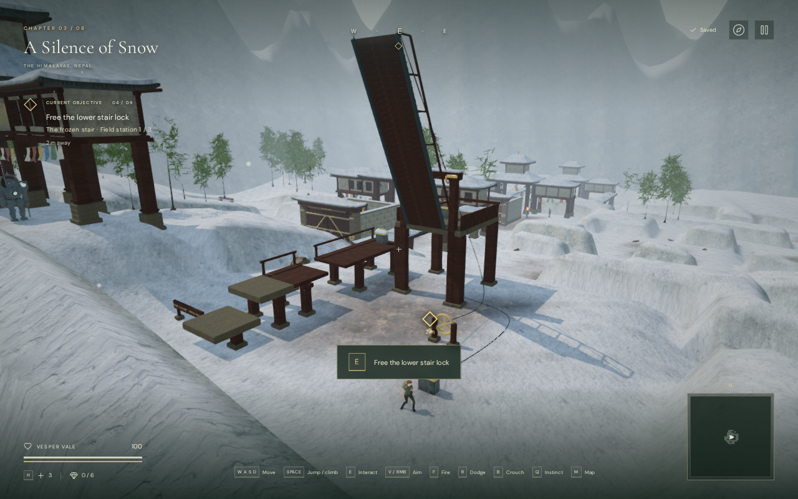
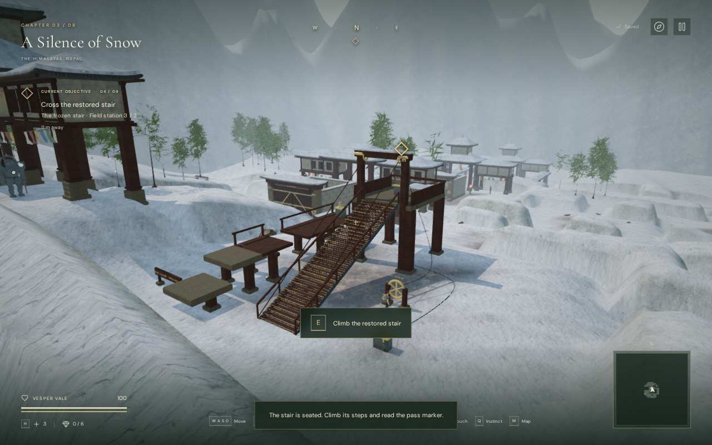

# The frozen stair

The fourth field mission in **A Silence of Snow** now restores a physical stair.
Its three generic winches, previously scattered across the chapter, are replaced
by two frozen brake locks and a pass marker in the existing final winch clearing.
A separate hauling wheel controls the raised flight after both locks are free.

Release the lower lock with **E / Use**, then climb the two western ledges with
**Space / Jump**. Jump the broken gallery span to reach the upper lock. Drop from
the open inner edge and return to the hauling wheel on the eastern side. **E /
Use** lowers the stair onto its supports. Walk up its 36 steps to the six-metre
landing and read the pass marker with **E / Use**. The sanctuary field gate opens,
and the gold objective marker returns to the chapter's bell lesson.

Both images are actual 1280 × 800 High browser views from the assisted route.
Their lossless WebPs retain the captured RGBA pixels exactly.

## Mechanism and world

The stair has a hinged flight, timber treads, bronze edges, side rails, a hauling
wheel, guide cables and two overhead pulley assemblies. Chipped stone pads and
posts support its upper landing and broken service gallery. Ice on each lock
clears when that field action is completed. The upper gallery's falling-ice trap
uses a narrow timber frame seated on the gallery, keeping the final landing
clear. It uses the gallery's elevation and is disabled by releasing its lock.

The 3.2-second lowering motion keeps the swept area clear until the steps are
seated. Treads then support ordinary walking in both directions; no repeated
jump input is needed for the stair. Handrails block walking through their edges.
The upper slabs preserve the ground routes beneath them and obstruct sight and
sound at their actual elevation. Camera bounds follow the moving flight.

Only the three field-objective positions move. The seven other chapter maps
match the published version, and the mountain map retains its other features,
rooms, paths, enemies and spawn. All **60,025 mountain terrain height samples**
are identical. The existing clearing supplies the foundation and connecting
trails. The chapter still has three field actions for this sector.

The mountain save records whether the stair reached its seated stop. Pausing
freezes an unfinished lowering in memory; reloading it retains the released
locks and returns the flight to its last seated state so the wheel can be used
again. A restored stair stays open. Existing saves that already completed the
field mission or passed its sector receive the restored stair automatically.

## Sound and verification

Two original machinery emitters sit exactly at the overhead pulley centres.
They use the existing hoist synthesis, HRTF positioning, linear distance falloff,
occlusion filtering and saved mix controls. Live browser checks found both
voices while hauling and neither at rest or on pause. The mountain score selects
its lifting task during motion and returns to the current field task afterward.

A distance-only render of the actual generated hoist buffer measured RMS
0.219196 at 2 m, 0.109598 at 14 m and zero at 27 m, using the emitters' 26 m range.
This verifies half amplitude at the falloff midpoint and silence beyond range;
it does not establish subjective sound or music quality.

All **483 tests pass** in 156.18 seconds. Five new checks cover the grouped
objectives, lock ordering, save normalization and legacy progress, lowering and
pause, gallery jumping, full stair ascent/descent, handrail collision, overhead
clearance and sight obstruction. The release build passes in 4.21 seconds with
the existing large-chunk advisory.

A continuous assisted browser route used native E and Space input to release
both locks, mantle the two service ledges, jump the gallery gap, lower the stair,
ascend, read the marker, descend and leave at 100 health. Movement directions and
the solution were supplied by the check; encounter and trap timers were not
advanced as a full playthrough. The reusable movement helper is
[`verify-frozen-stair-browser.js`](../scripts/verify-frozen-stair-browser.js).

High, Balanced and Performance views linked all active shaders. The checked
High overview submitted 1,879,295 triangles and 899 calls across its rendering
passes; Performance submitted 695,833 triangles and 324 calls. These include
the surrounding world and are not frame-rate measurements. Changing chapters
disposed all 23 inspected stair-root geometries and seven materials, cleared its
runtime state and removed both emitters. Development checks reported no console
errors, warnings or failed asset requests.

The final production build passed four saved-state checks: interrupted hauling,
a seated flight, keyboard ascent with the pass marker, and a muted 540 × 900
Performance touch ascent with the marker. Both ascents reached the six-metre
landing at 100 health through native input. Reloads restored the full saved
state exactly apart from the last-played timestamp. These used prepared saves
at the winch and stair entrance; the continuous route was checked separately
above. The release exposed no development hook, loaded the current build's four
JS/CSS files and reported no errors, warnings, failed assets or page overflow.

The stair, ice locks, guide cables and signs are original project geometry and
writing. They reuse the [credited monastery materials](asset-credits.md#environment-scans-and-pbr-materials)
and existing synthesized sound; no external assets or dependencies were added.

This adds a distinct physical objective to the main route. Approximately
one-hour chapter pacing still needs blind playtesting, broader browser/device
coverage and subjective listening remain open, and the requested modern AAA
graphics standard is not met.
