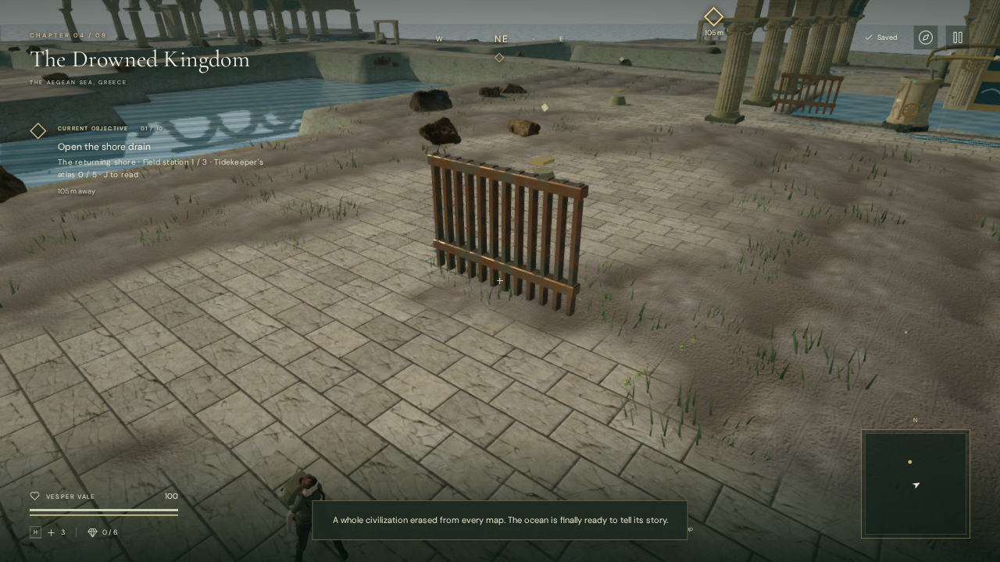
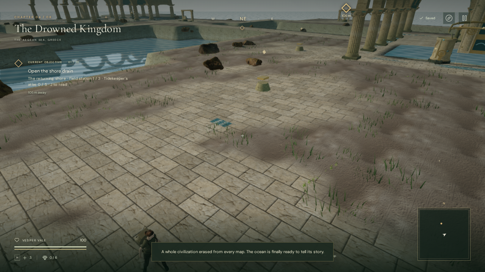

# Memorial gate machinery

The gallery's original portcullises rose through the shallow roof when opened.
The archive gate protruded approximately 3.5 metres above the courtyard paving;
the return gate also emerged beside the first sounding well. Both now descend
into sealed storage pockets beneath their thresholds.

## Construction and motion

Stone jambs and bronze guides seat each gate in its opening. Vertical racks turn
paired pinions on fixed axle bearings; the rotation follows the gate's travelled
distance. Pressure lines connect the emergency wheel's valve housing to the
brakes at both sides of each gate. The long return line follows the bell room's
eastern wall before entering the return passage, leaving the wheel approach
clear. Narrow bronze lips and a dark insert mark each floor pocket.

Opening takes approximately 1.54 gameplay seconds, with eased acceleration and
deceleration. The bars and their collision box descend together. At the stop,
their upper edge is 0.65 metres below the original floor and the hidden bars
stop rendering. The floor remains a continuous swimming collision boundary.
Saved open gates load directly at that stop; there is no new save field or
replay of their opening animation.

Static parts batch with the gallery architecture. Each gate's moving bars and
racks batch by material, as do each pinion's teeth and fasteners. The machinery
uses existing stone textures and original procedural bronze materials; it adds
no external assets. Existing attribution remains in
[asset credits](asset-credits.md).

## Sound

Each gate's drive voice now stays at a visible, fixed pinion instead of descending
underground with the bars. Its activity rises and falls with the eased motion,
reaching zero at the stop and on pause. The existing HRTF positioning, obstruction
filtering, twelve-voice budget, gain of 0.14, and linear falloff between 1.5 and
20 metres remain in use. The quiet water chapter arrangement is unchanged.
Behavioral checks do not establish subjective machinery sound or mix quality.

## Verification

- All **303 automated tests** pass. The new regression checks roof containment,
  closed and open passage clearance at multiple swimming depths, below-floor
  stowage of rendered geometry and collision, fixed drive bearings, and immediate
  restoration of saved open gates. The sound regression checks fixed emitter
  coordinates and activity during motion, pause and rest.
- The production build passes with the existing large Three.js chunk advisory.
- Four High surface views and ten interior views across High and Performance
  settings covered closed, moving and open gates and the wheel. All inspected
  shader programs linked. Both fully retracted gates had no vertices above the
  sampled surface terrain. The screenshots above show the same courtyard camera
  before and after the revision.
- Assisted movement completed the entire gallery both before and after
  1.8-metre drainage, visited all nine rooms, recovered the record and returned
  to the surface at 100 health. Across 163 sampled renders, temporary exterior
  culling restored object visibility and the shadow callback correctly. Changing
  to the crystal chapter removed the gallery renderer state and retained linked
  shaders.
- Native **X, D, S and E** input in the production animation loop left the second
  bell and opened the gates. Pause and reload restored the safe bell, open-gate
  state, other progress, settings, 93 health and exactly
  14.013500000000008 recorded gameplay seconds. The interior map and recovered
  record's journal attribution passed their checks. The production hook was
  absent; no failed assets, console errors or warnings were reported.
- A live spatial-mix check selected the archive drive at 1.5 metres with gain
  0.12285 during motion, without obstruction filtering. The drive voice was
  removed on pause and after the gate stopped, while the nearby bell's drip
  remained. Changing chapters disposed all 28 inspected gallery geometries,
  nine materials and six unique textures, and retained no gallery emitters or
  voices. This excludes the separately owned sea geometry. That browser check
  reported no console errors or warnings.

Verification used disposable Chromium 148 contexts with ANGLE Vulkan on the
Radeon 780M. This is a corrected and more physically connected prototype
mechanism. It does not establish AAA art quality, an hour of chapter content,
or a human listening review.

The verified release bundles are `index-q8B9Nn4a.js`, `game-C94CJIht.js`,
`three-DhbJ4463.js` and `index-BdgvWVky.css`. See the
[gallery guide](sunken-gallery.md) for the route and save rules, and
[production status](production-status.md) for the full acceptance audit.

The later [wheel interaction pass](gallery-wheel.md) replaces the automatic wheel
spin with a hand-operated 60-degree brake release. It adds fitted grips, approach
collision, movement cancellation, interrupted-turn recovery and frozen gate
travel on pause. That report contains the latest verification and release hashes.
