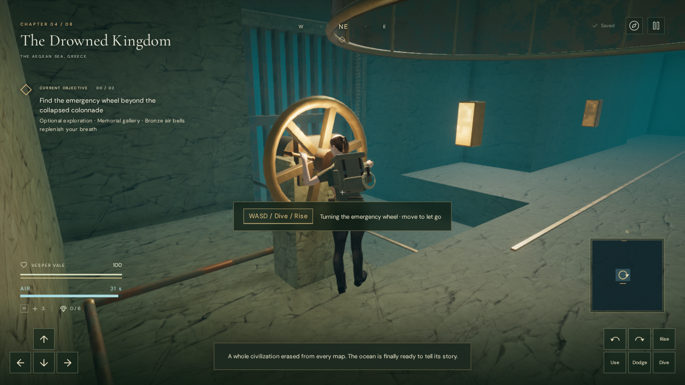

# Operating the memorial wheel

Vesper now reaches and grips the submerged emergency wheel before turning it.
Previously, pressing Use opened the gates immediately and spun the wheel while
the explorer continued her ordinary swimming stroke. Two supported 38 mm grips
now provide visible hand contacts, and a 60-degree turn releases the gate brakes.

## Controls and recovery

Approach the front of the wheel while diving, then press **E / Use**. The explorer
moves into a clear operating position, rises into an upright swimming pose,
reaches with both hands, turns the wheel and releases it. The approach is sampled
against the gallery's collision volumes, including the air-bell skirt. Its speed
never exceeds the normal 3.1 metres per second of swimming. A longer approach
therefore takes longer; the actual turn lasts 0.63 seconds.

Movement, **X / Dive**, or **Space / Rise** lets go immediately. If the turn is
unfinished, the wheel springs back and the gates remain closed. Once the brakes
release, both gates continue their opening travel even if the explorer swims
away. The hint explains how to let go. Pausing freezes the interaction and gate
travel, and resuming continues them. The normal air reserve keeps decreasing
throughout active underwater operation.

Only a completed turn writes the open-gate state. An interrupted reach or turn
does not introduce a new save field. Reloading retains the gallery's existing
safe-air-bell behavior: unfinished turns return with closed gates; completed turns
return with open gates. Dive resets, death and chapter changes discard the
transient interaction.

## Hand contact

The wheel shares the existing calibrated cylindrical-grip solver with the cable
trolley. A world-space handle frame positions the wrists, distributes axial
rotation through the forearms, and curls each finger around the grip. Reach and
release blend the arm, wrist and finger rotations into the swimming animation.
Arm and finger bone positions and scales remain unchanged. The upright body pose
also eases away when movement cancels the interaction.

The original explorer asset and bronze materials retain their existing
[attribution](asset-credits.md). The new grips and supports are original
procedural geometry. This adds a physical interaction to the existing prototype;
it does not establish AAA animation or environment quality.

## Verification

- All **306 automated tests** pass. The suite includes existing cable hand-contact
  checks across all 22 return routes, plus the new gallery interaction and hand
  geometry regressions. The production build passes with the existing large
  Three.js chunk advisory.
- Across 12 sampled turn poses, each hand's palm and finger surfaces contacted
  its grip's finite-cylinder envelope within 2.47 mm. The deepest sampled
  penetration was 0.46 mm, within
  the regression's 0.6 mm tolerance. Hand surfaces cleared the capped grip
  supports by at least 65 mm. Bone lengths and scales remained unchanged, and
  the reach/release interpolation matched its expected intermediate rotations.
- Functional checks cover front-side access, an approach blocked by the bronze
  skirt, collision and speed throughout alignment, uninterrupted oxygen use,
  movement and descent cancellation, pause before and after brake release,
  exactly one completion write, and closed/open reload states.
- Native keyboard input cancelled an unfinished turn and moved on the same
  frame. Pausing during a turn and during gate travel retained exact interaction
  time, position, air, wheel angle and gate progress across subsequent renders.
  At 844 × 390, the touch **Use** button completed the turn without retaining
  held movement keys. This is desktop Chromium touch emulation.
- Both assisted full-gallery routes, before and after 1.8-metre drainage,
  recovered the record and returned to the surface at 100 health. The rendered
  route check restored temporary visibility across 162 sampled renders and
  transitioned cleanly to the crystal chapter.
- The final production build accepted native diving, movement and E input.
  Pause/reload returned to the safe second bell with open gates, other chapter
  progress, settings, 93 health and exactly 15.08700000000002 recorded gameplay
  seconds. The interior map and recovered journal attribution passed. No failed
  assets, console errors or warnings were reported, and the development hook
  was absent.

Browser checks used disposable Chromium 148 contexts with ANGLE Vulkan on the
Radeon 780M. Assisted traversal does not establish blind human playthrough time.
The water chapter's music and fixed drive emitters remain as described in the
[machinery notes](gallery-machinery.md); this pass does not claim a listening
review or a broader device performance result.

The final bundles are `index-DMfYKF2a.js`, `game-B5UcV3ij.js`,
`three-DhbJ4463.js` and `index-BdgvWVky.css`.
