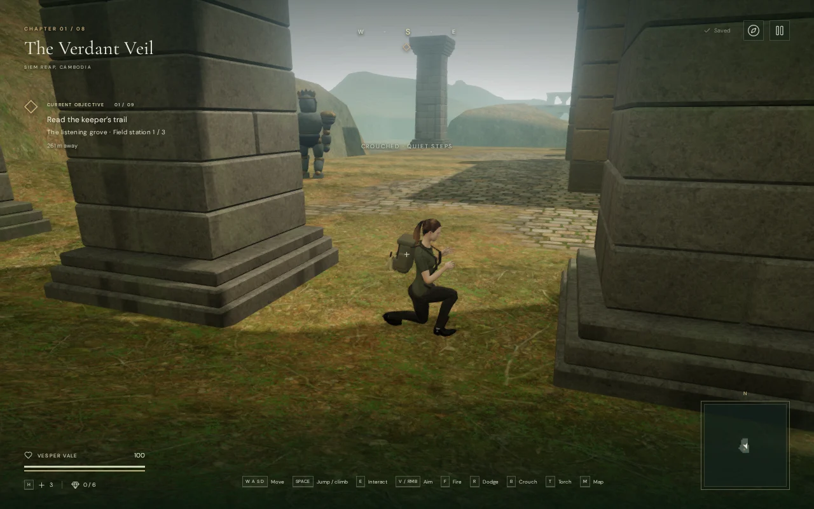
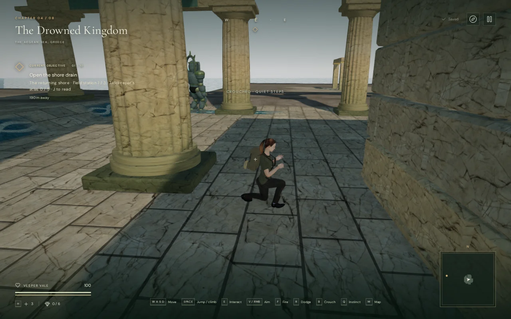

# Guardian watch routes

Guardians now walk regional routes around the two flanks of each sanctuary,
pausing to scan the approaches. Watch their movement, use solid cover, and
press **B / Crouch** to pass while they look away. This gives the existing
stealth system moving sight lines and openings to observe.

The 122 guardians across all eight chapters use eight route patterns. Jungle
and crystal guardians circle outer corners; desert and coastal guardians
follow longer flanks; mountain guardians inspect the front ledge; cloud-city
guards walk parapet approaches; forge and final-chapter guards use four-stop
circuits. Opposing guards use opposite flanks and staggered departure times.
Stops and turning directions follow the regional plan, with nearby clear
footings resolved against the actual built architecture.

A sound interrupts the patrol. The guardian investigates its remembered
origin, searches, then returns to its post and resumes its route. Visible
recognition still starts combat, with the existing warning marks, damage,
dodge windows and shield rules. Quiet patrols do not display suspicion meters
or activate combat music. Confirmed detection retains the danger arrangement.

Guardians keep dry footing during patrol, investigation, pursuit and return.
They avoid deep basins, hot lava and abrupt terrain edges. A hunter checks its
charge path before committing and navigates around an obstructed approach.
They do not swim, jump gaps or use the explorer's traversal equipment. Dynamic
obstructions trigger a route search; a persistently blocked patrol stop can
be skipped without teleporting through a barrier.

Footsteps come from the existing planted-foot animation and remain positioned
at the actual contacts. The quiet chapter/objective music continues beneath
patrol and investigation. Pause freezes movement, awareness and waypoint timers.
Defeats remain saved; patrol position, awareness and waypoint timers reset on
chapter load. No new save schema, audio voice type, graphics asset or dependency
was introduced. The original guardian and sound [attribution](asset-credits.md)
is retained.

## Verification

All 398 planned route legs completed a search through the actual built worlds.
The check found 25 old posts too close to props or unsuitable footing; these
now resolve 1.5–3 metres away before play begins. Endpoint fitting includes the
same corner clearance used by swept navigation, preventing a nominally clear
point from leaving the last leg unreachable.

During 210 simulated seconds per chapter, all 122 live guardians completed at
least one circuit: 482 completed circuits in total, with no skipped stops,
sampled footing failures or movement discontinuities. The player was placed
outside perception range for this route check. These accelerated simulations
do not measure human playthrough duration or frame rate.

Prepared 6.6-metre crouched crossings succeeded in every chapter with all
guardians active, no detection and 100 health. Keyboard B and held D operated
the crossings; placement and simulation timing were assisted. The first sky
approach raised partial suspicion; a wider approach remained unnoticed.
Sixteen High/Performance views rendered without console warnings/errors or
failed assets. This establishes selected crossing opportunities, not an
unseen whole-campaign playthrough or comprehensive encounter balance.

The browser interaction check recorded ten moving guardian footfalls, native
gunfire interrupting patrol, a search of the unchanged sound origin, return
and resumed movement, frozen pause state, and fresh routes after chapter
change. Music remained `explore` during patrol and investigation and changed
to `danger` on detection. An offline render of the actual footfall generator
measured RMS 0.003570 at 2 metres, 0.001785 at 21 metres and zero at 41 metres.
This confirms linear attenuation; subjective mix quality remains unverified.

Eight new automated checks cover the patrol cycle, smooth turns, positioned
footsteps, investigation, visible attacks, terrain and water avoidance,
dynamic cover, safe initial placement, pause, defeat persistence and all eight
regional plans. The final full suite passed all 450 tests in 138.9 seconds.
The public diagnostic is
[inspect-guardian-patrols-browser.js](../scripts/inspect-guardian-patrols-browser.js).

The final build passed with Vite's existing large-chunk advisory. Release
bundles are `index-8kLshOhn.js`, `game-CvtGszFY.js`, `three-CQcYX-_1.js` and
`index-DYq9hjRy.css`.

Three production cases passed without the development hook: keyboard crouch
and movement near a patrol, muted 540 × 900 two-finger movement/crouch, and
native camera turning and combat. Five shots defeated a warden after it dealt
18 damage. The reload retained its defeat and 82 health; the keyboard/touch
movement cases retained 100 health. Whole-save reloads matched except for
`lastPlayed`. No console warnings/errors, failed assets or portrait overflow
were reported. The first fight attempt fired toward the loaded objective-facing
camera; turning north with C corrected the test input. That unsuccessful
attempt is not counted as a passed combat case.

The game remains a campaign prototype. Approximately one hour per chapter,
modern AAA graphics, subjective listening quality and broader browser/device
performance remain unverified or unmet requirements.
