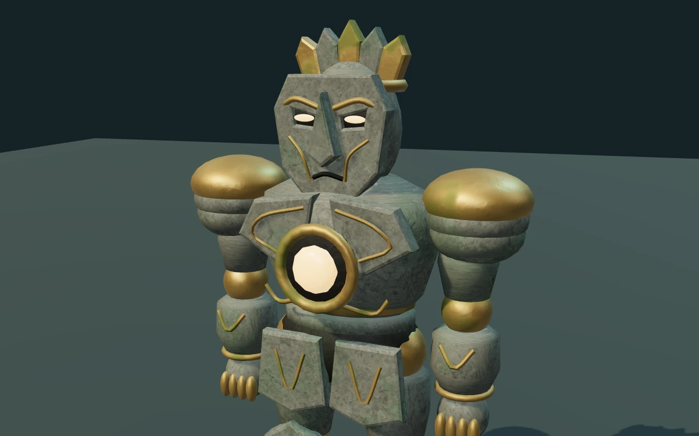
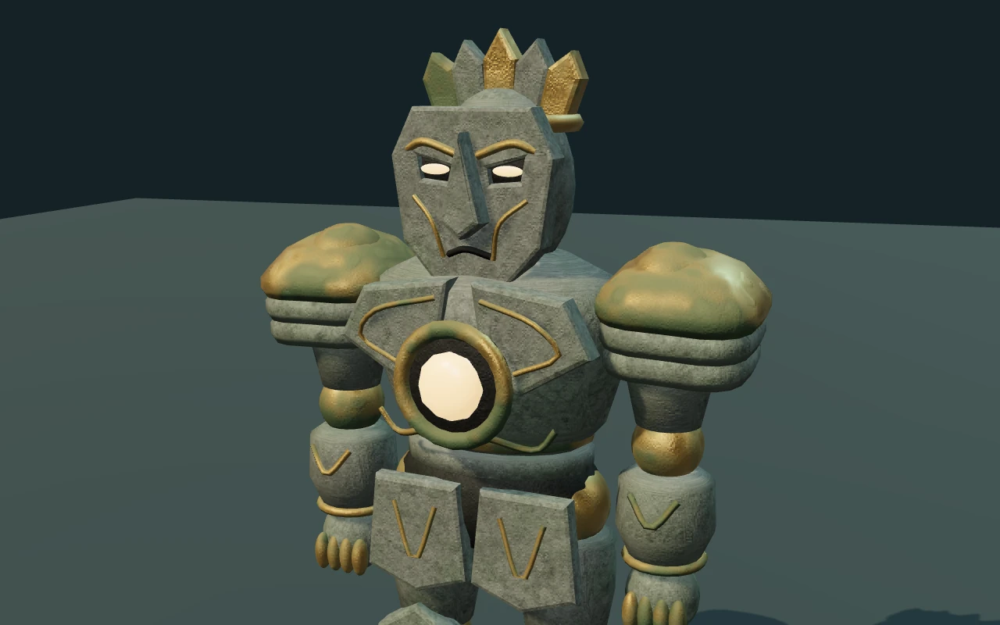
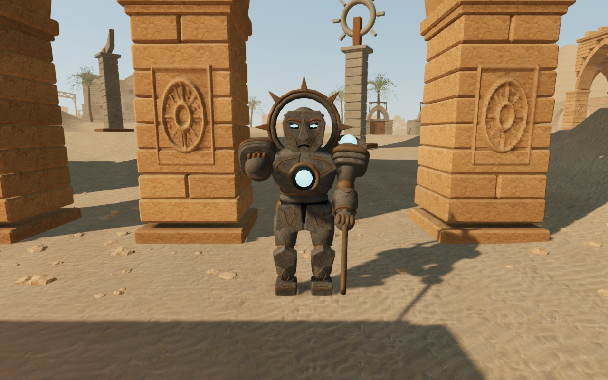

# Guardian armor and weathered surfaces

The four guardian types now wear cast shoulder plates with raised centers,
chamfered edges and overlapping stone skirts. Their bronze has dull oxidized
patches, darker sheltered surfaces and fine pitting. Exposed metal retains
smaller highlights. Damp, coastal and ash-covered chapters use different
oxidation colors; the coastal stone also has faint deposits on exposed faces.

These changes refine the existing mechanical stone figures. Their weapons,
combat silhouettes, joints, hit queries and saved defeat states retain the
existing design.

## Matched material views

Both images below show the running game's warden in the same development
material gallery, with identical camera, lighting, exposure and render size.
This gallery isolates the model; it is not a chapter environment.

Before:

After:

The surface coordinates and deposit weights belong to the original vertices,
so the weathering follows each rigidly skinned piece as it moves. Fine grain
fades with projected size to limit distant shimmer. Bronze uses its own small
surface perturbations instead of the stone's coarse normal texture.

## Verification

- All **595 automated tests** passed. The new geometry checks cover closed
  castings, outward winding, nondegenerate triangles, bounds and finite surface
  attributes at both detail tiers. Existing tests cover planted ankles,
  attack/recovery poses, combat, campaign progression and persistence.
- The production build passed. Vite retains its large-chunk advisory.
- Twelve matched gallery renders cover four material environments and three
  viewpoints. All shaders linked, with no browser errors or warnings.
- Chapter inspection uses the actual first guardian encounter in each of the
  eight chapters. It frames windup and recovery on High and Low settings;
  positioning and combat state are assisted. The helper updates the nearby
  shadow focus and places the camera before posing the feet. All **32 views**
  rendered with linked shaders and finite bone matrices, without browser
  errors or warnings. The eight High windup views were visually reviewed.
- A separate posed-mesh measurement in the jungle, desert, coast and eclipse
  encounters found the lowest sole vertices within **0.2 mm** of the terrain,
  with ankle targets met to floating-point precision. These four measurements
  do not establish contact on every slope in the campaign.
- A production browser check used native turning and firing to defeat a
  patrolling warden. Six fire inputs completed the encounter at 64 health.
  Reloading preserved the exact saved progress, apart from the visit timestamp,
  including position, health and guardian defeat. The restored encounter did
  not respawn the warden or damage the player during the following three seconds.
  The build exposed no development hook and emitted no browser errors or warnings.

An assisted windup view in **Beneath the Sands**, with the chapter's real
terrain, architecture and lighting:

## Rendering cost

A frozen close-up gallery at 1280 × 800 was measured on the sandbox's Radeon
780M through Chromium/ANGLE Vulkan. The order was before, after, after, before;
all four samples contained 271 valid GPU queries, with no disjoint samples.
The table averages the two samples of each version.

| Close gallery measure | Before | After |
| --- | ---: | ---: |
| Mean GPU rendering time | 2.350 ms | 2.540 ms |
| Draw submissions | 7 | 7 |
| Triangles | 41,726 | 39,326 |

The added shading costs approximately **0.19 ms (8.1%)** in this view.
The four-character wide view uses 4,800 fewer triangles, with its 13 draw
submissions unchanged. This is a bounded model-gallery comparison, not a
whole-game frame-rate claim or a benchmark of other devices.

## Scope and remaining review

This milestone improves a shared character kit. The figures still have a
stylized, procedural construction, and the selected encounter backgrounds
include sparse and repetitive spaces. The eight chapters require a current,
systematic visual inspection of routes, objective areas, optional spaces,
water, elevated structures and return paths before the overall visual goal
can be called complete. Selected gallery and encounter captures do not cover
the entire playable surface.

There is no minimum duration per chapter. AAA remains the artistic direction;
the acceptance target is the polished, rich and visually interesting playable
world described in [production status](production-status.md).

No external asset or dependency was added. See [asset credits](asset-credits.md).
