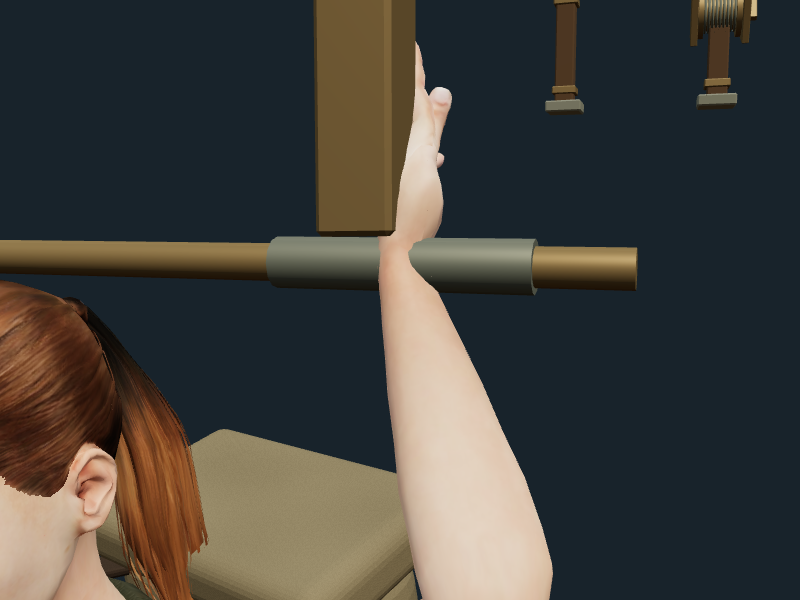
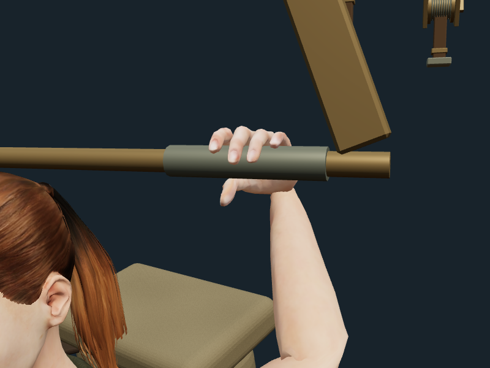
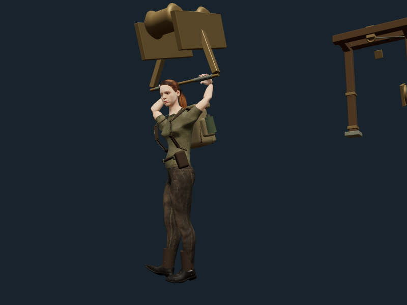
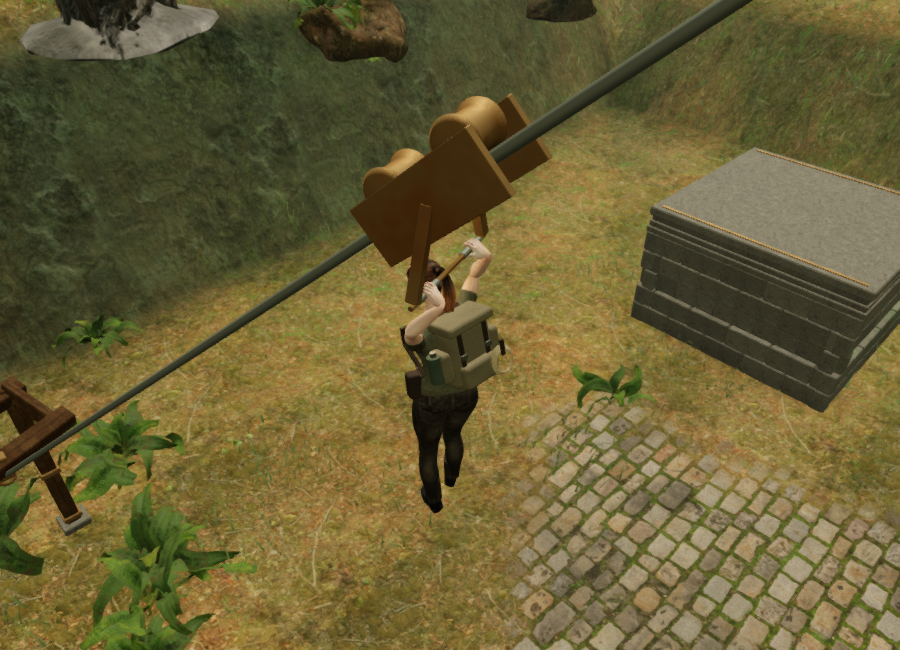

# Explorer cable grips

The explorer now places the palm behind the return-cable handle and curls all
five digits around it. Previously the arm solver placed the wrist at the handle
centre while leaving the fingers open. The new pose fits the delivered character's
finger joints to the 38 mm grips, gives the thumb an opposing position, and turns
the forearm toward the palm with bounded axial rotation. It preserves bone
lengths and the existing physical player position and traversal timing.

The lower handle struts now slope outward, clear of both grip areas. Their top
attachments remain on the roller frame. The existing batched geometry, materials,
moving carriage, automatic return and positioned mechanical audio remain in use.
This work uses the existing local character and materials; no external assets,
new dependencies or attribution changes are required.

The grip is a procedural layer over the existing locomotion animation. Before
each animation update, it restores the saved base rotations of the affected arm,
wrist and finger bones. This is necessary because the animation mixer can skip
rewriting a constant track. Without restoring the base pose, a grip rotation can
remain after dismounting or accumulate during repeated updates. After release,
the regular animation controls the hands again.

## Close views

These are actual Three.js renders of the delivered character and cable hardware
in an isolated inspection scene, using the same runtime pose code. They are not
campaign lighting or evidence of AAA production quality.

Before:

After:

## Verification

All 285 automated tests and the production build passed. The build retains its
existing advisory about the large Three.js chunk.

The hand-surface test covers all 22 cable slopes and headings, three positions
along each cable and three animation phases. Its 396 hand inspections measure
717,156 vertices primarily influenced by hand bones. Against the conservative
smooth-cylinder envelope of each grip, the minimum clearance was −0.462 mm;
every finger and palm group had a nearest contact within 2.470 mm. The test allows
at most 0.5 mm inside that envelope and requires contact within 4 mm. The actual
grips use twelve-sided geometry inside the smooth envelope. These measurements
do not establish perfect collision-free contact at every possible animation time.

The same checks preserve arm/finger joint translations and scales and check
finite rotations. Skin stayed at least 38.9 mm outside the struts' conservative
cross-section envelopes. A separate release test compares every hand and finger
rotation with a reference actor following the base animation for 90 frames after
dismounting. Existing swimming, climbing, aiming, footing and counterweight tests
also passed.

Assisted full-world browser input completed all 22 routes across all eight
chapters, including mantles, jumps, rope crossings, summit restoration and return
rides. All eight Performance-quality rider views linked their shaders. Their
recorded views used 65–137 draw calls and approximately 140,000–483,000 triangles.
The browser reported no failed assets or JavaScript errors; the software graphics
driver reported ReadPixels stalls during captures. These tests start at the route
entries and supply known field solutions, so they do not establish unassisted
difficulty, human completion times or consumer-hardware performance.

The final High-quality jungle rider view also linked its shaders, recording
317 draw calls and 1,469,694 triangles across its reported render passes. Its
hand-contact measurements match the Performance view.

The High production build accepted native E input to begin the approach to the
return handle and saved the changed position on pause. Reloading retained chapter
state and settings, apart from the expected last-played timestamp. Loading that
save restored the secure summit centre at height 8.4 m and cleared the consumed
traversal marker, preserving every other chapter field, including active time,
health, supplies and progress, and every setting. This recovery check explicitly
simulates an unfocused document so startup pauses before active time advances;
headless tab switching did not reliably produce that browser state. It used the
actual production bundles, contained no development hook, and reported no failed
assets or JavaScript errors. The software driver reported ReadPixels stalls.
Native input established the approach and save behavior; complete return rides
are covered by the assisted route checks above, not a native full-ride claim.

The new browser run also completes the return-cable milestone's previously
unavailable audio measurements. The live soundscape selected the carriage while
riding, carriage and winch during return, and neither at rest or after pausing.
Riding selected the chapter score's climbing arrangement; dismounting restored
the current objective arrangement. The inspection explicitly advances spatial
selection even if the browser suspends its audio clock.

Isolated HRTF renders used the delivered voice factory and the same source buffer
at each distance. Carriage RMS was 0.00286482 at 1.2 m, 0.00143241 at 11.6 m and
zero at 23 m. Winch RMS was 0.00347888 at 1.2 m, 0.00173944 at 9.6 m and zero at
19 m. Both therefore measured half amplitude at the falloff midpoint and silence
beyond range. This is signal evidence; subjective listening and mix review remain
open.

This pose is calibrated for the current explorer and return-cable grips. Rope,
weapon and mechanism finger articulation, broader wrist/elbow animation polish,
motion capture, subjective audio review, AAA graphics and approximately hour-long
chapter pacing remain further work. The [production status](production-status.md)
keeps the original requirements and their evidence separate from these milestones.
