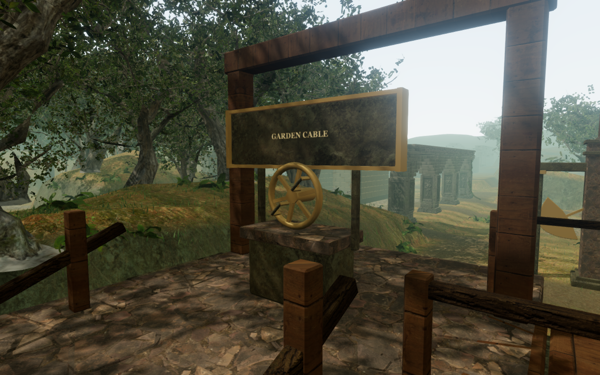
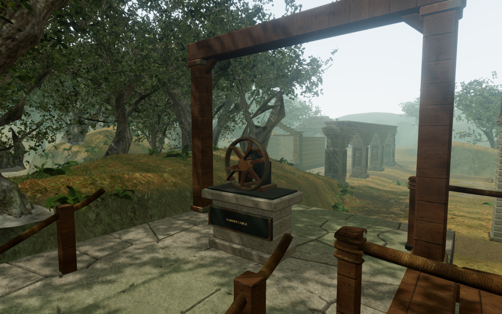
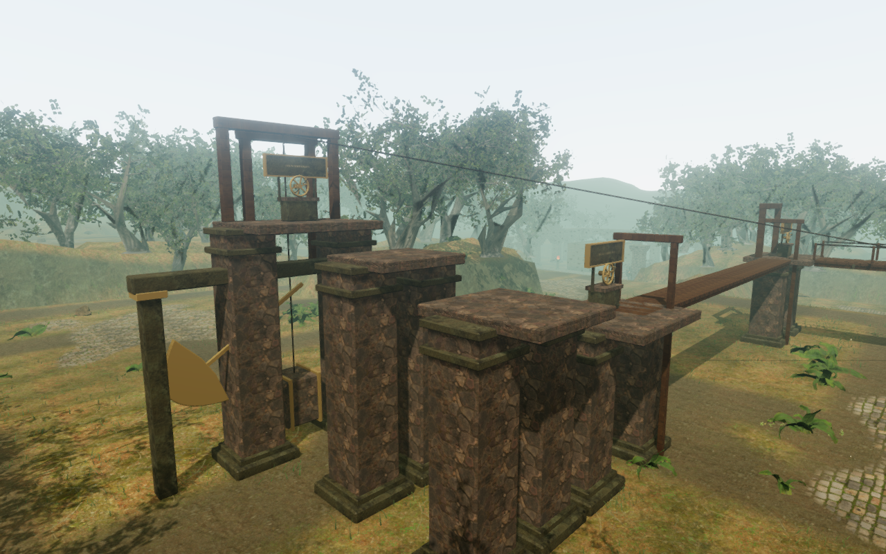
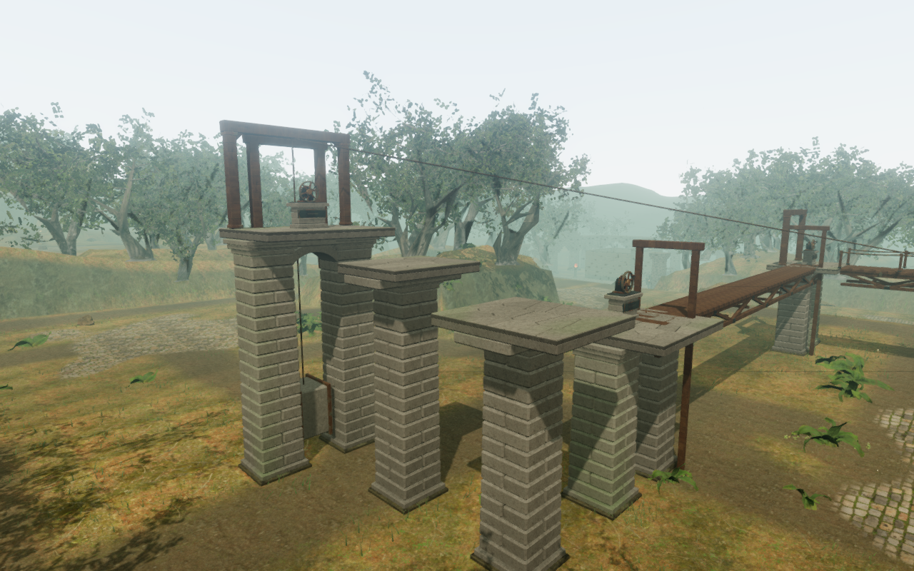
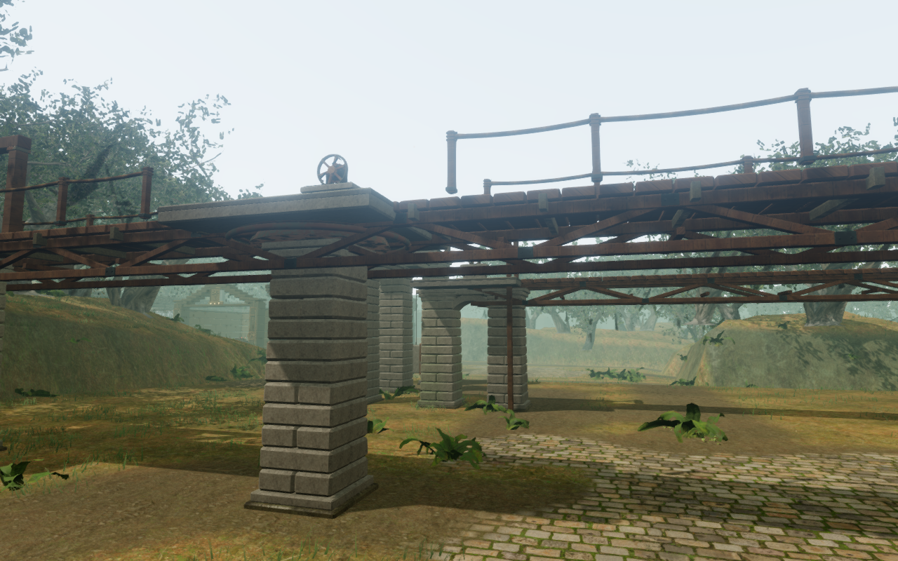

# Hanging Garden construction

The Hanging Garden's two rotating spans and northern return walk now have
timber trusses beneath their decks. Coursed stone shafts, corbelled headers and
four masonry arches support the fixed galleries. Small instruction tablets sit
on the winch plinths, with supported axles, geared handwheels and metal fittings.
The [route and controls](hanging-garden.md) retain their existing sequence.

| Earlier winch construction | Current winch construction |
| --- | --- |
|  |  |

The narrow broken steps use one central shaft each; the wider landings use two.
The twelve shafts have alternating masonry joints, slightly tapered courses
and stepped capitals. Grey-green stone weathering varies across the surfaces,
with darker damp bases and moss on exposed faces. Broad variation is computed
at vertices; the existing credited color, normal and roughness textures supply
the close surface detail.

| Earlier gallery supports | Current gallery supports |
| --- | --- |
|  |  |

The three trusses have diagonal timber webs, lower chords, cross ties, joint
straps and bolts. The span ropes sag slightly between posts, with three-turn
lashings around the posts. Stair posts meet sloping timber stringers, and
braces join the taller frames. The fixed centre of each span remains clear
while its side rails rotate.

## Traversal and collision

Moving deck collision extends 1.2 m below the walking surface to cover the
trusses. Character collision follows the rebuilt pier bases and shafts, and
the high frame braces limit jump headroom. Wheel positions, grip axes and
the six supported operating approaches remain calibrated to the hand pose.

Individual masonry blocks fall below the following camera's general detail
threshold. A continuous shaft proxy and explicit arch-stone records preserve
camera obstruction after the rendering meshes are batched. The shaft regression
was reproduced before the correction and passes afterward; all twelve shafts
and four arch undersides are checked.

The obsolete ground-level blade trap beneath the weight gallery has been
removed. The connected route supplies its own moving-span and missed-jump
hazards. The campaign retains 66 ordinary station traps.

## Rendering evidence

The comparison images are actual High renders at 1280 × 800, using the same
camera coordinates and synthetic completed-route fixture before and after the
change. They were converted losslessly to WebP. Four views on High and Low
link their shaders without browser errors. The full assisted route also checks
Medium.

The wide view at the end of the assisted route submits the following work
across the whole scene's rendering passes, including the surrounding jungle:

| Quality | Previous draw calls | Current draw calls | Previous triangles | Current triangles |
| --- | ---: | ---: | ---: | ---: |
| High | 1,620 | 1,696 | 4,620,064 | 4,816,224 |
| Medium | 1,066 | 1,121 | 2,897,901 | 3,029,093 |
| Low | 584 | 605 | 1,315,367 | 1,380,371 |

A bounded GPU comparison uses the active game loop at the close winch camera,
1280 × 800 and pixel ratio 1, in headless Chromium on Radeon 780M / RADV Vulkan.
Each version has two 4.5-second samples per quality after warmup. The previous
implementation was measured again in the same working session to avoid relying
on a baseline collected several hours earlier. The table reports the mean of
the two GPU sample means, using
[`benchmark-frames-browser.js`](../scripts/benchmark-frames-browser.js).

| Quality | Previous GPU rendering time | Current GPU rendering time | Difference |
| --- | ---: | ---: | ---: |
| High | 32.570 ms | 37.555 ms | +4.984 ms |
| Low | 13.827 ms | 18.395 ms | +4.568 ms |

These are separate browser runs on one shared machine, with no disjoint timer
queries in the accepted samples. They include the whole scene and do not
isolate the masonry shader or guarantee a frame rate on other hardware.
The extra construction has a measurable cost in this view. A sandbox run that
could not supply valid hardware timer samples was excluded.

## Verification

All **569 automated tests pass** with two test workers. The production build
passes with Vite's existing advisory for JavaScript chunks above 500 kB. The
three new construction regressions cover finite batched surfaces and deck
clearance, supported wheel approaches and grip axes, and camera obstruction
through the rebuilt shafts and arches.

All **nine production-browser cases pass**, using native keyboard/touch input
against the built release with no development hook:

- Complete the entrance winch and reload its progress.
- Reload a committed span rotation at its target alignment.
- Complete the counterweight winch and reload during the support lift.
- Walk up the southern stair with ordinary keyboard movement.
- Miss a gallery jump and recover at the earned landing with 92 health.
- Make the first broken-gallery jump with simultaneous touch movement and
  Jump, muted, in a 540 × 900 portrait viewport.
- Complete the final winch with touch, raise the return walk and open the
  portrait map without horizontal overflow.
- Load an older ground save now inside a rebuilt pier base; clear footing is
  found at ground height without losing health.
- Recover an older unsupported elevated save to the entrance landing.

Each case checks the stored chapter data again after reload, excluding its
last-played timestamp. The loaded release bundles match `index-BxVOnufp.js`,
`game-BDnsohpZ.js`, `three-CLZSoYGK.js` and `index-Cl7L-B9a.css`. The production
run reports no browser errors, warnings or failed HTTP responses.

The complete assisted route finishes all three winches, the rotating crossings,
the broken gallery and the return stair at **100 health**, with ordinary
movement, camera updates, guardians and hazards active. Its navigation and
jump timing are supplied by the check; it does not measure human chapter pacing.

The actual hoist buffer, rendered through the configured linear HRTF panner,
measures left-channel RMS of **0.219100 at 2 m**, **0.109550 at 15 m** and
**0 beyond the 28 m range**. The midpoint is half the near amplitude.
The handwheel voice activates during use; pause and rest remove garden
machinery voices. The score selects its winch and climbing arrangements.
These are behavioral and signal checks; subjective listening remains unverified.

Changing chapters disposes all **96 tracked geometries, 17 materials and
19 textures exactly once**, removes all seven local machinery emitters and
clears the garden state. The assisted route reports no browser errors,
warnings or failed HTTP responses.

All new geometry and the masonry weather shader are original project work,
reusing the credited temple stone, monastery wood, bark maps and bronze/iron
materials. No external assets or dependencies were added. See
[asset credits](asset-credits.md).

Approximately one-hour human chapter pacing, modern AAA graphics, subjective
music and soundscape quality, and broad browser/device coverage remain
unfinished production requirements.
